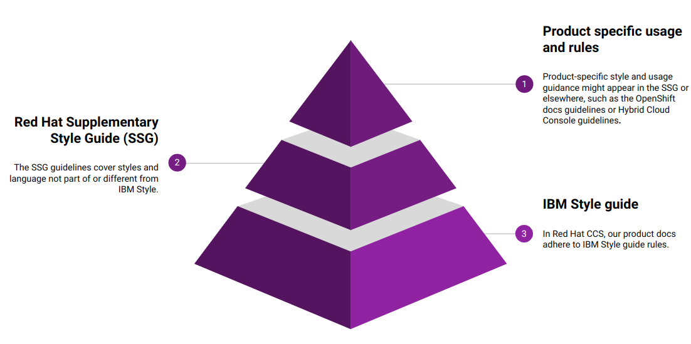
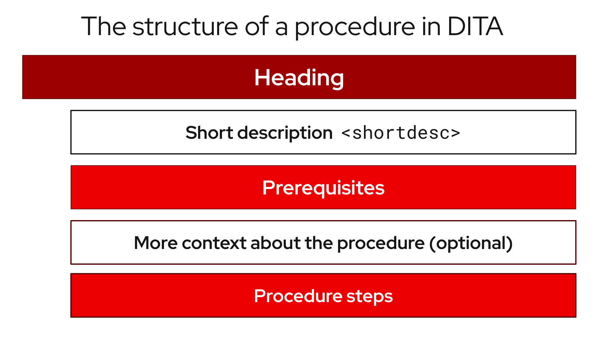

# Red Hat supplementary style guide for product documentation

## Introduction

# About this guide

The style and language guidance in this guide overrides or supplements some guidance provided by the [_IBM Style_](https://www.ibm.com/docs/en/ibm-style) guide, which is the primary source of style guidance for [Red Hat](https://www.redhat.com/) product and cross-product solution documentation.

The Red Hat Customer Content Services team has created this guide to help ensure that Red Hat product documentation is clear, consistent, and cohesive. Upstream communities who want to align more closely with the standards used by Red Hat product documentation can also use this guide. However, some links in this guide might not be accessible for non-Red Hat associates.

> **NOTE:**

Other Red Hat technical documentation, including Red Hat training and exam content by Global Learning Services (GLS), follows the [_Red Hat Technical Writing Style Guide_](https://stylepedia.net/) instead of the _Red Hat supplementary style guide for product documentation_.


## Using style guides for Red Hat product documentation

Red Hat product documentation adheres to the style guidance provided in the _IBM Style_ guide, the _Red Hat supplementary style guide for product documentation_, and documentation style guidelines specific to Red Hat products, such as Red Hat Enterprise Linux or Red Hat OpenShift Container Platform.

When seeking style guidance, consult the style guide specific to your product documentation project first, if applicable, then the [_Red Hat supplementary style guide for product documentation_](https://redhat-documentation.github.io/supplementary-style-guide), and finally the [_IBM Style_](https://www.ibm.com/docs/en/ibm-style) guide.

> **NOTE:**

To log in to the _IBM Style_ guide, enter your Red Hat email address in the **IBMid** field.


The following image illustrates the hierarchical relationship between the different style guides in Red Hat product documentation:



If you think that a documentation use case needs to deviate from the guidance in this guide, notify the style council by opening an [issue](https://github.com/redhat-documentation/doc-style/issues). This way, the deviation can be discussed by the style council and, if appropriate, included in this guide.

## Related Red Hat guides

In addition to the _IBM Style_ guide and the _Red Hat supplementary style guide for product documentation_, Red Hat product documentation uses the following reference guides for technical writers:

* [_Modular Documentation Reference Guide_](https://redhat-documentation.github.io/modular-docs/): Guidance for all things connected to modular documentation, including implementing those guidelines in AsciiDoc.
* [_AsciiDoc Mark-up Quick Reference_](https://redhat-documentation.github.io/asciidoc-markup-conventions/): Guidance specific to writing in AsciiDoc. Includes links to complete documentation for AsciiDoc and Asciidoctor.
* [_Getting started with accessibility for writers_](https://redhat-documentation.github.io/accessibility-guide/): Guidance for creating accessible content.

## PDF version

The _Red Hat supplementary style guide for product documentation_ is also available as a PDF. You can download the [latest version of the guide as a PDF](https://github.com/redhat-documentation/supplementary-style-guide/releases/latest/download/red-hat-supplementary-style-guide.pdf) from the GitHub releases section of project’s GitHub repository.

## Markdown version

The _Red Hat supplementary style guide for product documentation_ is also available as a Markdown file. You can download or reference the [Markdown version of the guide](ssg.md) for use with tools and workflows that consume Markdown.

# What’s new

Review the history of significant updates to the _Red Hat supplementary style guide for product documentation_.

> **NOTE:**

To view the history of changes from 2020 through 2022, see the [What’s new](https://github.com/redhat-documentation/supplementary-style-guide/blob/main/HISTORY.md) page in the GitHub repository.


## 2025
### June-December 2025

Making updates to the Supplementary Style Guide (SSG) has changed:

* Before opening a pull request (PR) for the SSG, [create an issue](https://github.com/redhat-documentation/supplementary-style-guide/issues/).
* When you create an issue, you are prompted to use either a **Bug report** or **Enhancement request** template. These templates include the **Severity** and **Priority** of the change. If we know the severity and priority of the issue, we can more easily track, triage, and expedite requests for changes.
* When you create a PR, the SSG automatically generates a preview and displays a URL that you can click and view.
* To merge a PR, we now need only one approval from an admin for the repo.

See the [Contributing guide](https://github.com/redhat-documentation/supplementary-style-guide/blob/main/CONTRIBUTING.md/) for more details.

* **[key pair](#yesimagesyespng-key-pair-noun)**: Added glossary entry
* **[remote execution](#yesimagesyespng-remote-execution-noun-adjective)**: Added glossary entry
* **[REX](#yesimagesyespng-rex-noun-adjective)**: Added glossary entry
* **[Technology Preview](#yesimagesyespng-technology-preview-noun)**: Updated glossary entry

* **[Release note updates](#release-notes)**: To address commonly encountered problems with release notes, the release note improvement initiative made several additions and changes to guidance in the SSG:
  * Improved the **[style advice for release note texts](#style-advice-for-release-note-texts)**
  * Clarified guidance for the correct **[tenses](#tenses-in-release-notes)** to use in release notes
  * Recommended adding **[headings](#headings-for-release-notes)** to each release note
  * Clarified advice on **[references to Jira in release notes](#references-to-jira-in-release-notes)**
  * Provided instructions for **[release note formatting in AsciiDoc](#release-note-formatting-in-asciidoc)** , which will simplify DITA migration
  * Provided a single set of approved names for all **[release note types and sections](#release-note-types-and-sections)**
* **[Commands in code blocks](#commands-in-code-blocks)**. The guidance in this section has changed. When formatting code blocks, put the command input and the example output in separate code blocks. In November, we also updated and improved the ASCIIDoc example for this update.
* **[Explanation of commands and variables used in code blocks](#explanation-of-commands-and-variables-used-in-code-blocks)**. Customer Content Services is no longer using callouts in documentation. Callouts are not supported by DITA.

## 2024

### July 2024

**Glossary entries**

* **[composite content view](#yesimagesyespng-composite-content-view-noun)**: Updated glossary entry to use lowercase spelling
* **[content view](#yesimagesyespng-content-view-noun)**: Updated glossary entry to use lowercase spelling
* **[Nmstate](#yesimagesyespng-nmstate-noun)**: Added glossary entry
* **[on-premise](#with-cautionimagescautionpng-on-premise-adjective)**: Updated glossary entry to include Red Hat OpenShift Container Platform definition
* **Product**: Removed glossary entry because Red Hat Satellite no longer capitalizes it
* **Red Hat Network Proxy Server**: Removed glossary entry because this term has been replaced by "Capsule Server"
* **Red Hat Network Satellite Server**: Removed glossary entry because this term has been replaced by "Satellite Server"
* **[subscription manifest](#yesimagesyespng-subscription-manifest-noun)**: Updated glossary entry to use lowercase spelling

**Style guidance**

* **[External links](#external-links)**: Added guidance to avoid using URL shorteners
* **[Short descriptions](#short-descriptions)**: Added guidance to avoid starting modules with admonitions, including Technology Preview admonitions

### June 2024

**Glossary entries**

* **[Base64](#yesimagesyespng-base64-noun-adjective)**: Added glossary entry
* **[offline](#yesimagesyespng-offline-adjective)**: Added glossary entry

**Style guidance**

* **[Technology Preview](#technology-preview)**: Updated guidance to clarify that you can omit the first sentence if you are not referring to a specific feature.

### May 2024

**Glossary entries**

* **[FedRAMP®](#yesimagesyespng-fedramp-noun)**: Added glossary entry

### April 2024

**Glossary entries**

* **[peer pod](#yesimagesyespng-peer-pod-noun-adjective)**: Added glossary entry
* **[Red Hat Decision Manager](#yesimagesyespng-red160hat-decision-manager-noun)**: Added glossary entry
* **Red Hat JBoss BPM Suite**: Removed glossary entry
* **Red Hat JBoss BRMS**: Removed glossary entry
* **[Red Hat Process Automation Manager](#yesimagesyespng-red160hat-process-automation-manager-noun)**: Added glossary entry

**Other updates**

* Updated references to _Red Hat JBoss BRMS_ to use the new name of _Red Hat Decision Manager_
* Updated references to _Red Hat JBoss BPM Suite_ to use the new name of _Red Hat Process Automation Manager_

### March 2024

**Glossary entries**

* **[access mode](#yesimagesyespng-access-mode-noun)**: Added glossary entry
* **[availability](#with-cautionimagescautionpng-availability-adjective)**: Added glossary entry
* **[availability zone](#yesimagesyespng-availability-zone-noun)**: Added glossary entry
* **[Bare Metal service](#yesimagesyespng-bare-metal-service-noun)**: Added glossary entry
* **[bind](#yesimagesyespng-bind-verb)**: Added glossary entry
* **[block device](#with-cautionimagescautionpng-block-device-noun)**: Added glossary entry
* **[block storage](#with-cautionimagescautionpng-block-storage-noun)**: Added glossary entry
* **[block volume](#with-cautionimagescautionpng-block-volume-noun)**: Added glossary entry
* **[boot source](#yesimagesyespng-boot-source-noun)**: Added glossary entry
* **[brick](#yesimagesyespng-brick-noun)**: Added glossary entry
* **[client](#yesimagesyespng-client)**: Updated glossary entry to include a generic definition
* **[clone (noun)](#yesimagesyespng-clone-noun)**: Added glossary entry
* **[clone (verb)](#yesimagesyespng-clone-verb)**: Added glossary entry
* **[cloud storage](#yesimagesyespng-cloud-storage-noun)**: Added glossary entry
* **[compression](#with-cautionimagescautionpng-compression-noun)**: Added glossary entry
* **[control plane node](#yesimagesyespng-control-plane-node-noun)**: Added glossary entry
* **[controller node](#yesimagesyespng-controller-node-noun)**: Added glossary entry
* **[copy](#yesimagesyespng-copy-verb)**: Added glossary entry
* **[currently](#yesimagesyespng-currently-adverb)**: Added glossary entry
* **[data compression](#with-cautionimagescautionpng-data-compression-noun)**: Added glossary entry
* **[deduplication](#yesimagesyespng-deduplication-noun)**: Added glossary entry
* **[directory](#yesimagesyespng-directory-noun)**: Added glossary entry
* **[disaster recovery](#yesimagesyespng-disaster-recovery-adjective)**: Added glossary entry
* **[disk encryption](#yesimagesyespng-disk-encryption-noun)**: Added glossary entry
* **[dispersed volume](#yesimagesyespng-dispersed-volume-noun)**: Added glossary entry
* **[distributed file system](#yesimagesyespng-distributed-file-system-noun)**: Added glossary entry
* **[distributed volume](#yesimagesyespng-distributed-volume-noun)**: Added glossary entry
* **[distributed-dispersed volume](#yesimagesyespng-distributed-dispersed-volume-noun)**: Added glossary entry
* **[distributed-replicated volume](#yesimagesyespng-distributed-replicated-volume-noun)**: Added glossary entry
* **[dynamically provisioned storage](#with-cautionimagescautionpng-dynamically-provisioned-storage-noun)**: Added glossary entry
* **[egress](#yesimagesyespng-egress-adjective)**: Added glossary entry
* **[encrypted disk](#yesimagesyespng-encrypted-disk-noun)**: Added glossary entry
* **[encryption](#yesimagesyespng-encryption-noun)**: Added glossary entry
* **[ephemeral storage](#yesimagesyespng-ephemeral-storage-noun)**: Added glossary entry
* **[external mode](#with-cautionimagescautionpng-external-mode-noun)**: Added glossary entry
* **[file storage](#yesimagesyespng-file-storage-noun)**: Added glossary entry
* **[FUSE](#with-cautionimagescautionpng-fuse)**: Added glossary entry
* **[geo-replication](#with-cautionimagescautionpng-geo-replication-noun)**: Added glossary entry
* **[gluster volume](#yesimagesyespng-gluster-volume-noun)**: Added glossary entry
* **[high-availability cluster](#yesimagesyespng-high-availability-cluster-noun)**: Added glossary entry
* **[hyperconverged cluster](#yesimagesyespng-hyperconverged-cluster-noun)**: Added glossary entry
* **[infrastructure node](#yesimagesyespng-infrastructure-node-noun)**: Added glossary entry
* **[initiator](#yesimagesyespng-initiator-noun)**: Added glossary entry
* **[internal mode](#yesimagesyespng-internal-mode-noun)**: Added glossary entry
* **[local storage](#yesimagesyespng-local-storage-noun)**: Added glossary entry
* **[logical cache](#yesimagesyespng-logical-cache-noun)**: Added glossary entry
* **[logical volume](#yesimagesyespng-logical-volume-noun)**: Added glossary entry
* **[metadata](#yesimagesyespng-metadata-noun)**: Added glossary entry
* **[multipath](#with-cautionimagescautionpng-multipath-noun)**: Added glossary entry
* **[network encryption](#yesimagesyespng-network-encryption-noun)**: Added glossary entry
* **[Network Time Configuration](#yesimagesyespng-network-time-configuration-noun)**: Added glossary entry
* **[n-way replication](#yesimagesyespng-n-way-replication-noun)**: Added glossary entry
* **[object storage](#yesimagesyespng-object-storage-noun)**: Added glossary entry
* **[OpenShift Container Platform cluster](#yesimagesyespng-openshift-container-platform-cluster-noun)**: Added glossary entry
* **[phase](#yesimagesyespng-phase-noun)**: Added glossary entry
* **[physical disk](#yesimagesyespng-physical-disk-noun)**: Added glossary entry
* **[physical volume](#yesimagesyespng-physical-volume-noun)**: Added glossary entry
* **[platform](#with-cautionimagescautionpng-platform-noun)**: Added glossary entry
* **[primary cluster](#yesimagesyespng-primary-cluster-noun)**: Added glossary entry
* **[primary node](#yesimagesyespng-primary-node-noun)**: Added glossary entry
* **[provision](#with-cautionimagescautionpng-provision-verb)**: Added glossary entry
* **[proxy](#with-cautionimagescautionpng-proxy-noun)**: Added glossary entry
* **[replicated volume](#yesimagesyespng-replicated-volume-noun)**: Added glossary entry
* **[restore](#yesimagesyespng-restore-verb)**: Added glossary entry
* **[rpm-ostree](#yesimagesyespng-rpm-ostree-noun)**: Updated glossary entry to add formatting guidance
* **[scale out](#yesimagesyespng-scale-out-verb)**: Added glossary entry
* **[scale up](#yesimagesyespng-scale-up-verb)**: Added glossary entry
* **[secondary cluster](#yesimagesyespng-secondary-cluster-noun)**: Added glossary entry
* **[self-healing](#yesimagesyespng-self-healing-noun)**: Added glossary entry
* **[server](#yesimagesyespng-server-noun)**: Added glossary entry
* **[snapshot](#yesimagesyespng-snapshot-noun)**: Added glossary entry
* **[source node](#yesimagesyespng-source-node-noun)**: Added glossary entry
* **[source volume](#yesimagesyespng-source-volume-noun)**: Added glossary entry
* **[split brain](#yesimagesyespng-split-brain-noun)**: Added glossary entry
* **[storage cluster](#yesimagesyespng-storage-cluster-noun)**: Added glossary entry
* **[storage pool](#yesimagesyespng-storage-pool-noun)**: Added glossary entry
* **[stripe](#yesimagesyespng-stripe-noun)**: Added glossary entry
* **[subvolume](#with-cautionimagescautionpng-subvolume-noun)**: Added glossary entry
* **[target](#yesimagesyespng-target-noun)**: Updated glossary entry to include a generic definition
* **[target volume](#yesimagesyespng-target-volume-noun)**: Added glossary entry
* **[thickly provisioned](#yesimagesyespng-thickly-provisioned-adjective)**: Added glossary entry
* **[total capacity](#yesimagesyespng-total-capacity-noun)**: Added glossary entry
* **[translator](#yesimagesyespng-translator-noun)**: Added glossary entry
* **[usable capacity](#yesimagesyespng-usable-capacity-noun)**: Added glossary entry
* **[virtual disk](#yesimagesyespng-virtual-disk-noun)**: Added glossary entry
* **[volume file](#yesimagesyespng-volume-file-noun)**: Added glossary entry
* **[volume group](#yesimagesyespng-volume-group-noun)**: Added glossary entry
* **[worker node](#yesimagesyespng-worker-node-noun)**: Added glossary entry

**Style guidance**

* **[Commands requiring root privileges](#commands-requiring-root-privileges)**: Updated guidance to include an example
* **[Release notes](#release-notes)**: Updated guidance about referring to release versions for documentation on deprecated and removed features
* **[Using style guides for Red Hat product documentation](#_using_style_guides_for_redhat_product_documentation)**: Updated to clarify the hierarchy of the _IBM Style_ guide, the _Red Hat supplementary style guide for product documentation_, and product-specific style guidelines

### February 2024

**Glossary entries**

* **Administration Portal**: Removed glossary entry because Red Hat Virtualization support is ending
* **Appliance console**: Removed glossary entry because Red Hat CloudForms support is ending
* **collect**: Removed glossary entry because Red Hat Virtualization support is ending
* **Data Warehouse**: Removed glossary entry because Red Hat Virtualization support is ending
* **details view**: Removed glossary entry because Red Hat Virtualization support is ending
* **gather**: Removed glossary entry because Red Hat Virtualization support is ending
* **header bar**: Removed glossary entry because Red Hat Virtualization support is ending
* **host**: Removed glossary entry because Red Hat Virtualization support is ending
* **Manager virtual machine**: Removed glossary entry because Red Hat Virtualization support is ending
* **MOM**: Removed glossary entry because Red Hat Virtualization support is ending
* **Monitoring Portal**: Removed glossary entry because Red Hat Virtualization support is ending
* **Red Hat CloudForms**: Removed glossary entry because Red Hat CloudForms support is ending
* **Red Hat CloudForms Appliance**: Removed glossary entry because Red Hat CloudForms support is ending
* **Red Hat CloudForms server**: Removed glossary entry because Red Hat CloudForms support is ending
* **Red Hat Enterprise Linux host**: Removed glossary entry because Red Hat Virtualization support is ending
* **Red Hat Virtualization**: Removed glossary entry because Red Hat Virtualization support is ending
* **Red Hat Virtualization Host**: Removed glossary entry because Red Hat Virtualization support is ending
* **Red Hat Virtualization Manager**: Removed glossary entry because Red Hat Virtualization support is ending
* **resource tab**: Removed glossary entry because Red Hat Virtualization support is ending
* **results list**: Removed glossary entry because Red Hat Virtualization support is ending
* **self-hosted engine**: Removed glossary entry because Red Hat Virtualization support is ending
* **self-hosted engine node**: Removed glossary entry because Red Hat Virtualization support is ending
* **SmartState analysis**: Removed glossary entry because Red Hat CloudForms support is ending
* **sparse**: Removed glossary entry because Red Hat Virtualization support is ending
* **sparsify**: Removed glossary entry because Red Hat Virtualization support is ending
* **standalone Manager**: Removed glossary entry because Red Hat Virtualization support is ending
* **Storage Pool Manager**: Removed glossary entry because Red Hat Virtualization support is ending
* **sub-version**: Removed glossary entry because Red Hat Virtualization support is ending
* **Virtual Management Database**: Removed glossary entry because Red Hat CloudForms support is ending
* **VM Portal**: Removed glossary entry because Red Hat Virtualization support is ending
* **Worker Appliance**: Removed glossary entry because Red Hat CloudForms support is ending

**Style guidance**

* **[Commands in code blocks](#commands-in-code-blocks)**: Added guidance to use bold formatting for commands in code blocks and to show only one command per code block

### January 2024

**Glossary entries**

* **[Customer Portal](#with-cautionimagescautionpng-customer-portal-noun)**: Added glossary entry
* **[hashbang](#noimagesnopng-hashbang-noun)**: Added glossary entry
* **[ingress](#yesimagesyespng-ingress-noun-adjective)**: Updated guidance from uppercase "Ingress" to lowercase "ingress"
* **[interpreter directive](#yesimagesyespng-interpreter-directive-noun)**: Added glossary entry
* **[shebang](#yesimagesyespng-shebang-noun)**: Added glossary entry

**Style guidance**

* **[Man page references](#man-page-references)**: Added guidance on referencing man pages

## 2023

### December 2023
**Glossary entries**

* **[IBM Cloud®](#yesimagesyespng-ibm-cloud-noun)**: Added glossary entry
* **look up**: Removed glossary entry because guidance already exists in the _Merriam-Webster Dictionary_
* **look-up**: Removed glossary entry because guidance already exists in the _Merriam-Webster Dictionary_
* **lookup**: Removed glossary entry because guidance already exists in the _Merriam-Webster Dictionary_
* **[now](#cautionimagescautionpng-now-adverb)**: Updated glossary entry to "use with caution"
* **[previously](#cautionimagescautionpng-previously-adverb)**: Added glossary entry

**Style guidance**

* **[IP addresses and MAC addresses](#ip-addresses-and-mac-addresses)**: Added examples of reserved IP addresses and MAC addresses

### November 2023

_No glossary or style updates._

### October 2023

**Glossary entries**

* **[Ansible Rulebook](#yesimagesyespng-ansible-rulebook-noun)**: Added glossary entry
* **because**: Removed glossary entry because guidance already exists in the _IBM Style_ guidance
* **[executable (adjective)](#yesimagesyespng-executable-adjective)**: Added glossary entry
* **[executable (noun)](#with-cautionimagescautionpng-executable-noun)**: Added glossary entry
* **[playbook](#yesimagesyespng-playbook-noun)**: Added glossary entry
* **[rulebook](#yesimagesyespng-rulebook-noun)**: Added glossary entry
* **[spec file](#yesimagesyespng-spec-file-noun)**: Updated glossary entry for clarity

### September 2023

**Glossary entries**

* **[AWS Local Zone](#yesimagesyespng-aws-local-zone-noun)**: Added glossary entry
* **[AWS opt-in Region](#yesimagesyespng-aws-opt-in-region-noun)**: Added glossary entry
* **[IBM Cloud® Bare Metal (Classic)](#yesimagesyespng-ibm-cloud-bare-metal-classic-noun)**: Added glossary entry
* **[IBM eServer System i](#noimagesnopng-ibm-eserver-system-i-noun)**: Added glossary entry with "do not use" guidance
* **[inject](#yesimagesyespng-inject-verb)**: Added glossary entry
* **[opt in](#yesimagesyespng-opt-in-verb)**: Added glossary entry
* **pulldown**: Removed glossary entry in favor of following the _IBM Style_ guidance on using "dropdown" and "drop-down"
* **[segmentation fault](#yesimagesyespng-segmentation-fault-noun)**: Updated glossary entry for clarity

### August 2023

**Glossary entries**

* **agnostic**: Removed glossary entry because it already exists in the _IBM Style_ guide
* **[Application Stream](#yesimagesyespng-application-stream-noun)**: Added glossary entry
* **[Appstream repository](#yesimagesyespng-appstream-repository-noun)**: Added glossary entry
* **[BaseOS repository](#yesimagesyespng-baseos-repository-noun)**: Added glossary entry
* **[binary RPM](#yesimagesyespng-binary-rpm-file-noun)**: Added glossary entry
* **[Boolean dependencies](#yesimagesyespng-boolean-dependencies-noun)**: Added glossary entry
* **[byte-compiled program](#yesimagesyespng-byte-compiled-program-noun)**: Added glossary entry
* **client side**: Removed glossary entry because it already exists in the _IBM Style_ guide
* **client-side**: Removed glossary entry because it already exists in the _IBM Style_ guide
* **cloud**: Removed glossary entry because it already exists in the _IBM Style_ guide
* **[CodeReady Linux Builder repository](#with-cautionimagescautionpng-codeready-linux-builder-repository-noun)**: Added glossary entry
* **colocate**: Removed glossary entry because it already exists in the _IBM Style_ guide
* **data center**: Removed glossary entry because it already exists in the _IBM Style_ guide
* **DevOps**: Removed glossary entry because it already exists in the _IBM Style_ guide
* **[DNF Automatic](#yesimagesyespng-dnf-automatic-noun)**: Added glossary entry
* **[domain controller](#yesimagesyespng-domain-controller-noun)**: Updated glossary entry to include IdM-specific information
* **[file trigger directive](#yesimagesyespng-file-trigger-directive-noun)**: Added glossary entry
* **[IBM eServer System p](#noimagesnopng-ibm-eserver-system-p-noun)**: Updated to "do not use"; use "IBM Power" instead
* **[IBM S/390](#noimagesnopng-ibm-s390-noun)**: Updated to "do not use"; use "IBM Z" instead
* **[interpreted code](#yesimagesyespng-interpreted-code-noun)**: Added glossary entry
* **[ISeries](#noimagesnopng-iseries-noun)**: Updated to "do not use"; use "IBM Power" instead
* **[module](#yesimagesyespng-module-noun)**: Added glossary entry
* **[module profile](#yesimagesyespng-module-profile-noun)**: Added glossary entry
* **[module stream](#yesimagesyespng-module-stream-noun)**: Added glossary entry
* **[natively compiled code](#yesimagesyespng-natively-compiled-code-noun)**: Added glossary entry
* **[pSeries](#noimagesnopng-pseries-noun)**: Updated to "do not use"; use "IBM Power" instead
* **[raw-interpreted program](#yesimagesyespng-raw-interpreted-program-noun)**: Added glossary entry
* **[Rolling Stream](#yesimagesyespng-rolling-stream-noun)**: Added glossary entry
* **[RPM macro](#yesimagesyespng-rpm-macro-noun)**: Added glossary entry
* **[scriptlet directive](#yesimagesyespng-scriptlet-directive-noun)**: Added glossary entry
* **[Source RPM](#yesimagesyespng-source-rpm-noun)**: Added glossary entry
* **[trigger directive](#yesimagesyespng-trigger-directive-noun)**: Added glossary entry
* **[Weak dependencies](#yesimagesyespng-weak-dependencies-noun)**: Added glossary entry

**Style guidance**

* **[Minimalism](#minimalism)**: Added section with guidance on writing with minimalism

### July 2023

**Glossary entries**

* **[Elastic Load Balancing](#yesimagesyespng-elastic-load-balancing-noun)**: Added glossary entry
* **[IBM® LinuxONE](#yesimagesyespng-ibm-linuxone-noun)**: Added glossary entry
* **[IBM Power®](#yesimagesyespng-ibm-power-noun)**: Added glossary entry
* **[IBM Z®](#yesimagesyespng-ibm-z-noun)**: Updated glossary entry
* **[Red Hat build of OpenJDK](#yesimagesyespng-red160hat-build-of-openjdk-noun)**: Added glossary entry
* **[Red Hat Java](#noimagesnopng-red160hat-java-noun)**: Added glossary entry
* **[Red Hat OpenJDK](#noimagesnopng-red160hat-openjdk-noun)**: Added glossary entry
* **[s390x](#yesimagesyespng-s390x-noun)**: Added glossary entry

**Style guidance**

* **[Non-breaking spaces](#non-breaking-spaces)**: Updated to clarify why non-breaking spaces should be used
* **[Titles and headings](#titles-and-headings)**: Added guidance to use sentence-style capitalization for titles and headings
* **[User interface elements](#user-interface-elements)**: Updated to clarify not to use bold text if an element is not labeled in the user interface
* **[User-replaced values](#user-replaced-values)**: Updated to provide guidance on using user-replaced values in example output

**Other updates**

* Updated the guide to enable clickable section headings.
* Added a **[downloadable PDF version](#pdf-version)** of the guide.

### June 2023

**Glossary entries**

* **[Ansible Playbook](#yesimagesyespng-ansible-playbook-noun)**: Updated glossary entry for preferred spelling
* **[bimodal IT](#with-cautionimagescautionpng-bimodal-it-noun)**: Updated glossary entry to include link to the Gartner website
* **[bimonthly](#noimagesnopng-bimonthly-adverb)**: Updated to "do not use" because the term can be ambiguous
* **[biweekly](#noimagesnopng-biweekly-adverb)**: Updated to "do not use" because the term can be ambiguous
* **[codebase](#yesimagesyespng-codebase-noun)**: Added glossary entry
* **[sos report](#with-cautionimagescautionpng-sos-report-noun)**: Added glossary entry
* **[sosreport](#with-cautionimagescautionpng-sosreport-noun)**: Added glossary entry

**Other updates**

* Added a **[0-9](#_0_9)** section and moved entries starting with a number to it.
* Added links to the new Red Hat [_Getting started with accessibility for writers_](https://redhat-documentation.github.io/accessibility-guide/) guide.
* Removed the _Cloud services guidelines_ heading, since all guidelines under it were applicable to all product documentation. Redistributed its guidelines to other sections:
  * Moved **[Accessibility](#accessibility)** to its own top-level section.
  * Moved the _Localization_ guideline to a note in **[Conversational style](#conversational-style)**.
  * Moved **[Microcopy](#microcopy)** to **[Graphical interfaces](#graphical-interfaces)**.
  * Moved **[Screenshots](#screenshots)** to **[Graphical interfaces](#graphical-interfaces)**.
* Renamed _Symbols_ to **[Special characters](#_special_characters)**.
* Updated the guide to use a new look and feel.

### May 2023

**Glossary entries**

* **[64-bit ARM](#yesimagesyespng-64-bit-arm-noun)**: Added glossary entry
* **[64-bit x86](#yesimagesyespng-64-bit-x86-noun)**: Added glossary entry
* **[AArch64](#yesimagesyespng-aarch64-noun)**: Added glossary entry
* **[aarch64](#yesimagesyespng-aarch64-noun)**: Added glossary entry
* **[AMD64](#yesimagesyespng-amd64-noun)**: Updated description
* **[amd64](#yesimagesyespng-amd64-noun)**: Added glossary entry
* **[ARM64](#yesimagesyespng-arm64-noun)**: Added glossary entry
* **[arm64](#yesimagesyespng-arm64-noun)**: Added glossary entry
* **[Intel 64](#yesimagesyespng-intel-64-noun)**: Added glossary entry
* **[softirq](#yesimagesyespng-softirq-noun)**: Added glossary entry
* **[x86_64](#yesimagesyespng-x86_64-noun)**: Added glossary entry

**Style guidance**

* **[External links](#external-links)**: Updated to clarify what an external link is

### April 2023

**Glossary entries**

* **[Apache web server](#yesimagesyespng-apache-web-server-noun)**: Updated to remove extraneous IdM definitions
* **[certificate authority](#yesimagesyespng-certificate-authority-noun)**: Renamed from "certificate authorities", and updated to remove extraneous IdM definitions
* **[domain controller](#yesimagesyespng-domain-controller-noun)**: Updated to remove extraneous IdM definitions
* **[Kerberos protocol](#yesimagesyespng-kerberos-protocol-noun)**: Updated to remove extraneous IdM definitions
* **[Kerberos realm](#yesimagesyespng-kerberos-realm-noun)**: Updated to remove extraneous IdM definitions
* **[POSIX attributes](#yesimagesyespng-posix-attributes-noun)**: Updated to remove extraneous IdM definitions
* **[web server](#yesimagesyespng-web-server-noun)**: Updated to remove extraneous IdM definitions

**Other updates**

* Added a **[non-breaking space](#non-breaking-spaces)** between "Red" and "Hat" in each occurrence within the guide.
* **[Short descriptions](#short-descriptions)**: Added guidance on writing _short descriptions_ (also known as _abstracts_).

### March 2023

**Glossary entries**

* **[devfile](#yesimagesyespng-devfile-noun)**: Added glossary entry

**Other updates**

* Updated examples throughout the guide to use a consistent order of "For _&lt;information>_, see _&lt;link>_" when referencing other resources.

### February 2023

**Glossary entries**

* **[Foreman](#with-cautionimagescautionpng-foreman-noun)**: Updated to remove outdated guidance
* **[session persistence](#yesimagesyespng-session-persistence-noun)**: Added glossary entry
* **[sticky bit](#yesimagesyespng-sticky-bit-noun)**: Added glossary entry
* **[sticky session](#yesimagesyespng-sticky-session-noun)**: Added glossary entry
* **[want](#with-cautionimagescautionpng-want-verb)**: Updated to "use with caution"
* **[we suggest](#noimagesnopng-we-suggest-verb)**: Updated to remove outdated guidance

**Other updates**

* Added a **[What’s new](#whats-new)** section to list what has changed with this guide each month.

### January 2023

**Glossary entries**

* **[Assisted Installer](#yesimagesyespng-assisted-installer-noun)**: Added glossary entry
* **[Basic HTTP authentication](#yesimagesyespng-basic-http-authentication-noun)**: Added glossary entry
* **[bytecode](#yesimagesyespng-bytecode-noun)**: Added glossary entry
* **[Developer Preview](#yesimagesyespng-developer-preview-noun)**: Added glossary entry
* **[Kubernetes](#yesimagesyespng-kubernetes-noun)**: Added glossary entry
* **through**: Removed glossary entry in favor of following the _IBM Style_ guidance on number ranges

**Style guidance**

* **[Developer Preview](#developer-preview)**: Added guidance on documenting Developer Preview features
* **[Non-breaking spaces](#non-breaking-spaces)**: Added guidance on using a non-breaking space between "Red" and "Hat"

# Contributing

## Submitting a question or suggestion

If you have a suggestion or question, open an [issue](https://github.com/redhat-documentation/doc-style/issues) in the project’s GitHub repository.

## Making an update to this guide

If you want to contribute an update to this guide, see the [Contributing guide](https://github.com/redhat-documentation/doc-style/blob/main/CONTRIBUTING.md) provided in the project’s GitHub repository.

## Style guidelines

These recommendations might override existing guidance in the [_IBM Style_](https://www.ibm.com/docs/en/ibm-style) guide, or might provide guidance for items not covered in the _IBM Style_ guide.

> **NOTE:**

If applicable, these guidelines provide example formatting in AsciiDoc, which is the markup language that Red Hat Customer Content Services currently uses. However, the guidelines can be applied to any language.


# Grammar and language

## Conscious language

The Conscious Language Group supports the Red Hat commitment to remove problematic language from our code, documentation, websites, and open source projects with which Red Hat is involved.
For more information about the Conscious Language Group, see https://github.com/conscious-lang/conscious-lang-docs.

> **IMPORTANT:**

To ensure consistency and success, it is imperative for product team stakeholders to align internally. For example, documentation teams should engage in discussions with their engineering leadership to reach an agreement on replacement terms. This ensures that the product documentation matches the code.


### Blacklist and whitelist

When possible, rewrite documentation to avoid these terms.
When it is not possible to remove the terms _blacklist_ and _whitelist_, replace them with one of the following alternatives:

* Blocklist / allowlist: This combination is recommended by the _IBM Style_ guide. Use this combination unless your product area has another specific replacement that is agreed between engineering leadership and your documentation team.
* Denylist / allowlist
* Blocklist / passlist
* You can also use a term that has been agreed by your product team stakeholders.

**Examples**

* Removing blacklist

   Heat _blacklists_ any servers in the list from receiving updated heat deployments. After the stack operation completes, any blacklisted servers remain unchanged. You can also power off or stop the `os-collect-config` agents during the operation.

   Heat _excludes_ any servers in the list from receiving updated heat deployments. After the stack operation completes, any excluded servers remain unchanged. You can also power off or stop the `os-collect-config` agents during the operation.
* Removing whitelist

   The following steps demonstrate adding a new rule to _whitelist_ a custom binary.

   The following steps demonstrate adding a new rule to _allow_ a custom binary.

### Master and slave

When possible, rewrite documentation to avoid these terms. When it is not possible to rewrite, you can use the following alternatives for _master_ / _slave_:

* Primary / secondary
* Source / replica
* Initiator, requester / responder
* Controller, host / device, worker, proxy
* Director / performer
* Controller / port interface (in networking)
* You can also use a term that has been agreed by your product team stakeholders.

**Examples**

* Removing _master_

   A Ceph Monitor maintains the _master_ copy of the Red Hat Ceph Storage cluster map with the current state of the Red Hat Ceph Storage cluster.

   A Ceph Monitor maintains the _primary_ copy of the Red Hat Ceph Storage cluster map with the current state of the Red Hat Ceph Storage cluster.

   A Ceph Monitor maintains the _main_ copy of the Red Hat Ceph Storage cluster map with the current state of the Red Hat Ceph Storage cluster.
* Removing _slave_

   Use the following command to copy the public key to the _slave_ node.

   Use the following command to copy the public key to the _secondary_ node.

## Contractions

Avoid contractions in product documentation to leave no ambiguity and to make it easier for translation and international audiences.

If you are writing quick start or other content that uses a more informal [conversational style](#conversational-style) (_fairly conversational_ or _more conversational_), you may use contractions. In this case, follow the guidance in the _IBM Style_ guide on using contractions.

## Conversational style

Follow the _IBM Style_ guide advice of _less conversational_ style in most cases.

Red Hat Enterprise Linux 8 delivers a stable, secure, and consistent foundation across hybrid cloud deployments with the tools needed to deliver workloads faster with less effort.

As needed, adjust the conversational to _fairly conversational_ for an audience of new users or _least conversational_ for API documentation and other very experienced audiences.

> **NOTE:**

Documentation for cloud services follows the _IBM Style_ guide for _fairly conversational_ tone. When using _fairly conversational_ tone, use contractions where appropriate.


## Homographs
A homograph is a word that is spelled the same as another word but has a different meaning.
Using homographs close together in a sentence or paragraph might confuse readers.
Therefore, be aware of this potential issue, and, when possible, avoid writing sentences that use homographs close to one another provided that you can do so without changing the technical meaning.

The following list includes homographs that might commonly appear in technical documentation:

* Application
* Attribute
* Block
* Coordinates
* Number
* Object
* Project

## Minimalism
Minimalism is a methodology for creating targeted documentation focused on your readers' needs. If you understand your customers' needs, you can write shorter and simpler documentation specific to what customers want to do.

Minimalism has five principles:

### Principle 1: Customer focus and action orientation
Know what your users do, what their goals are, and why they perform these actions. Minimize how much content customers must wade through to get to something they recognize as real work. Separate conceptual and background information from procedural tasks.

### Principle 2: Findability
Findability covers two areas:

* Ensure your content is findable through Google search and access.redhat.com site searches.
* Ensure your content is scannable. Use short paragraphs and sentences and bulleted lists where appropriate.

### Principle 3: Titles and headings
Use clear titles with familiar keywords for customers. Keep titles and headings between 3 to 11 words. Headings that are too short lack clarity and don’t help customers know what’s in a section. Headings that are too long are less visible in Google searches and harder for customers to understand.

### Principle 4: Elimination of fluff
Avoid long introductions and unnecessary context. Shorten unnecessarily long sentences.

### Principle 5: Error recovery, verification, and troubleshooting
Recognize that people make mistakes and need to verify that they have completed a task. Be sure to include troubleshooting, error recovery, and verification steps.

## Users
In most cases, the word "user" refers to a person or a person’s user account, and therefore would be considered animate. In these cases, use animate personal pronouns such as "who".

In certain technical cases, these users are not persons but instead system accounts or more abstract concepts (inanimate). For example, Linux `root` and `guest` users do not relate to any person. Applications and services might run as specific Linux users with no person controlling them. SELinux users such as `user_u` or `sysadm_u` are identifiers of one or multiple Linux users for access control purposes. In these specific cases, refer to these inanimate users with inanimate personal pronouns such as "that".

In these specific cases, and only if you cannot write around it, you can refer to these inanimate users with inanimate personal pronouns such as "that".

**Examples**

* Animate user

   Experienced _users that_ can configure their own systems...

   _Users who_ want to install their own packages...
* Inanimate user

   A Linux user has the restrictions of the _SELinux user who_ it is assigned to.

   A Linux user has the restrictions of the _SELinux user_ to _whom_ it is assigned.

   Specify a _user that_ is allowed to perform the requested action.

   A Linux user has the restrictions of the _SELinux user that_ it is assigned to.

# Formatting

## Commands in code blocks

Use a single command per code block for each procedure step. Separate a command and its related example output into individual code blocks. This approach helps with readability and makes it possible for the copy button in code blocks to work correctly.

> **NOTE:**

To apply formatting in a code block, you must use the `quotes` [AsciiDoc substitution](https://docs.asciidoctor.org/asciidoc/latest/subs/apply-subs-to-blocks/).


**Example AsciiDoc: A command and its output in separate code blocks**

Verify that the `libvirt` default network is active and configured to start automatically:

```
# virsh net-list --all
```

```
Name      State    Autostart   Persistent
--------------------------------------------
default   active   yes         yes
```

This example renders as follows in HTML:

Verify that the `libvirt` default network is active and configured to start automatically:

```
# virsh net-list --all
```

```
Name      State    Autostart   Persistent
--------------------------------------------
default   active   yes         yes
```

For commands and command outputs in code blocks, observe the correct markup for user-replaced values, as described in [User-replaced values](#user-replaced-values) and [User-replaced values for XML](#user-replaced-values-for-xml).

## Explanation of commands and variables used in code blocks

To explain commands, lines of code, or user-replaced values in a code block, do not use callouts.

Instead, follow the code block with the relevant explanation or description of the elements, using the following guidelines:

* Use a simple sentence to explain or describe a single line of command, variable, option, or parameter.

```terminal
$ hcp create cluster <platform> --help
```
+
Use the `hcp create cluster` command to create and manage hosted clusters. The supported platforms are `aws`, `agent`, and `kubevirt`.

* Use a definition list to explain multiple options, parameters, user-replaced values, placeholders, or UI elements.
  * List the parameters or variables in the order in which they appear in the code block.
  * Introduce definition lists with "where:" and begin each variable description with "Specifies".

```yaml
$ cat <<EOF | oc -n <my_product_namespace> create -f -
apiVersion: v1
kind: Secret
metadata:
 name: <my_product_database_certificates_secrets>
type: Opaque
stringData:
 postgres-ca.pem: |-
  -----BEGIN CERTIFICATE-----
  <ca_certificate_key>
 postgres-key.key: |-
  -----BEGIN CERTIFICATE-----
  <tls_private_key>
 postgres-crt.pem: |-
  -----BEGIN CERTIFICATE-----
  <tls_certificate_key>
  # ...
EOF
```
+
where:

* **`<my_product_database_certificates_secrets>`**\
Specifies the name of the certificate secret.
* **`<ca_certificate_key>`**\
Specifies the CA certificate key.
* **`<tls_private_key>`**\
Specifies the TLS private key.
* **`<tls_certificate_key>`**\
Specifies the TLS certificate key.
  * Use a bulleted list to describe the structure of a sample YAML file or explain multiple lines of code in a code block.
    * List the explanations in the order in which they appear in the code block.
    * Use the bullet format that makes the most sense for your explanations. You do not have to follow the exact wording in the following example.

```yaml
apiVersion: tekton.dev/v1
kind: Pipeline
metadata:
  name: build-and-deploy
spec:
  workspaces:
  - name: shared-workspace
  params:
...
  tasks:
  - name: build-image
    taskRef:
      resolver: cluster
      params:
      - name: kind
        value: task
      - name: name
        value: buildah
      - name: namespace
        value: openshift-pipelines
    workspaces:
    - name: source
      workspace: shared-workspace
    params:
    - name: TLSVERIFY
      value: "false"
    - name: IMAGE
      value: $(params.IMAGE)
    runAfter:
    - fetch-repository
  - name: apply-manifests
    taskRef:
      name: apply-manifests
    workspaces:
    - name: source
      workspace: shared-workspace
    runAfter:
      - build-image
...
```
+
***** `spec.workspaces` defines the list of pipeline workspaces shared between the tasks defined in the pipeline. A pipeline can define as many workspaces as required. In this example, only one workspace named `shared-workspace` is declared.
***** `spec.tasks` defines the tasks used in the pipeline. This snippet defines two tasks, `build-image` and `apply-manifests`.
***** `spec.tasks.workspaces` defines the list of task workspaces used in the `build-image` and `apply-manifests` tasks. A task definition can include as many workspaces as it requires. However, it is recommended that a task uses at most one writable workspace. In this example, both the tasks share a common task workspace named `source`, which in turn could share the pipeline workspace named `shared-workspace`.

## Date formats

Follow the _IBM Style_ guide advice of _day Month year_ for date formats, for example, 3 October 2019.

When the format _day Month year_ causes a presentation or clarity issue, use _Month day, year_ (for example, October 3, 2019) instead.

## Man page references

When referencing a man page in an "Additional resources" section, use the following format:

* `_<man_page_name>_(_<section_number>_)` man page on your system

Do not link to a website that contains the man page information. The contents of a man page might vary between systems or package versions, so users must run the `man` command on the target system to view the system-specific information for the named command or utility.

* `sudoers(5)` man page on your system

* `nmcli(1)`, `nm-settings(5)`, and `sudoers(5)` man pages on your system

## Non-breaking spaces

Use a _non-breaking space_ (` `) between the words "Red" and "Hat". The non-breaking space prevents an automatic line break from separating the two words onto two lines.
A _non-breaking space_ prevents the company name from splitting across a line break.

**Example AsciiDoc: Non-breaking space**

```
Before you begin to customize the installer, download the Red Hat-provided boot images.
```

## Product names and version references

Use attributes instead of hard-coded references when you refer to the name of your product in full, to its abbreviated form, or to its major or minor version.
Only use hard-coded version references if the version that you are referring to in a particular case never changes.

### Attribute file

Define attributes for product name and product version and store them in a dedicated attributes file for each set of product documentation.
For examples of where you can store the shared attributes file inside your documentation repository, see the [Example modular documentation repository](https://github.com/redhat-documentation/modular-docs/blob/mod-doc-repo-example/_artifacts/document-attributes.adoc).
Include the attributes file at the beginning of the `master.adoc` files of all titles in your documentation set:

**Example AsciiDoc: Attribute file included in a master.adoc file**

```
include::__<path_to_directory_with_attributes_file>__/attributes.adoc[]
```

### Minimum required attributes

Define attributes for the following values in each documentation set.
Note that the attribute names used in this section are only meant as examples.
You can use different attribute names:

* **The name of the product**\
Use the product name attribute for all instances of the product name where possible.
Avoid using hard-coded product names.
For example:

  **Example AsciiDoc: Product name attribute**

  ```
  :name-product: Red Hat JBoss Enterprise Application Platform
  ```
* **The abbreviated form of the product name**\
If it is necessary for your product, you can use an attribute to store a shortened version of the name of your product, for example:

  **Example AsciiDoc: Abbreviated product name attribute**

  ```
  :name-product-abbreviated: JBoss EAP
  ```
* **The major and minor version of the product**\
Use an attribute for the product version in cases where the product version can change with each release and the content is still correct.
For example:

  **Example AsciiDoc: Product version attributes**

  ```
  :version-product-minor: 1.11
  :version-product-patch: 1.11.6
  ```

  > **NOTE:**

  Do not use the product version attribute if the version should not change.
  For example, if a feature was introduced in a certain version, the version should be hard-coded.
  

You might create additional attributes according to what your documentation requires.
For example, you might combine existing product name attributes to create compound names of products or components:

**Example attributes for compound names of product components**

```
:name-runtime-spring-boot: Spring Boot
:name-runtime-vertx: Eclipse Vert.x
:name-spring-reactive: {name-runtime-spring-boot} with {name-runtime-vertx} reactive components
```

## Single-step procedures

When a procedure contains only one step, use an unnumbered bullet.

For example:
* Install the `dnf-automatic` package.

## Titles and headings

Use the following guidelines when writing titles and headings:

* Write all titles and headings, including the titles of product documentation guides and Knowledgebase articles, in sentence-style capitalization. Do not use headline-style capitalization.
* Focus your headings on user jobs and outcomes. Begin with user intent and then explain how the product fulfills the intended purpose.
* Use imperative verbs for procedural and task-based content. Do not use gerunds (-ing forms). Imperatives are more direct, translate more consistently, and better map to task sequences. Do not mix imperatives and gerunds.
* For concept and reference topics, use nouns or noun phrases. Do not use "Understanding" or "Understand" to begin a concept or reference topic.
* Avoid generic titles such as "Introduction," "About," or "Overview." Instead, use descriptive keywords that clearly define the specific task or subject.
* Keep headings between 3 and 11 words (approximately 60-75 characters) to ensure scannability and findability. Titles that exceed 60-75 characters are often truncated in search engine results.

Do not change any gerund-based headings and titles until after you have converted the content into a Jobs to Be Done format.

**Procedure (task) topics**

 Installing the OpenShift CLI

 Install the OpenShift CLI

 Using two-factor authentication

 Secure your environment with two-factor authentication

**Concept topics**

 Understanding platform and application integration

 Platform and application integration

 About Operators installation

 What to expect when you install an Operator

**Reference topics**

 Configuration parameters

 Installation configuration parameters for AWS

 Reference design specifications

 Reference design specifications for telco RAN DU 5G deployments

**Assemblies (parent topics)**

 About private clusters

 Private cluster architecture and features

 Architecture

 Architecture of hosted control planes

## User-replaced values

A _user-replaced value_, also known as a replaceable or variable value, is a placeholder that the user replaces with a value that is relevant for their situation. User-replaced values are often found in places such as code blocks, file paths, and commands.

Use descriptive names for user-replaced values and follow this general format: _&lt;value_name>_.

> **NOTE:**

For XML code blocks, see the guidance on [user-replaced values for XML](#user-replaced-values-for-xml).


Ensure that user-replaced values have the following characteristics:

* Surrounded by angle brackets (`< >`)
* Separated by underscores (`_`) for multi-word values
* Lowercase, unless the rest of the related text is uppercase or another capitalization scheme
* Italicized
* If the user-replaced value is referencing a value in code or in a command that is normally monospace, also use monospace for the user-replaced value
* If you want to use a user-replaced value in example output, format the replaceable value with italics and in angle brackets. Alternatively, if you choose to use an example value instead, do not italicize the example value and do not place it in angle brackets.

```
Create an Ansible inventory file that is named `/_<path>_/inventory/hosts`.
```

This example renders as follows in HTML:

Create an Ansible inventory file that is named `/_<path>_/inventory/hosts`.

To italicize a user-replaced value in a code block, you must add an attribute to apply text formatting, such as `subs="+quotes"` or `subs="normal"`, to the attribute list of the code block.

    [subs="+quotes"]
    ----
    $ oc describe node __<node_name>__
    ----

This example renders as follows in HTML:

```
$ oc describe node __<node_name>__
```

    [subs="+quotes"]
    ----
    connection.id:              __<profile_name>__
    connection.uuid:            b6cdfa1c-e4ad-46e5-af8b-a75f06b79f76
    connection.type:            802-3-ethernet
    connection.interface-name:  enp7s0
    ----

This example renders as follows in HTML:

```
connection.id:              __<profile_name>__
connection.uuid:            b6cdfa1c-e4ad-46e5-af8b-a75f06b79f76
connection.type:            802-3-ethernet
connection.interface-name:  enp7s0
```

To explain user-replaced values used in a code block, you must use a definition list following the code block. See [Explanation of commands and variables used in code blocks](#explanation-of-commands-and-variables-used-in-code-blocks) for details.

## User-replaced values for XML

Because XML uses angle brackets (`< >`), the [default guidance](#user-replaced-values) for user-replaced values does not work well for it. If you are using user-replaced values in an XML code block, use the following format: _${value_name}_.

Ensure that user-replaced values in XML have the following characteristics:

* Surrounded by curly braces and preceded by a dollar sign (`${ }`)
* Separated by underscores (`_`) for multi-word values
* Lowercase, unless the rest of the related text is uppercase or another capitalization scheme
* Italicized
* If the user-replaced value is referencing a value in code or in a command that is normally monospace, also use monospace for the user-replaced value

    [source,xml,subs="+quotes"]
    ----
    <ipAddress>__${ip_address}__</ipAddress>
    ----

This example renders as follows in HTML:

```xml
<ipAddress>__${ip_address}__</ipAddress>
```

    [source,xml,subs="+quotes"]
    ----
    <oauth2-introspection client-id="__${client_id}__"/>
    ----

This example renders as follows in HTML:

```xml
<oauth2-introspection client-id="__${client_id}__"/>
```

To explain user-replaced values used in a code block, you must use a definition list following the code block. See [Explanation of commands and variables used in code blocks](#explanation-of-commands-and-variables-used-in-code-blocks) for details.

# Structure

## Admonitions

Admonitions should draw the reader’s attention to certain information. Keep admonitions to a minimum, and avoid placing multiple admonitions close to one another. If multiple admonitions are necessary, restructure the information by moving the less-important statements into the flow of the main content.

Valid admonition types:

* **NOTE**\
Additional guidance or advice that improves product configuration, performance, or supportability.
* **IMPORTANT**\
Advisory information essential to the completion of a task. Users must not disregard this information.
* **WARNING**\
Information about potential system damage, data loss, or a support-related issue if the user disregards this admonition. Explain the problem, cause, and offer a solution that works. If available, offer information to avoid the problem in the future or state where to find more information.
* **TIP**\
Alternative methods that might not be obvious. Makes applying the techniques and procedures described in the text easier or targets specific needs. Helps users understand the benefits and capabilities of the product. Not essential to using the product.

> **IMPORTANT:**

CAUTION, which is another type of AsciiDoc admonition, is not fully supported by the Red Hat Customer Portal. Do not use this admonition type.


Admonitions should be short and concise. Do not include procedures in an admonition.

Only individual admonitions are allowed, for example, you cannot have a plural **NOTES** heading.

**Example AsciiDoc**

```
[NOTE]
====
Text for note.
====
```

## Lead-in sentences

A lead-in sentence in this context is the text that directly follows a `Prerequisites` or `Procedure` heading in a task-based module. It is distinct from the module abstract, which describes the goals of the user for the module.

Do not use a lead-in sentence in the `Prerequisites` or `Procedure` sections of a module unless it is necessary to aid navigation or add clarity.

The following examples demonstrate when a lead-in sentence might add value.

* Your module has a long list of prerequisites, and you want to group the prerequisites in sections to make it easier for users to understand what tasks must be performed to complete a procedure.
* Your module has a complex procedure or set of prerequisites, and you want to emphasize that all steps or prerequisites must be completed.

Use a complete sentence for the lead-in sentence to reduce ambiguity and support translation.

## Prerequisites

When writing prerequisites, be as clear and concise as possible. You can use the passive voice, _if necessary_, to achieve that end.

Write prerequisites as checks that are true or that the user must have completed before they begin a procedure. They can be actions that the user, another person, or piece of technology has completed. Prerequisites can also include items that the user must have ready before beginning the procedure.

* The passive voice might be appropriate for a prerequisite that is not completed by the current user. For example, having a configuration enabled by a system admin.
* Avoid using imperative formations.
* Use parallel language when you write prerequisites. For example, if one bullet is a complete sentence, write the other bullets as complete sentences. But one bullet can be passive voice and another active voice.

* JDK 11 or later is installed.

  Passive voice: the agent is unknown or unimportant.
* A running Kafka instance in {product}.

  Not a complete sentence: This prerequisite is acceptable if all the other prerequisites in your list are also not complete sentences.
* You are logged in to the Administration Portal.
* You have validated Thing 1.

* [_Procedure Prerequisites_ in the _Modular Documentation Reference Guide_](https://redhat-documentation.github.io/modular-docs/#creating-procedure-modules)

## Short descriptions

Every module and assembly must include a _short description_, formerly called an _abstract_. A short description provides a high-quality summary for both readers and AI-powered search tools.

* Short descriptions ***must*** be at least 50 characters and no more than 300 characters long.
* Place any information that exceeds 300 characters in a new paragraph or paragraphs. It cannot be part of the short description.

The short description must have the correct formatting and tagging:

* In AsciiDoc, label the short description with `[role="_abstract"]`.
* In DITA, tag the short description with `<shortdesc>`.

> **IMPORTANT:**

Do not start a module or assembly with an admonition, even when adding the Technology Preview admonition. Always provide a short description first.


### Placement of the short description in procedures

In procedures, the short description is displayed between the module title and the prerequisites section. Put additional information in a new paragraph or paragraphs.

In AsciiDoc, additional information is displayed ***before*** the prerequisites. The following image illustrates how to place this information:


In DITA, include the additional information ***after*** the prerequisites, as the following image illustrates. Be careful that this added text does not rely on the short description for context:



### Core principles for writing a helpful short description ===

Short descriptions help readers find the information that they need and confirm that they are in the right place. The following principles ensure that you are writing the best short description that you can:

* Include user intent. Explain **what** the user must do and **why** they must complete that action. Build upon the title--do not repeat it.
* Write for AI and search. High-quality short descriptions are a primary source of metadata for large language models (LLMs) and search engine link previews. A high quality, human-verified summary reduces the risk of AI misinterpretation and saves processing time.
* Do not use DITA-incompatible structures, such as bulleted lists or multiple paragraphs.

### Style guidelines ===

Be sure to follow Red Hat style guidelines. Pay particular attention to the following rules, because short descriptions frequently violate these standards:

* Use active voice and present tense. Write in plain English using simple, direct sentences.
* Use customer-centric language. Use phrases like "You can... by..." or "To..., configure...".
* Do not use self-referential language, for example, "This topic covers..." or "Use this procedure to...".
* Do not use feature-focused language. Focus on what users can accomplish rather than what the product does. Do not use "This product allows you to...".
* Make modules findable and reusable. Include the product name in either the title or the short description to make the module reusable.

### Short descriptions for complex procedures ===

If you are documenting two or more ways of completing the same procedure, use the short description to explain why users would want to choose one or the other. For complex procedures that have multiple sub-procedures, include some of the key tasks that a customer must complete.

### Example: Assembly ===

The original short description for this assembly example is self-referential and does not explain the **why**, although it does explain some of the **what**. The rewrite fixes both issues.

```
*Original:* Use one the following procedures to configure Satellite for the method that you have selected to deploy compliance policies. You will select one of these methods when you later create a compliance policy.
```

```
*Rewrite:* To choose the appropriate method for your infrastructure [*why*], review the compliance policy deployment options in Red Hat Satellite [*what*]. Understanding the Ansible method, Puppet method, and manual method helps you plan your deployment effectively [*why*].
```

### Example: Procedure (Task) topic ===

The original short description in this example is self-referential and does not contain much information. The rewrite leads with the benefit and explains what you can do after performing the task.

```
*Original:* Use this procedure to create an organization. To use the CLI instead of the Satellite web UI, see the CLI procedure.
```

```
*Rewrite:* Create organizations to divide resources among multiple teams [*why*]. Assign content and subscriptions to each organization or team, based on ownership, purpose, or security level [*what*].
```

### Example: Concept topic ===

A short description for a concept module briefly explains the **what** or **why** of a concept and helps readers decide if the topic is relevant to them. The following example does this by explaining the benefit of each migration method.

```
You can minimize virtual machine downtime by choosing an appropriate migration path for your workload. Warm migration runs in the background to keep applications active, but cold migration requires a full shutdown and is safer. Both methods provide similar transfer speeds.
```

### Example: Reference topic ===

A short description for a reference topic should provide a brief direct answer to the question, "What is this?"  The following example does this by describing the repository contents, which are listed in a table below the short description.

```
The Supplementary repository includes proprietary-licensed packages that are not included in the open source Red Hat Enterprise Linux repositories. Software packages in the Supplementary repository are not supported. The Application Binary Interfaces (ABIs) are also not guaranteed for these packages.
```

# Technical examples

## Commands requiring root privileges

Some commands require root privileges to run. Users without root privileges must first do one of the following to run such a command:

* Preface the command with `sudo` to temporarily change their current privileges.
* Run `su -` to switch to the root user account.

Use the following guidelines when you document commands that require root privileges:

* If a command requires a temporary switch to root privileges, use the `sudo` command at the beginning of the sample command syntax rather than the `su -` command.
* If you include a shell prompt in a sample command, always show the correct prompt for a regular user (`$`) or a user with root privileges (`#`).

  > **NOTE:**

  Do not rely solely on a shell prompt in a sample command to indicate the required privilege level to run a command.
  If you include a shell prompt to indicate that a user with root privileges must run the command, also include a statement about this requirement in the step text, the introductory text, or the prerequisites.
  

* When a sample command includes `sudo`, use the `$` prompt, not `#`, as shown in the following example:

  ```terminal
  $ sudo systemctl start firewalld
  ```

* If multiple commands in a procedure require root privileges, add introductory content to tell the user about the requirement.
The following example shows one way that you could integrate a requirement for root access into the introduction for a procedure:

  **Example AsciiDoc**

  ```
  Some tasks in this procedure require root privileges, which you can get temporarily by prefixing commands with `sudo`.
  ```

**Additional resources**

* [Exploring the differences between sudo and su commands in Linux](https://www.redhat.com/sysadmin/difference-between-sudo-su)

## Ellipses in YAML code blocks

Use the number sign (`#`) to comment out an ellipsis in YAML code blocks.
YAML reserves `...` to indicate the end of a document without starting a new document.

```yaml
apiVersion: operator.openshift.io/v1alpha1
kind: CertManager
metadata:
  name: cluster
# ...
```

**Additional resources**

* [YAML 1.2: Structures](https://yaml.org/spec/1.2.2/#22-structures)

## IP addresses and MAC addresses

Use the IP and MAC address ranges that are reserved for documentation purposes to avoid the likelihood of conflicts and confusion.

### Reserved IP addresses

Reserved IPv4 addresses for documentation are defined in [RFC 5737](https://www.rfc-editor.org/rfc/rfc5737.html):

|     |     |     |
| --- | --- | --- |
| Network | Subnet mask | Assignable addresses |
| 192.0.2.0 | 24 | 192.0.2.1 - 192.0.2.254 |
| 198.51.100.0 | 24 | 198.51.100.1 - 198.51.100.254 |
| 203.0.113.0 | 24 | 203.0.113.1 - 203.0.113.254 |

Reserved IPv6 addresses for documentation are defined in [RFC 3849](https://www.rfc-editor.org/rfc/rfc3849.html):

|     |     |     |
| --- | --- | --- |
| Network | Prefix | Assignable addresses |
| 2001:0DB8:: (long form: 2001:0DB8:0:0:0:0:0:0) | 32 | 2001:0db8:0000:0000:0000:0000:0000:0000 - 2001:0db8:ffff:ffff:ffff:ffff:ffff:ffff |

See the _IBM Style_ guide for additional guidance on using IP addresses in documentation.

### Reserved MAC addresses

Reserved MAC addresses for documentation are defined in [RFC 7042](https://www.rfc-editor.org/rfc/rfc7042.html#section-2.1.2):

* For unicast: 00:00:5E:00:53:00 - 00:00:5E:00:53:FF
* For multicast: 01:00:5E:90:10:00 - 01:00:5E:90:10:FF

## Long code examples

All code blocks (regardless of length) must be necessary, accurate, and helpful. Code blocks must be as copy-and-paste friendly as possible, with the exception of variables. The length of the block is irrelevant, within reason, if the code block follows these guidelines.

## Syntax highlighting

Provide the source language if it is supported by the Red Hat Customer Portal toolchain. Do not use the `bash` source language for terminal commands. It incorrectly interprets the number sign (#) as a comment instead of the prompt for a root command.

    [source,yaml]
    ----
    collections:
          - name: amazon.aws
            source: https://galaxy.ansible.com/api/v2/collections
            version: 1.2.1
    ----

# Graphical interfaces

For more detailed guidance on how to document user interface (UI) elements, see [PatternFly](https://www.patternfly.org/ux-writing/about).

## Microcopy

The words in a user interface, commonly referred to as "UX copy" or "microcopy", are just as important as the components or layouts. Microcopy is another element of design, and it can drive better UX decisions and guide users to succeed. Red Hat cloud services are based on PatternFly, an open source design system created to enable consistency and usability across a wide range of applications and use cases.

See [UX writing](https://www.patternfly.org/ux-writing/about) in the PatternFly content style guide for comprehensive guidelines about documenting user interfaces.

## Screenshots

Avoid screenshots for both accessibility and localization reasons. If you must use screenshots, use them as judiciously as possible and ensure alt text is unique and descriptive. For more information about proper use of images in user interface documentation, see [Accessibility](#accessibility).

## Text entry

To indicate that a user should input text, use "enter" as opposed to "type" or "input". The text to enter should be in monospace.

**Example AsciiDoc**

```
In the *Name* field, enter `test-postgresql`.
```

## User interface elements

Use bold text for all graphical user interface (GUI) element names, including menus, menu items, buttons, dialog boxes, and windows. Use bold text for the element name if the name appears in the GUI, even if the element is not clickable.

**Example AsciiDoc**

```
On the *Installed Operators* page, click *Metering*.
```

If an element is not labeled in the GUI, refer to the element by a generic description and do not use bold text. For example, if a search field is not labeled in the GUI, write it as "the search field", not "the **Search** field".

# Legal

## Cost references

Avoid all references to the costs and charges of Red Hat products. Although the _IBM Style_ guide recommends against using the term "free", also avoid any references to cost in product documentation because they can confuse users and cause legal concerns. Any cost information is best referenced in marketing materials.

* "at no initial cost" - Avoid this phrase in documentation because, although it implies there are further costs, it can also be construed to mean that the product is free when it is not.

## Future releases or plans

When possible, avoid making statements that predict future releases or plans.

However, some circumstances, such as release notes or deprecation notices, might dictate that you refer to a future release, plan, or event.
In these situations, follow these guidelines:

* When discussing future plans, use words such as "anticipate", "expect", or "plan".
* Do not promise that a feature or a fix for a known issue will be included in an upcoming release or according to a specific timeline.
* Do not refer to a specific future release. For example, do not mention a particular release number or a specific release date.

  > **NOTE:**

  One exception to this rule applies to deprecation and removal notices, which might have to specify a future release in which a feature or functions will be deprecated and removed.

  See [Deprecated and removed features](#deprecated-and-removed-features) for guidelines about deprecation and removal notices.
  

**Example: Bug fix statement**

 We will fix this issue in the 18.3.4 release next February.

 It is anticipated that an upcoming release will include a fix for this issue.

# Links

## Cross-references

Follow these guidelines when adding cross-references within your documentation:

* Include cross-references only when necessary.
* If the information is critical, consider including it instead of cross-referencing.

**Example AsciiDoc: Cross-reference**

```
For more information about <topic>, see xref:<link>[<link_text>].
```

## External links

Follow these guidelines when linking externally:

* Avoid unnecessary links to external sites not owned and operated by Red Hat or IBM.
Links to external sites can change or be unreliable.
In addition, customers might infer that Red Hat endorses or supports the linked content, even if that is not the intent.

  > **NOTE:**

  Links to upstream sites, such as GitHub, are considered to be external links.
  

* When possible, link to a top-level page and avoid deep links to a specific page or image.
Deep links can break more frequently and can inadvertently bypass a site’s legal notices.
* Do not use bare URLs for links.
Bare URLs are unhelpful because they do not provide adequate context about the link target.
* Do not use URL shorteners to replace full URLs.
* Always include meaningful link text.
Meaningful link text describes to users what content they will see if they click the link.
* Use hyperlinks unless the URL is an example URL or is otherwise inaccessible to users.
* By default, links are followable and crawlable. Do not use the `nofollow` link option unless absolutely necessary.

For information about links and web addresses, including using URLs in examples, see the _IBM Style_ guide.

**Example AsciiDoc: External link**

```
For more information about <topic>, see link:<link>[<link_text>].
```

## Link text

Follow these guidelines when specifying link text:

* Contextually describe what the user will find at the target location so that they can decide if they want to leave their current location.
* Use a concise sentence or sentence fragment as the link text.
* Avoid irrelevant link text.

## Links to Red Hat documentation

* Use `latest` in the URL so that the link resolves to the last published version.

**Example AsciiDoc: Latest version**

```
For more information, see link:https://docs.redhat.com/en/documentation/openshift_container_platform/latest/html/disconnected_environments/oc-mirror-migration-v1-to-v2[Migrating from oc-mirror plugin v1 to v2].
```

## Links to Red Hat Knowledgebase articles

* Use the title of the Knowledgebase article for the link text, or use descriptive running text.
* When not using running text, call out that this is a Knowledgebase article.
* When the link appears in **Additional resources**, put the article title first, followed by `(Red Hat Knowledgebase)` within the link.

For a non-cloud environment, you can resize the disk and file system. For more information, see the Red Hat Knowledgebase solution [Does RHEL 7 support online resize of disk partitions?](https://access.redhat.com/solutions/199573).

If your Apache web server configuration enables SSL security, verify that you enable only the TLSv1 protocol and disable SSLv2 and SSLv3. This is because of the [POODLE SSL vulnerability (CVE-2014-3566)](https://access.redhat.com/solutions/1232413).

* [Does RHEL 7 support online resize of disk partitions? (Red Hat Knowledgebase)](https://access.redhat.com/solutions/199573)

# Support

## Developer Preview

Developer Preview software provides early access to a technology, component, or feature in advance of its possible inclusion in a Red Hat product offering. Customers can use Developer Preview software to test functionality and provide feedback during the development process. Documentation is not required for Developer Preview software, but if documentation is provided, it is subject to change or removal at any time. Also, testing is limited for Developer Preview software. Red Hat might provide ways to submit feedback on Developer Preview software without an associated SLA.

> **WARNING:**

Some products, such as Red Hat Openshift Container Platform, do not include Developer Preview content in the documentation. Check with your Content Strategist or Support contact to confirm whether you can publish Developer Preview documentation for your product.


When documenting a Developer Preview software, follow these guidelines:

* Add an admonition labeled ***IMPORTANT*** at the beginning of the Developer Preview content and include the template text.
* Use initial uppercase capitalization, that is, Developer Preview.
* Never use the phrase "supported as a Developer Preview", and avoid using "support" in Developer Preview descriptions. Instead, use neutral words like "available", "provide", "capability", and so on.
* When the Developer Preview software becomes generally available, remove the IMPORTANT admonition from any document that includes content about the feature.

  > **NOTE:**

  You might need to replace the Developer Preview admonition with a Technology Preview admonition. For more information, see [Technology Preview](#technology-preview).
  

Use the following template. Replace _&lt;software_name>_ with the software name:

**Example AsciiDoc: Developer Preview admonition template**

```text
[IMPORTANT]
====
_<software_name>_ is Developer Preview software only. Developer Preview software is not supported by Red Hat in any way and is not functionally complete or production-ready. Do not use Developer Preview software for production or business-critical workloads. Developer Preview software provides early access to upcoming product software in advance of its possible inclusion in a Red Hat product offering. Customers can use this software to test functionality and provide feedback during the development process. This software might not have any documentation, is subject to change or removal at any time, and has received limited testing. Red Hat might provide ways to submit feedback on Developer Preview software without an associated SLA.

For more information about the support scope of Red Hat Developer Preview software, see link:https://access.redhat.com/support/offerings/devpreview/[Developer Preview Support Scope].
====
```

* NUMA-aware scheduling
* Node Health Check Operator
* CSI inline ephemeral volumes

For more information about the support scope of Red Hat Developer Preview features, see [Developer Preview Support Scope](https://access.redhat.com/support/offerings/devpreview/). For a comparison of Developer Preview and Technology Preview features, see [Developer and Technology Previews: How they compare](https://access.redhat.com/articles/6966848).

## Technology Preview

Technology Preview features provide early access to upcoming product innovations, enabling customers to test functionality and provide feedback during the development process. However, these features are not fully supported. Documentation for a Technology Preview feature might be incomplete or include only basic installation and configuration information.

When documenting a Technology Preview feature, follow these guidelines:

* Add an admonition labeled IMPORTANT at the beginning of the Technology Preview content and include the template text.
* Use initial uppercase capitalization, that is, Technology Preview.
* Include a brief description of the Technology Preview feature in the release notes.
* Maintain a list of features that are currently in Technology Preview status in the release notes.
* Never use the phrase "supported as a Technology Preview", and avoid using "support" in Technology Preview descriptions. Instead, use neutral words like "available", "provide", "capability", and so on.
* When the Technology Preview feature becomes generally available, remove the IMPORTANT admonition from the release notes and any other document that includes content about the feature.

Use the following template text verbatim, where _&lt;feature_name>_ is your feature name. If you are not referring to a specific feature, you can omit the first sentence of the template text:

**Example AsciiDoc: Technology Preview admonition template**

```text
[IMPORTANT]
====
_<feature_name>_ is a Technology Preview feature only. Technology Preview features are not supported with Red Hat production service level agreements (SLAs) and might not be functionally complete. Red Hat does not recommend using them in production. These features provide early access to upcoming product features, enabling customers to test functionality and provide feedback during the development process.

For more information about the support scope of Red Hat Technology Preview features, see link:https://access.redhat.com/support/offerings/techpreview/[Technology Preview Features Support Scope].
====
```

* The Driver Toolkit
* SSPI connection support on Microsoft Windows
* Hot-plugging virtual disks

For more information about the support scope of Red Hat Technology Preview features, see [Technology Preview Features Support Scope](https://access.redhat.com/support/offerings/techpreview/). For a comparison of Developer Preview and Technology Preview features, see [Developer and Technology Previews: How they compare](https://access.redhat.com/articles/6966848).

# Release notes

A release note explains specific product behavior, capability, or problem relevant to a product version. Release notes for a particular product version are collected in a document that is published when the new version is released.

## Style advice for release note texts

The normal stylistic guidelines for documentation from the _IBM Style_ guide and the _Red Hat supplementary style guide for product documentation_ apply also to release note texts, particularly the following:

Be clear and concise:

* Focus on the impact on the user, and omit any overly technical details.
* Avoid complicated syntax, such as passive voice and modal verbs, and ambiguous language. For example, replace "Should XY happen" with "If XY happens".
* Write easily readable text. Avoid using infinitive statements that are common in merge requests and changelogs, for example, "Remove deprecated support macros".

Define unfamiliar terms:

* When you first mention a utility, package, command, or similar item outside of a heading, define it. Do not assume that the customer is familiar with it.
* Omit the definition in later occurrences. If the context is ambiguous, for example, when the release note text mentions both an `example` package and an `example` service, you can repeat the definition to add clarity.
* Avoid definitions in headings, but you can use them to disambiguate different meanings of the same name.
* Expand abbreviations in descriptions. Do not expand abbreviations in headings. For more information, see "Abbreviations" in the _IBM Style_ guide.

Use correct capitalization:

* Do not start a sentence with a word in lowercase. You can repeat a definition to avoid starting a sentence with a lowercase name. For more information, see "Capitalization" in the _IBM Style_ guide.

Keep admonitions to a minimum:

* Avoid placing multiple admonitions in a single note.
* Do not begin a release note with an admonition.
* For more information, see [Admonitions](#admonitions).

## Tenses in release notes

Write the release notes from the perspective of just after the release, which is when most of the customers read release notes. The state before the update is in the past and the state after the update is in the present.

* Use the _simple present tense_ as much as possible.
* Do not use _future tenses_ (or "should" or "might") to describe the state after the update.
* Use the _simple past tense_ to describe the previous situation before the current update.
* Follow the CCFR (Cause-Consequence-Fix-Result) tense logic in bug fixes.
* Do not use "now" to refer to the state after the update. For more information, see the [now](#cautionimagescautionpng-now-adverb) glossary entry.

## Headings for release notes

Introduce each release note with a heading that summarizes the release note. This practice helps customers to quickly determine if the release note is relevant to them.

* The heading can, but does not need to be, a full sentence. Do not use a period at the end of the heading.
* Use _sentence-style capitalization_, not _title case_. If necessary, headings can start with a lowercase letter in the case of a lowercase component name. For example: "```nvme-cli``` and `cryptsetup` are available for Opal automation on NVMe SEDs".
* Write headings that are informative and specific without being overly long or too short. Adhere to the following guidelines:
  * Keep the heading under 120 characters.
  * Follow the specifics for the release notes type.
  * Mention the component in a heading whenever it might not be obvious.
  * Be specific; do not over-generalize headings. For example, "Program no longer crashes" is too generic.
* Do not expand abbreviations in headings. If you use an abbreviation in a heading, expand it on the first mention in the text below.
* Avoid definitions in headings unless necessary for clarity. For example, use definitions to disambiguate different meanings of the same name: "The `journald` system role can tune the performance of the `journald` service".
* Do not start the heading with a gerund. Use gerunds only for procedural content.

## References to Jira in release notes

For customer information, include references to Jira tickets on all _Known issues_  and _Fixed issues_. Some products provide ticket references for all release note types. Place the reference on the line directly after the entry, not inside parenthesis or brackets. See examples later in this guidance.

Inform the user that some Jira tickets might require login credentials. For example, write the following in the introduction of your _Known issues_ or _Fixed issues_:

“Some linked Jira tickets are accessible only with Red Hat credentials.”

If you refer to those tickets without including a link, inform the user. See the following example:

“Some referenced tickets are not linked. This means that the ticket is not accessible without Red Hat credentials."

## Release note formatting in AsciiDoc
To avoid nesting headings excessively, treat each release note as a description list item. This format is also compatible with the AEM DITA migration.

**Release note AsciiDoc basic formatting template**

```
Release note heading::
This is the main release note text.
+
Add another paragraph if necessary.
+
link:https://issues.redhat.com/browse/TICKET-REFERENCE[TICKET-REFERENCE]
```

For the DITA conversion to work correctly, the list must remain uninterrupted. Follow these guidelines:

* If the release note needs another paragraph or additional elements, you must attach all lines after the first line to the description with a plus sign on a separate line.
* If you need to have a list inside a release note text, attach it with a plus sign on a separate line, and add an empty line followed by a plus sign after the list to attach the next paragraph, such as the ticket reference.
* If you use an open block (`--`) to separate elements within the description, attach it with plus signs before and after.

**Release note AsciiDoc complex formatting template**

```
Release note heading::
This is the main release note text.
+
Add another list:

* List item 1
* List item 2

+
link:https://issues.redhat.com/browse/TICKET-REFERENCE[TICKET-REFERENCE]
```

## Release note types and sections

Each release note is defined by a specific type based on the information it provides to customers. In Jira tickets, the type is defined in the **Release Note Type** field.

In a release note document, each release note type is presented in a specific section. Do not use other section names for these release note types.

**Release note types and sections**

| Release note type | Release note section |
| --- | --- |
| Feature, Enhancement, Rebase | New features and enhancements |
| Technology Preview | Technology Preview features |
| Deprecated functionality | Deprecated features |
| Removed functionality | Removed features |
| Known issue | Known issues |
| Bug fix | Fixed issues |

Every release note type has a template, which is pre-filled in many Jira projects, and that engineers fill in to provide the required information. The writer then rewrites that information into a customer-readable **release note text** (RN text). You can use standard connecting phrases, for example, “As a result,” for results. Sometimes, the information is better presented by changing the order of the pieces of information, for example, a consequence before the cause, or combining them into a single sentence.

### New features and enhancements

New features are new functions, and enhancements are improvements to existing functions. The release notes for both types are similar, and you can group them together in a single section, or they can be separate.

**New feature and enhancement engineering template**

```
Feature, enhancement – describe the feature or enhancement from the user's point of view
Reason – why has the feature or enhancement been implemented
Result – what is the current user experience
```

**New feature and enhancement release note text template**

* **_&lt;Heading that summarizes the enhancement or feature>_**\
_&lt;Feature, enhancement>_. _&lt;Reason>_. As a result, _&lt;result>_.

  For more information, see _&lt;link_to_product_docs>_.

  TICKET-REFERENCE

In addition to general style, follow these guidelines:

* Describe why the feature or enhancement benefits the customer or why it is required.
* Add a link to the product documentation for the feature, if it exists.
* When a previous Technology Preview changes to full support, make this information clear. Use text similar to these examples:
  * _&lt;Feature>_, available as a Technology Preview before this update, is fully supported from RHEL X.Y.
  * _&lt;Feature>_, introduced in RHEL X.Y as a Technology Preview, is fully supported with this release.

**Examples of new features and enhancements release notes**

* **Cluster API replaces Terraform for VMware vSphere installations**\
In OpenShift Container Platform 4.16, the installation program uses Cluster API instead of Terraform to provision cluster infrastructure during installations on VMware vSphere.

  TICKET-REFERENCE

* **New packages: keylime**\
RHEL 9.1 introduces Keylime, a tool for attestation of remote systems, which uses the trusted platform module (TPM) technology. With Keylime, you can verify and continuously monitor the integrity of remote systems. You can also specify encrypted payloads that Keylime delivers to the monitored machines, and define automated actions that trigger whenever a system fails the integrity test.
For more information, see [Ensuring system integrity with Keylime](https://docs.redhat.com/en/documentation/red_hat_enterprise_linux/9/html-single/security_hardening/index#assembly_ensuring-system-integrity-with-keylime_security-hardening) in the RHEL 9 _Security hardening_ document.

  RHELPLAN-92522

* **The Template Sync plugin supports using an HTTP proxy to connect to a repository**\
You can use an HTTP proxy to synchronize templates between your Satellite server and a git repository. Configuring an HTTP proxy for template synchronization ensures that Satellite routes the Template Sync request to the repository through the specified proxy server.
For more information, see [Synchronizing template repositories](https://docs.redhat.com/en/documentation/red_hat_satellite/6.17/html-single/administering_red_hat_satellite/index#Synchronizing_Templates_Repositories_admin) in _Administering Red Hat Satellite_.

  [SAT-27349](https://issues.redhat.com/browse/SAT-27349)

### Rebases
A rebase is an enhancement in which the version of a component increases. Versions are typically presented in the following format:

X.Y.Z-A.elN, where X.Y.Z is version, A is build, and elN stands for Enterprise Linux version

Example: 1.3.6-3.el8

Rebuilds (change in A) are not rebases. Some products include rebases in the New features and enhancements section; some products do not have rebases at all.

**Rebase engineering template**

```
Version
List of highlights - notable new features and bug fixes since the last available version within the same RHEL major version
```

**Rebase release note text template**

* **`_<package>_` rebased to &lt;X.Y.Z>**\
The `_<package>_` package, which &lt;purpose>, has been rebased to upstream version X.Y.Z. This version provides important fixes and enhancements, most notably the following:

  * _&lt;Enhancement_or_fix>_.
  * _&lt;Enhancement_or_fix>_.

  TICKET-REFERENCE

In addition to general style, follow these guidelines:

* Write the version of the component only in the X.Y.Z format. Do not include the +1-A.elN part. Do not use monospace or other markup for the version number.
* Include a grammatically parallel list of highlights, usually an unordered (bulleted) list.
* Avoid blank rebase descriptions (just a version and no details). If the component is important, include it even if the rebase description is blank.
* Avoid using ungrammatical language common in merge requests and changelogs, such as infinitive statements and incomplete sentences that do not use articles. For example, a phrase such as "remove deprecated support macros" needs to be rewritten into “Deprecated support macros are removed.”
* Do not include CVEs in the list of highlights for a rebase if your product does not document CVEs in release notes.
* In the zeroth minor version (for example, 10.0), rebases are documented as “Package is provided in version X.Y.Z” instead of “Package is rebased to version X.Y.Z”.

**Examples of rebase release notes**

* **OpenSSL rebased to 3.2.2**\
The OpenSSL packages are rebased to upstream version 3.2.2. This update includes the following enhancements and bug fixes:

  * The `openssl req` command with the `-extensions` option no longer mishandles extensions when creating certificate signing requests (CSR). Before this update, the command fetched, parsed, and checked the name of the configuration file section for consistency but the name was not used for adding extensions to the created CSR file. With this fix, the extension is added to the generated CSR. As a side effect of this change, if the section specifies an extension incompatible with its use in the CSR, the command might fail with an error similar to this: `error:11000080:X509 V3 routines:X509V3_EXT_nconf_int:error in extension:crypto/x509/v3_conf.c:48:section=server_cert, name=authorityKeyIdentifier, value=keyid, issuer:always`.
  * The default X.500 distinguished name (DN) formatting uses the UTF-8 formatter. This change also removes space characters around the equal sign (`=`) that separates DN element types from their values.
  * The certificate compression extension (RFC 8879) is supported.
  * You can use the QUIC protocol on the client side as a Technology Preview.
  * The Argon2d, Argon2i, and Argon2id key derivation functions (KDF) are supported.
  * Brainpool curves are added to the TLS 1.3 protocol (RFC 8734), but Brainpool curves remain disabled in all supported system-wide cryptographic policies.

  TICKET-REFERENCE

* **`nbdkit` rebased to version 1.38**\
The `nbdkit` package is rebased to upstream version 1.38, which includes the following notable bug fixes and enhancements:

  * Block size advertising is enhanced, and a new read-only filter is added.
  * The Python and OCaml bindings support more features of the server API.
  * Internal struct integrity checks are added to make the server more robust.

  TICKET-REFERENCE

### Technology Preview features
Technology Preview features offer early access to new product innovations. This enables customers to test them and provide feedback. These features are not fully supported, might be incomplete, and are not for production use.
For more information, see [Technology Preview Features Support Scope](https://access.redhat.com/support/offerings/techpreview/).

**Technology Preview engineering template**

```
Package - list the package that includes the Technology Preview feature
Description - describe what the feature does
```

**Technology Preview release note text template**

* **_&lt;Feature>_ (Technology Preview)**\
_&lt;Release note text>_.

  TICKET-REFERENCE

In addition to general style, follow these guidelines:

* Always capitalize both words in “Technology Preview”. Never shorten to "Tech" in customer-facing documents. Do not use the term "Technical Preview".
* Never use “supported as a Technology Preview”. Avoid _support_ in Technology Preview descriptions. Instead, use neutral words, for example: _available_, _provide_, _capability_, _functionality_, _implement_, and _enable_. For hardware devices, _recognize_ is usually the correct term. For example, components can recognize devices, but Red Hat does not support the devices themselves.
* Write headings for Technology Preview features similar to headings for new features. End the heading with “(Technology Preview)”.
* After you briefly describe the feature, mention again that it is a Technology Preview.
* Do not use the Technology Preview admonition in the release notes because it would be repetitive.
* Repeat a Technology Preview release note in all subsequent releases until the feature moves to full support or is removed. If necessary, you can adjust the RN text for a minor release.
* Mention deprecated Technology Previews in both Technology Preview features and Deprecated features sections, and repeat until the last minor release within the major release.
* When required by stakeholders, you can include the following information in the description:
  * Request for feedback
  * Link to upstream docs
  * Link to a verified Knowledgebase article

**Examples of Technology Preview release notes**

* **Azure File CSI supports snapshots (Technology Preview)**\
OpenShift Container Platform 4.17 introduces volume snapshot support for the Microsoft Azure File Container Storage Interface (CSI) Driver Operator. This capability is a Technology Preview feature.

  For more information, see [CSI drivers supported by OpenShift Container Platform](https://docs.redhat.com/en/documentation/openshift_container_platform/4.17/html-single/storage/#csi-drivers-supported_persistent-storage-csi) and [CSI volume snapshots](https://docs.redhat.com/en/documentation/openshift_container_platform/4.17/html-single/storage/#csi-volume-snapshots).

  TICKET-REFERENCE

* **System-wide post-quantum cryptography is available through `crypto-policies-pq-preview` (Technology Preview)**\
The `TEST-PQ` subpolicy contained in the new `crypto-policies-pq-preview` package provides system-wide post-quantum cryptography (PQC) as a Technology Preview. You can enable PQC by switching to the TEST-PQ subpolicy and restarting the system, for example:

  ```
  # update-crypto-policies --set DEFAULT:TEST-PQ
  # reboot
  ```

  Note that all PQC algorithms in RHEL 10 are provided as a Technology Preview feature. The package and system-wide cryptographic policy name are subject to change when post-quantum cryptography exits Technology Preview.

  [RHEL-58241](https://issues.redhat.com/browse/RHEL-58241)

### Deprecated features

Deprecated features are supported but will be removed in a future version. Deprecating a feature is a signal to customers that they should not use the feature for new deployments.

**Deprecated feature engineering template**

```
Description - describe the discontinued feature
Consequence - describe the recommended replacement, if applicable
```

**Deprecated feature release note text template**

* **_&lt;feature>_ is deprecated**\
The _&lt;feature>_, which &lt;purpose>, is deprecated and might be removed in a future major release. You can _&lt;purpose>_ by using _&lt;alternative>_ instead.

  TICKET-REFERENCE

In addition to general style, follow these guidelines:

* Describe the feature or component that is deprecated.
* Write the proposed alternative for the user. Do not use the term “Recommended”. See the [recommend](#noimagesnopng-recommend-verb) glossary entry.
* Do not repeat the definition of “deprecated” from the section intro.
* Avoid predicting future feature statuses in release notes, such as "will be deprecated next release".
* If cloning a previous version of the release notes file for the latest version, ensure the table feature statuses are current for that version.

**Examples of deprecation release notes**

* **The `preserveBootstrapIgnition` parameter for AWS is deprecated**\
The `preserveBootstrapIgnition` parameter for AWS in the `install-config.yaml` file is deprecated. You can use the `bestEffortDeleteIgnition` parameter instead.

  [OCPBUGS-33661](https://issues.redhat.com/browse/OCPBUGS-33661)

* **`katello-agent` is deprecated**\
`katello-agent` is deprecated and might be removed in a future version. Migrate immediately to Remote Execution or Remote Execution pull mode. If you upgrade to Satellite 6.15 without migrating, you will not be able to perform critical host package actions, including patching and security updates. For more information about migrating to Remote Execution, see [Migrating From Katello Agent to Remote Execution](https://access.redhat.com/documentation/en-us/red_hat_satellite/6.14/html-single/managing_hosts/index#Migrating_From_Katello_Agent_to_Remote_Execution_managing-hosts) in _Managing Hosts_.

  SAT-18124

* **Bootstrap.py host registration script**\
The `bootstrap.py` script for registering a host to Satellite or Capsule is deprecated in 6.9. It has been replaced by the `curl` command created by using the global registration template.

  [SAT-21137](https://issues.redhat.com/browse/SAT-21137)

If your product presents deprecations and removals in a table, define the following columns:

* **Category**\
Shows what is impacted by the deprecation, for example, Installation. This can be a header for the table, or a column in your table.
* **Feature or component**\
Provides the specific feature or component.
* **Version**\
Shows when the feature is first deprecated. Keep that version in the table until the feature moves to your list or table of removed features.
* **Alternative action**\
Directs the user to another solution.
* **More information**\
If you do not describe alternative actions, link to documentation, and so on in a separate release note, this column guides the user to the alternative feature or component.

Follow these guidelines for the deprecation and removal tables:

* For scannability, reduce the number of columns and rows to only what is needed.
* Avoid overly long descriptions in tables. Aim for between 3 and 11 words. Link to documentation if more information is needed.
* Avoid blank cells in a table. Define a status, such as “Not available”, to represent that a feature did not exist in a release.
* Make sure that markup is displayed correctly in table cells, for example, `arm64`.
* See the following example table that you can use for deprecations:

  **Example table of deprecations**

  | Category | Feature or component | Version | Alternative action | More information |
  | --- | --- | --- | --- | --- |
  | Installation | Hive settings in the `mch` API | 2.2 | Edit hive configuration directly with the `oc edit` command. | For more information, see  _&lt;insert_link>_ . |

### Removed features
Removed features were deprecated in earlier releases and are no longer supported in the current release.

**Removed feature engineering template**

```
Description - describe the removed feature
Consequence - describe the recommended replacement, if applicable
```

**Removed feature release note text template**

* **&lt;feature> is removed**\
The _&lt;feature>_, which _&lt;purpose>_, is removed and is no longer supported. You can _&lt;purpose>_ by using _&lt;alternative>_ instead.

  TICKET-REFERENCE

In addition to general style, follow these guidelines:

* If a functionality is removed in a release (for example, in RHEL 9), it must be documented as deprecated in a preceding release (RHEL 8).
* Describe the feature or component that is removed.
* Write the proposed alternative for the user. Do not use the term “Recommended”. See the [recommend](#noimagesnopng-recommend-verb) glossary entry.
* If a small part of a feature is removed, treat that as a feature change, not a removed feature. Focus on why the change was made and what replaces the removed item.

**Examples of removed feature release notes**

* **`scap-workbench` is removed**\
The `scap-workbench` package is removed in RHEL 10. The `scap-workbench` graphical utility performed configuration and vulnerability scans on a single local or remote system. As an alternative, you can scan local systems for configuration compliance by using the `oscap` command and remote systems by using the `oscap-ssh` command. For more information, see [Configuration compliance scanning](https://docs.redhat.com/en/documentation/red_hat_enterprise_linux/10/html/security_hardening/scanning-the-system-for-configuration-compliance#configuration-compliance-scanning).

  RHELDOCS-19009

* **Service Binding Operator documentation removed**\
With this release, the documentation for the Service Binding Operator (SBO) has been removed because this Operator is no longer supported.

  TICKET-REFERENCE

If your product presents deprecations and removals in a table, follow the guidance for deprecation tables.

* Remove the entry from the table when the version for that removal is no longer fully supported. Removals are included in removal tables for a product-specific number of releases after the removal; typically for two or three releases.

**Example table of removed features**

| Category | Feature or component | Version | Alternative action | More information |
| --- | --- | --- | --- | --- |
| Application management | Subscriptions | 2.5 | Use GitOps for application management | See _&lt;insert_link_to_GitOps>_ for more details. |

### Known issues
Known issues describe existing problems that customers should be aware of, so that they can mitigate them and avoid unnecessary reporting.

**Known issue engineering template**

```
Cause - the user action or circumstances that trigger the bug
Consequence - what the user experience is when the bug occurs
Workaround - if available
Result – mandatory if the workaround does not solve the problem completely
```

**Known issue release note text template**

* **Heading that summarizes the known issue**\
_&lt;Cause>_. As a consequence, _&lt;consequence>_.

  To work around this problem, _&lt;workaround in imperative>_. As a result, _&lt;result>_.

  TICKET-REFERENCE

In addition to general style, follow these guidelines:

* Always provide information about a workaround in a separate paragraph:
  * If a workaround exists, describe it in the following format:

    To work around this problem, &lt;workaround in imperative>.
  * If no workaround is mentioned, investigate and try to describe how to avoid or partially mitigate the problem. If there is no workaround or mitigation, explicitly say: “No known workaround exists.”
* Use the present tense.
* If the known issue applies only to specific batch updates (z-streams), clarify that. For example, the known issue might exist from 4.14.0 to 4.14.4 but not 4.14.5 onwards.
* Never promise future fixes. Avoid making claims that are related to a future release; do not announce a new component will replace a deprecated one until it is released.
* For customer reference, include a Jira ticket link to each Known issue on the line directly after the entry. Do not place that link inside parenthesis or brackets. Notify the user if the references are not public in one of the following ways:
  * If you link to tickets that are not public, tell the user that some Jira tickets might require login credentials, for example: “Some linked Jira tickets are accessible only with Red Hat credentials.”
  * If you refer to non-public tickets without a link, inform the user, for example: “Some referenced tickets are not linked. This means that the ticket is accessible only with Red Hat credentials.”
* Before a release, always check the status of all known issues. If a previously identified known issue is fixed, the customer must be informed in a product-consistent way, for example:
  * A _Fixed issues_ release note contains a reference to the previous known issue.
  * A _New features_ and enhancements release note announces fixes that cover multiple known issues and contains references to those issues.
  * An erratum that contains a fix refers to the previous known issue.
* A partially resolved issue becomes a fixed issue for the fixed scenario but remains a known issue for the unfixed part.

**Examples of known issue release notes**

* **Inconsistent NVMe device names after reboot**\
A new kernel feature that enables asynchronous NVMe namespace scans is introduced in RHEL 10 to accelerate NVMe disk detection. As a consequence of the asynchronous scans, the `/dev/nvmeXnY` device files might point to different namespaces after each reboot. This can lead to inconsistent device names.

  No known workaround exists.

  TICKET-REFERENCE

* **SELinux autorelabel in the Rescue Mode might cause reboot loop**\
Accessing a file system in `rescue` mode triggers SELinux to autorelabel the file system on the next boot, which continues until SELinux runs in the `permissive` mode. Consequently, the system might go into an infinite loop of reboots after exiting the `rescue` mode because it cannot delete the `/.autorelabel` file.

  To work around this problem, switch to the `permissive` mode by adding `enforcing=0` to the kernel command line on the next boot. The system displays a warning message. This message indicates that you might see this problem when accessing the file system in `rescue` mode.

  [RHEL-14005](https://issues.redhat.com/browse/RHEL-14005)

### Fixed issues
Fixed issues, also called “bug fixes”, list problems that are resolved in the current release.

**Fixed issues engineering template**

```
Cause – the user action or circumstance that triggered the bug, in the past tense.
Consequence – what the user experience was when the bug occurred, in the past tense.
Fix – what has changed to fix the bug; do not include overly technical details, in the present perfect or present simple tense.
Result – what happens after the patch is applied, in the present tense.
```

**Fixed issues release note text template**

* **Heading that summarizes the fixed issue**\
Before this update, _&lt;cause>_. As a consequence, _&lt;consequence>_. With this release, _&lt;fix>_. As a result, _&lt;result>_.

  TICKET-REFERENCE

In addition to general style, follow these guidelines:

* Follow the Cause-Consequence-Fix-Result (CCFR) tense logic: “Before this update, a problem occurred. The current update has fixed the problem. As a result, the problem no longer occurs.”
  * **Cause**\
  The user action or circumstance that triggered the bug, in the past tense.
  * **Consequence**\
  What the user experience was when the bug occurred, in the past tense.
  * **Fix**\
  What has changed to fix the bug; do not include overly technical details; do not use the present perfect or present simple tense.
  * **Result**\
  What happens after the patch is applied, in the present tense.
* Use “before this update” instead of “previously” to refer to the past situation. See the [previously](#cautionimagescautionpng-previously-adverb) glossary entry.
* Partially fixed issues might require a separate Known issue for the unfixed scenario.

**Example fixed issue release notes**

* **IPsec `ondemand` connections no longer fail to establish**\
Before this update, when an IPsec connection with the `ondemand` option was configured by using the TCP protocol, the connection failed to establish. With this update, the new Libreswan package makes sure that the initial IKE negotiation completes over TCP. As a result, Libreswan successfully establishes the connection even in TCP mode of IKE negotiation.

  RHEL-51880
* **Multipath no longer crashes because of errors encountered by the ontap prioritizer**\
Before this update, `multipathd` failed when it was configured to use the ontap prioritizer on an unsupported path, because the prioritizer only works with NetApp storage arrays. This failure occurred because of a bug in the prioritizer’s error logging code, which caused it to overflow the error message buffer. With this update, the error logging code is fixed, and `multipathd` no longer crashes because of errors encountered by the ontap prioritizer.

  RHEL-49747
* **Infoblox plugin no longer suggests IP addresses already in use**\
Before this update, when you used the Infoblox plugin as the DHCP provider, it suggested free IP addresses that were already in use. With this fix, you can configure the plugin to check the availability of IP addresses. The availability checks are enabled by default.

  TICKET-REFERENCE

# Accessibility

For full information about writing accessible content at Red Hat, see [_Getting started with accessibility for writers_](https://redhat-documentation.github.io/accessibility-guide/).

## Colors and other visual information

Color should not be used as the only visual means of conveying information, indicating an action, prompting a response, or distinguishing a visual element. The documentation interface must provide at least one visual mode of operation that does not require user perception of color.
Avoid indicating direction, such as left, right, above and below, since these have no meaning to a screen reader. Instructions provided for understanding and operating the product must not rely solely on sensory characteristics such as shape, size, visual location, or orientation.

* Avoid instructions that rely solely on sensory characteristics.
* Information that is conveyed by color differences must also be provided in text form.
* For images or diagrams in your document, ensure sufficient contrast between foreground and background text or graphical elements. Graphics and diagrams in your document produced by a CCS graphic designer must meet contrast ratio requirements. If you created a graphic or diagram yourself, use the WCAG reference for [Contrast](https://www.w3.org/TR/WCAG21/#contrast-minimum), and the [Contrast Checker](https://webaim.org/resources/contrastchecker/) to evaluate contrast compliance.
* Avoid directional indicators such as left, right, above and below when providing navigational instruction in the user interface.

## Images

Use text equivalents for every diagram, image, or other non-text element. Avoid using images of text instead of actual text.

Evaluation:

* All icons, images, diagrams, and non-text elements that convey information must have meaningful alternative-text descriptions.
  * For icons, use alternative text that describes what the icon does rather than what it looks like. For example, the alt text for a `+` icon is "Add" rather than "Plus Sign".
* The document is free from images of text; for example, a screen capture image of an informational table. Make sure that actual text is used to convey information, rather than images of text.

## Links and hypertext

The purpose of each link can be determined from the link text alone, or from the link text together with the link context. Links must lead to the correct target locations within the document, or to a valid external web page location. Ensure that all links work as expected.

* All link URLs and cross-reference links must provide descriptive text that conveys information about the content of the target linked page prior to clicking the link. Do not use a generic phrase like “click here”.

Examples:

* A link to a different section in the same document shows the section title.
* An external link provides the site name or title of the target web page.
* URLs must link to correct and valid web destinations.

## Tables

When working with tables, accessibility tools such as a screen reader can programmatically determine the location of the content in each row and column. Screen readers interact with a data table based on the number of columns and rows, and provide table navigation to the user by reading row and column headers in the order they occur.

* All tables must have a simple, logical reading order from left to right, top to bottom.
* Avoid tables with irregular headers. Tables with multi-level headers, or spanned rows and cells, do not provide a clear horizontal or vertical association between header and data cells, and are too complex for accessibility tools to interpret.
  * See the example in [Tables with irregular headers](https://www.w3.org/WAI/tutorials/tables/irregular/).
* Avoid blank header cells. Older screen readers often do not handle blank header cells correctly. Simplify tables to remove empty header cells, or add row and column text to each header cell.
* For more information about adding titles using AsciiDoc, see [Add a Title to a Table](https://docs.AsciiDoctor.org/AsciiDoc/latest/tables/add-title/).

## Well-formed HTML and meaningful sequence

The meaning of content relies on the order in which you present it. For example, English content is arranged from left to right and readers usually look at a left-hand column before a right-hand column. Users who rely on assistive technology (such as a screen reader) to interpret content need the content to be presented in a meaningful order. If content is presented out of sequence, readers might become disoriented and unable to understand the content.

* Correctly nest headings from H1 to H2, H3 and so forth to indicate relative importance. Do not skip heading levels.
* Use correct AsciiDoc tags to produce the intended HTML.

* [Understanding WCAG 2.0](https://www.w3.org/TR/UNDERSTANDING-WCAG20/Overview.html)
  * [Text Alternatives](https://www.w3.org/TR/UNDERSTANDING-WCAG20/text-equiv.html)
  * [Images of Text](https://www.w3.org/TR/UNDERSTANDING-WCAG20/visual-audio-contrast-text-presentation.html)
  * [Link Purpose (In Context)](https://www.w3.org/TR/UNDERSTANDING-WCAG20/navigation-mechanisms-refs.html)
  * [Sensory Characteristics](https://www.w3.org/TR/UNDERSTANDING-WCAG20/content-structure-separation-understanding.html)
  * [Use of Color](https://www.w3.org/TR/UNDERSTANDING-WCAG20/visual-audio-contrast-without-color.html)
  * [Meaningful Sequence](https://www.w3.org/TR/UNDERSTANDING-WCAG20/content-structure-separation-sequence.html)
* [WebAIM Contrast Checker](https://webaim.org/resources/contrastchecker/)

## Glossary of terms and conventions

This glossary is the central location for terms and conventions for technical language in Red Hat product documentation and other technical content.

### Word usage

#### A

####  AArch64 (noun)
**Description**: A 64-bit version of the ARM architecture. Use this term when referring to operating systems and server instances, for example RHEL, Fedora, CoreOS, and other Linux distributions. Use this format in general cases when referring to system architecture.

Cloud providers can use different formats of this term when using architectures. If you are documenting hard code, commands, or outputs, confer with your SME on the correct format for the specific use case.

Example:

_When running RHEL with an AArch64 system, run the following command:_

**Use it**: yes

**Incorrect forms**:

**See also**: [aarch64](#yesimagesyespng-aarch64-noun)

####  aarch64 (noun)
**Description**: A 64-bit version of the ARM architecture. Use this term when referring to operating systems and server instances for example RHEL, Fedora, CoreOS, and other Linux distributions. Use the lowercase format with backticks when referring to objects or parameters.

Cloud providers can use different formats of this term when using architectures. If you are documenting hard code, commands, or outputs, confer with your SME on the correct format for the specific use case.

Example:

_Specify the system architecture of your cluster, such as `x86_64` or `aarch64`._

**Use it**: yes

**Incorrect forms**:

**See also**: [AArch64](#yesimagesyespng-aarch64-noun)

####  absolute path (noun)
**Description**: The location of a file or directory from the root directory (/). Provides all information to locate a file or directory.

**Use it**: yes

**Incorrect forms**:

**See also**:

####  acceptor (noun)
**Description**: In Red Hat AMQ, an _acceptor_ defines the way a client can connect to a broker instance.

**Use it**: yes

**Incorrect forms**:

**See also**:

####  access control instruction (noun)
**Description**: In an LDAP directory, an _access control instruction (ACI)_ grants or denies access to entries or attributes. Write "access control instruction (ACI)" on first use and "ACI" after that.

**Use it**: yes

**Incorrect forms**:

**See also**:

####  access mode (noun)
**Description**: _Access mode_ is the concurrency method used when accessing a storage component, such as `readwriteonce` or `readwritemany`.

**Use it**: yes

**Incorrect forms**:

**See also**:

####  access token
**Description**: An _access token_ is a token that can be provided as part of an HTTP request that grants access to the service being invoked on. This is part of the OpenID Connect and OAuth 2.0 specification.

**Use it**: yes

**Incorrect forms**:

**See also**:

####  ACK (noun)
**Description**: Do not use _ACK_ as an abbreviation for "acknowledgment". When writing about the acknowledgment flag ("ACK flag") in a TCP packet, use "ACK flag".

**Use it**: no

**Incorrect forms**: ACK

**See also**: [ACK flag](#yesimagesyespng-ack-flag-noun)

####  ACK flag (noun)
**Description**: The acknowledgment flag (_ACK flag_) in a TCP packet indicates that the acknowledgment field in the packet is relevant. Do not expand the abbreviation on first use. Write "ACK flag".

**Use it**: yes

**Incorrect forms**: ack, ACK, ack packet

**See also**:

####  action (noun)
**Description**: In Red Hat OpenShift, an authorization _action_ consists of _project_, _verb_, and _resource_.

**Use it**: yes

**Incorrect forms**:

**See also**: [project](#yesimagesyespng-project-noun), [verb](#yesimagesyespng-verb-noun)

####  Active Directory forest (noun)
**Description**: An _Active Directory forest (AD)_ is a set of one or more domain trees which share a common global catalog, directory schema, logical structure, and directory configuration. The forest represents the security boundary within which users, computers, groups, and other objects are accessible.

**Use it**: yes

**Incorrect forms**:

**See also**:

####  Active Directory global catalog (noun)
**Description**: The global catalog is a feature of Active Directory (AD) that allows a domain controller to provide information on any object in the forest, regardless of whether the object is a member of the domain controller’s domain. Domain controllers with the global catalog feature enabled are referred to as global catalog servers. The global catalog provides a searchable catalog of all objects in every domain in a multi-domain Active Directory Domain Services (AD DS).

**Use it**: yes

**Incorrect forms**:

**See also**: [Active directory forest](#yesimagesyespng-active-directory-forest-noun)

####  Active Directory security identifier (noun)
**Description**: An _Active Directory security identifier (SID)_ is a unique ID number assigned to an object in Active Directory, such as a user, group, or host. A SID is the functional equivalent of UIDs and GIDs in Linux.

**Use it**: yes

**Incorrect forms**:

**See also**:

####  ActiveMQ (noun)
**Description**: In Red Hat JBoss Enterprise Application Platform, do not use "ActiveMQ" by itself to refer to the built-in messaging technology for JBoss EAP.

**Use it**: no

**Incorrect forms**: Active MQ, Active-MQ

**See also**: [ActiveMQ Artemis](#with-cautionimagescautionpng-activemq-artemis-noun), [JBoss EAP messaging](#yesimagesyespng-jboss-eap-messaging-noun)

####  ActiveMQ Artemis (noun)
**Description**: In Red Hat JBoss Enterprise Application Platform, use "ActiveMQ Artemis" only when describing the technology used to implement the built-in messaging for JBoss EAP.

**Use it**: with caution

**Incorrect forms**: Active MQ Artemis, Active-MQ Artemis

**See also**: [JBoss EAP messaging](#yesimagesyespng-jboss-eap-messaging-noun)

####  air gap (noun)
**Description**: _Air gap_ is the physical segregation and isolation of a system as a security measure.

**Use it**: yes

**Incorrect forms**: air wall

**See also**:

####  alright (adjective)
**Description**: _Alright_ is the colloquial form of _correct_.

**Use it**: no

**Incorrect forms**:

**See also**:

####  AMD64 (noun)
**Description**: The AMD 64-bit version of the x86 architecture. Use this term for OpenShift Container Platform (OCP) attributes, Kubernetes, Operators, APIs, or CLI objects. Use this format in general sentences when referring to OCP features.

Cloud providers can use different formats of this term when using architectures. If you are documenting hard code, commands, or outputs, confer with your SME on the correct format for the specific use case.

Example:

_This Operator is supported on AMD64 and ARM64 platforms._

**Use it**: yes

**Incorrect forms**:

**See also**: [amd64](#yesimagesyespng-amd64-noun)

####  amd64 (noun)
**Description**: The AMD 64-bit version of the x86 architecture. Use this term for OpenShift Container Platform attributes, Kubernetes, Operators, APIs, or CLI objects. Use the lowercase format and backticks when referring to objects or parameters.

Cloud providers can use different formats of this term when using architectures. If you are documenting hard code, commands, or outputs, confer with your SME on the correct format for the specific use case.

Example:

_Valid values are `amd64`._

**Use it**: yes

**Incorrect forms**:

**See also**: [AMD64](#yesimagesyespng-amd64-noun)

####  AMQ (noun)
**Description**: The short product name for Red Hat AMQ.

**Use it**: yes

**Incorrect forms**: A-MQ, JBoss AMQ, Red Hat A-MQ, Red Hat AMQ

**See also**: [Red Hat AMQ](#yesimagesyespng-red160hat-amq-noun)

####  AMQ Broker (noun)
**Description**: In Red Hat AMQ, _AMQ Broker_ is a full-featured, message-oriented middleware broker. It offers specialized queueing behaviors, message persistence, and manageability.

**Use it**: yes

**Incorrect forms**: A-MQ Broker, The AMQ Broker, Red Hat Broker, JBoss Broker

**See also**: [broker distribution](#yesimagesyespng-broker-distribution-noun), [broker instance](#yesimagesyespng-broker-instance-noun)

####  AMQ Clients (noun)
**Description**: In Red Hat AMQ, _AMQ Clients_ is a suite of messaging libraries supporting multiple languages and platforms. It enables users to write messaging applications that send and receive messages. AMQ Clients is a component of Red Hat AMQ.

**Use it**: yes

**Incorrect forms**: A-MQ Clients, Red Hat Clients, JBoss Clients

**See also**: [client application](#yesimagesyespng-client-application-noun), [messaging API](#yesimagesyespng-messaging-api-noun)

####  AMQ Console (noun)
**Description**: In Red Hat AMQ, the _AMQ Console_ is a management tool for administering AMQ brokers and routers in a single graphical interface.

**Use it**: yes

**Incorrect forms**: A-MQ Console, Red Hat Console, JBoss Console

**See also**:

####  AMQ Core Protocol JMS (noun)
**Description**: In Red Hat AMQ, the _AMQ Core Protocol JMS_ is an implementation of the Java Message Service (JMS) using the ActiveMQ Artemis Core protocol. This is sometimes called _Core JMS_.

**Use it**: yes

**Incorrect forms**:

**See also**: [JMS](#yesimagesyespng-jms-noun), [Core protocol](#yesimagesyespng-core-protocol-noun)

####  AMQ Interconnect (noun)
**Description**: In Red Hat AMQ, it is a messaging router that provides flexible routing of messages between any AMQP-enabled endpoints, whether they are clients, servers, brokers, or any other entity that can send or receive standard AMQP messages.

**Use it**: yes

**Incorrect forms**: Interconnect, Router, A-MQ Interconnect, Red Hat Interconnect, JBoss Interconnect

**See also**: [router](#yesimagesyespng-router-noun)

####  AMQP (noun)
**Description**: _Advanced Message Queuing Protocol_. It is an open standard for passing business messages between applications or organizations (https://www.amqp.org/about/what). AMQ Broker supports AMQP, and AMQ Interconnect uses AMQP to route messages and links.

**Use it**: yes

**Incorrect forms**:

**See also**:

####  Anaconda (noun)
**Description**: The operating system installer used in Fedora, Red Hat Enterprise Linux, and their derivatives. _Anaconda_ is a set of Python modules and scripts with additional files like Gtk widgets (written in C), `systemd` units, and `dracut` libraries. Together, they form a tool that you can use to set parameters for your target operating system.

**Use it**: yes

**Incorrect forms**:

**See also**:

####  Ansible play (noun)
**Description**: _Ansible plays_ are the building blocks of Ansible Playbooks. The goal of an Ansible play is to map a group of hosts to some well-defined roles, represented by Ansible tasks.

**Use it**: yes

**Incorrect forms**:

**See also**: [Ansible Playbook](#yesimagesyespng-ansible-playbook-noun)

####  Ansible Playbook (noun)
**Description**: Playbooks are the configuration, deployment, and orchestration language for Ansible Automation Platform.
Playbooks can describe a policy you want your remote systems to enforce or a set of steps in a general IT process.
An _Ansible Playbook_ is a file that contains one or more Ansible plays.
Write as shown: uppercase _A_ and uppercase _P_. When using the term _playbook_ without the Ansible prefix, use lowercase _p_.

Examples:

* Run an Ansible Playbook.
* Run a playbook in Ansible.

**Use it**: yes

**Incorrect forms**: Ansible playbook

**See also**: [Ansible play](#yesimagesyespng-ansible-play-noun), [playbook](#yesimagesyespng-playbook-noun)

####  Ansible Rulebook (noun)
**Description**: An _Ansible Rulebook_ tells Event-Driven Ansible which sources to monitor for an event and what to do when certain conditions are met. Rulebooks are written in YAML and are used like Ansible Playbooks. Write as shown: uppercase _A_ and uppercase _R_. When using the term "rulebook" without the Ansible prefix, use lowercase _r_.

Examples:

* Use a rulebook in Ansible.
* Use an Ansible Rulebook.

**Use it**: yes

**Incorrect forms**: Ansible rulebook

**See also**: [rulebook](#yesimagesyespng-rulebook-noun)

####  Ansible task (noun)
**Description**: An Ansible play can contain multiple tasks. _Ansible tasks_ are units of action in Ansible. The goal of each task is to execute a module, with very specific arguments.
An Ansible task is a set of instructions to achieve a state defined, in its broad terms, by a specific Ansible role or module, and fine-tuned by the variables of that role or module.

**Use it**: yes

**Incorrect forms**:

**See also**:

####  Apache web server (noun)
**Description**: The _Apache HTTP Server_, colloquially called _Apache_, is a free and open-source cross-platform web server application, released under the terms of Apache License 2.0. Apache played a key role in the initial growth of the World Wide Web (WWW), and is currently the leading HTTP server. Its process name is `httpd`, which is short for _HTTP daemon_.

**Use it**: yes

**Incorrect forms**:

**See also**: [certificate](#yesimagesyespng-certificate-noun), [certificate authority](#yesimagesyespng-certificate-authority-noun), [Directory Server](#yesimagesyespng-directory-server-noun)

####  API server (noun)
**Description**: In Red Hat OpenShift, the _API server_ is a REST API endpoint for interacting with the system. New deployments and configurations can be created with this endpoint, and the state of the system can be interrogated through this endpoint as well.

**Use it**: yes

**Incorrect forms**:

**See also**: [endpoint](#with-cautionimagescautionpng-endpoint-noun)

####  app (noun)
**Description**: Acceptable when referring to a mobile or web application.

**Use it**: yes

**Incorrect forms**: app.

**See also**:

####  application (noun)
**Description**: In Red Hat OpenShift, although the term _application_ is not a specific API object type, customers still create and host applications, and using the term within certain contexts is acceptable. For example, the term _application_ might refer to some combination of an image, a Git repository, or a replication controller, and this application might be running PHP, MySQL, Ruby, JBoss, or something else.

**Use it**: yes

**Incorrect forms**:

**See also**: [app](#yesimagesyespng-app-noun)

####  Application Stream (noun)
**Description**: _Application Streams_ are multiple versions of Red Hat Enterprise Linux user-space components that are delivered and updated more frequently than the core operating system packages. Application Streams can be packaged as RPM packages, modules, or Software Collections. Do not confuse Application Streams with "AppStream", the repository through which Application Streams and other components are distributed.

**Use it**: yes

**Incorrect forms**: AppStream, application stream, Application stream

**See also**: [AppStream repository](#yesimagesyespng-appstream-repository-noun)

####  Applixware (noun)
**Description**: _Applixware_ is a suite of proprietary modular applications for Linux.

**Use it**: yes

**Incorrect forms**: Applix, ApplixWare

**See also**:

####  AppStream repository (noun)
**Description**: The _AppStream repository_  distributes RHEL content as Application Streams and other components. Do not confuse the AppStream repository with the Application Streams that it distributes.

**Use it**: yes

**Incorrect forms**: Appstream, appstream, Application Stream

**See also**: [Application Stream](#yesimagesyespng-application-stream-noun)

####  ARP (noun)
**Description**: Within a subnet of an Ethernet network, hosts use the Address Resolution Protocol (_ARP_) to discover the Media Access Control (MAC) address that is associated with an IPv4 address. In IPv6 networks, the Neighbor Discovery Protocol (NDP) provides the functionality of ARP.

**Use it**: yes

**Incorrect forms**:

**See also**:

####  Artemis (noun)
**Description**: The upstream project for AMQ Broker ([Apache ActiveMQ Artemis](https://activemq.apache.org/artemis/). When referring to AMQ Broker, always use the "Red Hat" product name.

**Use it**: with caution

**Incorrect forms**:

**See also**: [AMQ Broker](#yesimagesyespng-amq-broker-noun)

####  as expected (adverb)
**Description**: Expectations are relative; use "correctly" instead.

**Use it**: no

**Incorrect forms**:

**See also**:

####  assertion
**Description**: An _assertion_ provides information about a user. This usually pertains to an XML blob that is included in a SAML authentication response that provided identity metadata about an authenticated user.

**Use it**: yes

**Incorrect forms**:

**See also**:

####  asset (noun)
**Description**: In Red Hat Process Automation Manager and Red Hat Decision Manager, an _asset_ is anything that can be stored as a version in the artifact repository. Assets can be business rules, packages, business processes, decision tables, fact models, or domain-specific language (DSL) files.

**Use it**: yes

**Incorrect forms**:

**See also**: [business rule](#yesimagesyespng-business-rule-noun), [business process](#yesimagesyespng-business-process-noun), [decision table](#yesimagesyespng-decision-table-noun), [data model](#yesimagesyespng-data-model-noun), [DSL](#yesimagesyespng-dsl-noun)

####  Assisted Installer (noun)
**Description**: In Red Hat OpenShift, the Assisted Installer is an installation solution that is offered on the Red Hat Hybrid Cloud Console to provide Software-as-a-Service functionality for cluster installations.

**Use it**: yes

**Incorrect forms**: AI, assisted installer

**See also**:

####  Asynchronous Transfer Mode (noun)
**Description**: _Asynchronous Transfer Mode (ATM)_ is a network technology based on transferring data in cells or packets of a fixed size. The cell size used with ATM is relatively small compared to units used with older technologies.

**Use it**: yes

**Incorrect forms**:

**See also**:

####  attribute (noun)
**Description**: Each entry in an LDAP directory contains attributes. Object classes in an entry control which attributes in an entry are optional and which are required.

**Use it**: yes

**Incorrect forms**:

**See also**:

####  authentication
**Description**: _Authentication_ is the process of identifying and validating a user.

**Use it**: yes

**Incorrect forms**:

**See also**:

####  authentication flow
**Description**: An _authentication flow_ is a workflow that a user must perform when interacting with certain aspects of the system. A login flow can define what credential types are required. A registration flow defines what profile information a user must enter and whether something like reCAPTCHA must be used to filter out bots. Credential reset flow defines what actions a user must take before they can reset their password.

**Use it**: yes

**Incorrect forms**:

**See also**:

####  authorization (noun)
**Description**: An _authorization_ determines whether an _identity_ is allowed to perform any _action_. It consists of identity and action.

**Use it**: yes

**Incorrect forms**:

**See also**: [action](#yesimagesyespng-action-noun), [identity](#yesimagesyespng-identity-noun)

####  auto-detect (verb)
**Description**: _Auto-detect_ means to automatically detect threats, new hardware, software updates, and so on.

**Use it**: yes

**Incorrect forms**: autodetect

The term "autodetect" is in the Vale rules and should trigger a GitHub error report.

**See also**:

####  autolink (noun)
**Description**: In Red Hat AMQ, _autolink_ is an AMQ Interconnect configurable entity that defines a link between the router and a queue, topic, or service in an external broker.

**Use it**: yes

**Incorrect forms**: auto-link, AutoLink

**See also**:

####  availability (adjective)
**Description**: _Availability_ is the state of being available to perform work in a system, in the context of high availability or availability zones.

Ensure that "availability" is not erroneously used to indicate that a server or disk is online or available. For example, do not say "the server has availability".

**Use it**: with caution

**Incorrect forms**:

**See also**: [high-availability](#yesimagesyespng-high-availability-adjective), [availability zone](#yesimagesyespng-availability-zone-noun)

####  availability zone (noun)
**Description**: A logical context or geographical region used to provide high availability. This grouping can be defined by a technology or according to unique use cases.

**Use it**: yes

**Incorrect forms**:

**See also**: [high-availability](#yesimagesyespng-high-availability-adjective)

####  Azure CLI 2.0 (noun)
**Description**: In Microsoft Azure, the _Azure CLI 2.0_ is a set of open source commands for managing Microsoft Azure platform resources. Typing `az` at the CLI command prompt lists each of the many Microsoft Azure subcommands. Azure CLI 2.0 is the most current command-line interface and is replacing Microsoft Azure Xplat-CLI.

**Use it**: yes

**Incorrect forms**:

**See also**:  [Microsoft Azure Cross-Platform Command-Line Interface](#yesimagesyespng-microsoft-azure-cross-platform-command-line-interface-noun)

####  ARM64 (noun)
**Description**: A 64-bit version of the ARM architecture. Use this term for OpenShift Container Platform (OCP) attributes, Kubernetes, Operators, APIs, and CLI objects. Use this format in general sentences when referring to OCP features.

Cloud providers can use different formats of this term when using architectures. If you are documenting hard code, commands, or outputs, confer with your SME on the correct format for the specific use case.

Example:

_Creating an ARM64 compute machine set._

**Use it**: yes

**Incorrect forms**:

**See also**: [arm64](#yesimagesyespng-arm64-noun)

####  arm64 (noun)
**Description**: A 64-bit version of the ARM architecture. Use this term for OpenShift Container Platform attributes, Kubernetes, Operators, APIs, and CLI objects. Use lowercase format and backticks when referring to objects or parameters.

Cloud providers can use different formats of this term when using architectures. If you are documenting hard code, commands, or outputs, confer with your SME on the correct format for the specific use case.

Example:

_Valid values are `arm64`._

**Use it**: yes

**Incorrect forms**:

**See also**: [ARM64](#ARM64)

####  AWS Local Zone (noun)
**Description**: An _Amazon Web Services (AWS) Local Zone_ represents a location that places cloud resources closer to a metropolitan AWS Region. An AWS Local Zone location is prepended by an AWS Region code that is followed by an identifier, such as `us-west-2-lax-1a`.

**Use it**: yes

**Incorrect forms**: Local Zone, LZ, local zone

**See also**: [opt in](#yesimagesyespng-opt-in-verb), [AWS opt-in Region](#yesimagesyespng-aws-opt-in-region-noun)

####  AWS opt-in Region (noun)
**Description**: An _Amazon Web Services (AWS) opt-in Region_ represents a world-wide location, which hosts Amazon’s cloud-computing resources, where a customer must opt in to the AWS Region before they can deploy their OpenShift Container Platform cluster in this location. An AWS Region is represented by a regional service endpoint code, such as `us-east-2`.

**Use it**: yes

**Incorrect forms**: AWS region, AWS opt in Region

**See also**: [opt in](#yesimagesyespng-opt-in-verb)

####  Azure Resource Manager (noun)
**Description**: In Microsoft Azure, the _Azure Resource Manager (ARM)_ is a management mode that deploys, manages, and monitors resources in the Microsoft Azure portal. ARM mode is the default for Azure CLI 2.0. Microsoft Azure resources can be managed remotely from a Red Hat Enterprise Linux server. ARM replaces Azure Service Management (ASM) as the preferred mode for managing resources in Microsoft Azure.

**Use it**: yes

**Incorrect forms**:

**See also**: [Azure Service Management](#yesimagesyespng-azure-service-management-noun)

####  Azure Service Management (noun)
**Description**: In Microsoft Azure, _Azure Service Management (ASM)_ is a management mode that deploys, manages, and monitors resources in the Microsoft Azure portal. The Azure Resource Manager (ARM) has replaced ASM as the preferred method for managing Azure resources.

**Use it**: yes

**Incorrect forms**:

**See also**: [Azure Resource Manager](#yesimagesyespng-azure-resource-manager-noun)

#### B

####  backing store (noun)
**Description**: In Red Hat OpenShift Container Storage, a _backing store_ is a type of storage resource for Multicloud Object Gateway to store data, for example, from RADOS gateway (RGW), Amazon Web Services S3, Azure Blob Storage, IBM Cloud Object Storage.

**Use it**: yes

**Incorrect forms**:

**See also**:

####  backtrace (noun)
**Description**: _Backtrace_ is another name for _stack trace_ (or _stack backtrace_), which is a report of the active stack frames (function calls) at a certain point in time during the execution of a program. The Python programming language uses the term "traceback", possibly because the stack frames are printed in the opposite order of those presented by gdb, the GNU Debugger. "Traceback" is the preferred term when referring to a Python stack trace.

**Use it**: yes

**Incorrect forms**:

**See also**:

####  backup storage location (noun)
**Description**: In the OpenShift API for Data Protection, the Data Protection Application backs up cluster data in the _backup storage location (BSL)_.

**Use it**: yes

**Incorrect forms**:

**See also**:

####  backward chaining (verb)
**Description**: In Red Hat Process Automation Manager and Red Hat Decision Manager, _backward chaining_ is a feature of the rule engine. The backward chaining process is often referred to as derivation queries. It is not as common compared to reactive systems because Red Hat Decision Manager is primarily reactive forward chaining, that is, it responds to changes in your data. The backward chaining added to the rule engine is for product-like derivations.

**Use it**: yes

**Incorrect forms**:

**See also**:

####  bandwidth (noun)
**Description**: _Bandwidth_ refers to a range within a band of frequencies or wavelengths, or the amount of data that can be transmitted in a fixed amount of time.

**Use it**: yes

**Incorrect forms**:

**See also**: [latency](#yesimagesyespng-latency-noun)

####  bare metal (noun)
**Description**: _Bare metal_ refers to physical hardware as opposed to virtual hardware. Use the two-word form as a noun: "Install on bare metal".

**Use it**: yes

**Incorrect forms**: baremetal, bare-metal

**See also**: [bare-metal (adjective)](#yesimagesyespng-bare-metal-adjective)

####  bare-metal (adjective)
**Description**: _Bare metal_ refers to physical hardware as opposed to virtual hardware. Use the hyphenated form as an adjective: "Bare-metal servers".

**Use it**: yes

**Incorrect forms**: baremetal, bare metal

**See also**: [bare metal (noun)](#yesimagesyespng-bare-metal-noun)

####  Bare Metal service (noun)
**Description**: The _Bare Metal service_ is a Red Hat OpenStack Platform product that provisions bare metal machines.

**Use it**: yes

**Incorrect forms**:

**See also**:

####  base DN (noun)
**Description**: In an LDAP directory, the _base distinguished name (DN)_ defines the starting point for operations, such as searches.

**Use it**: yes

**Incorrect forms**:

**See also**: [distinguished name](#yesimagesyespng-distinguished-name-noun)

####  Base64 (noun, adjective)
**Description**: _Base64_ is a group of binary-to-text encoding schemes that transforms binary data into a sequence of printable characters, limited to a set of 64 unique characters.

**Use it**: yes

**Incorrect forms**: base64, Base-64, base-64

**See also**: [basic-http-authentication](#Basic HTTP authentication (noun)

####  BaseOS repository (noun)
**Description**: In Red Hat Enterprise Linux, the  _BaseOS repository_ contains the core set of the underlying operating system functionality that provides the foundation for all installations.

**Use it**: yes

**Incorrect forms**: Baseos, baseos, baseOS

**See also**:

####  Basic HTTP authentication (noun)
**Description**: _Basic HTTP authentication_, or _Basic authentication_, is an authorization scheme that uses HTTP to send login credentials encoded in Base64.
This scheme is often used by applications to authenticate with servers, services, and API endpoints.
Write "Basic HTTP authentication" on first use and "Basic authentication" after that.

**Use it**: yes

**Incorrect forms**: basic authentication, Basic Authentication, basic auth, Basic auth, Basic Auth

**See also**:

####  basically (adverb)
**Description**: _Basically_ is another term for _in principle_ or _fundamentally_.

**Use it**: no

**Incorrect forms**:

**See also**:

####  batch-jberet subsystem (noun)
**Description**: In Red Hat JBoss Enterprise Application Platform, the _batch-jberet subsystem_ is used to configure and manage batch jobs. In general text, write in lowercase as two words separated by a hyphen. Write "Batch subsystem" when referring to the `batch-jberet` subsystem in titles and headings.

**Use it**: yes

**Incorrect forms**:

**See also**:

####  bean-validation subsystem (noun)
**Description**: In Red Hat JBoss Enterprise Application Platform, the _bean-validation subsystem_ is used to configure validation of Java bean object data. In general text, write in lowercase as two words separated by a hyphen. Write "Bean Validation subsystem" when referring to the `bean-validation` subsystem in titles and headings.

**Use it**: yes

**Incorrect forms**:

**See also**:

####  bimodal IT (noun)
**Description**: _Bimodal IT_ is the [Gartner](https://www.gartner.com/en/glossary/all-terms) phrase for the combination of traditional (mode 1 or type 1) and modern (mode 2 or type 2) IT infrastructure and resources. There are many ways to talk about this combination approach. Using only the Gartner term can alienate other analysts or those not familiar with Gartner’s phrasing.

The practice of having both modes together is often referred to as _hybrid_, _agile_, or _modern_ IT. "Hybrid IT" is a more general term; for example, it could mean _on-premise plus public cloud_. "Agile" and "modern IT" can both carry an implication of _mode 2_. When using those terms, be specific about the exact technology combination you mean.

**Use it**: with caution

**Incorrect forms**:

**See also**:

####  bimonthly (adverb)
**Description**: Do not use. _Bimonthly_ can mean either twice a month or every two months. Instead, write "twice a month" or "every two months" to remove ambiguity.

**Use it**: no

**Incorrect forms**:

**See also**:

####  binary RPM file (noun)
**Description**: A _binary RPM file_ is an RPM package that contains the binaries built from sources and patches.

**Use it**: yes

**Incorrect forms**:

**See also**: [RPM](#yesimagesyespng-rpm-noun)

####  BIND (noun)
**Description**: Write "BIND" when referring to the DNS software.

**Use it**: yes

**Incorrect forms**: Bind, bind

**See also**:

####  bind (verb)
**Description**: To _bind_ is to associate two or more objects in a particular scope. For example, in OpenShift Container Storage, when a persistent volume claim is created, a persistent volume that matches the claim’s requirements is bound to the persistent volume claim.

**Use it**: yes

**Incorrect forms**:

**See also**: [BIND (noun)](#yesimagesyespng-bind-noun)

####  bind DN (noun)
**Description**: A _distinguished name (DN)_ defines the unique location of an entry in the LDAP directory. You can use the DN of an entry to bind (authenticate) to an LDAP directory. The bind DN is similar to a user name in other systems.

**Use it**: yes

**Incorrect forms**:

**See also**: [distinguished name](#yesimagesyespng-distinguished-name-noun), [bind (verb)](#yesimagesyespng-bind-verb)

####  BIOS (noun)
**Description**: _BIOS_ is an abbreviation for "Basic Input/Output System". The plural form is "BIOSes". BIOS is the specific name for the system board firmware that provides runtime services for operating systems in older PCs. Modern computers use a different kind of firmware, called either EFI or UEFI.

Do not use "BIOS" as a generic term for computer firmware. Instead, write "firmware" or a specific phrase such as "UEFI firmware" or "legacy BIOS".

**Use it**: with caution

**Incorrect forms**: Bios

**See also**: [firmware](#yesimagesyespng-firmware-noun)

####  biweekly (adverb)
**Description**: Do not use. _Biweekly_ can mean either twice a week or every two weeks. Instead, write "twice a week" or "every two weeks" to remove ambiguity.

**Use it**: no

**Incorrect forms**:

**See also**:

####  block device (noun)
**Description**: A _block device_ is a physical storage device that supports reading and writing data in groups (blocks) of bytes in any order. Do not confuse this term with "block storage" (cloud storage) or "block volume" (OpenShift Virtualization).

**Use it**: with caution

**Incorrect forms**: block storage, block volume

**See also**: [block storage](#with-cautionimagescautionpng-block-storage-noun), [block volume](#with-cautionimagescautionpng-block-volume-noun)

####  block storage (noun)
**Description**: _Block storage_, as distinct from file storage and object storage, breaks data into chunks that are arbitrarily organized and distributed. These chunks can then be further partitioned and treated as individual storage devices. Do not confuse this term with "block device" (generic) or "block volume" (OpenShift Virtualization).

**Use it**: with caution

**Incorrect forms**: block device, block volume

**See also**: [block device](#with-cautionimagescautionpng-block-device-noun), [block volume](#with-cautionimagescautionpng-block-volume-noun)

####  block volume (noun)
**Description**: A _block volume_ is a physical volume that supports `Block` as opposed to `Filesystem` data formats. Block data are raw chunks of data that are not compatible with any predefined file system mechanism, such as NFS. Do not confuse this term with "block device" (generic) or "block storage" (cloud storage).

**Use it**: with caution

**Incorrect forms**: block device, block storage

**See also**: [block device](#with-cautionimagescautionpng-block-device-noun), [block storage](#with-cautionimagescautionpng-block-storage-noun)

####  blueprint (noun)
**Description**: In Red Hat Enterprise Linux, _blueprints_ are simple text files in Tom’s Obvious Minimal Language (TOML) format that describe which packages, and what versions, to install into the image. They can also define a limited set of customizations that can be used to build the final image.

**Use it**: yes

**Incorrect forms**: blue print, BluePrint

**See also**:

####  BlueStore (noun)
**Description**: In Red Hat Ceph Storage, _BlueStore_ is an OSD back end that uses block devices directly.

**Use it**: yes

**Incorrect forms**: bluestore, Blue Store

**See also**: [FileStore](#yesimagesyespng-filestore-noun), [Object Store](#yesimagesyespng-object-store-noun)

####  Boolean dependencies (noun)
**Description**: In Red Hat Enterprise Linux, _Boolean dependencies_ are Boolean expressions such as `if`, `and`, `or`, and other expressions that are used in the `Requires`, `Conflicts`, and `Weak` dependency directives. Boolean dependencies are also known as _Rich dependencies_.

**Use it**: yes

**Incorrect forms**:

**See also**: [Weak dependencies](#yesimagesyespng-weak-dependencies-noun)

####  boot disk (noun)
**Description**: A _boot disk_ is a disk used to start a computer.

**Use it**: yes

**Incorrect forms**: boot diskette

**See also**:

####  boot loader (noun)
**Description**: _Boot loader_ is software used to load an operating system when a computer is started.

**Use it**: yes

**Incorrect forms**: bootloader

**See also**:

####  boot source (noun)
**Description**: A _boot source_ is a system image containing a bootable operating system (OS) and all of the configuration settings for the OS, such as drivers. Boot sources can be used to create virtual machine templates with specific configurations. These templates can be used to create any number of available virtual machines.

**Use it**: yes

**Incorrect forms**: bootsource, boot-source

**See also**:

####  bottleneck (noun)
**Description**: A _bottleneck_ is a limitation in the capacity of software or hardware caused by a single component.

**Use it**: yes

**Incorrect forms**: bottle neck, bottle-neck

**See also**:

####  bpp (noun)
**Description**: The abbreviation for "bits per pixel" (_bpp_) is presented in lowercase letters, unless it is at the beginning of a sentence. Use a non-breaking space between the numeral and the units, for example, "16 bpp", not "16bpp".

**Use it**: yes

**Incorrect forms**:

**See also**:

####  Bps (noun)
**Description**: _Bps_ is an abbreviation for "bytes per second".

**Use it**: yes

**Incorrect forms**: bps

**See also**: [bps](#yesimagesyespng-bps-noun)

####  bps (noun)
**Description**: The abbreviation for "bits per second" is _bps_.

**Use it**: yes

**Incorrect forms**: Bps

**See also**: [Bps](#yesimagesyespng-bps-noun)

####  brick (noun)
**Description**: A _brick_ is an exported directory on a server that is in a trusted storage pool. It is the basic unit of storage in Red Hat Gluster Storage.

**Use it**: yes

**Incorrect forms**:

**See also**:

####  broadcast (noun)
**Description**: When used as a noun, a _broadcast_ is a message sent simultaneously to multiple recipients. Broadcasting is a useful feature in email systems. It is also supported by some fax systems. In networking, a distinction is made between broadcasting and multicasting. Broadcasting sends a message to everyone on the network, whereas multicasting sends a message to a select list of recipients.

**Use it**: yes

**Incorrect forms**: broad cast, broad-cast

**See also**: [broadcast (verb)](#yesimagesyespng-broadcast-verb)

####  broadcast (verb)
**Description**: When used as a verb, _broadcast_ means to simultaneously send the same message to multiple recipients. Broadcasting is a useful feature in email systems. It is also supported by some fax systems. In networking, a distinction is made between broadcasting and multicasting. Broadcasting sends a message to everyone on the network, whereas multicasting sends a message to a select list of recipients.

**Use it**: yes

**Incorrect forms**: broad cast, broad-cast

**See also**: [broadcast (noun)](#yesimagesyespng-broadcast-noun)

####  broker cluster (noun)
**Description**: A group of brokers to be grouped together in order to share message processing load. In JBoss A-MQ 6, this was called a _network of brokers_.

**Use it**: yes

**Incorrect forms**:

**See also**:

####  broker distribution (noun)
**Description**: In Red Hat AMQ, _broker distribution_ is the platform-independent AMQ Broker archive containing the product binaries and libraries.

**Use it**: yes

**Incorrect forms**:

**See also**: [AMQ Broker](#yesimagesyespng-amq-broker-noun), [broker instance](#yesimagesyespng-broker-instance-noun)

####  broker instance (noun)
**Description**: In Red Hat AMQ, a _broker instance_ is a configurable instance of AMQ Broker. Each broker instance is a separate directory containing its own runtime and configuration data. Use this term to refer to the instance, not the product.

**Use it**: yes

**Incorrect forms**:

**See also**: [AMQ Broker](#yesimagesyespng-amq-broker-noun), [broker distribution](#yesimagesyespng-broker-distribution-noun)

####  brokered messaging (noun)
**Description**: Any messaging configuration that uses a message broker to deliver messages to destinations. _Brokered messaging_ can include brokers only, or a combination of brokers and routers.

**Use it**: yes

**Incorrect forms**:

**See also**:

####  Btrfs (noun)
**Description**: _Btrfs_ is a copy-on-write file system for Linux. Use a capital "B" when referring to the file system. When referring to tools, commands, and other utilities related to the file system, be faithful to those utilities. For more information about this file system, see the [Btrfs](http://en.wikipedia.org/wiki/Btrfs) wiki page. For a list of file system names and how to present them, see the [List of file systems](http://en.wikipedia.org/wiki/List_of_file_systems) wiki page.

**Use it**: yes

**Incorrect forms**: btrfs

**See also**:

####  bucket (noun)
**Description**: (1) A _bucket_ in the S3 API contains objects. A bucket also defines access control lists (ACLs). Unlike folders or directories, buckets cannot contain other buckets. A bucket in the S3 API is synonymous with a _container_ in the Swift API. (2) The term "bucket" is also sometimes used in the context of a _CRUSH hierarchy_, but CRUSH buckets and S3 buckets are mutually exclusive concepts.

**Use it**: yes

**Incorrect forms**:

**See also**: [container](#yesimagesyespng-container-noun)

####  bucket index (noun)
**Description**: A _bucket index_ in the S3 API contains an index of objects within the bucket. The bucket index enables listing the bucket’s contents.

**Use it**: yes

**Incorrect forms**:

**See also**:

####  bucket sharding (noun)
**Description**: _Bucket sharding_ is a process of breaking down a bucket index into smaller more manageable shards. Bucket sharding improves performance.

**Use it**: yes

**Incorrect forms**:

**See also**: [shard](#yesimagesyespng-shard-noun)

####  bug fix (noun)
**Description**: A _bug fix_ is the resolution to a bug.

**Use it**: yes

**Incorrect forms**: bugfix

**See also**:

####  build (noun)
**Description**: The process of transforming input parameters into a resulting object. Most often, the process is used to transform input parameters or source code into a runnable image.

**Use it**: yes

**Incorrect forms**:

**See also**:

####  build config (noun)
**Description**: In Red Hat OpenShift, a _build config_ describes a single build definition and a set of triggers for when a new build should be created. The API object for a build config is `BuildConfig`.

**Use it**: yes

**Incorrect forms**:

**See also**: [build](#yesimagesyespng-build-noun)

####  built-in (adjective)
**Description**: Write "built-in" when referring to something that is included or incorporated into a larger unit.

**Use it**: yes

**Incorrect forms**: builtin, built in

**See also**:

####  built-in messaging (noun)
**Description**: In Red Hat JBoss Enterprise Application Platform, _built-in messaging_ is an acceptable term for referring to the built-in messaging system. Capitalize "built-in" only at the beginning of a sentence. Other acceptable terms are "JBoss EAP messaging" and "JBoss EAP built-in messaging".

**Use it**: yes

**Incorrect forms**: ActiveMQ, ActiveMQ Artemis

**See also**: [JBoss EAP built-in messaging](#yesimagesyespng-jboss-eap-built-in-messaging-noun), [JBoss EAP messaging](#yesimagesyespng-jboss-eap-messaging-noun)

####  Business Central (noun)
**Description**: In Red Hat Process Automation Manager and Red Hat Decision Manager, the _Business Central_ is a web-based user interface. It is the user interface for the business rules manager and has been combined with the core Drools engine and other tools. It enables a business user to manage rules in a multi-user environment and implement changes in a controlled fashion.

**Use it**: yes

**Incorrect forms**: Central, BC

**See also**:

####  business process (noun)
**Description**: A _business process_ is a collection of related, structured tasks that results in achieving a specific target. It is presented as as a flowchart comprising a sequence steps necessary to achieve business goals.

**Use it**: yes

**Incorrect forms**:

**See also**:

####  Business Resource Planner (noun)
**Description**: In Red Hat Process Automation Manager and Red Hat Decision Manager, the _Business Resource Planner_ is a lightweight, embeddable, planning engine that optimizes planning problems. It helps Java TM programmers solve planning problems efficiently, and it combines optimization heuristics and metaheuristics with very efficient score calculations.

**Use it**: yes

**Incorrect forms**: Resource Planner, Planner

**See also**:

####  business rule (noun)
**Description**: A _business rule_ defines a particular aspect of a business that is intended to assert business structure or influence the behaviour of a business. Business rules often focus on access control issues and pertain to business calculations and policies of an organization.

**Use it**: yes

**Incorrect forms**:

**See also**:

####  bytecode (noun)
**Description**: A _bytecode_ is a non-human-readable instruction set that is generated by a compiler. Bytecode is typically either run by a virtual machine (VM) or recompiled into machine code. For example, Java bytecode is run on the Java Virtual Machine (JVM).

**Use it**: yes

**Incorrect forms**: byte code

**See also**:

####  byte-compiled program (noun)
**Description**: _Byte-compiled programs_ are programs that must be compiled into bytecode before they can run in a language virtual machine.

**Use it**: yes

**Incorrect forms**:

**See also**: [interpreted code](#yesimagesyespng-interpreted-code-noun)

#### C

####  Cache Manager (noun)
**Description**: In Red Hat Data Grid, _Cache Manager_ is an interface that you can use to create caches and manage cache lifecycles. Always spell as two words with capital letters when you refer to the abstract notion of a "Cache Manager". When you refer to specific interfaces, such as `CacheManager`, `EmbeddedCacheManager`, or `RemoteCacheManager`, use the appropriate markup language.

**Use it**: yes

**Incorrect forms**:

**See also**:

####  Camel context (noun)
**Description**: In Red Hat Fuse, every _Camel application_ is based on a `CamelContext` object, which is the Camel runtime. The `CamelContext` object keeps track of and provides access to all services loaded in it, such as components, endpoints, routes, data formats, languages, and registry. In the routing context `.xml` file, the object is represented by the `<camelContext>` element, which encloses all `<route>` elements and their routing rules. In Camel DSL, `CamelContext` instantiates a new `DefaultCamelContext` in which to add and configure routes and their routing rules. Use only when referencing code (element or method), otherwise use the generic term "routing context" when talking about the application’s `.xml/DSL` file or the file’s routing rules.

**Use it**: with caution

**Incorrect forms**:

**See also**: [routing context](#yesimagesyespng-routing-context-noun)

####  CapEx (noun)
**Description**: _CapEx_ is an acronym for "capital expenditures".

**Use it**: yes

**Incorrect forms**: Capex, capex, capEx

**See also**:

####  Capsule Server (noun)
**Description**: In Red Hat Satellite, _Capsule Server_ is an additional server that acts as a proxy to the Satellite and can provide services such as DHCP, DNS, and TFTP. Write "Capsule Server" on first use. "Capsule" is acceptable after that.

**Use it**: yes

**Incorrect forms**: Capsule server, capsule

**See also**:

####  cd (noun)
**Description**: The _change directory_ command is `cd`.

**Use it**: yes

**Incorrect forms**: CD

**See also**: [CD](#yesimagesyespng-cd-noun)

####  CD (noun)
**Description**: _CD_ is an abbreviation for "compact disc".

**Use it**: yes

**Incorrect forms**: cd

**See also**: [cd](#yesimagesyespng-cd-noun), [CDs](#yesimagesyespng-cds-noun)

####  CD #1 (noun)
**Description**: When referring to a specific CD in the Red Hat Enterprise Linux CD set, it is correct to refer to it as "Red Hat Enterprise Linux CD #1". Avoid using "Red Hat Enterprise Linux CD 1".

**Use it**: yes

**Incorrect forms**: CD 1

**See also**:

####  CD writer (noun)
**Description**: A _CD writer_ is a device that records data into the CD format.

**Use it**: yes

**Incorrect forms**: CD burner, burner

**See also**:

####  CDs (noun)
**Description**: _CDs_ is the plural form of _CD_. Use "CDs" to describe multiple compact discs.

**Use it**: yes

**Incorrect forms**: CDS, Cds

**See also**: [CD](#yesimagesyespng-cd-noun)

####  Ceph (noun)
**Description**: _Ceph_ is a unified, distributed storage system designed for excellent performance, reliability and scalability.

**Use it**: yes

**Incorrect forms**: CEPH, ceph

**See also**: [Red Hat Ceph Storage](#yesimagesyespng-red160hat-ceph-storage-noun), [ceph](#yesimagesyespng-ceph-noun)

####  ceph (noun)
**Description**: In Red Hat Ceph Storage, `ceph` is the Ceph command-line utility. Always mark it correctly (`ceph`).

**Use it**: yes

**Incorrect forms**: CEPH

**See also**: [Ceph](#yesimagesyespng-ceph-noun), [Red Hat Ceph Storage](#yesimagesyespng-red160hat-ceph-storage-noun)

####  Ceph Block Device (noun)
**Description**: In Red Hat Ceph Storage, the _Ceph Block Device_ is the block storage component of Ceph. Also known as the _RADOS Block Device_, however the term "Ceph Block Device" is preferred.

**Use it**: yes

**Incorrect forms**: Ceph block device, Ceph block devices

**See also**: [RADOS Block Device](#with-cautionimagescautionpng-rados-block-device-noun), [RBD](#yesimagesyespng-rbd-noun), [rbd](#yesimagesyespng-rbd-noun), [librbd](#yesimagesyespng-librbd-noun)

####  Ceph File System (noun)
**Description**: In Red Hat Ceph Storage, the _Ceph File System_ is the POSIX file system component of Ceph.

**Use it**: yes

**Incorrect forms**: Ceph filesystem, Ceph file system

**See also**: [Ceph File System](#yesimagesyespng-cephfs-noun)

####  Ceph Monitor (noun)
**Description**: In Red Hat Ceph Storage, the _Ceph Monitor_ is a node where the `ceph-mon` daemon is running.

**Use it**: yes

**Incorrect forms**: Ceph monitor

**See also**: [ceph-mon](#yesimagesyespng-ceph-mon-noun)

####  Ceph Object Gateway (noun)
**Description**: In Red Hat Ceph Storage, the _Ceph Object Gateway_ is the S3/Swift component. Also known as _RADOS gateway_. However, prefer using the "Ceph Object Gateway".

**Use it**: yes

**Incorrect forms**: Ceph object gateway, Ceph object gateways

**See also**: [RADOS Gateway](#with-cautionimagescautionpng-rados-gateway-noun), [RGW](#yesimagesyespng-rgw-noun), [ceph-radosgw](#yesimagesyespng-ceph-radosgw-noun)

####  ceph-ansible (noun)
**Description**: In Red Hat Ceph Storage, `ceph-ansible` is a utility that provides Ansible Playbooks for installing, managing, and upgrading the Ceph Storage Cluster. Always mark it correctly: `ceph-ansible`.

**Use it**: yes

**Incorrect forms**: Ceph Ansible

**See also**:

####  ceph-mds (noun)

**Description**: In Red Hat Ceph Storage, `ceph-mds` is the Metadata Server daemon. One or more instances of `ceph-mds` collectively manage the file system namespace, coordinating access to the shared OSD cluster. Always mark it correctly (`ceph-mds`)

**Use it**: yes

**Incorrect forms**:

**See also**: [Metadata Server](#yesimagesyespng-metadata-server-noun), [MDS](#yesimagesyespng-mds-noun)

####  ceph-mon (noun)

**Description**: In Red Hat Ceph Storage, `ceph-mon` is the Ceph Monitor daemon. Always mark it correctly (`ceph-mon`).

**Use it**: yes

**Incorrect forms**:

**See also**: [Ceph Monitor](#yesimagesyespng-ceph-monitor-noun)

####  ceph-osd (noun)

**Description**: In Red Hat Ceph Storage, `ceph-osd` is the Ceph object storage daemon that is responsible for storing objects on local file system and providing access to them over network. Always mark it correctly (`ceph-osd`).

**Use it**: yes

**Incorrect forms**:

**See also**: [OSD](#yesimagesyespng-osd-noun), [Object Storage Device](#yesimagesyespng-object-storage-device-noun),

####  ceph-radosgw (noun)
**Description**: In Red Hat Ceph Storage, the `ceph-radosgw` daemon runs on Ceph Object Gateway nodes. Each instance provides a Civetweb web server and the object gateway functionality.

**Use it**: yes

**Incorrect forms**:

**See also**: [Ceph Object Gateway](#yesimagesyespng-ceph-object-gateway-noun), [RADOS Gateway](#with-cautionimagescautionpng-rados-gateway-noun), [RGW](#yesimagesyespng-rgw-noun)

####  CephFS (noun)
**Description**: In Red Hat Ceph Storage, _CephFS_ is an initialization for the Ceph File System.

**Use it**: yes

**Incorrect forms**: cephfs

**See also**: [Ceph File System](#yesimagesyespng-ceph-file-system-noun)

####  certificate (noun)
**Description**: A _certificate_ is an electronic document used to identify an individual, a server, a company, or other entity and to associate that identity with a public key. A certificate provides generally recognized proof of a person’s identity. Public-key cryptography uses certificates to address the problem of impersonation.

**Use it**: yes

**Incorrect forms**:

**See also**: [certificate authority](#yesimagesyespng-certificate-authority-noun)

####  certificate authority (noun)
**Description**: An entity that issues digital certificates. In Red Hat Identity Management, the primary CA is `ipa`.

**Use it**: yes

**Incorrect forms**:

**See also**: [certificate](#yesimagesyespng-certificate-noun)

####  cgroup (noun)
**Description**: The term _cgroup_ is an abbreviation for "control group". Cgroups allow you to allocate resources, such as CPU time, system memory, network bandwidth, or combinations of these resources, among user-defined groups of processes running on a system.

**Use it**: yes

**Incorrect forms**: CGroup, c group

**See also**:

####  CIDR (noun)
**Description**: Classless Inter-Domain Routing (_CIDR_) is a method to efficiently allocate IP addresses and for IP routing. CIDR replaces the classful network addressing architecture. In CIDR notation, IP addresses contain a suffix that represents the number of bits of the prefix. Write "Classless Inter-Domain Routing (CIDR)" on first use and "CIDR" after that.

**Use it**: yes

**Incorrect forms**: cidr, Classless Interdomain Routing, Classless Inter-domain Routing

**See also**:

####  ciphertext (noun)
**Description**: In cryptography, _ciphertext_ is the result of encryption performed on plain text using an algorithm, called a _cipher_.

**Use it**: yes

**Incorrect forms**: cipher text, cyphertext, cypher text, cipher-text, cypher-text

**See also**:

####  clean install (noun)
**Description**: In Red Hat Enterprise Linux, a _clean install_ removes all traces of the previously installed operating system, system data, configurations, and applications and installs the latest version of the operating system.

**Use it**: yes

**Incorrect forms**:

**See also**: [upgrade](#yesimagesyespng-upgrade-verb), [in-place upgrade](#yesimagesyespng-in-place-upgrade-noun)

####  client
**Description**: _Client_ has multiple meanings, depending on the context:

* Generically, a _client_ is an entity, such as a machine, process, service, or application, that uses a service provided by a server. Avoid using "client" to refer to an application that manages configuration of such clients or to refer to applications, tools, and so on.
* In Red Hat Single Sign-On, a _client_ is an entity that can request Red Hat Single Sign-On to authenticate a user. Most often, clients are applications and services that want to use Red Hat Single Sign-On to secure themselves and provide a single sign-on solution. Clients are also entities that request identity information or an access token so that they can securely call other services on the network that are secured by Red Hat Single Sign-On.

**Use it**: yes

**Incorrect forms**:

**See also**:

####  client adapter
**Description**: In Red Hat Single Sign-On, _client adapters_ are libraries that make it easy to secure applications and services. Red Hat Single Sign-On has a number of adapters for different platforms that you can download. There are also third-party adapters you can use for environments that Red Hat does not cover.

**Use it**: yes

**Incorrect forms**:

**See also**:

####  client application (noun)
**Description**: In Red Hat AMQ, a _client application_ is an application or server that connects to broker instances, routers, or both to send or receive messages. This should not be confused with AMQ Clients, which is the messaging library used to create the client application.

**Use it**: yes

**Incorrect forms**:

**See also**: [producer](#yesimagesyespng-producer-noun), [consumer](#yesimagesyespng-consumer-noun), [AMQ Clients](#yesimagesyespng-amq-clients-noun), [messaging API](#yesimagesyespng-messaging-api-noun)

####  client role
**Description**: In Red Hat Single Sign-On, a _client role_ is a role namespace that is dedicated to a client. Each client can define roles that are specific to it.

**Use it**: yes

**Incorrect forms**:

**See also**:

####  client scope
**Description**: In Red Hat Single Sign-On, when a client is registered, you must define protocol mappers and role scope mappings for that client. To simplify the task of creating clients, you might decide to store a _client scope_ so that you can share some common settings. This is also useful for requesting some claims or roles to be conditionally based on the value of `scope` parameter. Red Hat Single Sign-On provides the concept of a client scope for this.

**Use it**: yes

**Incorrect forms**:

**See also**:

####  clone (noun)
**Description**: A _clone_ is a full data copy from an existing volume or disk drive to a new volume or disk drive. This process is not the same as a virtual machine clone, which copies both storage and configuration.

**Use it**: yes

**Incorrect forms**:

**See also**: [clone (verb)](#yesimagesyespng-clone-verb)

####  clone (verb)
**Description**: _Cloning_ is the process of making a full data copy from an existing volume or disk drive to a new volume or disk drive.

**Use it**: yes

**Incorrect forms**:

**See also**: [clone (noun)](#yesimagesyespng-clone-noun)

####  cloudbursting (verb)
**Description**: _Cloudbursting_ is an event where a private cloud exceeds its capacity and _bursts_ into and uses public cloud resources.

**Use it**: yes

**Incorrect forms**: cloud-bursting

**See also**:

####  cloud storage (noun)
**Description**: _Cloud storage_ refers to data or objects that are saved, accessed, and managed remotely, such as over a network.

**Use it**: yes

**Incorrect forms**:

**See also**:

####  cloudwashing (verb)
**Description**: _Cloudwashing_ is the process of rebranding legacy products to include the term "cloud" to increase their appeal to the cloud market.

**Use it**: yes

**Incorrect forms**: cloud-washing

**See also**:

####  cluster (noun)
**Description**: (1) A _cluster_ is a collection of interconnected computers working together as an integrated computing resource. Clusters are referred to as the _High Availability Add-On_ in Red Hat Enterprise Linux 6 and later. (2) In OpenShift context, a _cluster_ is the collection of controllers, pods, and services and related DNS and networking routing configuration that are defined on the system. Typically, a cluster is made up of multiple OpenShift hosts (masters, nodes, etc.) working together, across which the aforementioned components are distributed or running.

**Use it**: yes

**Incorrect forms**:

**See also**:

####  Cockpit web interface (noun)
**Description**: _Cockpit_ is a web-based server administration user interface.

**Use it**: yes

**Incorrect forms**:

**See also**:

####  code (noun)
**Description**: _Code_ refers to programming statements and a set of instructions for a computer. Do not use "code" as a verb.

**Use it**: yes

**Incorrect forms**:

**See also**:

####  CodeReady Linux Builder repository (noun)
**Description**: In Red Hat Enterpise Linux, the _CodeReady Linux Builder repository_ provides additional packages for use by developers. Red Hat does not support packages included in the CodeReady Linux Builder repository. Do not use a shortened form of this term. Always mention that packages in this repository are unsupported.

**Use it**: with caution

**Incorrect forms**: codeready Linux builder, CRB

**See also**:

####  codebase (noun)
**Description**: A _codebase_ is a complete collection of source code for a software component, application, or system. Write as shown: one word.

**Use it**: yes

**Incorrect forms**: code base

**See also**:

####  comma-delimited (adjective)
**Description**: _Comma-delimited_ is an adjective that refers to a data format in which each piece of data is separated by a comma.

**Use it**: yes

**Incorrect forms**: comma delimited, commadelimited

**See also**:

####  comma-separated values (noun)
**Description**: _Comma-separated values_ are a set of values in which each value is separated by a comma. Write "comma-separated values (CSV)" on first use and "CSV" after that.

**Use it**: yes

**Incorrect forms**: comma-delimited values, comma delimited values, comma separated values

**See also**: [CSV](#yesimagesyespng-csv-noun)

####  command language (noun)
**Description**: _Command language_ is the programming language through which a user communicates with an operating system or an application.

**Use it**: yes

**Incorrect forms**: command-language

**See also**:

####  command-driven (adjective)
**Description**: _Command-driven_ is an adjective that refers to programs and operating systems that accept commands in the form of special words or letters.

**Use it**: yes

**Incorrect forms**: command driven, commanddriven

**See also**: [menu-driven](#yesimagesyespng-menu-driven-adjective)

####  commit (noun)
**Description**: In Red Hat Enterprise Linux, a _commit_ is a release or image version of the operating system. Image Builder generates an OSTree commit for RHEL for Edge images. You can use these images to install or update RHEL on Edge servers.

**Use it**: yes

**Incorrect forms**:

**See also**: [OSTree](#yesimagesyespng-ostree-noun)

####  component (noun)
**Description**: In Red Hat Fuse, a _component_ is a factory for creating endpoints in a Camel route. For example, you would use the Twitter component to create Twitter endpoints. Each component represents a connection to a specific service or application, such as Atom, CXF, Bean, File, and so on.

**Use it**: yes

**Incorrect forms**:

**See also**: [connection](#yesimagesyespng-connection-noun), [endpoint](#with-cautionimagescautionpng-endpoint-noun)

####  compose (noun)
**Description**: In Red Hat Enterprise Linux, _composes_ are individual builds of a system image, based on a particular version of a particular blueprint. Compose as a term refers to the system image, the logs from its creation, inputs, metadata, and the process itself.

**Use it**: yes

**Incorrect forms**:

**See also**: [blueprint](#yesimagesyespng-blueprint-noun)

####  composite content view (noun)
**Description**: In Red Hat Satellite, a _composite content view_ is a collection of content views.

**Use it**: yes

**Incorrect forms**: Composite Content View, Composite Content view, Composite View, composite view

**See also**: [content view](#yesimagesyespng-content-view-noun)

####  composite role
**Description**: A _composite role_ is a role that can be associated with other roles. For example a `superuser` composite role can be associated with the `sales-admin` and `order-entry-admin` roles. If a user is mapped to the `superuser` role they also inherit the `sales-admin` and `order-entry-admin` roles.

**Use it**: yes

**Incorrect forms**:

**See also**:

####  compression (noun)
**Description**: Use _compression_ by itself only after first referring to the specific type of compression, for example, network compression.

**Use it**: with caution

**Incorrect forms**:

**See also**:

####  compute node (noun)
**Description**: A  _compute node_ is a node that is responsible for executing workloads for cluster users. Also known as  _worker nodes_.

**Use it**: yes

**Incorrect forms**:

**See also**:

####  config map (noun)
**Description**: In Red Hat OpenShift, a _config map_ holds configuration data for pods to consume. The API object for a config map is `ConfigMap`.

**Use it**: yes

**Incorrect forms**: configmap, configuration map

**See also**:

####  connection (noun)
**Description**: (1) In Red Hat AMQ, a _connection_ is a channel for communication between two peers on a network. For AMQ, connections can be made between containers (clients, brokers, and routers). These are sometimes also called _network connections_. (2) In Red Hat Fuse Online, you create a connection using a Fuse Online connector. You can then use the connection in a Fuse Online integration. For example, using the Twitter connector, you can create multiple connections to Twitter, each of which could require unique login credentials.

**Use it**: yes

**Incorrect forms**:

**See also**: [acceptor](#yesimagesyespng-acceptor-noun), [listener](#yesimagesyespng-listener-noun), [connector](#yesimagesyespng-connector-noun), [container](#yesimagesyespng-container-noun), [session](#with-cautionimagescautionpng-session-noun)

####  connection factory (noun)
**Description**: In Red Hat AMQ, a _connection factory_ is an object used by a JMS client to create a connection to a broker.

**Use it**: yes

**Incorrect forms**:

**See also**:

####  connectivity (noun)
**Description**: _Connectivity_ is the ability of a program or device to link with other programs and devices.

**Use it**: yes

**Incorrect forms**:

**See also**:

####  connector (noun)
**Description**: (1) In Red Hat AMQ, a _connector_ is a configurable entity for AMQ brokers and routers. They define an outgoing connection from either a router to another endpoint, or from a broker to another endpoint. (2) In Red Hat Fuse Online, a connector provides a template for creating any number of connections to a particular application or service, each of which can perform a different operation. A Camel component provides the foundation for a connector. For example, the Twitter connector, built on the Camel Twitter component, enables you to create multiple connections to Twitter.

**Use it**: yes

**Incorrect forms**:

**See also**: [connection](#yesimagesyespng-connection-noun)

####  consent
**Description**: In Red Hat Single Sign-On, _consent_ is when you as an `admin` want a user to give permission to a client before that client can participate in the authentication process. After a user provides their credentials, Red Hat Single Sign-On opens a screen identifying the client requesting a login and what identity information is requested of the user. Users can decide whether or not to grant the request.

**Use it**: yes

**Incorrect forms**:

**See also**:

####  consumer (noun)
**Description**: (1) In an LDAP replication environment, _consumers_ receive data from suppliers or hubs. (2) In Red Hat AMQ, a _consumer_ is a client that receives messages. (3) In Red Hat Fuse, a _consumer_ is an endpoint that acts as the source of message exchanges entering a route. It wraps received messages in an exchange and then sends the exchange to the next node in the route. A route can have only one consumer.

**Use it**: yes

**Incorrect forms**: slave

**See also**: [hub](#yesimagesyespng-hub-noun), [supplier](#yesimagesyespng-supplier-noun), [client application](#yesimagesyespng-client-application-noun), [message exchange](#yesimagesyespng-message-exchange-noun), [producer](#yesimagesyespng-producer-noun)

####  container (noun)
**Description**: (1) A _container_ is the fundamental piece of an OpenShift application. A container is a way to isolate and limit process interactions with minimal overhead and footprint. In most cases, a container is limited to a single process providing a specific service (for example web server, database). (2) A container in the Swift API contains objects. A container also defines access control lists (ACLs). Unlike folders or directories, a container cannot contain other containers. A container in the Swift API is synonymous with a "bucket" in the S3 API. (3) In Red Hat AMQ, a container is a top-level application, such as a broker or client. Connections are established between containers.

**Use it**: yes

**Incorrect forms**:

**See also**: [bucket](#yesimagesyespng-bucket-noun), [connection](#yesimagesyespng-connection-noun)

####  container registry (noun)
**Description**: A _container registry_ refers to a service that stores and retrieves Docker-formatted container
images. A container registry is also a registry that contains a collection of one or more image repositories. Each
image repository contains one or more tagged images.

**Use it**: yes

**Incorrect forms**:

**See also**: [Red Hat Container Catalog](#noimagesnopng-red160hat-container-catalog-noun), [OpenShift Container Registry](#yesimagesyespng-openshift-container-registry-noun)

####  Container Storage Interface (noun)
**Description**: The _Container Storage Interface (CSI)_ is a standard for exposing arbitrary block and file storage systems to containerized workloads on Container Orchestration Systems like Kubernetes, and in particular Red Hat OpenShift Container Platform. This allows OpenShift Container Platform to consume storage from third-party storage providers that implement the CSI interface as persistent storage.

**Use it**: yes

**Incorrect forms**:

**See also**:

####  container-based (adjective)
**Description**: Use "container-based" as an adjective when referring to applications made up of multiple services that are distributed in containers. "Container-based" can be used interchangeably with "containerized".

**Use it**: yes

**Incorrect forms**: container based

**See also**: [containerized](#yesimagesyespng-containerized-adjective)

####  containerized (adjective)
**Description**: Use "containerized" as an adjective when referring to applications made up of multiple services that are distributed in containers. "Containerized" can be used interchangeably with "container-based".

**Use it**: yes

**Incorrect forms**: containerised

**See also**: [container-based](#yesimagesyespng-container-based-adjective)

####  content view (noun)
**Description**: In Red Hat Satellite, a _content view_ is a subset of Library content created by intelligent filtering.

**Use it**: yes

**Incorrect forms**: Content view, Content View

**See also**: [composite content view](#yesimagesyespng-composite-content-view-noun)

####  control node (noun)
**Description**: Any machine with Ansible installed. You can run commands and playbooks, invoking `/usr/bin/ansible` or `/usr/bin/ansible-playbook`, from any _control node_. You can have multiple control nodes. You can use any computer that has Python installed on it as a control node: laptops, shared desktops, and servers can all run Ansible. However, you cannot use a Windows machine as a control node.

**Use it**: yes

**Incorrect forms**:

**See also**: [Ansible Playbook](#yesimagesyespng-ansible-playbook-noun)

####  control plane (noun)
**Description**: The  _control plane_ is a container orchestration layer that exposes the API and interfaces to define, deploy, and manage the lifecycle of containers.

**Use it**: yes

**Incorrect forms**:

**See also**: [API server](#yesimagesyespng-api-server-noun), [scheduler](#yesimagesyespng-scheduler-noun)

####  control plane node (noun)
**Description**: In OpenShift Container Platform, _control plane node_ refers to the node that manages other nodes in its Kubernetes cluster and schedules pods to run on nodes.

**Use it**: yes

**Incorrect forms**: master node

**See also**: [primary node](#yesimagesyespng-primary-node-noun)

####  control program (noun)
**Description**: A _control program_ refers to a program that enhances an operating system by creating an environment in which you can run other programs.

**Use it**: yes

**Incorrect forms**:

**See also**: [operating environment](#yesimagesyespng-operating-environment-noun)

####  controller (noun)
**Description**: In Red Hat OpenShift, a _controller_ is an object that reads APIs, applies changes to other objects, and reports status or write back to the object.

**Use it**: yes

**Incorrect forms**:

**See also**:

####  controller node (noun)
**Description**: A _controller node_ is the Ansible node from which jobs are executed.

**Use it**: yes

**Incorrect forms**: master node

**See also**: [primary node](#yesimagesyespng-primary-node-noun)

####  conversion (noun)
**Description**: In Red Hat Enterprise Linux, an operating system _conversion_ is when you convert your operating system from a different Linux distribution to Red Hat Enterprise Linux.

**Use it**: yes

**Incorrect forms**:

**See also**:

####  convert (verb)
**Description**: Use "convert" when referring to changing data from one format to another.

**Use it**: yes

**Incorrect forms**:

**See also**:

####  cooked (adjective)
**Description**: _Cooked_ is an adjective that refers to data that is processed before being passed to the I/O device.

**Use it**: yes

**Incorrect forms**:

**See also**: [raw](#yesimagesyespng-raw-adjective)

####  cookie (noun)
**Description**: A _cookie_ is a message given to a web browser by a web server. The browser stores the message. The message is then sent back to the server each time the browser requests a page from the server.

**Use it**: yes

**Incorrect forms**:

**See also**:

####  copy (verb)
**Description**: In a data storage context, _copying_ is the process of creating a duplicate of a file in a different location.

**Use it**: yes

**Incorrect forms**:

**See also**:

####  Core API (noun)
**Description**: The _Core API_ is an API for the ActiveMQ Artemis Core protocol. It is not supported by AMQ Broker.

**Use it**: yes

**Incorrect forms**:

**See also**: [Core protocol](#yesimagesyespng-core-protocol-noun), [AMQ Core Protocol JMS](#yesimagesyespng-amq-core-protocol-jms-noun)

####  Core protocol (noun)
**Description**: The _Core protocol_ is the native messaging protocol for ActiveMQ Artemis.

**Use it**: yes

**Incorrect forms**:

**See also**: [AMQ Core Protocol JMS](#yesimagesyespng-amq-core-protocol-jms-noun)

####  core-management subsystem (noun)
**Description**: In Red Hat JBoss Enterprise Application Platform, the _core-management subsystem_ is used to register server lifecycle event listeners and track configuration changes. In general text, write in lowercase as two words separated by a hyphen. Use "Core Management subsystem" when referring to the `core-management` subsystem in titles and headings.

**Use it**: yes

**Incorrect forms**:

**See also**:

####  crash (verb)
**Description**: When a program _crashes_, it terminates unexpectedly. The _IBM Style_ guide suggests to use a more specific term, such as "fail". However, in Red Hat documentation, it is acceptable to use crash in certain cases: When writing errata descriptions, it is possible to use "crash" instead of "terminate unexpectedly" if "terminate unexpectedly" was used in a previous sentence. For example: A utility terminated unexpectedly because of a bug in the underlying source code. With this update, the utility no longer crashes.

**Use it**: with caution

**Incorrect forms**:

**See also**: [fail](#yesimagesyespng-fail-verb)

####  credentials
**Description**: In Red Hat Single Sign-On, _credentials_ are pieces of data used to verify the identity of a user. Some examples are passwords, one-time passwords, digital certificates, or even fingerprints.

**Use it**: yes

**Incorrect forms**:

**See also**:

####  cross-forest trust (noun)
**Description**: A trust establishes an access relationship between two Kerberos realms, allowing users and services in one domain to access resources in another domain.
With a _cross-forest trust_ between an Active Directory (AD) forest root domain and an IdM domain, users from the AD forest domains can interact with Linux machines and services from the IdM domain. From the perspective of AD, Identity Management represents a separate AD forest with a single AD domain.

**Use it**: yes

**Incorrect forms**:

**See also**: [Active Directory forest](#yesimagesyespng-active-directory-forest-noun)

####  cross-platform (adjective)
**Description**: Use _cross-platform_ as an adjective when referring to the capability of software or hardware to run identically on different platforms.

**Use it**: yes

**Incorrect forms**: crossplatform, cross platform

**See also**:

####  cross-site replication (noun)
**Description**: In Red Hat Data Grid, _cross-site replication_ is a configuration that allows Data Grid clusters to form a global view and back up data across geographically disperse locations. Multiple clusters running in different data centers replicate data between each other to ensure business continuity in the event of an outage and to present a single, unified caching service to applications.

**Use it**: yes

**Incorrect forms**: xsite

**See also**:

####  cross-site scripting (adjective)
**Description**: Use "cross-site scripting" as an adjective when referring to "cross-site scripting" attacks. Another acceptable use is "cross-site scripting" (XSS) attack.

**Use it**: yes

**Incorrect forms**: cross site scripting

**See also**:

####  CRUSH (noun)
**Description**: In Red Hat Ceph Storage, _CRUSH_ is an abbreviation for "Controlled Replication Under Scalable Hashing". This is the mechanism of data distribution in a Ceph cluster. Use all capital letters when referring to "CRUSH". Do not expand, only when explaining what the abbreviation means.

**Use it**: yes

**Incorrect forms**:

**See also**: [CRUSH map](#yesimagesyespng-crush-map-noun)

####  CRUSH map (noun)
**Description**: In Red Hat Ceph Storage, a CRUSH map contain a list of OSDs, a list of buckets for aggregating the devices into physical locations, and a list of rules that tell CRUSH how it should replicate data in a Ceph cluster’s pools. For more information, see the [CRUSH](https://access.redhat.com/documentation/en/red-hat-ceph-storage/2/single/architecture-guide#crush) section in the Red Hat Ceph Storage Architecture Guide.

**Use it**: yes

**Incorrect forms**: crush map, crushmap

**See also**: [CRUSH](#yesimagesyespng-crush-noun)

####  CSV (noun)
**Description**: _CSV_ is an abbreviation for "comma-separated values", which is a set of values in which each value is separated by a comma. Write "comma-separated values (CSV)" on first use and "CSV" after that.

**Use it**: yes

**Incorrect forms**: csv

**See also**: [comma-separated values](#yesimagesyespng-comma-separated-values-noun)

####  Ctrl (noun)
**Description**: _Ctrl_ refers to the `Ctrl` key on a keyboard.

**Use it**: yes

**Incorrect forms**: control key, ctrl

**See also**:

####  currently (adverb)
**Description**: Use "currently" to refer to a situation that might change in the future. For example, you can use "currently" in release notes when a known issue will likely be fixed in an upcoming release.

**Use it**: yes

**Incorrect forms**:

**See also**:

####  custom resource (noun)
**Description**: In Red Hat OpenShift, a _custom resource (CR)_ is a resource implemented through the Kubernetes `CustomResourceDefinition` API. Although CRs have the same behaviors as the built-in set of Kubernetes and OpenShift Container Platform resources, CRs are added either manually or by installing Operators. Therefore, CRs might not be available on all clusters by default. Every CR is part of an API group.

**Use it**: yes

**Incorrect forms**:

**See also**:

####  custom resource definition (noun)
**Description**: In Red Hat OpenShift, a _custom resource definition (CRD)_ defines a new, unique object `Kind` in the cluster and lets the Kubernetes API server handle its entire lifecycle.

**Use it**: yes

**Incorrect forms**:

**See also**:

####  customer (noun)
**Description**: Use _customer_ to refer to the people who buy, subscribe to, or use Red Hat products and services.

**Use it**: yes

**Incorrect forms**: client

**See also**:

####  Customer Portal (noun)
**Description**: _Customer Portal_ is the shortened form of "Red Hat Customer Portal", the official name for https://access.redhat.com. Write "Red Hat Customer Portal" on first use. You can shorten it to "Customer Portal" after that.

**Use it**: with caution

**Incorrect forms**: CP, RHCP, customer portal, portal

**See also**: [Red Hat Customer Portal](#yesimagesyespng-red160hat-customer-portal-noun)

####  customization (noun)
**Description**: In Red Hat Enterprise Linux, _customizations_ are specifications for the system that are not packages. This includes users, groups, and SSH keys.

**Use it**: yes

**Incorrect forms**:

**See also**:

####  Cygmon (noun)
**Description**: _Cygmon_ is a type of ROM monitor.

**Use it**: yes

**Incorrect forms**: CygMon, cygmon, CYGMON

**See also**:

#### D

####  daisy chain (noun)
**Description**: When used as a noun, a _daisy chain_ is a hardware configuration in which devices are connected to each other in series.

**Use it**: yes

**Incorrect forms**: daisy-chain, daisychain

**See also**: [daisy chain (verb)](#yesimagesyespng-daisy-chain-verb)

####  daisy chain (verb)
**Description**: When used as a verb _daisy chain_ means to connect devices in a daisy-chain pattern, that is, in series.

**Use it**: yes

**Incorrect forms**: daisy-chain, daisychain

**See also**: [daisy chain (noun)](#yesimagesyespng-daisy-chain-noun)

####  data compression (noun)
**Description**: _Data compression_ is a method of encoding data using fewer bits than the original data. How compression is achieved differs across products and should always be clarified.

In Red Hat Enterprise Linux and solutions built on top of it, Virtual Disk Optimization (VDO) uses HIOPS compression, which operates on blocks that have not been identified as duplicates. When unique data is seen for the first time, it is compressed. Subsequent copies of data that have already been stored are then deduplicated without requiring an additional compression step.

Migration compression is specific to Red Hat Virtualization, and is the compression of virtual machine image information while a running virtual machine is moved from one server to another. It uses Xor Based Zero Run Length Encoding (XBZRLE) as the compression mechanism.

LZO compression and LZ4 compression are specific compression algorithms, so they are specific enough.

**Use it**: with caution

**Incorrect forms**:

**See also**:

####  data enumeration (noun)
**Description**: In Red Hat Process Automation Manager and Red Hat Decision Manager, _data enumeration_ is an optional type of asset that can be configured to provide drop-down lists for the guided decision table editor.

**Use it**: yes

**Incorrect forms**: enum

**See also**:

####  Data Grid (noun)
**Description**: The short product name for _Red Hat Data Grid_. Use "Red Hat Data Grid" in the first instance and "Data Grid" in all subsequent instances.

**Use it**: yes

**Incorrect forms**: JBoss Data Grid

**See also**: [Red Hat Data Grid](#yesimagesyespng-red160hat-data-grid-noun)

####  Data Grid Console (noun)
**Description**: In Red Hat Data Grid, the _Data Grid Console_ provides a web interface for creating and managing caches.

**Use it**: yes

**Incorrect forms**: JBoss Data Grid Administration Console, Data Grid console

**See also**:

####  Data Grid Server (noun)
**Description**: In Red Hat Data Grid, the _Data Grid Server_ is a standalone server that exposes any number of caches to clients over a variety of protocols, including Hot Rod, Memcached and REST. Always capitalize when referring to a "Data Grid Server" instance.

**Use it**: yes

**Incorrect forms**:

**See also**:

####  data mirroring (noun)
**Description**: _Data mirroring_ is the act of copying data from one location to a storage device in real time.

**Use it**: yes

**Incorrect forms**: datamirroring, data-mirroring

**See also**:

####  data model (noun)
**Description**: In Red Hat Process Automation Manager and Red Hat Decision Manager, _data model_ is a model of a data object. A _data object_ is a custom complex data type, such as a `Person` object with data fields `Name`, `Address`, and `Date of Birth`.

**Use it**: yes

**Incorrect forms**: pojo

**See also**:

####  Data Modeler (noun)
**Description**: In Red Hat Process Automation Manager and Red Hat Decision Manager, the _Data Modeler_ is a built-in editor for creating facts or data objects as part of a project data model from Business Central. Data objects are custom data types implemented as Java objects. These custom data types can be used in any resource (such as a guided decision table) after they have been imported.

**Use it**: yes

**Incorrect forms**:

**See also**:

####  data path (noun)
**Description**: A _data path_ is a collection of functional units (such as arithmetic logic units or multipliers that perform data processing operations), registers, and buses. Along with the control unit, a data path comprises the central processing unit (CPU).

**Use it**: yes

**Incorrect forms**: datapath

**See also**:

####  datasource subsystem (noun)
**Description**: In Red Hat JBoss Enterprise Application Platform, the _datasource subsystem_ is used to create and configure data sources and to manage JDBC database drivers. In general text, write in lowercase as one word. Use "Datasource subsystem" when referring to the `datasource` subsystem in titles and headings.

**Use it**: yes

**Incorrect forms**:

**See also**:

####  debug (adjective)
**Description**: Use _debug_ as an adjective to describe a type of command or script that is used to find and remove errors from a program or design, for example, a "debug script".

**Use it**: yes

**Incorrect forms**: de-bug

**See also**: [debug (verb)](#yesimagesyespng-debug-verb)

####  debug (verb)
**Description**: When used as a verb, _debug_ means to find and remove errors from a program or design.

**Use it**: yes

**Incorrect forms**: de-bug

**See also**: [debug (adjective)](#yesimagesyespng-debug-adjective)

####  deduplication (noun)
**Description**: _Deduplication_ is a feature of virtual disk optimization (VDO) that helps conserve storage space by eliminating multiple copies of duplicate blocks.

**Use it**: yes

**Incorrect forms**:

**See also**:

####  decision table (noun)
**Description**: A _decision table_ is a collection of rules stored in either a spreadsheet or in the Red Hat Decision Manager user interface.

**Use it**: yes

**Incorrect forms**:

**See also**:

####  decision tree (noun)
**Description**: A _decision tree_ is a graphical representation of a decision model in a tree-like manner.

**Use it**: yes

**Incorrect forms**:

**See also**:

####  delivery (noun)
**Description**: In Red Hat AMQ, _delivery_ is the process by which a message is sent to a receiver. Delivery includes the message content and metadata, and the protocol exchange required to transfer that content. When the delivery is completed, it is settled.

**Use it**: yes

**Incorrect forms**:

**See also**: [message settlement](#yesimagesyespng-message-settlement-noun)

####  denial of service (noun)
**Description**: _Denial of service_ is an interruption in a user’s access to a computer network, usually caused deliberately and with malicious intent. Use "denial of service (DoS)" on first use and "DoS" thereafter.

**Use it**: yes

**Incorrect forms**: Denial of Service

**See also**: [denial of service (adjective)](#yesimagesyespng-denial-of-service-adjective)

####  denial-of-service (adjective)
**Description**: When used as an adjective, spell as "denial-of-service", for example, "denial-of-service attack".

**Use it**: yes

**Incorrect forms**: Denial-of-Service

**See also**: [denial of service (noun)](#yesimagesyespng-denial-of-service-noun)

####  deployment (noun)
**Description**: In Red Hat OpenShift, a _deployment_ is a statement of intent by a user to deploy a new version of a configuration. To avoid confusion, do not refer to an overall OpenShift Container Platform installation, instance, or cluster as an "OpenShift deployment".

The API object for a deployment can be either a Kubernetes-native `Deployment` object (which uses replication controllers) or an OpenShift-specific `DeploymentConfig` object (which uses replica sets).

**Use it**: yes

**Incorrect forms**: deployment configuration

**See also**:

####  deployment-scanner subsystem (noun)
**Description**: In Red Hat JBoss Enterprise Application Platform, the _deployment-scanner subsystem_ is used to configure scanners to check for applications to deploy. In general text, write in lowercase as two words separated by a hyphen. Use "Deployment Scanners subsystem" when referring to the `deployment-scanner` subsystem in titles and headings. When writing the term in its heading form, ensure that you include a plural 's'.

**Use it**: yes

**Incorrect forms**:

**See also**:

####  desktop (adjective)
**Description**: Use _desktop_ as an adjective when describing a type of computer, for example, "desktop computer".

**Use it**: yes

**Incorrect forms**: desk top, desk-top

**See also**: [desktop (noun)](#yesimagesyespng-desktop-noun)

####  desktop (noun)
**Description**: When used as a noun, _desktop_ can refer to a type of computer or the working area of a computer screen.

**Use it**: yes

**Incorrect forms**: desk top, desk-top

**See also**: [desktop (adjective)](#yesimagesyespng-desktop-adjective)

####  destination (noun)
**Description**: In JMS, this is a named location for messages, such as a queue or a topic. Clients use _destinations_ to specify the queue or topic from which to send or receive messages. Only use this term in the context of JMS. In all other instances, use _address_.

**Use it**: with caution

**Incorrect forms**:

**See also**: [message address](#with-cautionimagescautionpng-message-address-noun)

####  Developer Preview (noun)
**Description**: _Developer Preview_ software provides early access to upcoming product software in advance of its possible inclusion in a Red Hat product offering. Customers can use Developer Preview software to test functionality and provide feedback during the development process. The software might not have any documentation, is subject to change or removal at any time, and has received limited testing. Developer Preview software is not supported by Red Hat in any way and is not functionally complete or production-ready.

**Use it**: yes

**Incorrect forms**: Development Preview, Developer preview, dev preview

**See also**:

####  devfile (noun)
**Description**: A _devfile_ is a YAML file that you can include in your local development environment to automate various build processes and apply environment guidelines. Specifically, devfiles can provide guidance for runtime images, example code, build and CI commands, and deployment options such as workspace servers and containerization.

**Use it**: yes

**Incorrect forms**: dev file, .dev file, dev-file

**See also**:

####  device (noun)
**Description**: A _device_ is any machine or component that attaches to a computer.

**Use it**: yes

**Incorrect forms**:

**See also**:

####  DHCP (noun)
**Description**: The Dynamic Host Configuration Protocol (_DHCP_) provides an IP address and other configuration information, such as IP addresses of DNS servers and time servers, to clients. DHCP clients use broadcasts to contact a DHCP server. Therefore, a DHCP server or a relay agent must be in the same broadcast domain as the client.

**Use it**: yes

**Incorrect forms**:

**See also**:

####  different from (preposition)
**Description**: Use "different from" when comparing two things. Use "different from" when the next part of the sentence is a noun or pronoun.

**Use it**: yes

**Incorrect forms**: different than, different to

**See also**:

####  direct grant
**Description**: A _direct grant_ is a way for a client to obtain an access token on behalf of a user through a REST invocation.

**Use it**: yes

**Incorrect forms**:

**See also**:

####  direct routed messaging (noun)
**Description**: A messaging configuration that uses routers only to deliver messages to destinations. This can also be called _routed messaging_.

**Use it**: yes

**Incorrect forms**:

**See also**:

####  director (noun)
**Description**: In Red Hat OpenStack Platform (RHOSP), _director_ is a toolset for installing and managing a complete OpenStack environment. Write in lowercase. For example: "Use director to create a RHOSP environment."

**Use it**: yes

**Incorrect forms**: The director, Director

**See also**:

####  directory (noun)
**Description**: A _directory_ is a special type of file in a Linux file system that contains a list of objects and their inodes.

**Use it**: yes

**Incorrect forms**:

**See also**:

####  Directory Manager (noun)
**Description**: In Red Hat Directory Server, the privileged administrative user is called the _Directory Manager_. The distinguished name (DN) of this user is cn=Directory Manager.

**Use it**: yes

**Incorrect forms**: DM, directory manager

**See also**:

####  directory server (noun)
**Description**: In Red Hat Enterprise Linux, a _directory server_ centralizes user identity and application information. It provides an operating system-independent, network-based registry for storing application settings, user profiles, group data, policies, and access control information. Each resource on the network is considered an object by the directory server. Information about a particular resource is stored as a collection of attributes associated with that resource or object.
Red Hat Directory Server conforms to LDAP standards.

**Use it**: yes

**Incorrect forms**:

**See also**: [LDAP](#yesimagesyespng-ldap-noun)

####  Directory Server (noun)
**Description**: The short product name of _Red Hat Directory Server_. In the title of guides, use the full product name "Red Hat Directory Server" and, elsewhere, the short name "Directory Server". Because it is the product name, both words start with a capital letter. Additionally, this practice distinguishes the Red Hat Directory Server product from other directory servers.

**Use it**: yes

**Incorrect forms**: directory server

**See also**: [Red Hat Directory Server](#yesimagesyespng-red160hat-directory-server-noun)

####  disaster recovery (adjective)
**Description**: _Disaster recovery_ refers to processes or methods used to ensure data integrity and the operational continuity of an environment or infrastructure during any malicious or accidental interruption.

**Use it**: yes

**Incorrect forms**:

**See also**:

####  disconnected (adjective)
**Description**: In Red Hat OpenShift, use "disconnected" when discussing installing a cluster in an environment that does not have an active connection to the internet. Use "disconnected" regardless of whether the restriction is physical or logical.

"Disconnected" is the preferred term over "restricted", "air-gapped", or "offline" for Red Hat OpenShift, but not for Red Hat build of MicroShift.

**Use it**: yes

**Incorrect forms**:

**See also**: [offline](#yesimagesyespng-offline-adjective)

####  Disk Druid (noun)
**Description**: A _Disk Druid_ is a partitioning tool incorporated into Red Hat Enterprise Linux.

**Use it**: yes

**Incorrect forms**: Disk druid, disk druid, diskdruid

**See also**:

####  disk encryption (noun)
**Description**:  _Disk encryption_ is a security feature to protect access to sensitive information stored on a disk by using mathematical functions to convert disk data into a format that cannot be deciphered easily by unauthorized processes or users. Disk encryption is also known as _block device encryption_ or _encryption at rest_.

**Use it**: yes

**Incorrect forms**:

**See also**:

####  disk label (noun)
**Description**: A _disk label_ is a record that contains information about the location of the partitions on a disk.

**Use it**: yes

**Incorrect forms**: disklabel, disk-label

**See also**:

####  Dispatch Router (noun)
**Description**: The upstream component for AMQ Interconnect ([Apache Qpid Dispatch Router](https://qpid.apache.org/components/dispatch-router/). When referring to "AMQ Interconnect", always use the "Red Hat" product name.

**Use it**: with caution

**Incorrect forms**:

**See also**: [AMQ Interconnect](#yesimagesyespng-amq-interconnect-noun)

####  dispersed volume (noun)
**Description**: A _dispersed volume_ is a Gluster volume that uses erasure coding to write data across three or more bricks to ensure that data remains available even when a certain number of bricks is not available.

**Use it**: yes

**Incorrect forms**:

**See also**: [brick](#yesimagesyespng-brick-noun)

####  distinguished name (noun)
**Description**: A _distinguished name (DN)_ is a sequence of relative distinguished names (RDN) connected by commas. A DN defines the unique location of an entry in the LDAP directory. Use "distinguished name" on the first usage and then the abbreviation "DN" subsequently.

**Use it**: yes

**Incorrect forms**:

**See also**:

####  DNF Automatic (noun)
**Description**: Use _DNF Automatic_ to refer to a Red Hat Enterprise Linux command-line interface suited for automatic and regular package updates.

**Use it**: yes

**Incorrect forms**: DNF automatic, dnf automatic

####  distributed file system (noun)
**Description**: A _distributed file system_ is a file system that presents files from several different storage devices, potentially on many different machines and in many different locations, as a single interface to an end user or consuming service.

**Use it**: yes

**Incorrect forms**:

**See also**:

####  distributed volume (noun)
**Description**: A _distributed volume_ is a Gluster volume that distributes data across one or more bricks.

**Use it**: yes

**Incorrect forms**:

**See also**:

####  distributed-dispersed volume (noun)
**Description**: A _distributed-dispersed volume_ is a Gluster volume that distributes and erasure codes data across one or more bricks.

**Use it**: yes

**Incorrect forms**:

**See also**:

####  distributed-replicated volume (noun)
**Description**: A _distributed-replicated volume_ is a Gluster volume that distributes and replicates data across multiple bricks.

**Use it**: yes

**Incorrect forms**:

**See also**:

####  DNS (noun)
**Description**: _DNS_ is an abbreviation for "Domain Name System" or "Domain Name Service", a service that translates domain names into IP addresses and vice versa.

**Use it**: yes

**Incorrect forms**: dns

**See also**:

####  DNS PTR records (noun)
**Description**: _DNS pointer records (PTR)_ resolve an IP address of a host to a domain or host name. PTR records are the opposite of DNS A and AAAA records, which resolve host names to IP addresses. DNS PTR records enable reverse DNS lookups. PTR records are stored on the DNS server.

**Use it**: yes

**Incorrect forms**:

**See also**:

####  DNS SRV records (noun)
**Description**: A _DNS service (SRV)_ record defines the hostname, port number, transport protocol, priority and weight of a service available in a domain. You can use SRV records to locate IdM servers and replicas.

**Use it**: yes

**Incorrect forms**:

**See also**:

####  Dockerfile (noun)
**Description**: Docker can build images automatically by reading the instructions from a Dockerfile. A _Dockerfile_ is a text document that contains all the commands you would normally execute manually in order to build a Docker image.

**Use it**: yes

**Incorrect forms**: dockerfile

**See also**:

####  domain controller (noun)
**Description**: In Red Hat Enterprise Linux, a _domain controller (DC)_ is a host that responds to security authentication requests within a domain and controls access to resources in that domain. IdM servers work as DCs for the IdM domain. A DC authenticates users, stores user account information and enforces security policy for a domain. When a user logs into a domain, the DC authenticates and validates their credentials and either allows or denies access.

**Use it**: yes

**Incorrect forms**:

**See also**:

####  domain mode (noun)
**Description**: In Red Hat JBoss Enterprise Application Platform, do not use "domain mode" to refer to the running instance of JBoss EAP server. For the correct usage, see the [managed domain](#yesimagesyespng-managed-domain-noun) entry.

**Use it**: no

**Incorrect forms**:

**See also**: [managed domain](#yesimagesyespng-managed-domain-noun)

####  domain name (noun)
**Description**: A _domain name_ is a name that identifies one or more IP addresses, for example, "redhat.com".

**Use it**: yes

**Incorrect forms**: domainname, domain-name

**See also**:

####  download (noun)
**Description**: Use "download" as a noun when referring to software, data, and so on that is being retrieved from another computer.

**Use it**: yes

**Incorrect forms**: down-load, down load

**See also**: [download (verb)](#yesimagesyespng-download-verb)

####  download (verb)
**Description**: Use "download" as a verb when referring to the act or process of downloading data.

**Use it**: yes

**Incorrect forms**: down-load, down load

**See also**: [download (noun)](#yesimagesyespng-download-noun)

####  downstream (adjective)
**Description**: _Downstream_ as an adjective refers to the Red Hat offerings that are based on upstream community projects.

**Use it**: yes

**Incorrect forms**: down-stream, down stream

**See also**: [downstream (noun)](#yesimagesyespng-downstream-noun), [upstream (adjective)](#yesimagesyespng-upstream-adjective), [upstream (noun)](#yesimagesyespng-upstream-noun)

####  downstream (noun)
**Description**: _Downstream_ as a noun refers to the Red Hat offerings that are based on upstream community projects.

**Use it**: yes

**Incorrect forms**: down-stream, down stream

**See also**: [downstream (adjective)](#yesimagesyespng-downstream-adjective), [upstream (adjective)](#yesimagesyespng-upstream-adjective), [upstream (noun)](#yesimagesyespng-upstream-noun)

####  DRL (noun)
**Description**: In Red Hat Process Automation Manager and Red Hat Decision Manager, _DRL_ is an abbreviation for the "Drools Rule Language", which is a file with the .drl extension. A DRL file stores technical rules as text and can be managed in the Red Hat Decision Manager user interface. A DRL file contains one or more rules.

**Use it**: yes

**Incorrect forms**: drl

**See also**:

####  Drools Expert (noun)
**Description**: The _Drools Expert_ is a pattern matching-based rule engine that runs on Java EE application servers, Red Hat Decision Manager platform, or bundled with Java applications. It comprises an inference engine, a production memory, and a working memory. Rules are stored in the production memory, and the facts that the inference engine matches the rules against are stored in the working memory.

**Use it**: yes

**Incorrect forms**:

**See also**:

####  DSL (noun)
**Description**: In Red Hat Process Automation Manager and Red Hat Decision Manager, _DSL_ is an abbreviation for "domain-specific language". DSL is used to create a rule language that is dedicated to your problem domain. A set of DSL definitions consists of transformations from DSL sentences to DRL constructs. These constructs let you use all of the underlying rule language and engine features. You can write rules in DSL rule (DSLR) files, which are translated into Drools Rule Language (DRL) files.

**Use it**: yes

**Incorrect forms**: dsl

**See also**:

####  dual-boot (adjective)
**Description**: A _dual-boot_ system is a system in which two operating systems are installed on the same hard drive.

**Use it**: yes

**Incorrect forms**: dualboot, dual boot

**See also**:

####  DVD writer (noun)
**Description**: A _DVD writer_ is a device that records data into the DVD format.

**Use it**: yes

**Incorrect forms**: DVD burner, burner

**See also**:

####  dynamically provisioned storage (noun)
**Description**:  _Dynamically provisioned storage_ is a data repository that changes in size depending on the current demand of the application or the user. In OpenShift Container Platform and OpenShift Data Foundation, use "dynamic volume provisioning" to refer to the related `StorageClass` configuration parameter.

**Use it**: with caution

**Incorrect forms**:

**See also**:

#### E

####  ee subsystem (noun)
**Description**: In Red Hat JBoss Enterprise Application Platform, the _ee subsystem_ is used to configure functionality in the Jakarta Enterprise Edition platform. In general text, write in lowercase as one word. Use "EE subsystem" when referring to the `ee` subsystem in titles and headings.

**Use it**: yes

**Incorrect forms**:

**See also**:

####  egress (adjective)
**Description**: In Red Hat OpenShift, _egress_ describes the process of network traffic leaving a Red Hat OpenShift cluster. Alternatively, data _ingress_ refers to outside network traffic entering an OpenShift cluster.

**Use it**: yes

**Incorrect forms**:

**See also**: [ingress](#yesimagesyespng-ingress-noun-adjective)

####  EIP (noun)
**Description**: _EIP_ is an initialism for "Enterprise Integration Pattern". In Red Hat Fuse, an EIP is a pattern language providing a technology-independent vocabulary and visual notation for designing and documenting enterprise integration solutions. Each pattern provides a proven solution for a recurring problem in integrating disparate applications and services across different enterprises. Red Hat Fuse implements numerous patterns for asynchronous messaging.

**Use it**: yes

**Incorrect forms**:

**See also**: [component](#yesimagesyespng-component-noun)

####  ejb3 subsystem (noun)
**Description**: In Red Hat JBoss Enterprise Application Platform, the _ejb3 subsystem_ is used to configure Enterprise JavaBeans. In general text, write in lowercase as one word. Use "EJB 3 subsystem" when referring to the `ejb3` subsystem in titles and headings. When writing the term in its heading form, ensure that you include a space between 'EJB' and '3'.

**Use it**: yes

**Incorrect forms**:

**See also**:

####  Elastic Load Balancing (noun)
**Description**: _Elastic Load Balancing (ELB)_ automatically distributes incoming traffic across multiple targets, such as Amazon Elastic Container Service (ECS) instances, and IP addresses in one or more Availability Zones (AZs). ELB supports the following load balancers:

* Application Load Balancer
* Classic Load Balancer
* Gateway Load Balancer
* Network Load Balancer

Do not abbreviate any of the previously listed load balancer terms.

**Use it**: yes

**Incorrect forms**: Elastic Load Balancer

**See also**:

####  elytron subsystem (noun)
**Description**: In Red Hat JBoss Enterprise Application Platform, the _elytron subsystem_ is used to configure server and application security. Write in lowercase in general text. Use "Elytron subsystem" when referring to the `elytron` subsystem in titles and headings. For the correct usage when referring to the `elytron` subsystem in the management console, see the [Security - Elytron](#yesimagesyespng-security---elytron-noun) entry.

**Use it**: yes

**Incorrect forms**:

**See also**: [Security - Elytron](#yesimagesyespng-security---elytron-noun)

####  Emacs (noun)
**Description**: _Emacs_ is a text editor that is available on the UNIX system and similar operating systems. Like vi, Emacs is a screen editor. Unlike vi, Emacs is not an insertion mode editor, meaning that any character typed in Emacs is automatically inserted into the file, unless it includes a command prefix.

If referring to the program, use "Emacs", for example, "Source-Navigator supports Emacs or vi commands." If referring to the shell prompt command, use `emacs`. Always mark up the command correctly, for example, "At the prompt, type `emacs`." The complete and correct name is "GNU Emacs".

**Use it**: yes

**Incorrect forms**:

**See also**:

####  emit (verb)
**Description**: _Emit_ means to send something out. Do not use "send out" because that is too informal and imprecise. Alternatively, use "issue".

**Use it**: yes

**Incorrect forms**: send out

**See also**:

####  encrypted disk (noun)
**Description**: An _encrypted disk_ contains data that has been encoded for the purpose of ensuring data security.

**Use it**: yes

**Incorrect forms**:

**See also**:

####  encryption (noun)
**Description**: _Encryption_ is the encoding of data, either at-rest or in-transit, for the purpose of ensuring data security.

**Use it**: yes

**Incorrect forms**:

**See also**:

####  endpoint (noun)
**Description**: (1) The servers that back a service. (2) In Red Hat Fuse, an _endpoint_ provides the starting and terminal ends of a Camel route through which an external system or service can send or receive messages. You use Camel components to create and configure endpoints.

**Use it**: with caution

**Incorrect forms**:

**See also**: [component](#yesimagesyespng-component-noun), [consumer](#yesimagesyespng-consumer-noun), [producer](#yesimagesyespng-producer-noun)

####  Enter (noun)
**Description**: When referring to the keyboard key, use "Enter". If referring to the keyboard key on Solaris, use "Return".

**Use it**: yes

**Incorrect forms**:

**See also**: [return](#yesimagesyespng-return-verb)

####  entitlement (noun)
**Description**: _Entitlement_ refers to the number of systems that can be attached to an individual subscription. When you use Red Hat Subscription Management (RHSM), you register a system, attach a subscription, and enable repositories. Attaching a subscription to the system consumes one or more of the subscription’s available entitlements. Do not use "entitlement" and "subscription" interchangeably. See [https://access.redhat.com/discussions/3119981](https://access.redhat.com/discussions/3119981) for details.

**Use it**: with caution

**Incorrect forms**:

**See also**: [subscription](#yesimagesyespng-subscription-noun), [repository](#yesimagesyespng-repository-noun)

####  environment (noun)
**Description**: In IT, _environment_ refers to the state of a computer, usually determined by which programs are running and basic hardware and software characteristics. For example, when one speaks of running a program in a UNIX "environment", it means running a program on a computer that has the UNIX operating system. One ingredient of an environment is the operating system, but operating systems include a number of different parameters. For example, many operating systems allow you to choose your command prompt or a default command path. All of these parameters taken together comprise the environment.

**Use it**: yes

**Incorrect forms**:

**See also**:

####  ephemeral storage (noun)
**Description**: _Ephemeral storage_ is a temporary storage location that only exists while an individual pod exists, and that cannot be shared by multiple pods.

**Use it**: yes

**Incorrect forms**:

**See also**:

####  essentially (adverb)
**Description**: Do not use "essentially". It does not add anything to the sentence.

**Use it**: no

**Incorrect forms**:

**See also**:

####  event (noun)
**Description**: (1) An _event_ is an action or occurrence detected by a program. Events can be user actions, such as clicking a mouse button or pressing a key, or system occurrences, such as running out of memory. (2) An event is an audit stream that administrators view and connect to.

**Use it**: yes

**Incorrect forms**:

**See also**:

####  examine (verb)
**Description**: Use "examine" instead of "look at".

**Use it**: yes

**Incorrect forms**: look at

**See also**:

####  Exec-Shield (noun)
**Description**: _Exec-Shield_ is a security-enhancing modification to the Linux kernel that makes large parts of specially marked programs including their stack not executable.

**Use it**: yes

**Incorrect forms**:

**See also**:

####  executable (adjective)
**Description**: _Executable_ describes a file an operating system can run as a program. For directories, having executable permission allows you to navigate into the directory with the `cd` command.

**Use it**: yes

**Incorrect forms**:

**See also**:

####  executable (noun)
**Description**: When it runs, an _executable_ performs specific operations based on its coded instructions. Write "executable file (executable)" on first use.

**Use it**: with caution

**Incorrect forms**:

**See also**:

####  Exif (noun)
**Description**: _Exif_ is an image file format specification that enables metadata tags to be added to existing JPEG, TIFF, and RIFF files. _Exif_ is sometimes referred to as _Exif Print_.

**Use it**: yes

**Incorrect forms**: EXIF, exif

**See also**:

####  Expansion Pack (noun)
**Description**: In Red Hat JBoss Enterprise Application Platform, _Expansion Pack_ is an add-on that enhances JBoss EAP with additional features, such as MicroProfile capabilities.

**Use it**: yes

**Incorrect forms**:

**See also**: [XP](#yesimagesyespng-xp-noun)

####  extranet (noun)
**Description**: _Extranet_ refers to an "intranet" that is partially accessible to authorized outsiders. Whereas an intranet resides behind a firewall and is accessible only to people who are members of the same company or organization, an extranet provides various levels of accessibility to outsiders. You can access an extranet only if you have a valid user name and password. Your identity determines which parts of the extranet you can view.

Capitalize "extranet" only at the beginning of a sentence.

**Use it**: yes

**Incorrect forms**: Extranet

**See also**:

####  external mode (noun)
**Description**: In the context of externally hosted storage services, _external mode_ refers to a deployment of Red Hat OpenShift Container Storage that uses externally hosted Red Hat Ceph Storage (RHCS) clusters to provide storage. This OpenShift Container Storage deployment type is supported for bare metal and user-provisioned VMware environments.

Use this term only in OpenShift Container Storage.

**Use it**: with caution

**Incorrect forms**:

**See also**:

#### F

####  Facter (noun)
**Description**: _Facter_ is the Puppet system inventory tool.

**Use it**: yes

**Incorrect forms**: facter

**See also**:

####  fail (verb)
**Description**: When a program _fails_, it means that it stops working.

**Use it**: yes

**Incorrect forms**:

**See also**: [crash](#with-cautionimagescautionpng-crash-verb)

####  FAQ (noun)
**Description**: When referring to a _Frequently Asked Questions (FAQ)_ section of content, refer to it as "an FAQ" (to be read as "an F-A-Q"), not "a FAQ". The plural form is "FAQs".

**Use it**: yes

**Incorrect forms**: Faq, faq, F.A.Q

**See also**:

####  fault tolerance (noun)
**Description**: _Fault tolerance_ is the ability of a system to respond gracefully to an unexpected hardware or software failure. There are many levels of fault tolerance, the lowest being the ability to continue operation in the event of a power failure.

Use the two-word "fault tolerance" when using it as a noun.

**Use it**: yes

**Incorrect forms**: fault-tolerance

**See also**: [fault-tolerant](#yesimagesyespng-fault-tolerant-adjective)

####  fault-tolerant (adjective)
**Description**: _Fault-tolerant_ systems can respond gracefully to an unexpected hardware or software failure. Many fault-tolerant computer systems mirror all operations, that is, every operation is performed on two or more duplicate systems, so if one fails the other can take over.

Use the hyphenated "fault-tolerant" when using it as an adjective.

**Use it**: yes

**Incorrect forms**: fault tolerant

**See also**: [fault tolerance](#yesimagesyespng-fault-tolerance-noun)

####  federated (adjective)
**Description**: In Red Hat Ceph Storage 1.3, you can configure the Ceph Object Gateway to participate in a _federated_ architecture with multiple regions and with multiple zones for a region.

**Use it**: yes

**Incorrect forms**:

**See also**: [multisite](#yesimagesyespng-multisite-adjective)

####  Fedora™ Project (noun)
**Description**: The _Fedora Project_ is a global partnership of free software community members, sponsored by Red Hat. Red Hat Enterprise Linux is based on the Fedora operating system.

**Use it**: yes

**Incorrect forms**: fedora project

**See also**:

####  FedRAMP® (noun)
**Description**: The _Federal Risk and Authorization Management Program (FedRAMP®)_ is managed by the FedRAMP Program Management Office. Write "FedRAMP®" with the registered trademark symbol on first use. For more information, see the [FedRAMP Brand Guide](https://www.fedramp.gov/assets/resources/documents/FedRAMP_Branding_Guidance.pdf).

**Use it**: yes

**Incorrect forms**: Fedramp, FedRamp, FEDRAMP

**See also**:

####  file storage (noun)
**Description**: _File storage_ refers to a repository of files and directories organized in a hierarchical way, as distinct from block storage or object storage.

**Use it**: yes

**Incorrect forms**:

**See also**: [block storage](#with-cautionimagescautionpng-block-storage-noun), [object storage](#yesimagesyespng-object-storage-noun)

####  FileStore (noun)
**Description**: In Red Hat Ceph Storage, _FileStore_ is an OSD back end responsible for the OSD data that writes objects as files on a file system.

**Use it**: yes

**Incorrect forms**: filestore, File Store

**See also**: [BlueStore](#yesimagesyespng-bluestore-noun)

####  file trigger directive (noun)
**Description**: In Red Hat Enterprise Linux, a _file trigger directive_ is a special form of a transaction scriptlet that runs conditionally when matching files from other packages are installed or uninstalled.

**Use it**: yes

**Incorrect forms**:

**See also**:

####  firewalld (noun)
**Description**: The _firewalld_ service provides a dynamically managed firewall with support for zones that define the trust level of network connections or interfaces. Write as shown (all lowercase).

**Use it**: yes

**Incorrect forms**: Firewalld, firewallD, FirewallD

**See also**:

####  FireWire (noun)
**Description**: _FireWire_ is the Apple name for the IEEE 1394 High Speed Serial Bus, a serial bus architecture for high-speed data transfer.

Do not use "Firewire" or "firewire". Although FireWire is a trademark of Apple Computer, it does not need to be listed with a trademark symbol when mentioned. Only use the trademark symbol when talking about the Apple FireWire software license or specific logos. See http://developer.apple.com/softwarelicensing/agreements/firewire.html for full details.

**Use it**: yes

**Incorrect forms**: Firewire, firewire

**See also**:

####  firmware (noun)
**Description**: _Firmware_ is software (programs or data) that has been written onto read-only memory (ROM). Firmware is a combination of software and hardware. ROMs, PROMs (programmable ROMs), and EPROMs (erasable PROMs) that have data or programs recorded on them are firmware.

**Use it**: yes

**Incorrect forms**: firm ware, firm-ware

**See also**: [BIOS](#with-cautionimagescautionpng-bios-noun)

####  floating point (noun)
**Description**: _Floating point_ derives from the fact that there is no fixed number of digits before and after the decimal point, that is, the decimal point can float.

**Use it**: yes

**Incorrect forms**: floating-point

**See also**:

####  foreground (noun)
**Description**: In multiprocessing systems, _foreground_ sometimes refers to the process that is currently accepting input from the keyboard or other input device. On display screens, the foreground consists of the characters and pictures that are displayed on the screen. The background is the uniform canvas behind the characters and pictures.

**Use it**: yes

**Incorrect forms**: fore-ground, forground

**See also**:

####  Foreman (noun)
**Description**: The upstream project from which the provisioning and life cycle management functions of Satellite Server are drawn. Use only when required to mention the upstream project.

**Use it**: with caution

**Incorrect forms**: foreman

**See also**:

####  Fortran (noun)
**Description**: _Fortran_ is a general-purpose, imperative programming language that is especially suited to numeric computation and scientific computing. For earlier versions up to FORTRAN 77, use "FORTRAN". For later versions beginning with Fortran 90, use "Fortran".

**Use it**: yes

**Incorrect forms**: fortran

**See also**:

####  FQDN (noun)
**Description**: _FQDN_ is an abbreviation for "fully qualified domain name". A FQDN consists of a host and domain name, including top-level domain. For example, www.redhat.com is a fully qualified domain name. www is the host, redhat is the second-level domain, and .com is the top-level domain. A FQDN always starts with a hostname and continues all the way up to the top-level domain name, so www.parc.xerox.com is also a FQDN.

**Use it**: yes

**Incorrect forms**: Fqdn, fqdn

**See also**:

####  fully qualified domain name (noun)
**Description**: A _fully qualified domain name (FQDN)_ is a domain name that specifies the exact location of a host within the hierarchy of the Domain Name System (DNS). A device with the hostname `myhost` in the parent domain `example.com` has the FQDN `myhost.example.com`. The FQDN uniquely distinguishes the device from any other hosts called `myhost` in other domains.

**Use it**: yes

**Incorrect forms**:

**See also**:

####  FUSE
**Description**: _FUSE_ (File system in USEr Space) is a software interface for Linux and Linux-like systems that lets non-privileged users create and configure their own file systems without interacting directly with kernel code.

Use with caution. It is more typical to refer to _FUSE-compatible_ or _FUSE-compliant_ systems rather than FUSE itself.

**Use it**: with caution

**Incorrect forms**:

**See also**:

####  Fuse Online (noun)
**Description**: _Fuse Online_ is the short product name for "Red Hat Fuse Online".

**Use it**: yes

**Incorrect forms**: Ignite, Fuse Ignite

**See also**: [Syndesis](#yesimagesyespng-syndesis-noun), [Red Hat Fuse Online](#yesimagesyespng-red160hat-fuse-online-noun)

####  FUSE_HOME (noun)
**Description**: In Red Hat Fuse, _FUSE_HOME_ specifies the Fuse installation directory. Use this when describing which directory to use.

**Use it**: yes

**Incorrect forms**: INSTALL_DIR, installDir

**See also**:

####  futex (noun)
**Description**: A _futex_, which is an abbreviation for "fast userspace mutex", is a Linux kernel system call that programmers can use to implement basic locking or as a building block for higher-level locking abstractions.

**Use it**: yes

**Incorrect forms**:

**See also**: [futexes](#yesimagesyespng-futexes-noun), [mutex](#yesimagesyespng-mutex-noun)

####  futexes (noun)
**Description**: _Futex_ is an abbreviation for "fast user-space mutex". "Futexes" is the correct plural form.

**Use it**: yes

**Incorrect forms**:

**See also**: [futex](#yesimagesyespng-futex-noun), [mutexes](#yesimagesyespng-mutexes-noun)

####  fuzzy (adjective)
**Description**: It is only correct to use "fuzzy" as an adjective when referring to "fuzzy searches" (the technique of finding strings that match a pattern approximately, rather than exactly). See [Avoiding Slang, Metaphors, and Misleading Language](http://www.stylepedia.net/#chap-Red_Hat_Technical_Publications-Writing_Style_Guide-Avoiding_Slang_Metaphors_and_Misleading_Language) for details and examples.

**Use it**: with caution

**Incorrect forms**:

**See also**:

#### G

####  G++ (noun)
**Description**: pass:q[_G++_] is a C compiler usually operated by using the command line.
When referring to the program, use +++"G++"+++.
When referring to the command, use pass:q[`g++`], marked up appropriately.

**Use it**: yes

**Incorrect forms**:

**See also**:

####  GAS (noun)
**Description**: _GAS_ is an acronym for "GNU Assembler", the assembler used by the GNU Project. When referring to the program, use "GAS".

**Use it**: yes

**Incorrect forms**:

**See also**: [gas](#yesimagesyespng-gas-noun)

####  gas (noun)
**Description**: _GAS_ is an acronym for "GNU Assembler", the assembler used by the GNU Project. When referring to the command, use `gas`, marked up appropriately.

**Use it**: yes

**Incorrect forms**:

**See also**: [GAS](#yesimagesyespng-gas-noun)

####  GB (noun)
**Description**: _GB_ is an abbreviation for "gigabyte". Use a space between the value and the abbreviation, for example, "a 2 GB file".

**Use it**: yes

**Incorrect forms**: gb, Gb

**See also**: [gigabyte](#yesimagesyespng-gigabyte-noun)

####  Gbps (noun)
**Description**: _Gbps_ is an abbreviation for "gigabits per second", a data transfer speed measurement for high-speed networks such as Gigabit Ethernet. When used to describe data transfer rates, a gigabit equals 1,000,000,000 bits.

**Use it**: yes

**Incorrect forms**: gbps, GBPS

**See also**:

####  GCC (noun)
**Description**: _GCC_ is an abbreviation for the "GNU Compiler Collection". GCC is a compiler system produced by the GNU Project supporting various programming languages. When referring to the program, use "GCC".

**Use it**: yes

**Incorrect forms**:

**See also**: [gcc](#yesimagesyespng-gcc-noun)

####  gcc (noun)
**Description**: _GCC_ is an abbreviation for the "GNU Compiler Collection". GCC is a compiler system produced by the GNU Project supporting various programming languages. When referring to the command, use `gcc`, marked up appropriately.

**Use it**: yes

**Incorrect forms**:

**See also**: [GCC](#yesimagesyespng-gcc-noun)

####  GCJ (noun)
**Description**: _GCJ_ is an abbreviation for the "GNU Compiler for Java". GCJ was a free compiler for the Java programming language and part of the GNU Compiler Collection. As of 2015, there were no new developments announced from GCJ. In 2016, GCJ was removed from GCC. When referring to the program, use "GCJ".

**Use it**: yes

**Incorrect forms**:

**See also**: [gcj](#yesimagesyespng-gcj-noun), [GCC](#yesimagesyespng-gcc-noun)

####  gcj (noun)

**Description**: _GCJ_ is an abbreviation for the "GNU Compiler for Java". GCJ was a free compiler for the Java programming language and part of the GNU Compiler Collection. As of 2015, there were no new developments announced from GCJ. In 2016, GCJ was removed from GCC. When referring to the command, use `gcj`, marked up appropriately.

**Use it**: yes

**Incorrect forms**:

**See also**: [GCJ](#yesimagesyespng-gcj-noun), [gcc](#yesimagesyespng-gcc-noun)

####  GDB (noun)
**Description**: _GDB_ is an abbreviation for "GNU Debugger", the standard debugger for the GNU operating system. It is a portable debugger that runs on many operating systems that are similar to the UNIX system, and works for many programming languages. When referring to the program, use "GDB".

**Use it**: yes

**Incorrect forms**:

**See also**: [gdb](#yesimagesyespng-gdb-noun), [Insight](#yesimagesyespng-insight-noun)

####  gdb (noun)
**Description**: _GDB_ is an abbreviation for "GNU Debugger", the standard debugger for the GNU operating system. It is a portable debugger that runs on many operating systems that are similar to the UNIX system, and works for many programming languages. When referring to the command, use `gdb`, marked up appropriately.

**Use it**: yes

**Incorrect forms**:

**See also**: [GDB](#yesimagesyespng-gdb-noun), [Insight](#yesimagesyespng-insight-noun)

####  geo-replication (noun)
**Description**: (1) In Red Hat Gluster Storage and related solutions, _geo-replication_ refers to asynchronous replication of data in a Gluster file system from one location to another across a network. (2) In Red Hat Quay, _geo-replication_ refers to replication of data from one central storage engine to other storage engines.

**Use it**: with caution

**Incorrect forms**:

**See also**:

####  GID (noun)
**Description**: _GID_ is an abbreviation for "Group ID". Do not use "gid".

**Use it**: yes

**Incorrect forms**: gid, Gid

**See also**:

####  gigabyte (noun)
**Description**: A _gigabyte_ is 2 to the 30th power (1,073,741,824) bytes. One gigabyte is equal to 1,024 megabytes. When abbreviating gigabyte, use "GB".

**Use it**: yes

**Incorrect forms**:

**See also**: [GB](#yesimagesyespng-gb-noun)

####  GIMP (noun)
**Description**: _GIMP_ is an acronym for "GNU Image Manipulation Program". Do not use "Gimp" or "gimp".

**Use it**: yes

**Incorrect forms**: Gimp, gimp

**See also**:

####  Git (noun)
**Description**: _Git_ is an open source version control system. Use "Git" when referring to the software in general, for example, "Clone the Git repository." Do not use lowercase "git" unless you are referring to the `git` command, which you should mark up in monospace.

**Use it**: yes

**Incorrect forms**: git, GIT

**See also**:

####  gluster volume (noun)
**Description**: A _gluster volume_ is a logical collection of bricks across one or more servers in a trusted storage pool.

**Use it**: yes

**Incorrect forms**:

**See also**: [brick](#yesimagesyespng-brick-noun)

####  GNOME (noun)
**Description**: _GNOME_ is an open source desktop environment for operating systems that are similar to the UNIX system.

**Use it**: yes

**Incorrect forms**: Gnome, gnome

**See also**: [GNOME Classic](#yesimagesyespng-gnome-classic-noun)

####  GNOME Classic (noun)
**Description**: Although the desktop team tends to refer to "GNOME Classic" (technically, GNOME Shell with the classic mode extensions enabled) as _classic mode_ in internal and developer-oriented community documents, we should stay consistent with what is displayed to the user on the GNOME Display Manager (GDM) login screen, that is, "GNOME Classic". Refer to "GNOME modern mode" (technically, GNOME Shell with the classic mode extensions disabled) as "GNOME" (on the login screen and elsewhere).

**Use it**: yes

**Incorrect forms**: classic mode

**See also**: [GNOME](#yesimagesyespng-gnome-noun)

####  GNU (noun)
**Description**: _GNU_ is a recursive acronym for "GNU’s Not UNIX". GNU is an open-source operating system that is similar to the UNIX system. Do not use "Gnu" or "gnu".

**Use it**: yes

**Incorrect forms**: Gnu, gnu

**See also**:

####  GNUPro (noun)
**Description**: _GNUPro_ Toolkit for Linux is designed for developing commercial and noncommercial Linux applications on native Linux platforms. It is a set of tested and certified, open-source, GNU standard C, C++, and assembly language development tools. When referring to the Red Hat product, use "GNUPro".

**Use it**: yes

**Incorrect forms**:

**See also**:

####  GPL (noun)
**Description**: _GPL_ is an abbreviation for "General Public License". Do not use "Gpl" or "gpl".

**Use it**: yes

**Incorrect forms**: Gpl, gpl

**See also**:

####  grayscale (noun)
**Description**: _Grayscale_ is a range of gray shades from white to black, as used in a monochrome display or printout. Do not use "gray-scale" or "gray scale". Only the noun form is currently recognized.

**Use it**: yes

**Incorrect forms**: gray-scale, gray scale

**See also**:

####  greenboot (noun)
**Description**: Refer to the Generic Health Check Framework for `systemd` on `rpm-ostree` based systems as _greenboot_.

**Use it**: yes

**Incorrect forms**: Greenboot, green boots, GreenBoot

**See also**:

####  group (noun)
**Description**: In Red Hat Single Sign-On, a _group_ manages a collection of users. You can define attributes for a group. You can also map roles to a group. Users that become members of a group inherit the attributes and role mappings in the group’s definition.

**Use it**: yes

**Incorrect forms**:

**See also**:

####  GRUB (noun)
**Description**: _GRUB_ is an acronym for "GRand Unified Bootloader", which is a Linux boot loader. Note that GRUB 2 has replaced what was formerly known as GRUB, which was version 0.9x. GRUB version 0.9x is now known as "GRUB Legacy".

**Use it**: yes

**Incorrect forms**: Grub, GRUB 2, GRUB2

**See also**:

####  GSSAPI (noun)
**Description**: _GSSAPI_ (or _GSS-API_) is an abbreviation for "Generic Security Service Application Program Interface". Developers use GSSAPI to abstract how their applications protect data sent to peer applications. Security-service vendors can provide GSSAPI implementations of common procedure calls as libraries with their security software. These libraries present a GSSAPI-compatible interface to application writers who can write their application to use only the vendor-independent GSSAPI. With this flexibility, developers do not have to tailor their security implementations to any particular platform, security mechanism, type of protection, or transport protocol.

Kerberos is the dominant GSSAPI mechanism implementation, which allows Red Hat Enterprise Linux and Microsoft Windows Active Directory Kerberos implementations to be API compatible.

**Use it**: yes

**Incorrect forms**:

**See also**:

####  GTK+ (noun)
**Description**: _GTK+_ is an abbreviation for "GIMP Tool Kit". Do not use "GTK", "Gtk", or "gtk".

**Use it**: yes

**Incorrect forms**: GTK, Gtk, gtk

**See also**:

####  guest operating system (noun)
**Description**: A _guest operating system_ refers to the operating system installed in a virtual machine. Do not use "guest" on its own.

**Use it**: yes

**Incorrect forms**: guest

**See also**:

####  Guestfish (noun)
**Description**: _Guestfish_ is an interactive shell that supports commands for accessing and modifying virtual disk images used in platform virtualization. You can use Guestfish for viewing and editing virtual machines (VMs) managed by `libvirt`.

**Use it**: yes

**Incorrect forms**:

**See also**: [libvirt](#yesimagesyespng-libvirt-noun)

####  guided editor (noun)
**Description**: In Red Hat Process Automation Manager and Red Hat Decision Manager, the _guided editor_ is an editor for creating and editing business rules. Rules edited in the guided editor use the Business Rules Language (BRL) format. The guided editor prompts users for input based on the object model of the rule being edited.

**Use it**: yes

**Incorrect forms**: Editor, GUI editor, Business Central editor

**See also**: [Business Central](#yesimagesyespng-business-central-noun)

#### H

####  hard code (verb)
**Description**: _Hard code_ means to configure values in source code such that they cannot be altered without modifying the code.

**Use it**: yes

**Incorrect forms**: hardcode

**See also**:

####  hard-coded (adjective)
**Description**: A _hard-coded_ value is a value that is configured in the source code such that it cannot be altered without modifying the code.

**Use it**: yes

**Incorrect forms**: hardcoded

**See also**:

####  hashbang (noun)
**Description**: Do not use _hashbang_ when referring to a computer language construct that controls which interpreter parses and interprets instructions in a computer program. Write "interpreter directives, also known as shebangs ..." on first use.

**Use it**: no

**Incorrect forms**:

**See also**: [interpreter directive](#yesimagesyespng-interpreter-directive-noun), [shebang](#yesimagesyespng-shebang-noun)

####  he (pronoun)

**Description**: Reword the sentence to avoid using "he" or "she".

**Use it**: no

**Incorrect forms**:

**See also**: [she](#noimagesnopng-she-pronoun)

####  health check (noun)
**Description**: A _health check_ identifies inefficiencies in your IT systems, applications, and maintenance. "Health check" is only capitalized when it is part of a product name, for example, "Red Hat Enterprise Linux Server Health Check". Do not capitalize "health check" when referring to those services in a general way. For example, "A health check ensures your systems perform at their best."

**Use it**: yes

**Incorrect forms**: healthcheck, health-check

**See also**:

####  help desk (noun)
**Description**: A _help desk_ is a service that provides support for computer users.

**Use it**: yes

**Incorrect forms**: helpdesk, help-desk

**See also**:

####  hertz (noun)
**Description**: A _hertz_ is a unit of frequency. Capitalize the initial "H" only at the beginning of a sentence. The correct abbreviation is "Hz".

**Use it**: yes

**Incorrect forms**:

**See also**:

####  hidden replica (noun)
**Description**: In Red Hat Enterprise Linux, a _hidden replica_ is an IdM replica that has all services running and available, but its server roles are disabled, and clients cannot discover the replica because it has no SRV records in DNS.

Hidden replicas are primarily designed for services such as backups, bulk importing and exporting, or actions that require shutting down IdM services. Since no clients use a hidden replica, administrators can temporarily shut down the services on this host without affecting any clients.

**Use it**: yes

**Incorrect forms**:

**See also**: [DNS SRV records](#yesimagesyespng-dns-srv-records-noun)

####  high availability (noun)
**Description**: _High availability_ is the concept of making a system or service continuously available, even if a particular component experiences a failure. For example, "Support is available 24x7 to help maintain high availability."

**Use it**: yes

**Incorrect forms**:

**See also**: [high-availability](#yesimagesyespng-high-availability-adjective)

####  high-availability (adjective)
**Description**: Use _high-availability_ to describe an object that is continuously available, for example, "high-availability cluster".

**Use it**: yes

**Incorrect forms**:

**See also**: [high availability](#yesimagesyespng-high-availability-noun)

####  high-availability cluster (noun)
**Description**: A _high-availability cluster_ is a group of physical or virtual machines that can share work between themselves in order to allow services and resources to be available even if one or more machines in the cluster is offline.

**Use it**: yes

**Incorrect forms**:

**See also**: [availability](#with-cautionimagescautionpng-availability-adjective)

####  high-performance computing (noun)
**Description**: _High-performance computing_ is the use of parallel processing to obtain more efficient processing of complex programs. Use standard hyphenation guidelines to maintain clarity.

**Use it**: yes

**Incorrect forms**:

**See also**:

####  horizontal pod autoscaler (noun)
**Description**: In Red Hat OpenShift, a _horizontal pod autoscaler_, also known as _HPA_, is implemented as a Kubernetes API resource and a controller. You can use the HPA to specify the minimum and maximum number of pods that you want to run. You can also specify the CPU or memory usage that your pods should target. The HPA scales pods in and out when a given CPU or memory threshold is crossed.

**Use it**: yes

**Incorrect forms**:

**See also**:

####  host group (noun)
**Description**: A _host group_ is a group of one or more hosts. Only capitalize the initial "H" at the beginning of a sentence.

**Use it**: yes

**Incorrect forms**: hostgroup

**See also**:

####  host system (noun)
**Description**: In Red Hat Enterprise Linux, the _host system_ is the system on which the instrumentation modules, from SystemTap scripts, are compiled to be loaded on target systems.

**Use it**: yes

**Incorrect forms**:

**See also**: [target system](#yesimagesyespng-target-system-noun)

####  hosted control planes (noun)
**Description**: _Hosted control planes_ is a form factor of OpenShift Container Platform where compute nodes are separated from the control plane, reducing infrastructure costs and time to provision. On first use of the term, use "hosted control planes for Red Hat OpenShift Container Platform". Capitalize the "H" in "hosted control planes" only when you use the term at the start of a title, heading, or sentence. Do not use "HyperShift" to refer to hosted control planes.

**Use it**: yes

**Incorrect forms**: HyperShift

**See also**: [hypershift operator](#yesimagesyespng-hypershift-operator-noun)

####  hot add (verb)
**Description**: _Hot add_ is the ability to add physical or virtual hardware to a running system without the need for downtime.

**Use it**: yes

**Incorrect forms**: hotadd, hot-add

**See also**: [hot plug](#yesimagesyespng-hot-plug-verb), [hot swap](#yesimagesyespng-hot-swap-verb)

####  hot plug (verb)
**Description**: _Hot plug_ is the ability to add or remove physical or virtual hardware to or from a running system without the need for downtime.

**Use it**: yes

**Incorrect forms**: hotplug, hot-plug

**See also**: [hot add](#yesimagesyespng-hot-add-verb), [hot swap](#yesimagesyespng-hot-swap-verb)

####  Hot Rod (adjective)
**Description**: In Red Hat Data Grid, _Hot Rod_ is a binary TCP client-server protocol. Java, C#, C++, and Node.js clients, as well as clients written in other programming languages, can access data that resides in remote caches on Data Grid Server clusters via the Hot Rod endpoint. Write as two words and capitalize the first letter of each word.

**Use it**: yes

**Incorrect forms**: hot rod, HotRod, hotrod

**See also**:

####  hot swap (verb)
**Description**: _Hot swap_ is the ability to remove and replace physical or virtual hardware on a running system without the need for downtime.

**Use it**: yes

**Incorrect forms**: hotswap, hot-swap

**See also**: [hot add](#yesimagesyespng-hot-add-verb), [hot plug](#yesimagesyespng-hot-plug-verb)

####  hotline (noun)
**Description**: A _hotline_ is a direct communications link between two points in which communications are automatically directed to a specific destination without the need for additional routing.

**Use it**: yes

**Incorrect forms**: hot-line

**See also**:

####  HP ProLiant (noun)
**Description**: _HP ProLiant_ is a Hewlett-Packard (HP) server. Do not use any other variations.

**Use it**: yes

**Incorrect forms**: HP Proliant

**See also**:

####  HTML (noun)
**Description**: _HTML_ is an abbreviation for "HyperText Markup Language", a markup language for web pages. When referring to the language, use "HTML", such as "To see the HTML version of this documentation". When referring to a web page file extension, use "html". For example "The main page is `index.html`."

**Use it**: yes

**Incorrect forms**:

**See also**:

####  HTTP interface (noun)
**Description**: In Red Hat JBoss Enterprise Application Platform, do not use "HTTP interface" to refer to the management console. For the correct usage, see the [management console](#yesimagesyespng-management-console-noun) entry.

**Use it**: no

**Incorrect forms**:

**See also**: [management console](#yesimagesyespng-management-console-noun)

####  hub (noun)
**Description**: In an LDAP replication environment, a _hub_ receives data from a supplier and replicates the data to consumers.

**Use it**: yes

**Incorrect forms**:

**See also**: [consumer](#yesimagesyespng-consumer-noun), [LDAP](#yesimagesyespng-ldap-noun)

####  huge page (noun)
**Description**: Use "huge page" when referring to page sizes on Linux-based systems larger than the default size of 4096 bytes. Use the two-word version in uppercase and lowercase. Capitalize "huge" at the beginning of a sentence, and capitalize both words in titles. If you are documenting a user interface, use the capitalization used in that interface.

**Use it**: yes

**Incorrect forms**: large page, super page

**See also**: [huge-page (adjective)](#yesimagesyespng-huge-page-adjective)

####  huge-page (adjective)
**Description**: Use "huge-page" when referring to page sizes on Linux-based systems larger than the default size of 4096 bytes. Normal hyphenation rules apply. See [huge page](#yesimagesyespng-huge-page-noun) for capitalization rules.

**Use it**: yes

**Incorrect forms**:

**See also**: [huge page (noun)](#yesimagesyespng-huge-page-noun)

####  Hyper-Threading (noun)
**Description**: _Hyper-Threading_ is the Intel implementation of simultaneous multithreading. If you are not referring specifically to the Intel implementation, use "simultaneous multithreading" or "SMT".

**Use it**: yes

**Incorrect forms**: hyperthreading, hyper-threading

**See also**:

####  HyperShift Operator (noun)
**Description**: The _HyperShift Operator_ manages the lifecycle of hosted clusters that are represented by the `HostedCluster` API. The HyperShift Operator and the `hcp` command-line interface (CLI) are components of hosted control planes.

**Use it**: yes

**Incorrect forms**: hosted control planes Operator

**See also**: [hosted control planes](#yesimagesyespng-hosted-control-planes-noun)

####  Hyper-V (noun)
**Description**: In the Microsoft Windows operating system, _Hyper-V_ is a native hypervisor. Hyper-V can create virtual machines (VMs) on AMD64 systems running the Microsoft Windows operating system. Hyper-V drivers are required on all Red Hat Enterprise Linux (RHEL) VMs running in Microsoft Azure.

**Use it**: yes

**Incorrect forms**:

**See also**: [hypervisor](#yesimagesyespng-hypervisor-noun)

####  hyperconverged (adjective)
**Description**: A _hyperconverged_ system combines compute, storage, networking, and management capabilities into a single solution, simplifying deployment and reducing the cost of acquisition and maintenance.

**Use it**: yes

**Incorrect forms**: hyper-converged

**See also**:

####  hyperconverged cluster (noun)
**Description**: A _hyperconverged cluster_ is a generic phrase that refers to the set of physical machines providing compute and storage capabilities in a Red Hat Hyperconverged Infrastructure for Virtualization (RHHI-V) or Red Hat Hyperconverged Infrastructure for Cloud (RHHI-C) cluster.

**Use it**: yes

**Incorrect forms**: hyper converged cluster, hyper-converged cluster

**See also**:

####  hypervisor (noun)
**Description**: A _hypervisor_ is software that runs virtual machines. Only capitalize the initial "H" at the beginning of a sentence or as part of Red Hat Enterprise Virtualization Hypervisor.

**Use it**: yes

**Incorrect forms**: HyperVisor, Hyperviser

**See also**:

#### I

####  IaaS (noun)
**Description**: _IaaS_ is an acronym for "Infrastructure-as-a-Service". Always use hyphens when spelling out the acronym.

**Use it**: yes

**Incorrect forms**:

**See also**: [PaaS](#yesimagesyespng-paas-noun), [SaaS](#yesimagesyespng-saas-noun)

####  IBM Cloud® (noun)
**Description**: _IBM Cloud®_ refers to a platform where a customer can run an OpenShift Container Platform cluster on hybrid cloud infrastructure. The name IBM Cloud® replaces IBM Cloud VPC.

**Use it**: yes

**Incorrect forms**: IBM Cloud® Bare Metal (Classic), IBM Cloud VPC

**See also**: [IBM Cloud® Bare Metal (Classic)](#yesimagesyespng-ibm-cloud-bare-metal-classic-noun)

####  IBM Cloud® Bare Metal (Classic) (noun)
**Description**: _IBM Cloud® Bare Metal (Classic)_ refers to a platform where a customer can run an OpenShift Container Platform cluster on an IBM bare-metal server. Ensure that "IBM Cloud®" precedes "Bare Metal (Classic)".

**Use it**: yes

**Incorrect forms**: IBM Cloud®

**See also**: [IBM Cloud®](#yesimagesyespng-ibm-cloud-noun)

####  IBM eServer System i (noun)
**Description**: This is a former product name; instead use the official product name "IBM Power".

**Use it**: no

**Incorrect forms**: IBM eServer System I

**See also**: [IBM Power®](#yesimagesyespng-ibm-power-noun), [iSeries](#noimagesnopng-iseries-noun)

####  IBM eServer System p (noun)
**Description**: This is a former product name; instead use the official product name "IBM Power".

**Use it**: no

**Incorrect forms**: pSeries

**See also**: [IBM Power®](#yesimagesyespng-ibm-power-noun)

####  IBM® LinuxONE (noun)
**Description**: _IBM® LinuxONE_ represents the IBM® LinuxONE platform (`s390x` architecture) and its products. "IBM®" must always precede "LinuxONE" in any context.

**Use it**: yes

**Incorrect forms**: IBM LinuxONE, LinuxONE, linuxone

**See also**: [IBM Z®](#yesimagesyespng-ibm-z-noun), [s390x](#yesimagesyespng-s390x-noun)

####  IBM Power® (noun)
**Description**: _IBM Power®_ represents the family of servers based on Power processors that can include combinations of IBM Power® servers and its products. For sub-products of IBM Power®, do not move the registered trademark symbol’s position. For example, _IBM Power® Virtual Server_.

**Use it**: yes

**Incorrect forms**: pSeries, System P, Power Systems

**See also**:

####  IBM S/390 (noun)
**Description**: This is a former product name; instead use the official product name "IBM Z®".

**Use it**: no

**Incorrect forms**: S/390, S90

**See also**: [IBM® LinuxONE](#yesimagesyespng-ibm-linuxone-noun), [IBM Z®](#yesimagesyespng-ibm-z-noun), [s390x](#yesimagesyespng-s390x-noun)

####  IBM Z® (noun)
**Description**: _IBM Z®_ represents the IBM mainframe platform (`s390x` architecture) and its products.

**Use it**: yes

**Incorrect forms**: IBM zSystems, Z, S/390

**See also**: [IBM® LinuxONE](#yesimagesyespng-ibm-linuxone-noun), [s390x](#yesimagesyespng-s390x-noun)

####  ID mapping (noun)
**Description**: In Red Hat Enterprise Linux, SSSD can use the SID of an AD user to algorithmically generate POSIX IDs in a process called _ID mapping_. ID mapping creates a map between SIDs in AD and IDs on Linux.

* When SSSD detects a new AD domain, it assigns a range of available IDs to the new domain. Therefore, each AD domain has the same ID range on every SSSD client machine.
* When an AD user logs in to an SSSD client machine for the first time, SSSD creates an entry for the user in the SSSD cache, including a UID based on the user’s SID and the ID range for that domain.
* Because the IDs for an AD user are generated in a consistent way from the same SID, the user has the same UID and GID when logging in to any Red Hat Enterprise Linux system.

**Use it**: yes

**Incorrect forms**:

**See also**: [id ranges](#yesimagesyespng-id-ranges-noun), [SSSD](#yesimagesyespng-sssd-noun)

####  ID ranges (noun)
**Description**: In Red Hat Enterprise Linux, an _ID range_ is a range of ID numbers assigned to the IdM topology or a specific replica. You can use ID ranges to specify the valid range of UIDs and GIDs for new users, hosts and groups. ID ranges are used to avoid ID number conflicts. There are two distinct types of ID ranges in IdM:

* _IdM ID range_

  Use this ID range to define the UIDs and GIDs for users and groups in the whole IdM topology. Installing the first IdM server creates the IdM ID range. You cannot modify the IdM ID range after creating it. However, you can create an additional IdM ID range, for example when the original one nears depletion.
* _Distributed Numeric Assignment (DNA) ID range_

  Use this ID range to define the UIDs and GIDs a replica uses when creating new users. Adding a new user or host entry to an IdM replica for the first time assigns a DNA ID range to that replica. An administrator can modify the DNA ID range, but the new definition must fit within an existing IdM ID range.

Note that the IdM range and the DNA range match, but they are not interconnected. If you change one range, ensure you change the other to match.

**Use it**: yes

**Incorrect forms**:

**See also**: [ID mapping](#yesimagesyespng-id-mapping-noun)

####  ID views (noun)
**Description**: In Red Hat Enterprise Linux, you can use _ID views_ to specify new values for POSIX user or group attributes, and to define on which client host or hosts the new values will apply. See examples of ID views usage:

* Define different attribute values for different environments.
* Replace a previously generated attribute value with a different value.

In an IdM-AD trust setup, the `Default Trust View` is an ID view applied to AD users and groups. Using the `Default Trust View`, you can define custom POSIX attributes for AD users and groups, thus overriding the values defined in AD.

**Use it**: yes

**Incorrect forms**:

**See also**: [POSIX attributes](#yesimagesyespng-posix-attributes-noun)

####  identity (noun)
**Description**: _Identity_ refers to both the user name and the list of groups a user belongs to.
Capitalize it only when it starts a sentence.

**Use it**: yes

**Incorrect forms**:

**See also**:

####  identity provider (noun)
**Description**: An _identity provider (IdP)_ is a service that authenticates a user. Red Hat Single Sign-On is an IdP.

**Use it**: yes

**Incorrect forms**:

**See also**: [identity provider federation](#yesimagesyespng-identity-provider-federation-noun), [identity provider mappers](#yesimagesyespng-identity-provider-mappers-noun)

####  identity provider federation (noun)
**Description**: In Red Hat Single Sign-On, you can delegate authentication to one or more IdPs, and this process is referred to as _identity provider federation_. Social login through Facebook or Google+ is an example of identity provider federation. You can also hook Red Hat Single Sign-On to delegate authentication to any other OpenID Connect or SAML 2.0 IdP.

**Use it**: yes

**Incorrect forms**:

**See also**: [identity provider](#yesimagesyespng-identity-provider-noun), [identity provider mappers](#yesimagesyespng-identity-provider-mappers-noun)

####  identity provider mappers (noun)
**Description**: When doing IdP federation, you can map incoming tokens and assertions to user and session attributes, which you refer to as "identity provider mappers". This helps you propagate identity information from the external IdP to your client requesting authentication.

**Use it**: yes

**Incorrect forms**:

**See also**: [identity provider](#yesimagesyespng-identity-provider-noun), [identity provider federation](#yesimagesyespng-identity-provider-federation-noun), [identity token](#yesimagesyespng-identity-token-noun)

####  identity token (noun)
**Description**: An _identity token_ provides identity information about the user and is part of the OpenID Connect specification.

**Use it**: yes

**Incorrect forms**:

**See also**: [identity provider](#yesimagesyespng-identity-provider-noun), [identity provider mappers](#yesimagesyespng-identity-provider-mappers-noun), [identity provider federation](#yesimagesyespng-identity-provider-federation-noun)

####  IdM CA renewal server (noun)
**Description**: In Red Hat Enterprise Linux, if your IdM topology contains an integrated certificate authority (CA), one server has the unique role of the _IdM CA renewal server_. This server maintains and renews IdM system certificates. By default, the first CA server you install fulfills this role, but you can configure any CA server to be the IdM CA renewal server. In a deployment without integrated CA, there is no IdM CA renewal server.

**Use it**: yes

**Incorrect forms**: master CA

**See also**: [certificate authority](#yesimagesyespng-certificate-authority-noun)

####  IdM CA server (noun)
**Description**: In Red Hat Enterprise Linux, an _IdM CA server_ is an IdM server on which the IdM certificate authority (CA) service is installed and running.

Alternative names: **CA server**

**Use it**: yes

**Incorrect forms**:

**See also**: [certificate authority](#yesimagesyespng-certificate-authority-noun)

####  IdM CRL publisher server (noun)
**Description**: In Red Hat Enterprise Linux, if your IdM topology contains an integrated certificate authority (CA), one server has the unique role of the Certificate revocation list (CRL) publisher server. This server is known as an _IdM CRL publisher server_ and is responsible for maintaining the CRL. By default, the server that fulfills the `CA renewal server` role also fulfills this role, but you can configure any CA server to be the IdM CRL publisher server. In a deployment without integrated CA, there is no IdM CRL publisher server.

**Use it**: yes

**Incorrect forms**:

**See also**: [IdM CA renewal server](#yesimagesyespng-idm-ca-renewal-server-noun), [certificate authority](#yesimagesyespng-certificate-authority-noun)

####  IdM deployment (noun)
**Description**: In Red Hat Enterprise Linux, _IdM deployment_ is a term that refers to the entirety of your IdM installation. Your IdM deployment has many identifying components:

* Purpose: whether it is a production environment, as opposed to a testing or development environment.
* Certificate Authority (CA) configuration: you can use the IdM integrated CA as a self-signed root CA, or as an externally-signed CA. Alternatively, if your environment has an external CA, you do not need to use the IdM integrated CA.
* DNS: IdM integrated DNS, or external DNS solution.
* Active Directory (AD) integration: whether you have a purely Linux environment, or if you have configured a trust with a Microsoft AD environment.

**Use it**: yes

**Incorrect forms**:

**See also**:

####  IdM server and replicas (noun)
**Description**: In Red Hat Enterprise Linux, to install the first server in an IdM deployment, you must use the `ipa-server-install` command.

Administrators can then use the `ipa-replica-install` command to install _replicas_ in addition to the first _server_ that was installed. By default, installing a replica creates a replication agreement with the IdM server from which it was created, enabling receiving and sending updates to the rest of IdM.

There is no functional difference between the first server that was installed and a replica. Both are fully functional read/write IdM servers.

**Use it**: yes

**Incorrect forms**: master server

**See also**:

####  IdM topology (noun)
**Description**: In Red Hat Enterprise Linux, _IdM topology_ is a term that refers to the structure of your IdM solution, especially the replication agreements between and within individual data centers and clusters.

**Use it**: yes

**Incorrect forms**:

**See also**:

####  iiop-openjdk subsystem (noun)
**Description**: In Red Hat JBoss Enterprise Application Platform, the _iiop-openjdk subsystem_ is used to configure Common Object Request Broker Architecture (CORBA) services. In general text, write in lowercase as two words separated by a hyphen. Use "IIOP subsystem" when referring to the `iiop-openjdk` subsystem in titles and headings.

**Use it**: yes

**Incorrect forms**:

**See also**:

####  image (noun)
**Description**: An _image_ is a pre-built, binary file that contains all of the necessary components to run a single container; a container is the working instantiation of an image. Additionally, an image defines certain information about how to interact with containers created from the image, such as what ports are exposed by the container. OpenShift Container Platform uses the same image format as Docker; existing Docker images can easily be used to build containers through OpenShift Container Platform. Additionally, OpenShift Container Platform provides a number of ways to build images, either from a Dockerfile or directly from source hosted in a Git repository.

**Use it**: yes

**Incorrect forms**:

**See also**:

####  image stream (noun)
**Description**: In Red Hat OpenShift, an _image stream_ is a series of Docker images identified by one or more tags. Image streams are capable of aggregating images from a variety of sources into a single view, including images stored in the integrated Docker repository of OpenShift Container Platform, images from external Docker registries, and other image streams. The API object for an image stream is `ImageStream`.

**Use it**: yes

**Incorrect forms**:

**See also**: [image](#yesimagesyespng-image-noun)

####  in-memory (adjective)
**Description**: _In-memory_ systems store data in a computer’s random access memory (RAM). Clusters share memory resources, which reduces waste and boosts application performance by providing access to data in the same memory space where code executes.

**Use it**: yes

**Incorrect forms**:

**See also**:

####  in-place upgrade (noun)
**Description**: In Red Hat Enterprise Linux, during an _in-place upgrade_, you replace the earlier version with the new version without removing the earlier version first. The installed applications and utilities, along with the configurations and preferences, are incorporated into the new version.

**Use it**: yes

**Incorrect forms**:

**See also**: [upgrade](#yesimagesyespng-upgrade-verb), [clean install](#yesimagesyespng-clean-install-noun)

####  indexless bucket (noun)
**Description**: An _indexless bucket_ is a bucket that does not maintain an index.

**Use it**: yes

**Incorrect forms**:

**See also**: [bucket index](#yesimagesyespng-bucket-index-noun)

####  inference (noun, verb)
**Description**: AI inference is the process in which a trained model is loaded into memory and then makes predictions based on input data. For example, "The Llama-3.2-90B-Vision-Instruct-FP8-dynamic model performs inference to identify objects in an image."

**Use it**: yes

**Incorrect forms**:

**See also**:

####  inferencing (noun)
**Description**: _Inferencing_ is the active process of running a trained AI model against input data to produce outputs such as predictions, classifications, or generated output text.

**Use it**: yes

**Incorrect forms**:

**See also**:

####  inference engine (noun)
**Description**: In Red Hat Process Automation Manager and Red Hat Decision Manager, the _inference engine_ is a part of the Red Hat Decision Manager engine, which matches production facts and data to rules. It is often called the brain of a production rules system because it is able to scale to a large number of rules and facts. It makes inferences based on its existing knowledge and performs the actions based on what it infers from the information.

**Use it**: yes

**Incorrect forms**: BRMS engine, engine

**See also**:

####  InferenceService (noun)
**Description**: In Red Hat OpenShift AI, this is the custom resource definition (CRD) used to create the `InferenceService` object. When referring to the CRD name, use `InferenceService` in monospace.

**Use it**: yes

**Incorrect forms**: InferenceService, inference serving

**See also**:

####  inference serving (verb)
**Description**: _Inference serving_ is the process of deploying and hosting a large language model on a serving platform so that it can receive and respond to inference requests.

**Use it**: yes

**Incorrect forms**:

**See also**:

####  InfiniBand (noun)
**Description**: _InfiniBand_ is a switched fabric network topology used in high-performance computing. The term is both a service mark and a trademark of the InfiniBand Trade Association. Their rules for using the mark are standard ones: append the (TM) symbol the first time it is used, and respect the capitalization (including the inter-capped "B") from then on. In ASCII-only circumstances, the "\(TM)" string is the acceptable alternative.

**Use it**: yes

**Incorrect forms**: Open InfiniBand, Infiniband

**See also**:

####  Infinispan (noun)
**Description**: _Infinispan_ is the open-source, community project on which Red Hat Data Grid is built.

**Use it**: yes

**Incorrect forms**:

**See also**:

####  infrastructure node (noun)
**Description**: An _infrastructure node_ is a node that is labeled to run pieces of the OpenShift Container Platform environment, as distinct from a node intended to run applications.

**Use it**: yes

**Incorrect forms**:

**See also**:

####  ingress (noun, adjective)
**Description**: In Red Hat OpenShift, _Ingress_  is a Kubernetes API object that developers can use to expose services within the cluster through an HTTP(S) load balancer and a proxy layer by using a public DNS entry. The `Ingress` resource defines the cluster-wide configuration for ingress traffic, and provides the ability to specify TLS options, a certificate, or a public CNAME that the OpenShift `IngressController` object can accept for HTTP(S) traffic. Additionally, _ingress_ can also be used to describe the incoming direction of network traffic. In Red Hat OpenShift, for example, this traffic is described as entering (ingress) or leaving (egress) an OpenShift cluster.

Always use `Ingress` with markup when referencing the `Ingress` resource or `IngressController` object in Red Hat OpenShift. Write in lowercase and omit markup when discussing _ingress_ as a traffic direction.

**Use it**: yes

**Incorrect forms**:

**See also**:[egress](#yesimagesyespng-egress-adjective), [Ingress Controller](#yesimagesyespng-ingress-controller-noun)

####  Ingress Controller (noun)
**Description**: In Red Hat OpenShift, the _Ingress Controller_ is a resource that forwards traffic to endpoints of services.

**Use it**: yes

**Incorrect forms**:

**See also**:

####  init container (noun)
**Description**: An _init container_ is a container that you can use to reorganize configuration scripts and binding code. An init container differs from a regular container in that it always runs to completion. Each init container must complete successfully before the next one is started. A pod can have init containers in addition to application containers.

**Use it**: yes

**Incorrect forms**:

**See also**:

####  initiator (noun)
**Description**: An _initiator_ is the consumer of storage from a target. An initiator is typically a server with an adapter card. The initiator starts a connection over the network fabric to one or more target ports on a storage system.

**Use it**: yes

**Incorrect forms**:

**See also**:

####  inject (verb)
**Description**: When data is _injected_, an object or function receives other required objects or functions from external code instead of creating them internally. To _inject_ can also mean to populate application input fields with embedded control or command sequences.

Red Hat Trusted Application Pipeline users can configure secrets to inject sensitive data into an application in the form of files or environment variables.

**Use it**: yes

**Incorrect forms**:

**See also**:

####  insecure (adjective)
**Description**: _Insecure_ refers to something that is unsafe.

**Use it**: yes

**Incorrect forms**: nonsecure, non-secure

**See also**:

####  Insight (noun)
**Description**: _Insight_ is a graphical user interface to the GNU Debugger (GDB). Insight is written in Tcl/Tk and was developed by associates from Red Hat and Cygnus Solutions.

**Use it**: yes

**Incorrect forms**: GDBTK

**See also**: [GDB](#yesimagesyespng-gdb-noun), [gdb](#yesimagesyespng-gdb-noun)

####  installation program (noun)
**Description**: An _installation program_ is a program that installs certain software.

**Use it**: yes

**Incorrect forms**: the installer

**See also**:

####  installer-provisioned infrastructure (noun)
**Description**: In Red Hat OpenShift, if the installation program deploys and configures the infrastructure that the cluster runs on, it is an _installer-provisioned infrastructure_ installation.

**Use it**: yes

**Incorrect forms**: IPI

**See also**:

####  instance (noun)
**Description**: In Red Hat OpenStack Platform, an _instance_ is a running virtual machine, or a virtual machine in a known state such as suspended, that can be used like a hardware server. Use the term "instance" instead of "virtual machine" unless specifically called out in the user interface or a configuration file.

**Use it**: yes

**Incorrect forms**:

**See also**:

####  instrumentation module (noun)
**Description**: In Red Hat Enterprise Linux, an _instrumentation module_ is the kernel module built from a `SystemTap` script; the `SystemTap` module is built on the host system and will be loaded on the target kernel of the target system.

**Use it**: yes

**Incorrect forms**:

**See also**: [host system](#yesimagesyespng-host-system-noun), [target kernel](#yesimagesyespng-target-kernel-noun), [target system](#yesimagesyespng-target-system-noun)

####  integration (noun)
**Description**: In Red Hat Fuse Online, an _integration_ is a Camel route created.

**Use it**: yes

**Incorrect forms**:

**See also**:

####  Intel(R) Core(TM) (noun)
**Description**: _Intel(R) Core(TM)_ refers to a line of Intel brand processors.

**Use it**: yes

**Incorrect forms**:

**See also**:

####  Intel(R) EP80579 Integrated Processor (noun)
**Description**: _Intel(R) EP80579 Integrated Processor_ is the official brand name of this Intel processor.

**Use it**: yes

**Incorrect forms**: Tolapai, Intel Tolapai

**See also**:

####  Intel Virtualization Technology (noun)
**Description**: Write "Intel Virtualization Technology (Intel VT)" or "Itanium architecture (Intel VT-i)" on first use and then "Intel VT" or "Intel VT-i" after that. Do not use the abbreviation in prominent places such as in titles or paragraph headings. Do not include trademark symbols such as "(TM)" or "\(TM)".

**Use it**: yes

**Incorrect forms**: VT-i, VT

**See also**:

####  Intel(R) Xeon(R) (noun)
**Description**: _Intel(R) Xeon(R)_ refers to a line of Intel brand processors.

**Use it**: yes

**Incorrect forms**:

**See also**:

####  Intel 64 (noun)
**Description**: The Intel 64-bit version of the x86 architecture. Use this format when referring to information that is exclusive to Intel processors. Use only in RHEL documentation.

Cloud providers can use different formats of this term when using architectures. If you are documenting hard code, commands, or outputs, confer with your SME on the correct format for the specific use case.

Example:

_This feature can run only on Intel 64 processors_

**Use it**: yes

**Incorrect forms**:

**See also**:

####  Intelligent Process Server (noun)
**Description**: In Red Hat Process Automation Manager and Red Hat Decision Manager, the _Intelligent Process Server_ is a standalone, out-of-the-box component that can be used to instantiate and execute rules and processes. The Intelligent Process Server is created as a WAR file that can be deployed on any web container.

**Use it**: yes

**Incorrect forms**: Kie server

**See also**:

####  interesting (adjective)
**Description**: Avoid using "interesting" as a substitute for showing the reader why something is of interest. For example, instead of writing, "It is interesting to note...", consider using a "Note" admonition.

**Use it**: no

**Incorrect forms**:

**See also**:

####  internal mode (noun)
**Description**: _Internal-mode_ describes using Red Hat OpenShift Container Storage where all components of OpenShift Container Storage are deployed within a cluster managed by OpenShift Container Platform and benefit from Operator-based deployment and management. For example, this situation can occur when you are using internally hosted services.

**Use it**: yes

**Incorrect forms**:

**See also**:

####  interpreted code (noun)
**Description**: In Red Hat Enterprise Linux, _interpreted code_ is source code that runs step-by-step, without prior transformations by a language interpreter or a language virtual machine.

**Use it**: yes

**Incorrect forms**:

**See also**: [raw-interpreted program](#yesimagesyespng-raw-interpreted-program-noun), [byte-compiled program](#yesimagesyespng-byte-compiled-program-noun)

####  interpreter directive (noun)
**Description**: An _interpreter directive_, such as `#!/bin/bash`, is a computer language construct that controls which interpreter parses and interprets instructions in a computer program. This term is also commonly known as _shebang_. Write "interpreter directives, also known as shebangs ..." on first use. Do not use "hashbang".

**Use it**: yes

**Incorrect forms**: hashbang

**See also**: [shebang](#yesimagesyespng-shebang-noun), [hashbang](#noimagesnopng-hashbang-noun)

####  inventory (noun)
**Description**: In Red Hat Enterprise Linux, an _inventory_ is a list of managed nodes. An inventory file is also sometimes called a _hostfile_. An inventory can specify information like IP address for each managed node. An inventory can also organize managed nodes, creating and nesting groups for easier scaling.

**Use it**: yes

**Incorrect forms**:

**See also**: [managed nodes](#yesimagesyespng-managed-nodes-noun)

####  io subsystem (noun)
**Description**: In Red Hat JBoss Enterprise Application Platform, the _io subsystem_ is used to define workers and buffer pools used by other subsystems. In general text, write "io" in lowercase as one word. Use "IO subsystem" when referring to the `io` subsystem in titles and headings.

**Use it**: yes

**Incorrect forms**:

**See also**:

####  IOPS (noun)
**Description**: _IOPS_ is an acronym for "input/output operations per second".

**Use it**: yes

**Incorrect forms**: Iops, IOPs

**See also**:

####  IP (noun)
**Description**: _IP_ is an abbreviation for "Internet Protocol". Use "IP" to refer to the Internet Protocol in general if the specific versions, IPv4 and IPv6, do not matter. Use "IP address" instead of "IP" when writing about IP addresses. Do not expand the abbreviation on first use.

**Use it**: yes

**Incorrect forms**: Ip

**See also**: [IPv4](#yesimagesyespng-ipv4-noun), [IPv6](#yesimagesyespng-ipv6-noun)

####  IP address (noun)
**Description**: Use _IP address_ instead of "IP" when writing about IP addresses.

**Use it**: yes

**Incorrect forms**: IP

**See also**: [IP](#yesimagesyespng-ip-noun)

####  IPv4 (noun)
**Description**: Use _IPv4_ to explicitly refer to version 4 of the Internet Protocol. Do not expand the abbreviation on first use.

**Use it**: yes

**Incorrect forms**: ipv4, IPV4, Ipv4

**See also**: [IP](#yesimagesyespng-ip-noun)

####  IPv6 (noun)
**Description**: Use _IPv6_ to explicitly refer to version 6 of the Internet Protocol. Do not expand the abbreviation on first use.

**Use it**: yes

**Incorrect forms**: ipv6, IPV6, Ipv6

**See also**: [IP](#yesimagesyespng-ip-noun)

####  IP Masquerade (noun)
**Description**: _IP Masquerade_ is a Linux networking function. IP Masquerade, also called "IPMASQ" or "MASQ", allows one or more computers in a network without assigned IP addresses to communicate with the internet using the Linux server’s assigned IP address. The IPMASQ server acts as a gateway, and the other devices are invisible behind it. To other machines on the internet, the outgoing traffic appears to be coming from the IPMASQ server and not the internal PCs. Because IPMASQ is a generic technology, the server can be connected to other computers through LAN technologies such as Ethernet, Token Ring, and FDDI, as well as dial-up connections such as PPP or SLIP.

**Use it**: yes

**Incorrect forms**:

**See also**:

####  IP switching (noun)
**Description**: _IP switching_ is a type of IP routing developed by Ipsilon Networks, Inc. Unlike conventional routers, IP switching routers use ATM hardware to speed packets through networks. Although the technology is new, it appears to be considerably faster than older router techniques.

**Use it**: yes

**Incorrect forms**:

**See also**:

####  IPsec (noun)
**Description**: _IPsec_ is an abbreviation for "Internet Protocol security".

**Use it**: yes

**Incorrect forms**: IPSec

**See also**:

####  iSeries (noun)
**Description**: This is a former product name; instead use the official product name "IBM Power®".

**Use it**: no

**Incorrect forms**: ISeries

**See also**: [IBM Power®](#yesimagesyespng-ibm-power-noun), [IBM eServer System i](#noimagesnopng-ibm-eserver-system-i-noun)

####  ISO (noun)
**Description**: _ISO_ is an acronym for the "International Organization for Standardization", which is an international standard-setting body made up of representatives from multiple national standards organizations. Since its founding in February 1947, ISO has promoted worldwide proprietary, industrial, and commercial standards.

**Use it**: yes

**Incorrect forms**: iso

**See also**:

####  ISO image (noun)
**Description**: An _ISO image_ is a type of disk image comprising the data contents from every written sector on a media disk. ISO image files use the `.iso` file extension. According to Wikipedia, the ISO name comes from the ISO 9660 file system used with CD-ROM media, but what is known as an ISO image might also contain a UDF (ISO/IEC 13346) file system, which is often used by DVDs and Blu-ray discs.

**Use it**: yes

**Incorrect forms**: iso image

**See also**:

####  IT, I.T. (noun)
**Description**: _IT_ and _I.T._ are abbreviations for "information technology". Use "I.T." (with periods) only in headlines or subheadings where all uppercase letters are used, to clarify that the word is "IT" rather than "it".

**Use it**: yes

**Incorrect forms**:

**See also**:

####  Itanium (noun)
**Description**: _Itanium_ is a 64-bit RISC microprocessor and a member of the Intel Merced family of processors. Based on the Explicitly Parallel Instruction Computing (EPIC) design philosophy, which states that the compiler should decide which instructions be executed together, Itanium has the highest FPU power available. In 64-bit mode, Itanium is able to calculate two bundles of a maximum of three instructions at a time. In 32-bit mode, it is much slower. Decoders must first translate 32-bit instruction sets into 64-bit instruction sets, which results in extra-clock cycle use. The Itanium processor’s primary use is driving large applications that require more than 4 GB of memory, such as databases, ERP, and future internet applications.

**Use it**: yes

**Incorrect forms**: IA64, ia64

**See also**: [Itanium 2](#yesimagesyespng-itanium-2-noun)

####  Itanium 2 (noun)
**Description**: _Itanium 2_ is correct. Do not use "Itanium2" without the space between "Itanium" and "2".

**Use it**: yes

**Incorrect forms**: Itanium2

**See also**: [Itanium](#yesimagesyespng-itanium-noun)

#### J

####  javascript (adjective)
**Description**: When referring to a file written using the "JavaScript" language, use all lowercase letters, for example, "Copy the IPA javascript file to the `/temp/` directory."

**Use it**: yes

**Incorrect forms**:

**See also**: [JavaScript](#yesimagesyespng-javascript-noun)
####  JavaScript (noun)
**Description**: _JavaScript_ is a trademark of Oracle Corporation and should be used when referring to the scripting language. When referring to a file written using this language, use "javascript".

**Use it**: yes

**Incorrect forms**:

**See also**: [javascript](#yesimagesyespng-javascript-adjective)

####  jaxrs subsystem (noun)
**Description**: In Red Hat JBoss Enterprise Application Platform, the _jaxrs subsystem_ enables the deployment and functionality of RESTful web services through the Java API for RESTful Web Services (JAX-RS). In general text, write in lowercase as one word. Use "JAX-RS subsystem" when referring to the `jaxrs` subsystem in titles and headings. When writing the term in its heading form, ensure that you include a hyphen between 'JAX' and 'RS'.

**Use it**: yes

**Incorrect forms**:

**See also**:

####  JBoss AMQ (noun)
**Description**: Do not use "JBoss AMQ" to refer to the Red Hat messaging queue product. This product has been renamed "Red Hat AMQ".

**Use it**: no

**Incorrect forms**:

**See also**: [Red Hat AMQ](#yesimagesyespng-red160hat-amq-noun)

####  JBoss Community (noun)
**Description**: Use "JBoss Community" when referring to the community of users and contributors. Do not refer to the community as "JBoss.org".

**Use it**: yes

**Incorrect forms**: JBoss.org

**See also**:

####  JBoss EAP (noun)
**Description**: _JBoss EAP_ is the approved shortened form of [Red Hat JBoss Enterprise Application Platform](#yesimagesyespng-red160hat-jboss-enterprise-application-platform-noun).

**Use it**: yes

**Incorrect forms**: EAP, JBoss

**See also**: [Red Hat JBoss Enterprise Application Platform](#yesimagesyespng-red160hat-jboss-enterprise-application-platform-noun)

####  JBoss EAP built-in messaging (noun)
**Description**: In Red Hat JBoss Enterprise Application Platform, _JBoss EAP built-in messaging_ is an acceptable term for referring to the built-in `messaging` system. Other acceptable terms are "built-in messaging" and "JBoss EAP messaging".

**Use it**: yes

**Incorrect forms**: ActiveMQ, ActiveMQ Artemis

**See also**: [built-in messaging](#yesimagesyespng-built-in-messaging-noun), [JBoss EAP messaging](#yesimagesyespng-jboss-eap-messaging-noun)

####  JBoss EAP messaging (noun)
**Description**: In Red Hat JBoss Enterprise Application Platform, "JBoss EAP messaging" is an acceptable term for referring to the built-in messaging system. Other acceptable terms are "built-in messaging" and "JBoss EAP built-in messaging".

**Use it**: yes

**Incorrect forms**: ActiveMQ, ActiveMQ Artemis

**See also**: [built-in messaging](#yesimagesyespng-built-in-messaging-noun), [JBoss EAP built-in messaging](#yesimagesyespng-jboss-eap-built-in-messaging-noun)

####  JBoss Way (noun)
**Description**: Capitalize "JBoss Way" as a formal, branded concept when referring specifically to the JBoss cultural and business climate or practices. If the reference is generic or the way is further specified, do not capitalize "way".

**Use it**: yes

**Incorrect forms**:

**See also**: [Red Hat Way](#yesimagesyespng-red160hat-way-noun)

####  jca subsystem (noun)
**Description**: In Red Hat JBoss Enterprise Application Platform, the _jca subsystem_ is used to configure settings for the Jakarta EE Connector Architecture (JCA) container. In general text, write in lowercase as one word. Use "JCA subsystem" when referring to the `jca` subsystem in titles and headings.

**Use it**: yes

**Incorrect forms**:

**See also**:

####  jdr subsystem (noun)
**Description**: In Red Hat JBoss Enterprise Application Platform, the _jdr subsystem_ is used to gather diagnostic data to support troubleshooting. In general text, write in lowercase as one word. Use "JDR subsystem" when referring to the `jdr` subsystem in titles and headings.

**Use it**: yes

**Incorrect forms**:

**See also**:

####  jgroups subsystem (noun)
**Description**: In Red Hat JBoss Enterprise Application Platform, the _jgroups subsystem_ is used to configure protocol stacks and communication mechanisms for servers in a cluster. In general text, write in lower case as one word. Use "JGroups subsystem" when referring to the `jgroups` subsystem in titles and headings. When writing the term in its heading form, ensure that you include an uppercase 'G'.

**Use it**: yes

**Incorrect forms**:

**See also**:

####  JMS (noun)
**Description**: The Java Message Service API for sending messages between clients.

**Use it**: yes

**Incorrect forms**:

**See also**:

####  jmx subsystem (noun)
**Description**: In Red Hat JBoss Enterprise Application Platform, the _jmx subsystem_ is used to configure remote Java Management Extensions (JMX) access. In general text, write in lowercase as one word. Use "JMX subsystem" when referring to the `jmx` subsystem in titles and headings.

**Use it**: yes

**Incorrect forms**:

**See also**:

####  job (noun)
**Description**: A _job_ is a task performed by a computer system, for example, printing a file is a job. Jobs can be performed by a single program or by a collection of programs.

**Use it**: yes

**Incorrect forms**:

**See also**:

####  jpa subsystem (noun)
**Description**: In Red Hat JBoss Enterprise Application Platform, the _jpa subsystem_ is used to manage requirements of the Java Persistence API. In general text, write in lowercase as one word. Use "JPA subsystem" when referring to the `jpa` subsystem in titles and headings.

**Use it**: yes

**Incorrect forms**:

**See also**:

####  jsf subsystem (noun)
**Description**: In Red Hat JBoss Enterprise Application Platform, the _jsf subsystem_ is used to manage JavaServer Faces implementations. In general text, write in lowercase as one word. Use "JSF subsystem" when referring to the `jsf` subsystem in titles and headings.

**Use it**: yes

**Incorrect forms**:

**See also**:

####  jsr77 subsystem (noun)
**Description**: In Red Hat JBoss Enterprise Application Platform, the _jsr77 subsystem_ provides Java EE management capabilities defined by the JSR-77 specification. In general text, write in lowercase as one word. Use "JSR-77 subsystem" when referring to the `jsr77` subsystem in titles and headings. When writing the term in its heading form, ensure that you include a hyphen between 'JSR' and '77'.

**Use it**: yes

**Incorrect forms**:

**See also**:

####  jsvc (noun)
**Description**: The Apache Commons Daemon _jsvc_ is a set of libraries and applications for making Java applications run on UNIX systems more easily. Capitalize the initial "J" only at the beginning of a sentence.

**Use it**: yes

**Incorrect forms**:

**See also**:

####  JVM (noun)
**Description**: "JVM" is an abbreviation for "Java Virtual Machine" and a registered trademark of Oracle Corporation. Due to this registration, use the full phrase "Java Virtual Machine" or "Java VM", or only the noun itself, "virtual machine". You can include "JVM" for clarity because most people know it as such, for example, "Java Virtual Machine (JVM)".

**Use it**: yes

**Incorrect forms**: Jvm, jvm

**See also**:

#### K

####  Katello (noun)
**Description**: The upstream project from which the subscription and repository management functions of Satellite Server are drawn. Use only when required to mention the upstream project.

**Use it**: with caution

**Incorrect forms**: katello

**See also**:

####  KB (noun)
**Description**: "KB" is an abbreviation for "kilobyte". One KB equals 1024 bytes.

**Use it**: yes

**Incorrect forms**:

**See also**: [kB](#yesimagesyespng-kb-noun)

####  kB (noun)
**Description**: "kB" is an abbreviation for "kilobyte". One kB equals 1000 bytes.

**Use it**: yes

**Incorrect forms**:

**See also**: [KB](#yesimagesyespng-kb-noun)

####  kerberize (verb)
**Description**: Do not use "kerberize" or other variants to refer to applications or services that use Kerberos authentication. Refer to such applications as "Kerberos-aware" or "Kerberos-enabled", or rewrite the sentence.

**Use it**: no

**Incorrect forms**:

**See also**: [kerberized](#noimagesnopng-kerberized-adjective)

####  kerberized (adjective)
**Description**: Do not use "kerberized" or other variants to refer to applications or services that use Kerberos authentication. Refer to such applications as "Kerberos-aware" or "Kerberos-enabled", or rewrite the sentence.

**Use it**: no

**Incorrect forms**:

**See also**: [kerberize](#noimagesnopng-kerberize-verb)

####  Kerberos authentication indicators (noun)
**Description**: _Authentication indicators_ are attached to Kerberos tickets and represent the initial authentication method used to acquire a ticket:

* `otp` for two-factor authentication (password + one-time password)
* `radius` for Remote Authentication Dial-In User Service (RADIUS) authentication (commonly for 802.1x authentication)
* `pkinit` for Public Key Cryptography for Initial Authentication in Kerberos (PKINIT), smart card, or certificate authentication
* `hardened` for passwords hardened against brute-force attempts

**Use it**: yes

**Incorrect forms**:

**See also**:

####  Kerberos keytab (noun)
**Description**: While a password is the default authentication method for a user, keytabs are the default authentication method for hosts and services. A _Kerberos keytab_ is a file that contains a list of Kerberos principals and their associated encryption keys, so a service can retrieve its own Kerberos key and verify a user’s identity. For example, every IdM client has an `/etc/krb5.keytab` file that stores information about the `host` principal, which represents the client machine in the Kerberos realm.

**Use it**: yes

**Incorrect forms**:

**See also**: [Kerberos principal](#yesimagesyespng-kerberos-principal-noun)

####  Kerberos principal (noun)
**Description**:  Unique _Kerberos principals_ identify each user, service, and host in a Kerberos realm. "Kerberos principals" adhere to the following naming conventions:

* For users: `identifier@REALM`, such as `admin@EXAMPLE.COM`
* For services: `service/fully-qualified-hostname@REALM`, such as `http/server.example.com@EXAMPLE.COM`
* For hosts: `host/fully-qualified-hostname@REALM` such as `host/client.example.com@EXAMPLE.COM`

**Use it**: yes

**Incorrect forms**:

**See also**: [Kerberos realm](#yesimagesyespng-kerberos-realm-noun)

####  Kerberos protocol (noun)
**Description**: _Kerberos_ is a network authentication protocol that provides strong authentication for client and server applications by using secret-key cryptography.

**Use it**: yes

**Incorrect forms**:

**See also**:

####  Kerberos realm (noun)
**Description**: A _Kerberos realm_ encompasses all the principals managed by a Kerberos Key Distribution Center (KDC).

**Use it**: yes

**Incorrect forms**:

**See also**: [IdM deployment](#yesimagesyespng-idm-deployment-noun), [Key Distribution Center](#yesimagesyespng-key-distribution-center-noun)

####  Kerberos ticket policies (noun)
**Description**: The _Kerberos Key Distribution Center (KDC)_ enforces ticket access control through connection policies, and manages the duration of Kerberos tickets through ticket lifecycle policies. For example, the default global ticket lifetime is one day, and the default global maximum renewal age is one week.

**Use it**: yes

**Incorrect forms**:

**See also**: [Key Distribution Center](#yesimagesyespng-key-distribution-center-noun)

####  kernel (noun)
**Description**: The _kernel_ is the central module of an operating system. It is the part of the operating system that loads first, and it remains in main memory. Because it stays in memory, it is important for the kernel to be as small as possible while still providing all the essential services required by other parts of the operating system and applications. Typically, the kernel is responsible for memory management, process and task management, and disk management.

Do not capitalize the first letter.

**Use it**: yes

**Incorrect forms**: Kernel

**See also**: [kernel panic](#yesimagesyespng-kernel-panic-noun), [kernel space](#yesimagesyespng-kernel-space-noun), [kernel-space](#yesimagesyespng-kernel-space-adjective)

####  kernel oops (noun)
**Description**: A _kernel oops_ is an error in the Linux kernel. Do not use "oops" by itself.

**Use it**: yes

**Incorrect forms**: oops

**See also**: [kernel](#yesimagesyespng-kernel-noun), [kernel panic](#yesimagesyespng-kernel-panic-noun)

####  kernel panic (noun)
**Description**: Numerous circumstances can cause a _kernel panic_. Unlike a _kernel oops_, when confronted with a kernel panic, the operating system shuts down to prevent the possibility of further damage or security breaches.

**Use it**: yes

**Incorrect forms**:

**See also**: [kernel](#yesimagesyespng-kernel-noun), [kernel oops](#yesimagesyespng-kernel-oops-noun)

####  kernel space (noun)
**Description**: _Kernel space_ is the part of the system memory where the kernel executes and provides its services.

**Use it**: yes

**Incorrect forms**: kernelspace

**See also**: [kernel](#yesimagesyespng-kernel-noun), [kernel-space](#yesimagesyespng-kernel-space-adjective)

####  Kernel-based Virtual Machine (noun)
**Description**: _Kernel-based Virtual Machine_ is a loadable kernel module that converts the Linux kernel into a bare-metal hypervisor. Write "Kernel-based Virtual Machine (KVM)" on first use and "KVM" after that. It is an industry standard and a proper noun.

**Use it**: yes

**Incorrect forms**: kernel-based virtual machine

**See also**: [KVM](#yesimagesyespng-kvm-noun)

####  kernel-space (adjective)
**Description**: _Kernel space_ is that part of the system memory where the kernel executes and provides its services. When used as modifier, use the hyphenated form "kernel-space".

**Use it**: yes

**Incorrect forms**: kernelspace

**See also**: [kernel](#yesimagesyespng-kernel-noun), [kernel space](#yesimagesyespng-kernel-space-noun)

####  Key Distribution Center (noun)
**Description**: The Kerberos _Key Distribution Center_ (KDC) is a service that acts as the central, trusted authority that manages Kerberos credential information. The KDC issues Kerberos tickets and ensures the authenticity of data originating from entities within the IdM network.

**Use it**: yes

**Incorrect forms**:

**See also**:

####  key pair (noun)
**Description**: A _key pair_ is a set of two mathematically linked cryptographic keys: a public key that can be shared and a private key that must be kept secret. The public key encrypts data or verifies signatures, and the private key decrypts data or creates signatures. This pairing is the basis of public-key cryptography used in systems like SSH and TLS/SSL.

**Use it**: yes

**Incorrect forms**: keypair, Key Pair

**See also**:

####  keystore (noun)
**Description**: A _keystore_ is a repository for private and self-certified security certificates. Write in lowercase as one word. This is in contrast to a "truststore", which stores trusted security certificates.

**Use it**: yes

**Incorrect forms**: key store

**See also**: [truststore](#yesimagesyespng-truststore-noun)

####  Kickstart (noun)
**Description**: _Kickstart_ is a tool for Red Hat Enterprise Linux and Fedora-based distributions that allows you to control various aspects of a system install process using commands in a text file. You can use "Kickstart" to change defaults or even do a fully automatic installation. Capitalize the first letter.

**Use it**: yes

**Incorrect forms**: kickstart

**See also**:

####  KIE (noun)
**Description**: In Red Hat Process Automation Manager and Red Hat Decision Manager, "KIE" is an abbreviation for "Knowledge Is Everything". _KIE_ is a knowledge solution for Red Hat Decision Manager and Red Hat Process Automation Manager and is used for the generic parts of a unified API, such as building, deploying, and loading.

**Use it**: yes

**Incorrect forms**: kie, Kie, knowledge

**See also**:

####  KIE API (noun)
**Description**: In Red Hat Process Automation Manager and Red Hat Decision Manager, the _KIE API_ is a knowledge-centric API, where rules and processes are first class citizens. "KIE" is used for the generic parts of unified API, such as building, deploying, and loading.

**Use it**: yes

**Incorrect forms**: kie, Kie, knowledge API

**See also**:

####  KIE base (noun)
**Description**: In Red Hat Process Automation Manager and Red Hat Decision Manager, the _KIE base_ is a repository of the application’s knowledge definitions. The name of the Java object is `KieBase`. It contains rules, processes, functions, and type models. A KIE base does not contain runtime data; instead KIE sessions are created from the `KieBase` into which data can be inserted and process instances started.

**Use it**: yes

**Incorrect forms**: kbase, knowledge base

**See also**:

####  KIE session (noun)
**Description**: In Red Hat Process Automation Manager and Red Hat Decision Manager, a _KIE session_ stores runtime data created from a KIE base. The name of the Java object is `KieSession`. After the KIE base is loaded, a session can be created to interact with the engine. The session can then be used to start new processes and signal events.

**Use it**: yes

**Incorrect forms**: ksession, knowledge session

**See also**:

####  KJAR (noun)
**Description**: In Red Hat Process Automation Manager and Red Hat Decision Manager, _KJARs_ are simple jar files that include a descriptor for the KIE system to produce KieBase and KieSession. Red Hat Process Automation Manager provides a simplified and complete deployment mechanism that is based entirely on Apache Maven artifacts. The KJAR descriptor is represented as the `kmodule.xml` file.

**Use it**: yes

**Incorrect forms**: kjar, kJAR

**See also**:

####  knowledge base (noun)
**Description**: Use the two-word "knowledge base" unless referring specifically to the "Red Hat Knowledgebase".

**Use it**: yes

**Incorrect forms**: knowledgebase

**See also**: [Knowledgebase](#yesimagesyespng-knowledgebase-noun)

####  knowledge store (noun)
**Description**: In Red Hat Process Automation Manager and Red Hat Decision Manager, _knowledge store_ is a centralized repository for your business knowledge. The knowledge store connects to the Git repository to store various knowledge assets and artifacts at a single location.

**Use it**: yes

**Incorrect forms**:

**See also**:

####  Knowledgebase (noun)
**Description**: [Red Hat Knowledgebase](https://access.redhat.com/search/#/knowledgebase) includes solutions and articles written mainly by GSS support engineers. The proper spelling is "Knowledgebase", not "KnowledgeBase".

**Use it**: yes

**Incorrect forms**: KnowledgeBase

**See also**: [knowledge base](#yesimagesyespng-knowledge-base-noun)

####  kubelet (noun)
**Description**: In Kubernetes, the _kubelet_ is the agent that controls a Kubernetes node. Each node runs a `kubelet`, which handles starting and stopping containers on a node, based on the required state defined by the master.

**Use it**: yes

**Incorrect forms**: Kubelet

**See also**:

####  Kubernetes (noun)
**Description**: _Kubernetes_ is an open-source system for automating deployment, scaling, and management of containerized applications. Do not use "k8s" as an abbreviation unless it is a code or variable reference.

**Use it**: yes

**Incorrect forms**: kubernetes, k8s

**See also**: [OpenShift](#with-cautionimagescautionpng-openshift-noun), [OKD](#yesimagesyespng-okd-noun)

####  Kubernetes master (noun)
**Description**: The Kubernetes-native equivalent to the OpenShift master. An OpenShift system runs OpenShift masters, not _Kubernetes masters_, and an OpenShift master provides a superset of the functionality of a _Kubernetes master_, so it is generally preferred to use the term "OpenShift master".

**Use it**: yes

**Incorrect forms**:

**See also**: [OpenShift master](#yesimagesyespng-openshift-master-noun)

####  KVM (noun)
**Description**: "KVM" is an abbreviation for "Kernel-based Virtual Machine".

**Use it**: yes

**Incorrect forms**: kvm

**See also**: [Kernel-based Virtual Machine](#yesimagesyespng-kernel-based-virtual-machine-noun)

#### L

####  label (noun)
**Description**: In Red Hat OpenShift, _labels_ are objects used to organize, group, or select API objects. For example, pods are tagged with labels, and then services use label selectors to identify the pods they proxy to. This makes it possible for services to reference groups of pods, even treating pods with potentially different containers as related entities.

**Use it**: yes

**Incorrect forms**:

**See also**:

####  LAN (noun)
**Description**: "LAN" is an acronym for "local area network".

**Use it**: yes

**Incorrect forms**: Lan, lan

**See also**:

####  latency (noun)
**Description**: (1) In general, _latency_ is the period of time that one component in a system is waiting for another component, which is wasted time. In accessing data on a disk, latency is the time it takes to position the proper sector under the read/write head. (2) In networking, _latency_ is the amount of time it takes a packet to travel from source to destination. Latency and bandwidth define the speed and capacity of a network.

**Use it**: yes

**Incorrect forms**:

**See also**: [bandwidth](#yesimagesyespng-bandwidth-noun)

####  LDAP (noun)
**Description**: The Lightweight Directory Access Protocol (_LDAP_) defines an industry standard for accessing and maintaining directory servers, such as Red Hat Directory Server. By default, the LDAP protocol is unencrypted. Do not expand the abbreviation on first use.

**Use it**: yes

**Incorrect forms**: Lightweight Directory Access Protocol

**See also**: [LDAPS](#yesimagesyespng-ldaps-noun), [STARTTLS](#yesimagesyespng-starttls-noun)

####  LDAPS (noun)
**Description**: The Lightweight Directory Access Protocol over Secure Socket Layer (_LDAPS_) uses the TLS protocol to encrypt LDAP traffic. Do not expand the abbreviation on first use.

**Use it**: yes

**Incorrect forms**: Lightweight Directory Access Protocol over Secure Socket Layer

**See also**: [LDAP](#yesimagesyespng-ldap-noun), [STARTTLS](#yesimagesyespng-starttls-noun)

####  librados (noun)
**Description**: In Red Hat Ceph Storage, _librados_ is a shared library allowing applications to access the RADOS object store.

**Use it**: yes

**Incorrect forms**: Librados, LIBRADOS

**See also**: [RADOS](#yesimagesyespng-rados-noun)

####  librbd (noun)
**Description**: In Red Hat Ceph Storage, _librbd_ is a shared library allowing applications to access Ceph Block Devices.

**Use it**: yes

**Incorrect forms**: Librbd, LIBRBD

**See also**: [Ceph Block Device](#yesimagesyespng-ceph-block-device-noun), [RADOS Block Device](#with-cautionimagescautionpng-rados-block-device-noun), [RBD](#yesimagesyespng-rbd-noun)

####  libvirt (noun)
**Description**: _libvirt_ is an open source API, daemon, and management tool for managing platform virtualization. It can manage several types of virtualization technologies, including KVM and QEMU. `libvirt` APIs are used in the orchestration layer of hypervisors in the development of cloud-based environments.

**Use it**: yes

**Incorrect forms**: Libvirt

**See also**:  [KVM](#yesimagesyespng-kvm-noun)

####  lightweight sub-CA (noun)
**Description**: In IdM, a _lightweight sub-CA_ is a certificate authority (CA) whose certificate is signed by an IdM root CA or one of the CAs that are subordinate to it. A lightweight sub-CA issues certificates only for a specific purpose, for example to secure a VPN or HTTP connection.

**Use it**: yes

**Incorrect forms**:

**See also**: [certificate authority](#yesimagesyespng-certificate-authority-noun)

####  link (noun)
**Description**: In Red Hat AMQ, a _link_ is a message path between endpoints. Links are established over connections, and are responsible for tracking the exchange status of the messages that flow through them.

**Use it**: yes

**Incorrect forms**:

**See also**:

####  link routing (noun)
**Description**: In Red Hat AMQ, _link routing_ is a routing mechanism in AMQ Interconnect. A link route is a set of links that represent a private message path between a sender and receiver. Link routes can traverse multiple brokers and routers. With link routing, a router makes a routing decision when it receives link-attach frames, and it enables the sender and receiver to use the full AMQP link protocol.

**Use it**: yes

**Incorrect forms**:

**See also**: [message routing](#yesimagesyespng-message-routing-noun)

####  Linux (noun)
**Description**: _Linux_ is an operating system that is similar to the UNIX system. Do not use "LINUX" because it is not an acronym. Do not use "linux" unless you are referring to a command, such as "To start Linux, type `linux`." In that case, mark it correctly.

**Use it**: yes

**Incorrect forms**: LINUX, linux

**See also**:

####  listener (noun)
**Description**: In Red Hat AMQ, a _listener_ is a configurable entity for AMQ routers and messaging APIs. A listener defines a context for accepting multiple, incoming connections on a particular TCP address and port.

**Use it**: yes

**Incorrect forms**:

**See also**: [connection](#yesimagesyespng-connection-noun)

####  live-only (noun)
**Description**: In Red Hat AMQ, _live-broker_ is a broker high availability policy for scaling down brokers. If a `live-only` broker is shut down, its messages and transaction state are copied to another live broker.

**Use it**: yes

**Incorrect forms**: live only

**See also**:

####  load (verb)
**Description**: (1) To "load" means to copy a program from a storage device into memory. Every program must be loaded into memory before it can be executed. Usually, the loading process is performed invisibly by a part of the operating system called the loader. (2) In programming, "load" means to copy data from main memory into a data register. (3) In networking, "load" refers to the amount of data (traffic) being carried by the network.

**Use it**: yes

**Incorrect forms**:

**See also**:

####  load balance (verb)
**Description**: The compound verb "load balance" means to distribute processing requests among a set of servers.

**Use it**: yes

**Incorrect forms**: load-balance, load-balancing

**See also**:

####  load balancing (noun)
**Description**: _Load balancing_ distributes processing and communications activity evenly across a computer network so that no single device is overwhelmed. Load balancing is especially important for networks, where it is difficult to predict the number of requests that might be issued to a server. Busy websites typically employ two or more web servers in a load-balancing scheme. If one server starts to get swamped, requests are forwarded to another server with more capacity. "Load balancing" can also refer to the communications channels themselves.

**Use it**: yes

**Incorrect forms**:

**See also**:

####  local storage (noun)
**Description**: _Local storage_ is a method to save, access, and manage data or objects on hardware devices that are part of or closely connected to the machine accessing the data, such as hard drives, solid state drives, or external storage devices. In OpenShift Container Storage, local storage affects scheduling, as local storage can only be accessed by processes running on the node that the storage is physically attached to.

**Use it**: yes

**Incorrect forms**:

**See also**:

####  logging subsystem (noun)
**Description**: In Red Hat JBoss Enterprise Application Platform, the _logging subsystem_ is used to configure logging at the system and application levels. Write in lowercase in general text. Use "Logging subsystem" when referring to the logging subsystem in titles and headings.

**Use it**: yes

**Incorrect forms**:

**See also**:

####  logical cache (noun)
**Description**: A _logical cache_ is a caching mechanism used to improve the performance of a logical volume. Typically, a smaller and faster device is used to improve I/O performance of a larger and slower logical volume. A logical cache is also known as a _virtual cache_ or _LVM cache_.

**Use it**: yes

**Incorrect forms**:

**See also**:

####  logical topology (noun)
**Description**: Every LAN has a topology, or the way that the devices on a network are arranged and how they communicate with each other. The _logical topology_ (or _signal topology_) is the way that the signals act on the network media, or the way that the data passes through the network from one device to the next without regard to the physical interconnection of the devices.

**Use it**: yes

**Incorrect forms**:

**See also**: [physical topology](#yesimagesyespng-physical-topology-noun), [signal-topology](#yesimagesyespng-signal-topology-noun)

####  logical volume (noun)
**Description**: A _logical volume_ is a virtual, block storage device that a file system, database, or application can use. To create a logical volume, physical volumes are combined into a volume group (VG). This process creates a pool of disk space out of which logical volumes (LVs) can be allocated. Note that Logical Volume Manager (LVM) is the device mapper framework that provides logical volume management for the Linux kernel.

**Use it**: yes

**Incorrect forms**:

**See also**:

####  loopback address (noun)
**Description**: The _loopback address_ is a special IP address (127.0.0.1 for IPv4, ::1 for IPv6) that is designated for the software loopback interface of a machine. The loopback interface has no hardware associated with it, and it is not physically connected to a network. The loopback interface allows IT professionals to test IP software without worrying about broken or corrupted drivers or hardware.

**Use it**: yes

**Incorrect forms**:

**See also**:

####  LPAR (noun)
**Description**: "LPAR" is an acronym for "logical partitioning", a system of taking a computer’s total resources (processors, memory, and storage) and splitting them into smaller units that each can be run with its own instance of the operating system and applications. Logical partitioning, which requires specialized hardware circuits, is typically used to separate different functions of a system, such as web serving, database functions, client/server actions, or systems that serve multiple time zones and/or languages. Logical partitioning can also be used to keep testing environments separated from the production environments. Because the logical partitions act as separate physical machines, they can communicate with each other. Logical partitioning was first used in 1976 by IBM.

**Use it**: yes

**Incorrect forms**:

**See also**:

####  LUN (noun)
**Description**: A _LUN_ (logical unit number) is a number used to identify a logical unit, which is a device addressed by the SCSI protocol, or Storage Area Network protocols which encapsulate SCSI, such as Fibre Channel or iSCSI.

Always capitalize as shown, with the exception of UI content.

**Use it**: yes

**Incorrect forms**: Lun, lun

**See also**:

#### M

####  mail subsystem (noun)
**Description**: In Red Hat JBoss Enterprise Application Platform, the `mail` subsystem is used to configure mail services for applications deployed to JBoss EAP. Write in lowercase in general text. Use "Mail subsystem" when referring to the mail subsystem in titles and headings.

**Use it**: yes

**Incorrect forms**:

**See also**:

####  MAC address (noun)
**Description**: Hardware vendors assign a unique Media Access Control address (_MAC address_) to each network interface controller, and typically store the MAC address in the device’s read-only memory or firmware. MAC addresses are represented as six groups of hexadecimal digits, separated by hyphens or colons. Use "MAC address" instead of "MAC".

**Use it**: yes

**Incorrect forms**: MAC

**See also**:

####  man page (noun)
**Description**: "Man page" is an abbreviation for "manual page".

**Use it**: yes

**Incorrect forms**: manpage

**See also**: [manual page](#yesimagesyespng-manual-page-noun)

####  managed domain (noun)
**Description**: In Red Hat JBoss Enterprise Application Platform, a "_managed domain_ is a group of JBoss EAP instances managed from a single control point. This is the appropriate way to refer to the managed domain operating mode. For example, "When running the JBoss EAP server in a managed domain".

**Use it**: yes

**Incorrect forms**: domain mode

**See also**: [domain mode](#noimagesnopng-domain-mode-noun)

####  managed nodes (noun)
**Description**: The network devices, servers, or both that you manage with Ansible. "Managed nodes" are also sometimes called “hosts”. Ansible is not installed on managed nodes.

**Use it**: yes

**Incorrect forms**:

**See also**:

####  management CLI (noun)
**Description**: In Red Hat JBoss Enterprise Application Platform, use "management CLI" to refer to the command-line interface for the JBoss EAP management tool. Do not capitalize "management" unless it starts a sentence.

**Use it**: yes

**Incorrect forms**: CLI, native interface

**See also**: [native interface](#noimagesnopng-native-interface-noun)

####  management console (noun)
**Description**: In Red Hat JBoss Enterprise Application Platform, use "management console" when referring to the web-based JBoss EAP management console. Do not capitalize "management" unless it starts a sentence.

**Use it**: yes

**Incorrect forms**: GUI, HTTP interface

**See also**: [HTTP interface](#noimagesnopng-http-interface-noun)

####  manual page (noun)
**Description**: A _manual page_ is a form of software documentation tied directly with packages providing that software. It is accessible by using the `man <utility>` command from the command-line interface.

**Use it**: yes

**Incorrect forms**:

**See also**: [man page](#yesimagesyespng-man-page-noun)

####  many (noun)
**Description**: Use "many" to indicate the number of objects.

**Use it**: yes

**Incorrect forms**: lots of, bunches of

**See also**:

####  master (noun)
**Description**: In an LDAP replication environment, do not use "master" to refer to a supplier.

**Use it**: no

**Incorrect forms**:

**See also**: [supplier](#yesimagesyespng-supplier-noun)

####  Master Boot Record (noun)
**Description**: _Master Boot Record_ (MBR) is a small program that is executed when a computer boots up. Typically, the MBR resides on the first sector of the hard disk. The program begins the boot process by looking up the partition table to determine which partition to use for booting. The program then transfers program control to the boot sector of that partition, which continues the boot process.

**Use it**: yes

**Incorrect forms**:

**See also**: [MBR](#yesimagesyespng-mbr-noun)

####  master broker (noun)
**Description**: In Red Hat AMQ, the _master broker_ is the broker that serves client requests in a master-slave group.

**Use it**: yes

**Incorrect forms**: live broker

**See also**: [master-slave group](#yesimagesyespng-master-slave-group-noun), [slave broker](#yesimagesyespng-slave-broker-noun)

####  master-slave group (noun)
**Description**: In Red Hat AMQ, a _master-slave group_ is a broker high availability configuration in which a master broker is linked to slave brokers. If a failover event occurs, the slave broker(s) take over the master broker’s workload.

**Use it**: yes

**Incorrect forms**: live-backup group

**See also**:

####  matrixes (noun)
**Description**: In mathematics, a _matrix_ is a rectangular array of numbers, symbols, or expressions arranged in rows and columns. The correct plural form for US English spelling is "matrixes".

**Use it**: yes

**Incorrect forms**: matrices

**See also**:

####  MB (noun)
**Description**: "MB" is an abbreviation for "megabyte", which is 1,000,000 bytes or 1,048,576 bytes, depending on the context.

**Use it**: yes

**Incorrect forms**:

**See also**: [Mb](#yesimagesyespng-mb-noun)

####  Mb (noun)
**Description**: "Mb" is an abbreviation for "megabit". One megabit equals 1000 kilobits or 1,000,000 bits.

**Use it**: yes

**Incorrect forms**:

**See also**: [MB](#yesimagesyespng-mb-noun)

####  MBps (noun)
**Description**: "MBps" is an abbreviation for "megabytes per second", a measure of data transfer speed. Mass storage devices are generally measured in MBps.

**Use it**: yes

**Incorrect forms**:

**See also**:

####  MBR (noun)
**Description**: "MBR" is an abbreviation for "Master Boot Record".

**Use it**: yes

**Incorrect forms**:

**See also**: [Master Boot Record](#yesimagesyespng-master-boot-record-noun)

####  MDS (noun)
**Description**: In Red Hat Ceph Storage, "MDS" is an abbreviation for the Ceph Metadata Server.

**Use it**: yes

**Incorrect forms**:

**See also**: [Metadata Server](#yesimagesyespng-metadata-server-noun), [ceph-mds](#yesimagesyespng-ceph-mds-noun)

####  media (noun)
**Description**: (1) _Media_ are objects on which data can be stored. These objects include hard disks, diskettes, CDs, and tapes. (2) In computer networks, "media" refer to the cables linking workstations together. There are many different types of transmission media, the most popular being twisted-pair wire (normal electrical wire), coaxial cable (the type of cable used for cable television), and fiber optic cable (cables made out of glass). (3) "Media" can also mean the form and technology used to communicate information. Multimedia presentations, for example, combine sound, pictures, and videos, all of which are different types of media.

**Use it**: yes

**Incorrect forms**:

**See also**:

####  menu-driven (adjective)
**Description**: Use "menu-driven" to refer to programs whose user interface employs menus rather than command-line interface commands.

**Use it**: yes

**Incorrect forms**: menu driven, menudriven

**See also**: [command-driven](#yesimagesyespng-command-driven-adjective)

####  MEP (noun)
**Description**: Message Exchange Pattern. In Red Hat Fuse, the _MEP_ is the part of the message exchange that selects between one of two messaging modes: one-way (`InOnly`) or request-reply (`InOut`). The default is `InOnly`.

**Use it**: yes

**Incorrect forms**:

**See also**: [message exchange](#yesimagesyespng-message-exchange-noun)

####  message (noun)
**Description**: (1) In Red Hat AMQ, a _message_ is a mutable holder of application content. (2) In Red Hat Fuse, the message is the fundamental structure for moving data through a route. A message consists of a body (also known as payload), headers, and attachments (optional). Messages flow in one direction from sender to receiver. Headers contain metadata, such as sender IDs, content encoding hints, and so on. Attachments can be text, image, audio, or video files and are typically used with email and web service components.

**Use it**: yes

**Incorrect forms**:

**See also**: [message exchange](#yesimagesyespng-message-exchange-noun)

####  message address (noun)
**Description**: In Red Hat AMQ, a _message address_ is the name of a source or destination endpoint for messages within the messaging network. Message addresses can designate entities, such as queues and topics. The term "address" is also acceptable, but should not be confused with "TCP/IP addresses". In JMS, the term "destination" may be used.

**Use it**: with caution

**Incorrect forms**:

**See also**: [destination](#with-cautionimagescautionpng-destination-noun)

####  message exchange (noun)
**Description**:  In Red Hat Fuse, _message exchanges_ deal with conversations and can flow in both directions. They encapsulate messages in containers while the messages are en route to their target endpoints. A message exchange consists of an exchange ID that identifies the conversation, an MEP setting to indicate whether the exchange is one- or two-way (request-reply), an Exception field that is set whenever an error occurs during routing, and global-level properties that users can store/retrieve at any time during the lifecycle of the exchange.

**Use it**: yes

**Incorrect forms**:

**See also**: [message](#yesimagesyespng-message-noun), [MEP](#yesimagesyespng-mep-noun)

####  message routing (noun)
**Description**: In Red Hat AMQ, _message routing_ is a routing mechanism in AMQ Interconnect. A message route is the message distribution pattern used for a message address. With message routing, a router makes a routing decision on a per-message basis when a message arrives.

**Use it**: yes

**Incorrect forms**:

**See also**: [link routing](#yesimagesyespng-link-routing-noun)

####  message settlement (noun)
**Description**: In Red Hat AMQ, _message settlement_ is the process for confirming that a message delivery has been completed, and propagating that confirmation to the appropriate endpoints. The term "settlement" is also acceptable.

**Use it**: yes

**Incorrect forms**:

**See also**: [delivery](#yesimagesyespng-delivery-noun)

####  Messaging - ActiveMQ (noun)
**Description**: In Red Hat JBoss Enterprise Application Platform, use "Messaging - ActiveMQ" when describing the `messaging-activemq` subsystem in the management console. Write as two capitalized words separated by two spaces and a hyphen. Ensure that "MQ" is also in uppercase.

**Use it**: yes

**Incorrect forms**:

**See also**: [messaging-activemq](#yesimagesyespng-messaging-activemq-subsystem-noun), [messaging subsystem](#yesimagesyespng-messaging-subsystem-noun)

####  messaging API (noun)
**Description**: In Red Hat AMQ, the _messaging API_ is the client libraries and APIs used to create client applications. These libraries are provided by AMQ Clients.

**Use it**: yes

**Incorrect forms**:

**See also**: [AMQ Clients](#yesimagesyespng-amq-clients-noun), [client application](#yesimagesyespng-client-application-noun)

####  messaging subsystem (noun)
**Description**: In Red Hat JBoss Enterprise Application Platform, _messaging subsystem_ is an acceptable generic term for referring to the `messaging-activemq` subsystem. Capitalize "messaging" only at the beginning of a sentence. However, for the correct usage when referring to the `messaging-activemq` subsystem in the management console, see the [Messaging - ActiveMQ](#yesimagesyespng-messaging---activemq-noun) entry.

**Use it**: yes

**Incorrect forms**:

**See also**: [messaging-activemq](#yesimagesyespng-messaging-activemq-subsystem-noun), [Messaging - ActiveMQ](#yesimagesyespng-messaging---activemq-noun)

####  messaging-activemq subsystem (noun)
**Description**: In Red Hat JBoss Enterprise Application Platform, the _messaging-activemq subsystem_ is used to configure messaging in JBoss EAP. In general text, write in lowercase as two words separated by a hyphen. Use "Messaging subsystem" when referring to the `messaging-activemq` subsystem in titles and headings. For the correct usage when referring to the `messaging-activemq` subsystem in the management console, see the [Messaging - ActiveMQ](#yesimagesyespng-messaging---activemq-noun) entry.

**Use it**: yes

**Incorrect forms**:

**See also**: [Messaging - ActiveMQ](#yesimagesyespng-messaging---activemq-noun), [messaging subsystem](#yesimagesyespng-messaging-subsystem-noun)

####  metadata (noun)
**Description**: _Metadata_ is a generic term for data that provides information about one or more other pieces of data.

**Use it**: yes

**Incorrect forms**:

**See also**:

####  Metadata Server (noun)
**Description**: In Red Hat Ceph Storage, "Metadata Server" is another name for the `ceph-mds` daemon.

**Use it**: yes

**Incorrect forms**:

**See also**: [MDS](#yesimagesyespng-mds-noun), [ceph-mds](#yesimagesyespng-ceph-mds-noun)

####  micro release (noun)
**Description**: "Micro release" refers to the **_z_** in an _x.y.z_ product version numbering schema. Use only if required for generic reference to a release and the term is already used by the product. In all other instances refer to the specific release number.

**Use it**: with caution

**Incorrect forms**:

**See also**: [z-stream](#with-cautionimagescautionpng-z-stream-noun)

####  Microsoft (noun)
**Description**: _Microsoft_ is a technology company that develops, manufactures, licenses, supports, and sells computer software, consumer electronics, personal computers, and services.

**Use it**: yes

**Incorrect forms**: MS, MSFT, MicroSoft

**See also**: [MS-DOS](#yesimagesyespng-ms-dos-noun)

####  Microsoft Azure (noun)
**Description**: _Microsoft Azure_ is a cloud computing platform and infrastructure for building, deploying, and managing applications and services through a global network of Microsoft-managed datacenters. (source: Wikipedia). Always refer to it as "Microsoft Azure" to provide clarity unless the term is repeated multiple times in a sentence or paragraph.

For additional terms and definitions, see the [Microsoft Azure glossary](https://azure.microsoft.com/en-us/documentation/articles/azure-glossary-cloud-terminology/).

**Use it**: yes

**Incorrect forms**: Azure

**See also**:

####  Microsoft Azure Cross-Platform Command-Line Interface (noun)
**Description**: In Microsoft Azure, the _Microsoft Azure Cross-Platform Command-Line Interface_ (Xplat-CLI) is a set of open source, cross-platform commands for managing Microsoft Azure platform resources. The Xplat-CLI has several top-level commands that correspond to Microsoft Azure features. Typing `azure` at the Xplat-CLI command prompt lists each of the many Microsoft Azure subcommands. When using the Xplat-CLI, a user can enable ARM mode or ASM mode.

Azure CLI 2.0 is the most current command-line interface and is replacing Xplat-CLI. Do not use all uppercase letters for "Xplat", and do not use any other variant of "Xplat-CLI".

**Use it**: yes

**Incorrect forms**: xplat-cli, x-plat-cli, xplat cli, x-plat cli, X-PLAT CLI, X-PLAT-CLI, XPLAT-CLI, XPLAT CLI

**See also**: [Azure CLI 2.0](#yesimagesyespng-azure-cli-20-noun)

####  Microsoft Azure On-Demand Marketplace (noun)
**Description**: In Microsoft Azure, the _Microsoft Azure On-Demand Marketplace_ is a storefront where users can locate and quickly install operating systems, programming languages, frameworks, tools, databases, and devices into their Microsoft Azure environment. Red Hat Enterprise Linux is available as a VM image within the Microsoft Azure On-Demand Marketplace, along with other Red Hat open source products. Always preface "On-Demand Marketplace" with "Microsoft Azure" to provide clarity unless the term is repeated multiple times in a sentence or paragraph.

**Use it**: yes

**Incorrect forms**: On-Demand Marketplace

**See also**:

####  Microsoft Azure portal (noun)
**Description**: In Microsoft Azure, the _Microsoft Azure portal_ is a unified console graphical user interface (GUI) that allows users to build, manage, and monitor resources, web apps, and cloud applications. Do not capitalize "portal"; this is how Microsoft presents the portal’s name.

**Use it**: yes

**Incorrect forms**: Microsoft Azure Portal

**See also**: [Azure Resource Manager](#yesimagesyespng-azure-resource-manager-noun)

####  Microsoft Windows (noun)
**Description**: Do not use "Microsoft Windows" to refer to the Windows Server product by Microsoft or to Windows-specific commands and scripts such as `standalone.bat`. For the correct usage, see the [Windows Server](#yesimagesyespng-windows-server-noun) entry.

**Use it**: no

**Incorrect forms**:

**See also**: [Windows Server](#yesimagesyespng-windows-server-noun)

####  migration (noun)
**Description**: In Red Hat Enterprise Linux, typically, a _migration_ indicates a change of platform: software or hardware. Moving from Windows to Linux is a migration. Moving a user from one laptop to another or a company from one server to another is a migration. However, most "migrations" also involve "upgrades", and sometimes the terms are used interchangeably.

**Use it**: with caution

**Incorrect forms**:

**See also**: [update](#yesimagesyespng-update-noun), [upgrade](#yesimagesyespng-upgrade-verb), [conversion](#yesimagesyespng-conversion-noun)

####  minion (noun)
**Description**: In Red Hat OpenShift, this term is deprecated. Use "node" instead.

**Use it**: no

**Incorrect forms**:

**See also**: [node](#yesimagesyespng-node-noun)

####  misconfigure (verb)
**Description**: "Misconfigure" means to configure something incorrectly. Avoid using it if possible.

**Use it**: with caution

**Incorrect forms**: mis-configure

**See also**:

####  modcluster subsystem (noun)
**Description**: In Red Hat JBoss Enterprise Application Platform, the _modcluster subsystem_ is used to configure `modcluster` worker nodes. In general text, write in lowercase as one word. Use "ModCluster subsystem" when referring to the `modcluster` subsystem in titles and headings.

**Use it**: yes

**Incorrect forms**:

**See also**:

####  module (noun)
**Description**: In Red Hat Enterprise Linux, a _module_ is a collection of packages representing a logical unit: an application, a language stack, a database, or a set of tools. These packages are built, tested, and released together.

**Use it**: yes

**Incorrect forms**:

**See also**:

####  module profile (noun)
**Description**: In Red Hat Enterprise Linux, a _module profile_ is a list of recommended packages to be installed together for a particular use case such as for a server, client, development, or minimal installation. These package lists can contain packages outside the module stream, usually from the BaseOS repository or the dependencies of the stream.

**Use it**: yes

**Incorrect forms**:

**See also**: [BaseOS repository](#yesimagesyespng-baseos-repository-noun)

####  module stream (noun)
**Description**: In Red Hat Enterprise Linux, _module streams_ are filters that can be thought of as virtual repositories in the AppStream physical repository. Module streams represent versions of the Application Stream components.

**Use it**: yes

**Incorrect forms**:

**See also**:

####  mount (verb)
**Description**: (1) "Mount" means to make a mass storage device available. In Linux environments, for example, inserting a floppy disk into the drive is called "mounting" the floppy. (2) "Mount" also means to install a device, such as a disk drive or expansion board.

**Use it**: yes

**Incorrect forms**:

**See also**:

####  mouse button (noun)
**Description**: Use "mouse button" as two words. If you need to indicate which mouse button to use, use "right", "left", or "center", such as "right mouse button".

**Use it**: yes

**Incorrect forms**: mouse-button, mousebutton

**See also**:

####  Mozilla Firefox (noun)
**Description**: _Mozilla Firefox_ is an open source web browser. The first reference must be "Mozilla Firefox". Subsequent references can be "Firefox". Do not use "firefox" unless you are referring to the `firefox` command; as such, mark it correctly.

**Use it**: yes

**Incorrect forms**: firefox

**See also**: [Mozilla Thunderbird](#yesimagesyespng-mozilla-thunderbird-noun)

####  Mozilla Thunderbird (noun)
**Description**: _Mozilla Thunderbird_ is a free, open source, cross-platform email, news, RSS, and chat client. The first reference must be "Mozilla Thunderbird". Subsequent references can be "Thunderbird". Do not use "thunderbird" unless you are referring to the `thunderbird` command; as such, mark it correctly.

**Use it**: yes

**Incorrect forms**: thunderbird

**See also**: [Mozilla Firefox](#yesimagesyespng-mozilla-firefox-noun)

####  MQTT (noun)
**Description**: MQ Telemetry Transport protocol. It is a lightweight, client-to-server, publish/subscribe messaging protocol (http://mqtt.org/). AMQ Broker supports _MQTT_.

**Use it**: yes

**Incorrect forms**:

**See also**:

####  MS-DOS (noun)
**Description**: _MS-DOS_ is an operating system, mostly developed by Microsoft.

**Use it**: yes

**Incorrect forms**: ms-dos, MSDOS, msdos

**See also**: [Microsoft](#yesimagesyespng-microsoft-noun)

####  Multicloud Object Gateway (noun)
**Description**: _Multicloud Object Gateway_ (MCG) is a lightweight object storage service for OpenShift Container Platform you can use to start with a small storage service and then scale according to your requirements on-premise, in multiple clusters, and with cloud-native storage.

**Use it**: yes

**Incorrect forms**:

**See also**:

####  multipath (noun)
**Description**: Device Mapper _Multipath_ Input Output (DM-MPIO), also known as DM _Multipathing_ or _multipath_, is a Linux utility that enables multiple input/output paths between server nodes and storage arrays to be configured into a single device path to provide redundancy and improve performance.

**Use it**: with caution

**Incorrect forms**:

**See also**:

####  multiprocessing (noun)
**Description**: _Multiprocessing_ is the use of two or more central processing units within a single computer system.

**Use it**: yes

**Incorrect forms**: multi-processing

**See also**:

####  multisite (adjective)
**Description**: In Red Hat Ceph Storage, you can configure the Ceph Object Gateway to participate in a _multisite_ architecture that consists of one zone group and multiple zones each zone with one or more `ceph-radosgw` instances.

**Use it**: yes

**Incorrect forms**: multi site, multi-site

**See also**: [federated](#yesimagesyespng-federated-adjective)

####  multitenant (adjective)
**Description**: "Multitenant" describes a mode where a software instance serves multiple tenants. Do not hyphenate "multitenant".

**Use it**: yes

**Incorrect forms**: multi-tenant

**See also**:

####  mutex (noun)
**Description**: "Mutex" is an abbreviation for "mutual exclusion".

**Use it**: yes

**Incorrect forms**:

**See also**: [mutual exclusion](#yesimagesyespng-mutual-exclusion-noun), [Mutexes](#yesimagesyespng-mutexes-noun)

####  mutexes (noun)
**Description**: "Mutexes" is the plural form of "mutex".

**Use it**: yes

**Incorrect forms**:

**See also**: [mutual exclusion](#yesimagesyespng-mutual-exclusion-noun), [Mutex](#yesimagesyespng-mutex-noun)

####  mutual exclusion (noun)
**Description**: In computer science, "mutual exclusion" is a property of concurrency control, which is instituted for the purpose of preventing race conditions. It is the requirement that one thread of execution never enter its critical section at the same time that another concurrent thread of execution enters its own critical section.

**Use it**: yes

**Incorrect forms**:

**See also**: [Mutex](#yesimagesyespng-mutex-noun), [Mutexes](#yesimagesyespng-mutexes-noun)

####  MySQL (noun)
**Description**: _MySQL_ is the common open source database server and client package from Microsoft. Mark the first mention of MySQL in body text with an r-ball (®) to denote that it is a registered trademark.

**Use it**: yes

**Incorrect forms**: MYSQL, mySQL

**See also**: [SQL](#yesimagesyespng-sql-noun)

#### N

####  namespace (noun)
**Description**: In Red Hat OpenShift, "namespace" is typically synonymous with project in OpenShift parlance, which is preferred.

**Use it**: with caution

**Incorrect forms**:

**See also**: [project](#yesimagesyespng-project-noun)

####  namespace bucket (noun)
**Description**: _Namespace buckets_ enable connecting data repositories on different providers together so that the interaction with data is possible through a single unified view. Data written to namespace buckets are plain and not deduped, compressed, or encrypted. The data can be consumed directly from the repository.

**Use it**: yes

**Incorrect forms**:

**See also**:

####  namespace store (noun)
**Description**: In Red Hat OpenShift Data Foundation, which was formerly Red Hat OpenShift Container Storage, a _namespace store_ is a type of a resource for Multicloud Object Gateway that namespace buckets use to store plain data. The supported stores are Amazon Web Services (AWS) S3, Microsoft Azure, and AWS S3 compatible.

**Use it**: yes

**Incorrect forms**:

**See also**:

####  naming subsystem (noun)
**Description**: In Red Hat JBoss Enterprise Application Platform, the `naming` subsystem is used to manage Java naming and directory interface (JNDI) namespaces and interfaces. Write in lowercase in general text. Use "Naming subsystem" when referring to the naming subsystem in titles and headings.

**Use it**: yes

**Incorrect forms**:

**See also**:

####  NAT (noun)
**Description**: Network Address Translation (_NAT_) replaces the source or destination IP address in a network packet.

**Use it**: yes

**Incorrect forms**:

**See also**:

####  native interface (noun)
**Description**: In Red Hat JBoss Enterprise Application Platform, do not use "native interface" to refer to the command line interface for the JBoss EAP management tool. For the correct usage, see the [management CLI](#yesimagesyespng-management-cli-noun) entry.

**Use it**: no

**Incorrect forms**:

**See also**: [management CLI](#yesimagesyespng-management-cli-noun)

####  natively compiled code (noun)
**Description**: _Natively compiled code_ is code written in a programming language that compiles to machine code with a resulting binary executable file. Such code can be run standalone.

**Use it**: yes

**Incorrect forms**: natively-compiled code

**See also**:

####  need (verb)
**Description**: Use "need" instead of "desire" or "wish". Use "want" when the reader’s actions are optional; that is, one might not need something but might still want something.

**Use it**: yes

**Incorrect forms**: desire, wish

**See also**: [want](#with-cautionimagescautionpng-want-verb)

####  neighbor (noun)

**Description**: "Neighbor" is the accepted spelling.

**Use it**: yes

**Incorrect forms**: neighbour

**See also**:

####  .NET (noun)
**Description**: Microsoft’s development platform, _.NET_, is an open source and cross-platform framework for building cloud-based internet-connected applications, such as web apps, IoT apps, and mobile back ends. All .NET applications can run on .NET or on the .NET Framework. For version 5 and later, refer to it as ".NET". For earlier versions, use ".NET Core".

**Use it**: yes

**Incorrect forms**: .Net, dotNet, .NET Core, dotNet Core, .Net Core

**See also**: [.Net Core](#noimagesnopng-net-core-noun)

####  .NET Core (noun)
**Description**: Microsoft’s development platform, _.NET Core_, is an open source and cross-platform framework for building cloud-based internet-connected applications, such as web apps, IoT apps, and mobile back ends. All .NET Core applications can run on .NET Core or on the .NET Framework. For version 3.1 and earlier, refer to it as ".NET Core". In later versions, Microsoft changed the name to ".NET".

**Use it**: no

**Incorrect forms**: dotNet Core, .Net Core, .NET, .Net

**See also**: [.NET](#yesimagesyespng-net-noun)

####  network bond (noun)
**Description**: A _network bond_ is a method to combine or aggregate physical and virtual network interfaces to provide a logical interface with higher throughput or redundancy. The main difference to a network team is that, in bonding, the kernel handles all operations exclusively.

**Use it**: yes

**Incorrect forms**:

**See also**:

####  network encryption (noun)
**Description**: _Network encryption_ refers to the encoding of data that is in transit across a network, for the purpose of ensuring data security.

**Use it**: yes

**Incorrect forms**:

**See also**:

####  network interface card
**Description**: Do not use "network interface card" for the acronym "NIC". Use "network interface controller" instead.

**Use it**: no

**Incorrect forms**:

**See also**: [network interface controller](#yesimagesyespng-network-interface-controller-nic)

####  network interface controller (NIC)
**Description**: The physical or virtual hardware that provides Ethernet connectivity between a host or virtual machine and a network.

**Use it**: yes

**Incorrect forms**: network interface card

**See also**: [vNIC](#yesimagesyespng-vnic-noun), [SmartNIC](#yesimagesyespng-smartnic)

####  network team (noun)
**Description**: A _network team_ is a method to combine or aggregate physical and virtual network interfaces to provide a logical interface with higher throughput or redundancy. The main difference to a network bond is that, in teaming, both a small kernel module and a user-space service process the operations.

**Use it**: yes

**Incorrect forms**:

**See also**:

####  Network Time Configuration (noun)
**Description**: _Network Time Configuration_ refers to using NTP (Network Time Protocol) to synchronize time settings across all storage servers.

**Use it**: yes

**Incorrect forms**:

**See also**:

####  network transparency (noun)

**Description**: _Network transparency_ is a condition where an operating system or other service allows the user access to a remote resource through a network without needing to know if the resource is remote or local. For example, Sun Microsystems' NFS, which has become a de facto industry standard, provides access to shared files through an interface called the Virtual File System (VFS) that runs on top of the TCP/IP stack. Users can manipulate shared files as if they were stored locally on the user’s hard disk.

**Use it**: yes

**Incorrect forms**:

**See also**:

####  NIC
**Description**: "NIC" is an acronym for "network interface controller".

**Use it**: yes

**Incorrect forms**:

**See also**: [vNIC](#yesimagesyespng-vnic-noun), [SmartNIC](#yesimagesyespng-smartnic)

####  Nmstate (noun)

**Description**: _Nmstate_ is a declarative API to manage a host’s network settings. The administrator describes a certain network state, and Nmstate applies it to the host or rolls back the changes if the process fails.

**Use it**: yes

**Incorrect forms**: NMstate, NmState, nmstate

**See also**:

####  node (noun)

**Description**: (1) In networks, a _node_ is a processing location. A node can be a computer or other device, such as a printer. Every node has a unique network address, sometimes called a Data Link Control (DLC) address or Media Access Control (MAC) address. In tree structures, a _node_ is a point where two or more lines meet. (2) In the context of OpenShift, a _node_ provides the runtime environments for containers. (3) In the context of OpenStack, a _node_ is a machine running a particular OpenStack service, for example, "a Networking node". Exceptions: In a virtualization use case where the machine resources are being used to host virtual machines, use "host" instead of "node", for example, "a Compute host".

**Use it**: yes

**Incorrect forms**:

**See also**:

####  now (adverb)
**Description**: In most content, you can use "now" when you mean the present time, immediately, or at once.

If your release notes are based on the templates in this guide’s [Release notes](#release-notes) section, use "with this update" rather than "now" to refer to the current release. This is because the temporal context of "now" can cause confusion in release notes that span multiple releases.

**Use it**: with caution

**Incorrect forms**: right now

**See also**: [Release notes](#release-notes)

####  n-way replication (noun)
**Description**: In Red Hat Gluster Storage, the term _n-way replication_ is a generic phrase that refers to data being copied to multiple storage devices so that _n_ copies are available in the storage cluster as a whole.

**Use it**: yes

**Incorrect forms**:

**See also**:

#### O

####  O-RAN (noun)
**Description**: Write as shown (hyphenated, all uppercase) for specific and official references to the "O-RAN" Alliance. For generic references to deploying and managing radio access network features by using open interfaces, use "Open RAN". For references to the Telecom Infra Project, use "OpenRAN".

**Use it**: with caution

**Incorrect forms**: ORAN

**See also**: [Open RAN](#with-cautionimagescautionpng-open-ran-noun), [OpenRAN](#with-cautionimagescautionpng-openran-noun)

####  object bucket (noun)
**Description**: A container to store objects.

**Use it**: yes

**Incorrect forms**:

**See also**:

####  object bucket claim (noun)
**Description**: Creates a new bucket and an application account in Multicloud Object Gateway or RADOS Gateway (RGW) with permissions to the bucket, including a new access key and secret access key. You can use "object bucket claim" to request an AWS S3 compatible bucket for the workloads.

**Use it**: yes

**Incorrect forms**:

**See also**:

####  object class (noun)
**Description**: _Object classes_ in an entry that controls attributes that are either optional or required. Write as two words when you refer to object classes in general.

**Use it**: yes

**Incorrect forms**: objectClass

**See also**: [objectClass](#yesimagesyespng-objectclass-noun)

####  object storage (noun)
**Description**: _Object storage_ is a repository of data objects stored in an unstructured way, as distinct from block storage or file storage.

**Use it**: yes

**Incorrect forms**:

**See also**: [block storage](#with-cautionimagescautionpng-block-storage-noun), [file storage](#yesimagesyespng-file-storage-noun)

####  Object Storage Device (noun)
**Description**: In Red Hat Ceph Storage, _Object Storage Device_ is a storage drive in a Ceph Storage Cluster. Do not confuse "Object Storage Device" with the "Ceph OSD", which is the `ceph-osd` daemon and the underlying data disk.

**Use it**: yes

**Incorrect forms**:

**See also**: [ceph-osd](#yesimagesyespng-ceph-osd-noun), [OSD](#yesimagesyespng-osd-noun), [OSD daemon](#yesimagesyespng-osd-daemon-noun)

####  Object Store (noun)
**Description**: In Red Hat Ceph Storage, _Object Store_ is a core component of the Ceph Storage Cluster. Also referred as "RADOS".

**Use it**: yes

**Incorrect forms**:

**See also**: [RADOS](#yesimagesyespng-rados-noun)

####  objectClass (noun)
**Description**: The `objectClass` attribute in an LDAP entry stores the object classes of this entry.

**Use it**: yes

**Incorrect forms**: object class, objectclass

**See also**: [object class](#yesimagesyespng-object-class-noun)

####  Objective C (noun)
**Description**: "Objective C" is the name of a programming language.

**Use it**: yes

**Incorrect forms**: Objective-C

**See also**:

####  OEM (noun)
**Description**: "OEM" is an abbreviation for "original equipment manufacturer", which is a misleading term for a company that has a special relationship with computer producers. OEMs buy computers in bulk and customize them for a particular application. They then sell the customized computer under their own name. OEMs are not the original manufacturers; they are the customizers.

**Use it**: yes

**Incorrect forms**:

**See also**:

####  offline (adjective)

**Description**: In Red Hat build of MicroShift, use _offline_ for endpoints where no network is present or all network cards are unplugged. Also use _offline_ to describe endpoints where both conditions are true. Examples include edge devices in physically remote locations. For situations where a network is present, but devices or hosts are isolated from it, such as in restricted networks or air-gapped networks, use _disconnected_.

**Use it**: yes

**Incorrect forms**:

**See also**: [disconnected](#yesimagesyespng-disconnected-adjective)

####  offline backup (noun)
**Description**: Use "offline backup" to refer to backing up a database while the database is not being accessed by applications.

**Use it**: yes

**Incorrect forms**: cold backup

**See also**: [online backup](#yesimagesyespng-online-backup-noun)

####  OK (noun)
**Description**: When referring to the "OK" button, it is not necessary to use "button" in the sentence.

**Use it**: yes

**Incorrect forms**: OK button

**See also**:

####  OKD (noun)
**Description**: The name of the open source, upstream project of OpenShift Container Platform (previously known as OpenShift Origin before August 3, 2018). _OKD_ is a distribution of Kubernetes optimized for continuous application development and multitenant deployment. Officially, the initialism does not stand for anything.

**Use it**: yes

**Incorrect forms**: O.K.D., okd, OpenShift Kubernetes Distribution, OpenShift Origin

**See also**:

####  omit (verb)
**Description**: Use "omit" rather than "leave out" and other terms meaning the same thing.

**Use it**: yes

**Incorrect forms**: leave out

**See also**:

####  on-board (adjective)
**Description**: Hyphenate "on-board" when using it as an adjective. The term "on board" is also valid, for example, "They are on board with the idea." Try to reword the sentence to avoid using "on board".

**Use it**: with caution

**Incorrect forms**:

**See also**: [onboard](#with-cautionimagescautionpng-onboard-verb)

####  on-premise (adjective)
**Description**: Substitute "on-site" or "in-house" for "on-premise" whenever possible. Although "on-premises" is grammatically correct, "on-premise" is preferred by the industry and the Red Hat Cloud business unit. Capitalize "on-premise" only when using it as part of the name of the Red Hat product "Red Hat Storage Server for On-premise". For Red Hat OpenShift Container Platform, _on-premise_ is a collective term for grouping the bare-metal, VMware vSphere, Nutanix, and Red Hat OpenStack Platform (RHOSP) platforms, so you can use the term in this context.

**Use it**: with caution

**Incorrect forms**: on premise, on-premises, on-prem

**See also**:

####  onboard (verb)
**Description**: "Onboard" is usually used to describe the process of introducing a new employee to the company.

**Use it**: with caution

**Incorrect forms**:

**See also**: [on-board](#with-cautionimagescautionpng-on-board-adjective)

####  online backup (noun)
**Description**: From [webopedia](http://www.webopedia.com/TERM/O/online_backup.html): In storage technology, "online backup" means to back up data from your hard drive to a remote server or computer using a network connection.

**Use it**: yes

**Incorrect forms**:

**See also**: [offline backup](#yesimagesyespng-offline-backup-noun)

####  opcode (noun)
**Description**: An _opcode_ is the portion of a machine language instruction that specifies the operation to be performed.

**Use it**: yes

**Incorrect forms**: op-code

**See also**:

####  open architecture (noun)
**Description**: An _open architecture_ is an architecture whose specifications are public. This includes officially approved standards and privately designed architectures whose specifications are made public by the designers. The opposite of "open architecture" is "closed architecture" or "proprietary architecture".

**Use it**: yes

**Incorrect forms**:

**See also**:

####  Open RAN (noun)
**Description**: Write as shown (two words, uppercase "O", uppercase "RAN") for generic references to deploying and managing radio access network features by using open interfaces. For specific and official references to the O-RAN Alliance, use "O-RAN". For references to the Telecom Infra Project, use "OpenRAN".

**Use it**: with caution

**Incorrect forms**:

**See also**: [O-RAN](#with-cautionimagescautionpng-o-ran-noun), [OpenRAN](#with-cautionimagescautionpng-openran-noun)

####  OpenShift Container Platform cluster (noun)
**Description**: An _OpenShift Container Platform cluster_ is a group of physical machines that contains the controllers, pods, services, and configurations required to build and run containerized applications.

**Use it**: yes

**Incorrect forms**:

**See also**:

####  open source (noun)
**Description**: "Open source" means that the source code of a program or utility can be viewed, modified, and shared. See [What is Open Source](https://opensource.com/resources/what-open-source) for details.

**Use it**: yes

**Incorrect forms**: open-source, OpenSource, opensource

**See also**:

####  OpenRAN (noun)
**Description**: Write as shown (one word, uppercase "O", uppercase "RAN") for references to the Telecom Infra Project. For specific and official references to the O-RAN Alliance, use "O-RAN". For generic references to deploying and managing radio access network features by using open interfaces, use "Open RAN".

**Use it**: with caution

**Incorrect forms**:

**See also**: [O-RAN](#with-cautionimagescautionpng-o-ran-noun), [Open RAN](#with-cautionimagescautionpng-open-ran-noun)

####  OpenShift (noun)
**Description**: The "OpenShift" product name should be paired with its product distribution or variant name whenever possible. For example:

* OpenShift Container Platform
* OpenShift Online
* OpenShift Dedicated
* OpenShift Kubernetes Engine

Previously, the upstream distribution was called "OpenShift Origin", however it is now called "OKD"; use of the "OpenShift Origin" name is deprecated.

Avoid using the name "OpenShift" on its own when referring to something that applies to all distributions, as OKD does not have OpenShift in its name. However, the following components currently use "OpenShift" in the name and are allowed for use across all distribution documentation:

* OpenShift Ansible Broker (deprecated in 4.2 / removed in 4.4)
* OpenShift Pipeline
* OpenShift SDN

**Use it**: with caution

**Incorrect forms**:

**See also**: [OKD](#yesimagesyespng-okd-noun)

####  OpenShift CLI (noun)
**Description**: In Red Hat OpenShift, the `oc` tool is the command-line interface of OpenShift Container Platform 3 and 4.

**Use it**: yes

**Incorrect forms**:

**See also**:

####  OpenShift Container Registry (noun)
**Description**: In Red Hat OpenShift, the _OpenShift Container Registry_ is the integrated container registry that is deployed as part of an installation. This container registry adds the ability to easily provision new image repositories. With OpenShift Container Registry users can automatically have a place for their builds to push the resulting images. OpenShift Container Platform has an installation option you can use to have the OpenShift Container Registry deployed, but with none of the other build options enabled.

**Use it**: yes

**Incorrect forms**:

**See also**: [container registry](#yesimagesyespng-container-registry-noun), [Red Hat Container Catalog](#noimagesnopng-red160hat-container-catalog-noun)

####  OpenShift master (noun)
**Description**: Provides a REST endpoint for interacting with the system and manages the state of the system, ensuring that all containers expected to be running are actually running and that other requests such as builds and deployments are serviced. New deployments and configurations are created with the REST API, and the state of the system can be interrogated through this endpoint as well. An _OpenShift master_ comprises the API server, scheduler, and SkyDNS.

**Use it**: yes

**Incorrect forms**:

**See also**: [endpoint](#with-cautionimagescautionpng-endpoint-noun), [API server](#yesimagesyespng-api-server-noun), [scheduler](#yesimagesyespng-scheduler-noun)

####  OpenShift Origin (noun)
**Description**: The previous name of the open source, upstream project of OpenShift Container Platform. This project has been renamed "OKD".

**Use it**: no

**Incorrect forms**:

**See also**: [OKD](#yesimagesyespng-okd-noun)

####  OpenWire (noun)
**Description**: A cross-language wire protocol that enables JMS clients to communicate with AMQ Broker (http://activemq.apache.org/openwire.html).

**Use it**: yes

**Incorrect forms**:

**See also**:

####  operating environment (noun)
**Description**: An _operating environment_ is the environment in which a user can run application software. An operating environment consists of a user interface provided by an applications manager and usually includes an application programming interface (API).

**Use it**: yes

**Incorrect forms**: Operating Environment

**See also**: [control program](#yesimagesyespng-control-program-noun)

####  operating system (noun)
**Description**: From [Wikipedia](https://en.wikipedia.org/wiki/Operating_system): An _operating system_ is system software that manages computer hardware and software resources and provides common services for computer programs. All computer programs, excluding firmware, require an operating system to function.

**Use it**: yes

**Incorrect forms**: [OS](#noimagesnopng-os-noun), Operating System

**See also**:

####  Operator (noun)
**Description**: In the context of Kubernetes, an _Operator_ is a method of packaging, deploying, and managing a
Kubernetes application. A Kubernetes application is an application that is both deployed on a Kubernetes cluster (including OpenShift clusters) and managed using the Kubernetes APIs and `kubectl` or `oc` tooling.

The term "Operator" in the context of Kubernetes is always capitalized to distinguish it from other types of operators, such as human or mathematical operators.

**Example: Kubernetes Operator**

```
= Support policy for unmanaged Operators

Individual Operators have a `managementState` parameter in their configuration.
```

**Example: Mathematical operator**

```
The following operators and operands are supported in Drools Rule Language:

* + (addition)
* - (subtraction)
...
```

The full name of an "Operator" must be a proper noun, with each word initially
capitalized. If it includes a product name, defer to the product’s capitalization
style guidelines. For example:

* Red Hat OpenShift Logging Operator
* Prometheus Operator
* etcd Operator
* Node Tuning Operator
* Cluster Version Operator

Although "containerized" is allowed, do not use "Operatorize" to refer to building
an Operator that packages an application.

**📌 NOTE**\
When referring generally to other Kubernetes components, such as pods, nodes, or image streams, use lowercase. When referring to a specific component, follow the capitalization of the component name and apply monospace formatting, such as "the `Pod` spec", "a `Node` object", or "an `ImageStream` resource".

**Use it**: yes

**Incorrect forms**: Kubernetes operator, operatorize

**See also**:

####  Operator Framework (noun)
**Description**: In Red Hat OpenShift, _Operator Framework_ is a family of tools and capabilities to deliver on the customer experience. Operator Framework includes open source tools such as Operator SDK, Operator Lifecycle Manager (OLM), Operator Registry, and OperatorHub.

**Use it**: yes

**Incorrect forms**:

**See also**:

####  Operator Lifecycle Manager (noun)
**Description**: In Red Hat OpenShift, _Operator Lifecycle Manager_ (OLM) helps users install, update, and manage the lifecycle of Kubernetes native applications (Operators) and their associated services running across their OpenShift Container Platform clusters. OLM is part of the Operator Framework, which is an open source toolkit designed to manage Operators in an effective, automated, and scalable way.

**Use it**: yes

**Incorrect forms**: The Operator Lifecycle Manager

**See also**:

####  OperatorHub (noun)
**Description**: In Red Hat OpenShift,  _OperatorHub_ is a central location where you can find a wide array of useful Operators to install.

**Use it**: yes

**Incorrect forms**:

**See also**:

####  OpEx (noun)
**Description**: "OpEx" is an abbreviation of "operating expenses".

**Use it**: yes

**Incorrect forms**: Opex, Opex, OPEX, opEx

**See also**:

####  opt in (verb)
**Description**: For Amazon Web Services (AWS), _opt in_ refers to manually selecting AWS opt-in Regions, which are usually locations that can offer higher security requirements than default commercial AWS Regions. A Red Hat customer who wants to deploy an OpenShift Container Platform cluster in an AWS Region or AWS Local Zone location must opt in to the location by configuring their AWS management account. For the gerund form of the phrase, use "opting in".

**Use it**: yes

**Incorrect forms**: opt into, opting into

**See also**: [AWS opt-in Region](#yesimagesyespng-aws-opt-in-region-noun), [AWS Local Zone](#yesimagesyespng-aws-local-zone-noun)

####  Organization Administrator (noun)
**Description**: From [Roles and Permissions for Red Hat Customer Portal](https://access.redhat.com/articles/1757953): Organization Administrator: This is the highest permission level for a Red Hat account with full access to content and features. This is the only role that can manage users and control their access and permissions on an account.

Use Organization Administrator as a proper noun when referring to the Organization Administrator role for a Red Hat corporate account.

**Use it**: yes

**Incorrect forms**: Organization administrator, Org Admin, org admin

**See also**:

####  organizational unit (noun)
**Description**: In Red Hat Process Automation Manager and Red Hat Decision Manager, an _organizational unit_ is a directory comprising repositories that store business assets.

**Use it**: yes

**Incorrect forms**:

**See also**:

####  OS (noun)
**Description**: Do not use "OS" as an abbreviation for "operating system".

**Use it**: no

**Incorrect forms**:

**See also**: [operating system](#yesimagesyespng-operating-system-noun)

####  OSD (noun)
**Description**: In Red Hat Ceph Storage, OSD is the `ceph-osd` daemon and the underlying data disk.

**Use it**: yes

**Incorrect forms**: ceph-osd, Object Storage Device, OSD daemon

**See also**: [ceph-osd](#yesimagesyespng-ceph-osd-noun), [Object Storage Device](#yesimagesyespng-object-storage-device-noun), [OSD daemon](#yesimagesyespng-osd-daemon-noun)

####  OSD Daemon (noun)
**Description**: In Red Hat Ceph Storage, "OSD Daemon" is another name of the `ceph-osd` daemon.

**Use it**: yes

**Incorrect forms**:

**See also**: [ceph-osd](#yesimagesyespng-ceph-osd-noun), [OSD](#yesimagesyespng-osd-noun), [Object Storage Device](#yesimagesyespng-object-storage-device-noun)

####  OSTree (noun)
**Description**: A tool used for managing Linux-based operating system versions. The _OSTree_ tree view is similar to Git and is based on similar concepts.

**Use it**: yes

**Incorrect forms**:

**See also**:

####  output device (noun)
**Description**: An _output device_ is any machine capable of representing information from a computer, such as display screens, printers, plotters, and synthesizers.

**Use it**: yes

**Incorrect forms**:

**See also**:

####  overcloud (noun)
**Description**: In Red Hat OpenStack Platform (RHOSP), the _overcloud_ is the resulting RHOSP environment that is created by using the undercloud. Write in lowercase.

**Use it**: yes

**Incorrect forms**: Overcloud

**See also**: [undercloud](#yesimagesyespng-undercloud-noun)

####  override (verb)
**Description**: In computing, "override" means to force the use of a specific setting or value instead of the one that would otherwise be used, for example, "Apply a setting from a configuration file to override the default ones."

**Use it**: yes

**Incorrect forms**: over-ride, over ride

**See also**:

#### P

####  PaaS (noun)
**Description**: _PaaS_ is an acronym for _Platform-as-a-Service_. In the spelled-out version of this term and its variants (for example, "Infrastructure-as-a-Service" and "Software-as-a-Service"), hyphens are always used. Note for Marketing, Brand, or Customer Portal usage: For all-uppercase text, such as banners, use "&lt;VARIANT>-AS-A-SERVICE" for the spelled-out version. The same acronym is used across all groups.

**Use it**: yes

**Incorrect forms**:

**See also**: [SaaS](#yesimagesyespng-saas-noun), [IaaS](#yesimagesyespng-iaas-noun)

####  package (noun)
**Description**: In Red Hat Process Automation Manager and Red Hat Decision Manager, a _package_ is a deployable collection of assets. Rules and other assets must be collected into a package before they can be deployed. When a package is built, the assets contained in the package are validated and compiled into a deployable package.

**Use it**: yes

**Incorrect forms**:

**See also**:

####  packet (noun)
**Description**: Computers use network _packets_ to transmit data over networks. A packet contains control information and the data.

**Use it**: yes

**Incorrect forms**: package

**See also**:

####  password policy (noun)
**Description**: In Red Hat Enterprise Linux, a _password policy_ is a set of conditions that the passwords of a particular IdM user group must meet. The conditions can include the following parameters:

* The length of the password
* The number of character classes used
* The maximum lifetime of a password

**Use it**: yes

**Incorrect forms**:

**See also**:

####  PC (noun)
**Description**: _PC_ is an abbreviation for personal computer.

**Use it**: yes

**Incorrect forms**:

**See also**:

####  peer pod (noun, adjective)
**Description**: In Red Hat OpenShift sandboxed containers, a _peer pod_ extends the concept of a standard pod. For bare metal servers, workloads run as containers inside a standard pod on a virtual machine that is created on a worker node. For public clouds or environments that do not support nested virtualization, workloads run as containers inside a peer pod on a virtual machine that is created on a hypervisor, such as VMware, or a public cloud instance, such as Azure or AWS.

**Use it**: yes

**Incorrect forms**: peer-pod

**See also**:

####  peer-to-peer messaging (noun)
**Description**: A messaging operation in which a client sends messages directly to another client without using a broker or router. This term should only be used to refer to client-to-client communication, not direct routed messaging.

**Use it**: yes

**Incorrect forms**:

**See also**: [direct routed messaging](#yesimagesyespng-direct-routed-messaging-noun)

####  performance counter (noun)
**Description**: A _performance counter_ is a utility for collecting and analyzing performance data. Always use "performance counter" unless referring to a code element named `perfcounter` and as such, mark it up appropriately (`perfcounter`).

**Use it**: yes

**Incorrect forms**: perfcounter

**See also**:

####  permission (noun)
**Description**: A _permission_ is a property of an object. The term is usually used in the context of file systems and their objects, such as files and directories.
Permissions for an object determine which agents, such as a user group, are allowed to access the object and what they can do to that object, such as read, write, or modify it.

When combined with privileges, permissions define a user’s or resource’s overall access to a system and what the system allows the user or resource to do.

**Use it**: yes

**Incorrect forms**:

**See also**: [privilege](#yesimagesyespng-privilege-noun)

####  persistent storage (noun)
**Description**: _Persistent storage_ is a type of storage that preserves data even after the computer is turned off or after the process that created the data ends. A hard disk, tape, or flash memory are examples of persistent storage.

**Use it**: yes

**Incorrect forms**:

**See also**: [volatile storage](#yesimagesyespng-volatile-storage-noun)

####  persistent volume (noun)
**Description**: (1) Generically, a _persistent volume_ (PV) is a piece of storage in the cluster that an administrator provisions or uses storage classes to dynamically provision. (2) A storage volume for data in an Red Hat OpenShift cluster that remains available and usable after the pod that created it has been destroyed. A persistent volume provides persistent storage to Red Hat OpenShift applications, as distinct from the ephemeral storage provided by default. This term is sometimes abbreviated as _PV_, so it is important to clearly distinguish this term from _physical volume_ in contexts where logical volume management is discussed, such as when discussing storage for both Red Hat Enterprise Linux and OpenShift Container Platform.

**Use it**: yes

**Incorrect forms**:

**See also**:

####  persistent volume claim (noun)
**Description**: A _persistent volume claim_ (PVC) is a request for storage in the cluster by a user.

**Use it**: yes

**Incorrect forms**:

**See also**:

####  PG (noun)
**Description**: In Red Hat Ceph Storage, _PG_ is an abbreviation for placement group.

**Use it**: yes

**Incorrect forms**:

**See also**: [placement group](#yesimagesyespng-placement-group-noun)

####  phase (noun)
**Description**: In Red Hat OpenShift, a _phase_ is the state of an object (storage or otherwise). For example, an object’s phase can be `available`, `bound`, `released`, or `failed`.

**Use it**: yes

**Incorrect forms**:

**See also**:

####  PHP (noun)
**Description**: Use _PHP_ when referring to the programming language in general. Use `php` when referring to the specific command or some other literal use. See http://www.php.net/ for specific PHP language information. See http://en.wikipedia.org/wiki/PHP for more general information.

**Use it**: yes

**Incorrect forms**:

**See also**:

####  physical disk (noun)
**Description**: A _physical disk_ is a hardware component that stores data, such as a hard disk or solid-state drive.

**Use it**: yes

**Incorrect forms**:

**See also**: [virtual disk](#yesimagesyespng-virtual-disk-noun)

####  physical topology (noun)
**Description**: Every LAN has a topology, or the way that the devices on a network are arranged and how they communicate with each other. The _physical topology_ is the way that the workstations are connected to the network through the actual cables that transmit data.

**Use it**: yes

**Incorrect forms**:

**See also**: [logical topology](#yesimagesyespng-logical-topology-noun), [signal topology](#yesimagesyespng-signal-topology-noun)

####  physical volume (noun)
**Description**: A _physical volume_ is a storage unit, a partition, or a whole disk that has been configured for use by Logical Volume Manager. Before this configuration, the physical volume is just a block device. This term is sometimes abbreviated as _PV_, so be sure that you clearly distinguish this term from _persistent volume_ in contexts where Red Hat OpenShift is discussed, such as when discussing storage for both Red Hat Enterprise Linux and OpenShift Container Platform.

**Use it**: yes

**Incorrect forms**:

**See also**:

####  picketlink-federation subsystem (noun)
**Description**: In Red Hat JBoss Enterprise Application Platform, the `picketlink-federation` subsystem is used to configure single sign-on (SSO) using security assertion markup language (SAML). In general text, write in lowercase as two words separated by a hyphen. Use "PicketLink Federation subsystem" when referring to the picketlink-federation subsystem in titles and headings. When writing the term in its heading form, ensure that you include an uppercase "L".

**Use it**: yes

**Incorrect forms**:

**See also**:

####  picketlink-identity-management subsystem(noun)
**Description**: In Red Hat JBoss Enterprise Application Platform, the `picketlink-identity-management` subsystem is used to configure identity management services. In general text, write in lowercase as three words separated by hyphens. Use "PicketLink Identity Management subsystem" when referring to the `picketlink-identity-management` subsystem in titles and headings. When writing the term in its heading form, ensure that you include an uppercase "L".

**Use it**: yes

**Incorrect forms**:

**See also**:

####  Pico (noun)
**Description**: Capitalize "Pico" when referring to the text editor or to the programming language. Do not capitalize "pico" when referring to the SI prefix.

**Use it**: yes

**Incorrect forms**:

**See also**:

####  PID (noun)
**Description**: In Red Hat Fuse, the _persistent identifier_ (PID) of a registered OSGi service is used to identify the service across container restarts. In Fuse (Karaf), PIDs map to `.cfg` configuration files located in the `FUSE_HOME/etc/` directory. A `.cfg` file contains a list of attribute/value pairs that configure a service. You can edit any `.cfg` file to configure/reconfigure the corresponding OSGi service.

**Use it**: yes

**Incorrect forms**:

**See also**:

####  placement group (noun)
**Description**: In Red Hat Ceph Storage, a _placement group_ aggregates a series of objects into a group, and maps the group into a series of OSDs. Write "Placement Group" (both first letters in uppercase) only when explaining the PC abbreviation, then write "placement group" (in lowercase).

**Use it**: yes

**Incorrect forms**:

**See also**: [PG](#yesimagesyespng-pg-noun)

####  placement target (noun)
**Description**: In Red Hat Ceph Storage, a _placement target_ is a configurable rule that determines where bucket data is stored.

**Use it**: yes

**Incorrect forms**:

**See also**:

####  plain text (adjective)
**Description**: "Plain text" is correct in almost all cases. We use "plain text" as a plain English denotation of all unencrypted information, whether it is being stored or is being fed to an encryption algorithm. Unless it is necessary to make the cryptographer’s distinction, do not use "plaintext" or "cleartext". Cryptographers distinguish between "cleartext" (unencrypted data) and "plaintext" (unencrypted data as input to an encryption algorithm).

**Use it**: yes

**Incorrect forms**: plaintext, plain-text, cleartext, clear text

**See also**:

####  platform (noun)
**Description**: A _platform_ is a set of technological building blocks, such as hardware and an operating system, that is used to develop and run applications, software, services, workflows, and so forth. Use with caution, because this term is vague.

**Use it**: with caution

**Incorrect forms**:

**See also**:

####  playbook (noun)
**Description**: _Playbooks_ are the configuration, deployment, and orchestration language for Ansible Automation Platform.
Playbooks can describe a policy you want your remote systems to enforce or a set of steps in a general IT process.
When using the term "playbook" without the Ansible prefix, use lowercase _p_.

Examples:

* Run a playbook in Ansible.
* Run an Ansible Playbook.

**Use it**: yes

**Incorrect forms**: Playbook

**See also**: [Ansible Playbook](#yesimagesyespng-ansible-playbook-noun)

####  pluggable (noun)
**Description**: "Pluggable" refers to something that is capable of being plugged in, especially in terms of (for example) software modules. "Hot-pluggable" is also widely used with respect to hardware to indicate that it can be connected and recognized without powering down the system.

**Use it**: yes

**Incorrect forms**:

**See also**:

####  plugin (adjective)
**Description**: Use to distinguish software code separate from the core application or service that adds new features or extends the functionality.
Use "plugin" rather than "plug-in", unless you are updating existing content that uses the hyphenated form.

**Use it**: yes

**Incorrect forms**: plug in, plug-in

**See also**: [plugin](#yesimagesyespng-plugin-noun)

####  plugin (noun)
**Description**: A _plugin_ is a software component that adds new features or extends the functionality of an existing application or service.
Use "plugin" rather than "plug-in", unless you are updating existing content that uses the hyphenated form.

**Use it**: yes

**Incorrect forms**: plug in, plug-in

**See also**: [plug-in](#with-cautionimagescautionpng-plug-in-noun)

####  plug-in (noun)
**Description**: Use with caution. Write as shown only when updating existing content that uses the hyphenated form. For new content, use "plugin".

**Use it**: with caution

**Incorrect forms**: plug in

**See also**: [plugin](#yesimagesyespng-plugin-noun)

####  pod (noun)
**Description**: In Kubernetes, a _pod_ is a set of one or more containers deployed together to act as if they are on a single host, sharing an internal IP, ports, and local storage. OpenShift Container Platform treats pods as immutable. Any changes to the underlying image, `Pod` configuration, or environment variable values, cause new pods to be created and phase out the existing pods. Being immutable also means that any state is not maintained between pods when they are re-created. The API object for a pod is `Pod`.

**Use it**: yes

**Incorrect forms**:

**See also**: [container](#yesimagesyespng-container-noun)

####  pojo subsystem (noun)
**Description**: In Red Hat JBoss Enterprise Application Platform, the `pojo` subsystem enables deployment of applications containing JBoss Microcontainer services. In general text, write in lowercase as one word. Use "POJO subsystem" when referring to the `pojo` subsystem in titles and headings.

**Use it**: yes

**Incorrect forms**:

**See also**:

####  pool (noun)
**Description**: In Red Hat Ceph Storage, a _pool_ is a logical unit in which Ceph stores data. You can create pools for particular types of data, such as for Ceph Block Devices, Ceph Object Gateways, or to separate one group of users from another.

**Use it**: yes

**Incorrect forms**:

**See also**:

####  pop-up (noun)
**Description**: A _pop-up_ is a graphical user interface (GUI) display area, usually a small window, that is suddenly displayed in the foreground of the visual interface. Pop-ups can be initiated by a single or double mouse click or rollover, which is sometimes called a "mouseover". A "pop-up window" must be smaller than the background window or interface; otherwise, it’s a "replacement interface".

**Use it**: yes

**Incorrect forms**: popup, Pop-up

**See also**:

####  POSIX (noun)
**Description**: "POSIX" is an acronym for "Portable Operating System Interface [for UNIX]".

**Use it**: yes

**Incorrect forms**: Posix, posix, variations

**See also**:

####  POSIX attributes (noun)
**Description**: _POSIX attributes_ are user attributes for maintaining compatibility between operating systems.

**Use it**: yes

**Incorrect forms**:

**See also**:

####  PostScript (noun)
**Description**: "PostScript" is a registered trademark of Adobe.

**Use it**: yes

**Incorrect forms**: Postscript

**See also**:

####  PowerPC (noun)
**Description**: Depending on context, "PowerPC" refers to either "64-bit PowerPC", which covers most 64-bit PowerPC implementations, or "64-bit IBM POWER Series", which covers the IBM POWER2 and IBM POWER8 series. The _PowerPC_ version of Red Hat Enterprise Linux runs on 64-bit IBM POWER series hardware in almost all cases.

**Use it**: yes

**Incorrect forms**: PPC, P-PC, PPC64

**See also**:

####  PPP (noun)
**Description**: "PPP" is an abbreviation for "Point-to-Point Protocol", a data link (layer 2) protocol used to establish a direct connection between two nodes. PPP can provide connection authentication, transmission encryption (using ECP, RFC 1968), and compression.

**Use it**: yes

**Incorrect forms**: Ppp, ppp

**See also**:

####  previously (adverb)
**Description**: In most content, you can use "previously" to refer to something that was true or in effect at an earlier time but is no longer true or in effect now.

If your release notes are based on the templates in this guide’s [Release notes](#release-notes) section, use "before this update" rather than "previously" to refer to the current release. This is because the temporal context of "previously"  can cause confusion in release notes that span multiple releases.

**Use it**: with caution

**Incorrect forms**:

**See also**: [Release notes](#release-notes)

####  primary cluster (noun)
**Description**: In Red Hat Gluster Storage, a _primary cluster_ is the storage cluster in active or production use.

**Use it**: yes

**Incorrect forms**:

**See also**:

####  primary node (noun)
**Description**: Generically, a _primary node_ is the machine that contains or runs the main components of a product.

Use "control plane node" for the OpenShift Container Platform node that manages other nodes in its Kubernetes cluster and schedules pods to run on nodes.

Use "controller node" for the Ansible node from which jobs are executed.

Use "source node" for the node in the active cluster when discussing geo-replication in Red Hat Gluster Storage.

**Use it**: with caution

**Incorrect forms**: master node

**See also**: [control plane node](#yesimagesyespng-control-plane-node-noun), [controller node](#yesimagesyespng-controller-node-noun), [source node](#yesimagesyespng-source-node-noun)

####  processor (noun)
**Description**: In Red Hat Fuse, a _processor_ is a node that is capable of using, creating, or modifying an incoming message exchange in a Camel route. Processors are typically implementations of EIPs, but can be custom made.

**Use it**: yes

**Incorrect forms**:

**See also**: [route](#yesimagesyespng-route-noun), [EIP](#yesimagesyespng-eip-noun)

####  producer (noun)
**Description**: (1) In Red Hat AMQ, a _producer_ is a client that sends messages. (2) In Red Hat Fuse, a producer is an endpoint that acts as the source of messages exiting a Camel route. It can create and send processed messages to their target destination, such as external systems or services. The producer populates the messages it creates with data that is compatible with the target destination. A route can have multiple producers.

**Use it**: yes

**Incorrect forms**:

**See also**: [client application](#yesimagesyespng-client-application-noun), [consumer](#yesimagesyespng-consumer-noun)

####  project (noun)
**Description**: (1) In Red Hat OpenShift, a _project_ corresponds to a Kubernetes namespace. They organize and group objects in the system, such as services and deployments, as well as provide security policies specific to those resources. (2) In Red Hat Process Automation Manager and Red Hat Decision Manager, a project is a container that comprises packages of assets (business processes, rules, work definitions, decision tables, fact models, data models, and DSLs) and is located in the knowledge repository. This container defines the properties of the KIE base and KIE session that are applied to its content. You can edit these entities in the project editor in Business Central.

**Use it**: yes

**Incorrect forms**:

**See also**: [action](#yesimagesyespng-action-noun), [business rule](#yesimagesyespng-business-rule-noun), [business process](#yesimagesyespng-business-process-noun)

####  privilege (noun)
**Description**: A _privilege_ is a right granted to an agent to perform certain restricted actions. A user is one example of an agent.
"Privilege" generally refers to an interaction of an agent with the system or with an application rather than with a file system and its objects.
For example, a user might have privileges granted that allow that user to add or remove user accounts or to install applications.
Use "privilege" in the context of system actions and the abilities of an agent, such as a user account, to perform non-object-specific tasks.

When combined with permissions, privileges define an agent’s overall access to a system and what the system allows the agent to do.

**Use it**: yes

**Incorrect forms**:

**See also**: [permission](#yesimagesyespng-permission-noun)

####  PROM (noun)
**Description**: "PROM" is an acronym for "programmable read-only memory" and is a variation of "ROM". _PROMs_ are manufactured as blank chips on which data can be written with a device called a PROM programmer.

**Use it**: yes

**Incorrect forms**: prom, Prom

**See also**: [ROM](#yesimagesyespng-rom-noun)

####  proof of concept (noun)
**Description**: Use the following rules to form the plural of this phrase: Use "proofs of concept" for multiple proofs but only one concept. Use "proofs of concepts" for multiple proofs and multiple concepts.

**Use it**: yes

**Incorrect forms**: proof of concepts

**See also**:

####  Properties View (noun)
**Description**: In Red Hat Fuse, _Properties view_ displays, by default, the properties of the node that is selected on the canvas for editing. It also displays the selected node’s user documentation on the Documentation tab.

**Use it**: yes

**Incorrect forms**: Properties editor

**See also**:

####  protocol mapper
**Description**: For each client, you can tailor what claims and assertions are stored in the OIDC token or SAML assertion. You do this for each client by creating and configuring protocol mappers.

**Use it**: yes

**Incorrect forms**:

**See also**:

####  provision (verb)
**Description**: To _provision_ is to create, configure, and assign a resource for use. For example, you can provision more storage to ensure you have sufficient storage space in a cluster. Use with caution; this term can have different meanings in different contexts.

**Use it**: with caution

**Incorrect forms**:

**See also**:

####  provisioning (verb)
**Description**: When discussing virtual machines (VMs), "provisioning" refers to a set of actions to prepare a VM with appropriate configuration options, data, and software to make it ready for operating in a cloud environment. In Microsoft Azure, RHEL VMs are provisioned using Azure CLI 2.0 or using the Azure Resource Manager (ARM) in the Microsoft Azure portal.

**Use it**: yes

**Incorrect forms**:

**See also**:

####  proxy (noun)
**Description**: A _proxy_ is a production environment that denies direct access to the Internet and provides an available HTTP or HTTPS proxy instead. Use with caution; support levels vary, so the exact method and limitations must be explained clearly.

**Use it**: with caution

**Incorrect forms**:

**See also**:

####  pSeries (noun)
**Description**: This is a former product name; instead use the official product name "IBM Power".

**Use it**: no

**Incorrect forms**:

**See also**: [IBM Power](#yesimagesyespng-ibm-power-noun)

####  pseudo-ops (noun)
**Description**: "Pseudo-ops" is an abbreviation for "pseudo operations" and is sometimes called an assembler directive. These keywords do not directly translate to a machine instruction.

**Use it**: yes

**Incorrect forms**: pseudo ops, pseudoops

**See also**:

####  Puppet (noun)
**Description**: _Puppet_ is a tool for applying and managing system configurations.

**Use it**: yes

**Incorrect forms**: puppet

**See also**:

####  Puppet Forge (noun)
**Description**: _Puppet Forge_ is a Puppet Labs Git repository for community supplied Puppet modules.

**Use it**: yes

**Incorrect forms**: puppet forge

**See also**:

####  Puppetize (verb)
**Description**: To apply Puppet manifests and methods to a system. This is unnecessary industry jargon or slang.

**Use it**: no

**Incorrect forms**: puppetize

**See also**: [Puppet](#yesimagesyespng-puppet-noun)

####  PXE (noun)
**Description**: "PXE" is an acronym for "Pre-Boot Execution Environment". Pronounced "pixie", PXE is one of the components of the Intel Wired for Management (WfM) specification. It allows a workstation to boot from a server on a network in preference to booting the operating system on the local hard drive. _PXE_ is a mandatory element of the WfM specification. To be considered compliant, PXE must be supported by the computer’s BIOS and its NIC.

**Use it**: yes

**Incorrect forms**:

**See also**:

#### Q

####  Q and A (noun)
**Description**: _Q and A_ is an abbreviation for _Question and Answer_, as defined by the American Heritage Dictionary. In DocBook XML, the title is defined by the DocBook style sheets for the `<qandadiv>` element. The relevant generated text in English is "Q & A" and is localized automatically.

**Use it**: yes

**Incorrect forms**: q & a, q&a Q & A, Q&A

**See also**:

####  QCOW2 (noun)
**Description**: _QCOW2_ is an abbreviation for _QEMU Copy On Write version 2_. QCOW2 is a file format for disk image files used by QEMU, a hosted virtual machine monitor. Always write this term in uppercase letters.

**Use it**: yes

**Incorrect forms**: qcow2, Qcow2

**See also**: [KVM](#yesimagesyespng-kvm-noun)

####  qdmanage (noun)
**Description**: In Red Hat AMQ, `qdmanage` is a generic AMQP management client used for managing AMQ Interconnect.

**Use it**: yes

**Incorrect forms**: Qdmanage, QDMANAGE

**See also**:

####  qdstat (noun)
**Description**: In Red Hat AMQ, `qdstat` is a management client used for monitoring the status of an AMQ Interconnect router network.

**Use it**: yes

**Incorrect forms**: Qdstat, QDSTAT

**See also**:

####  qeth (adjective)
**Description**: Messages with a prefix `qeth` are issued by the `qeth` device driver. The `qeth` device driver supports a multitude of network connections, for example, connections through Open Systems Adapters (OSA), HiperSockets™, guest LANs, and virtual switches.

**Use it**: yes

**Incorrect forms**: Qeth, QETH

**See also**:

####  queue (noun)
**Description**: In Red Hat AMQ, a _queue_ is a stored sequence of messages. In AMQ, queues are hosted on brokers.

**Use it**: yes

**Incorrect forms**:

**See also**:

####  quick start (noun)
**Description**: In Red Hat OpenShift, there are two types of _quick starts_:

* Quick starts that provide a guided tutorial in the web console.
* Quick start templates that enable users to start creating new applications quickly.

Ensure that you provide context about which type of "quick start" you are referring to.

**Use it**: yes

**Incorrect forms**: quickstart, Quickstart

**See also**:

####  quiescent (adjective)
**Description**: This lofty-sounding word means "at rest", "quiet", or "inactive". With reference to a measurable property or system, it can also mean "not active". A system can be _quiescent_, meaning it is inactive, or, by extension, in a known, unchanging state. If this is what you mean, this is what you should write. If a system is, or needs to be inactive, write "inactive". If a system is, or needs to be safe, write "safe".

**Use it**: no

**Incorrect forms**:

**See also**:

#### R

####  RADOS (noun)
**Description**: In Red Hat Ceph Storage, _RADOS_ is an acronym for Reliable Autonomic Distributed Object Storage. A core component of the Ceph Storage Cluster. Do not expand, unless explaining what the acronym means. Also referred as _Object Store_.

**Use it**: yes

**Incorrect forms**: rados

**See also**: [Object Store](#yesimagesyespng-object-store-noun)

####  RADOS Block Device (noun)
**Description**: In Red Hat Ceph Storage, the _RADOS Block Device_ is the block storage component of Ceph. Also known as the "Ceph Block Device", which is the preferred form. Use "RADOS Block Device" only when expanding the RBD abbreviation.

**Use it**: with caution

**Incorrect forms**: RADOS block device

**See also**: [Ceph Block Device](#yesimagesyespng-ceph-block-device-noun), [RBD](#yesimagesyespng-rbd-noun), [rbd](#yesimagesyespng-rbd-noun), [librbd](#yesimagesyespng-librbd-noun)

####  RADOS Gateway (noun)
**Description**: In Red Hat Ceph Storage, _RADOS Gateway_ is the S3/Swift component. Also known as the "Ceph Object Gateway", which is the preferred form. Use "RADOS Gateway" only when expanding the RGW abbreviation.

**Use it**: with caution

**Incorrect forms**: RadosGW, RADOS gateway

**See also**: [Ceph Object Gateway](#yesimagesyespng-ceph-object-gateway-noun), [RGW](#yesimagesyespng-rgw-noun), [ceph-radosgw](#yesimagesyespng-ceph-radosgw-noun)

####  RAM (noun)
**Description**: _RAM_ is an acronym for random access memory.

**Use it**: yes

**Incorrect forms**: Ram, ram

**See also**: [RAM disk](#yesimagesyespng-ram-disk-noun)

####  RAM disk (noun)
**Description**: _RAM disk_ refers to RAM that has been configured to simulate a disk drive. You can access files on a RAM disk as you would access files on a physical disk. RAM disks, however, are approximately a thousand times faster than hard disk drives. They are particularly useful for applications that require frequent disk accesses.

**Use it**: yes

**Incorrect forms**: RAMdisk, ramdisk, RAM-disk

**See also**: [RAM](#yesimagesyespng-ram-noun)

####  raw (adjective)
**Description**: In computing terms, _raw_ means unprocessed. The term refers to data that is passed to an I/O device without being interpreted. In contrast, _cooked_ refers to data that is processed before being passed to the I/O device. The term comes from the UNIX system, which supports cooked and raw modes for data output to a terminal. In cooked mode, special characters, such as erase and kill, are processed by the device driver before being sent to the output device.

**Use it**: yes

**Incorrect forms**: RAW

**See also**: [cooked](#yesimagesyespng-cooked-adjective)

####  raw data (noun)
**Description**: _Raw data_ is information that has not been organized, formatted, or analyzed.

**Use it**: yes

**Incorrect forms**:

**See also**:

####  raw-interpreted program (noun)

**Description**: A _Raw-interpreted program_ is a program that does not need to be compiled and is directly run by a language interpreter.

**Use it**: yes

**Incorrect forms**:

**See also**: [interpreted code](#yesimagesyespng-interpreted-code-noun)

####  RBD (noun)
**Description**: In Red Hat Ceph Storage, _RBD_ is an abbreviation for RADOS Block Device.

**Use it**: yes

**Incorrect forms**: rbd

**See also**: [Ceph Block Device](#yesimagesyespng-ceph-block-device-noun), [RADOS Block Device](#with-cautionimagescautionpng-rados-block-device-noun), [rbd](#yesimagesyespng-rbd-noun), [librbd](#yesimagesyespng-librbd-noun)

####  rbd (noun)
**Description**: In Red Hat Ceph Storage, `rbd` is a command to create, list, introspect, and remove Ceph Block Device images. Always mark it correctly (`rbd`).

**Use it**: yes

**Incorrect forms**:

**See also**: [Ceph Block Device](#yesimagesyespng-ceph-block-device-noun), [RADOS Block Device](#with-cautionimagescautionpng-rados-block-device-noun), [RBD](#yesimagesyespng-rbd-noun), [librbd](#yesimagesyespng-librbd-noun)

####  read (noun)
**Description**: When used as a noun, "read" refers to the act of reading, for example, "A fast disk drive performs 100 'reads' per second."

**Use it**: yes

**Incorrect forms**:

**See also**: [read (verb)](#yesimagesyespng-read-verb)

####  read (verb)
**Description**: To _read_ means to copy data to a place where it can be used by a program. Read is commonly used to describe copying data from a storage medium, such as a disk, to main memory. It is also used to refer to the act of determining the contents of a variable or parameter.

**Use it**: yes

**Incorrect forms**:

**See also**: [read (noun)](#yesimagesyespng-read-noun)

####  realm
**Description**: (1) A _realm_ manages a set of users, credentials, roles, and groups. A user belongs to and logs into a realm. Realms are isolated from one another and can only manage and authenticate the users that they control. (2) In Red Hat Ceph Storage, a _realm_ is a namespace context for storing a multisite configuration. The notion of a realm enables Ceph to provide multiple namespaces in the same cluster.

**Use it**: yes

**Incorrect forms**:

**See also**: [zone group](#yesimagesyespng-zone-group-noun)

####  Realtime Decision Server (noun)
**Description**: In Red Hat Decision Manager and Red Hat Process Automation Manager, the _Realtime Decision Server_ is a standalone, built-in component that can be used to instantiate and execute rules through interfaces available for REST, JMS, or a Java client-side applications. Created as a web deployable WAR file, this server can be deployed on any web container. The current version of the Realtime Decision Server is included with default extensions for both Red Hat Decision Manager and Red Hat Process Automatio Manager.

**Use it**: yes

**Incorrect forms**: Decision Server, Kie Server

**See also**:

####  receiver (noun)
**Description**: In Red Hat AMQ, a _receiver_ is a channel for receiving messages from a source.

**Use it**: yes

**Incorrect forms**:

**See also**: [consumer](#yesimagesyespng-consumer-noun), [source](#yesimagesyespng-source-noun), [sender](#yesimagesyespng-sender-noun)

####  recommend (verb)
**Description**: Avoid "recommends". Instead of "Red Hat recommends", direct users to take the recommended action. This allows Red Hat to be more prescriptive in documentation and prevent any user uncertainty, and is easier for upstream or downstream coordinated efforts.

For example, instead of "Red Hat recommends using X package because", write "Use this package because" or "Use this package when".

**Use it**: no

**Incorrect forms**: we recommend, we suggest, Red Hat recommends

**See also**: [we suggest](#noimagesnopng-we-suggest-verb)

####  Red Hat AMQ (noun)
**Description**: A lightweight messaging platform that delivers information and easily integrates applications. _Red Hat AMQ_ consists of several components, such as message broker, interconnect router, and clients, that support a variety of configurations. Always use the full product name, "Red Hat AMQ", or short product name, "AMQ".

**Use it**: yes

**Incorrect forms**: A-MQ, AMQ, Red Hat A-MQ, Red Hat JBoss AMQ

**See also**: [AMQ](#yesimagesyespng-amq-noun), [JBoss AMQ](#noimagesnopng-jboss-amq-noun)

####  Red Hat build of OpenJDK (noun)
**Description**: _Red Hat build of OpenJDK_ is the Red Hat distribution of the Open Java Development Kit (OpenJDK).

**Use it**: yes

**Incorrect forms**: Red Hat Java, Red Hat OpenJDK, RHOJDK

**See also**: [Red Hat Java](#noimagesnopng-red160hat-java-noun), [Red Hat OpenJDK](#noimagesnopng-red160hat-openjdk-noun)

####  Red Hat Ceph Storage (noun)
**Description**: _Red Hat Ceph Storage_ is a Red Hat offering of the Ceph storage system.

**Use it**: yes

**Incorrect forms**:

**See also**: [Ceph](#yesimagesyespng-ceph-noun)

####  Red Hat Cloud Access (noun)
**Description**: _Red Hat Cloud Access_ is a Red Hat partner program that allows customers to use their Red Hat subscriptions to build resources and import images on qualified Red Hat Certified Cloud and Service Providers (CCSPs).

**Use it**: yes

**Incorrect forms**:

**See also**:

####  Red Hat Container Catalog (noun)
**Description**: _Red Hat Container Catalog_ was the Red Hat-hosted registry for enterprise-ready containers located at [https://catalog.redhat.com/](https://catalog.redhat.com/).

The Red Hat Container Catalog no longer exists; it has become part of the Red Hat Ecosystem Catalog, which holds not only information about container images, but also information about certified software, hardware, and cloud service providers. The old [Red Hat Ecosystem Catalog](https://catalog.redhat.com/) link redirects to the [Container images](https://catalog.redhat.com/software/containers/explore) section of the Red Hat Ecosystem Catalog.

**Use it**: no

**Incorrect forms**:

**See also**: [container registry](#yesimagesyespng-container-registry-noun), [OpenShift Container Registry](#yesimagesyespng-openshift-container-registry-noun)

####  Red Hat Customer Portal (noun)
**Description**: _Red Hat Customer Portal_ is the official name for https://access.redhat.com. Use "Red Hat Customer Portal" on the first use. You can shorten it to "Customer Portal" after that.

**Use it**: yes

**Incorrect forms**: CP, RHCP, customer portal, portal

**See also**: [Customer Portal](#with-cautionimagescautionpng-customer-portal-noun)

####  Red Hat Data Grid (noun)
**Description**: _Red Hat Data Grid_, which was formerly Red Hat JBoss Data Grid, is a high-performance, distributed, in-memory data store. Use "Red Hat Data Grid" in the first instance and "Data Grid" in all subsequent instances. In 2019, Red Hat JBoss Data Grid was rebranded as Red Hat Data Grid.

**Use it**: yes

**Incorrect forms**: Red Hat JBoss Data Grid, JDG

**See also**: [Data Grid](#yesimagesyespng-data-grid-noun), [Red Hat JBoss Data Grid](#noimagesnopng-red160hat-jboss-data-grid-noun)

####  Red Hat Decision Manager (noun)
**Description**: _Red Hat Decision Manager_ is a comprehensive platform for business rules management, business resource optimization, and complex event processing (CEP). Red Hat Decision Manager is a subset of Red Hat Process Automation Manager. Organizations can use Red Hat Decision Manager to incorporate sophisticated decision logic into line-of-business applications and quickly update underlying business rules as market conditions change.

**Use it**: yes

**Incorrect forms**: BRMS, BRM, JBoss BRMS, DM

**See also**: [Red Hat Process Automation Manager](#yesimagesyespng-red160hat-process-automation-manager-noun)

####  Red Hat Directory Server (noun)
**Description**: _Red Hat Directory Server_ (RHDS) is an LDAPv3-compliant directory server and the name of the product. Use the full product name in titles of guides. Outside of titles, refer to the product as "Directory Server". Use the product name without an article. Do not use the acronym "RHDS" in documentation.

**Use it**: yes

**Incorrect forms**: RHDS

**See also**: [Directory Server](#yesimagesyespng-directory-server-noun)

####  Red Hat Ecosystem Catalog (noun)
**Description**: The _Red Hat Ecosystem Catalog_ is the official source for discovering and learning more about the Red Hat Certified Technology Ecosystem and certified third-party products and services. The Red Hat Ecosystem Catalog is a repository for all certified partner software, hardware, and public cloud provider images that run on, in, or under Red Hat software, such as Red Hat Enterprise Linux, OpenShift Container Platform, Red Hat OpenStack Platform, and Ansible.

Write this name in full the first time that you use it in a document. Subsequent uses can be shortened to "Ecosystem Catalog".

**Use it**: yes

**Incorrect forms**:

**See also**: [Red Hat Container Catalog](#noimagesnopng-red160hat-container-catalog-noun)

####  Red Hat Enterprise Linux

**Description**: _Red Hat Enterprise Linux_ is an open source operating system based on Fedora and developed by Red Hat.

**Use it**: yes

**Incorrect forms**:

**See also**: [RHEL](#with-cautionimagescautionpng-rhel-noun)

####  Red Hat Enterprise Linux OpenStack Platform (noun)
**Description**: Spell out in full. This product name applies to Red Hat Enterprise Linux OpenStack Platform 7 and earlier versions.

**Use it**: with caution

**Incorrect forms**: RHELOSP, RHEL-OSP

**See also**: [Red Hat OpenStack Platform](#yesimagesyespng-red160hat-openstack-platform-noun)

####  Red Hat Fuse Online (noun)
**Description**: The distribution of Red Hat Fuse for non-expert integrators with a simplified workflow that is accessed through a browser-based UI.

**Use it**: yes

**Incorrect forms**: Ignite, Fuse Ignite

**See also**: [Syndesis](#yesimagesyespng-syndesis-noun), [Fuse Online](#yesimagesyespng-fuse-online-noun)

####  Red Hat Java (noun)
**Description**: Do not use _Red Hat Java_ to refer to the Red Hat distribution of the Open Java Development Kit (OpenJDK).

Java is a registered trademark of Oracle and its affiliates.

Always use the approved product name _Red Hat build of OpenJDK_ instead.

**Use it**: no

**Incorrect forms**:

**See also**: [Red Hat build of OpenJDK](#yesimagesyespng-red160hat-build-of-openjdk-noun), [Red Hat OpenJDK](#noimagesnopng-red160hat-openjdk-noun)

####  Red Hat JBoss Data Grid (noun)
**Description**: This product name applies to Red Hat Data Grid 7.2 and earlier versions.

**Use it**: no

**Incorrect forms**:

**See also**: [Red Hat Data Grid](#yesimagesyespng-red160hat-data-grid-noun)

####  Red Hat JBoss Enterprise Application Platform (noun)
**Description**: _Red Hat JBoss Enterprise Application Platform_ is an enterprise-grade Java application server. Spell out on first use in a guide, and use the approved abbreviation "JBoss EAP" thereafter.

**Use it**: yes

**Incorrect forms**: Red Hat JBoss EAP, JBoss Enterprise Application Platform

**See also**: [JBoss EAP](#yesimagesyespng-jboss-eap-noun)

####  Red Hat OpenJDK (noun)
**Description**: Do not use _Red Hat OpenJDK_ to refer to the Red Hat distribution of the Open Java Development Kit (OpenJDK).

OpenJDK is a registered trademark of Oracle and its affiliates.

Always use the approved product name _Red Hat build of OpenJDK_ instead.

**Use it**: no

**Incorrect forms**:

**See also**: [Red Hat build of OpenJDK](#yesimagesyespng-red160hat-build-of-openjdk-noun), [Red Hat Java](#noimagesnopng-red160hat-java-noun)

####  Red Hat OpenShift Cluster Manager (noun)
**Description**: A managed service for Red Hat OpenShift that lets users create, subscribe, and manage different types of OpenShift clusters from a single user interface. After the first mention, you can use "OpenShift Cluster Manager". [OpenShift Cluster Manager](https://console.redhat.com/openshift) is part of the Red Hat Hybrid Cloud Console.

**Use it**: yes

**Incorrect forms**: OCM, Cluster Manager, the OpenShift Cluster Manager, the OpenShift Cluster Manager site

**See also**:

####  Red Hat OpenShift Container Platform (noun)
**Description**: A Red Hat private, on-premise cloud application deployment and hosting platform.

**Use it**: yes

**Incorrect forms**: OpenShift, OpenShift CP, Openshift, OCP

**See also**:

####  Red Hat OpenShift Container Storage (noun)
**Description**: Red Hat software-defined storage for containers that helps to develop and deploy applications quickly and efficiently across cloud platforms. In 2021, _Red Hat OpenShift Container Storage_ was rebranded as _Red Hat OpenShift Data Foundation_.

**Use it**: no

**Incorrect forms**: OCS

**See also**: [Red Hat OpenShift Data Foundation](#yesimagesyespng-red160hat-openshift-data-foundation-noun)

####  Red Hat OpenShift Data Foundation (noun)
**Description**: Red Hat software-defined, container-native storage that helps to develop and deploy applications quickly and efficiently across cloud platforms. Formerly _Red Hat OpenShift Container Storage_.

**Use it**: yes

**Incorrect forms**: ODF

**See also**: [Red Hat OpenShift Container Storage](#noimagesnopng-red160hat-openshift-container-storage-noun)

####  Red Hat OpenShift Dedicated (noun)
**Description**: A Red Hat managed public cloud application deployment and hosting service.

**Use it**: yes

**Incorrect forms**: Openshift, OpenShift, OD, Dedicated

**See also**:

####  Red Hat OpenShift Online (noun)
**Description**: A Red Hat public cloud application deployment and hosting platform.

**Use it**: yes

**Incorrect forms**: Openshift, OpenShift, Openshift online, OO

**See also**:

####  Red Hat OpenStack Platform (noun)
**Description**: On first use in a module, use the complete product name and the abbreviation in parentheses: "Red Hat OpenStack Platform (RHOSP)". After the first instance, use "RHOSP". This product name applies to RHOSP version 8 and later. If you need to use the indefinite article before "RHOSP", use 'a' not 'an'.

**Use it**: yes

**Incorrect forms**: OpenStack Platform, RHOS, RH-OSP

**See also**: [Red Hat Enterprise Linux OpenStack Platform](#with-cautionimagescautionpng-red160hat-enterprise-linux-openstack-platform-noun)

####  Red Hat Process Automation Manager (noun)
**Description**: _Red Hat Process Automation Manager_ is the Red Hat platform for Business Process Management (BPM). With Red Hat Process Automation Manager enterprise business and IT users can document, simulate, manage, automate, and monitor business processes and policies. It is designed to empower business and IT users to collaborate more effectively, so business applications can be changed more easily and quickly.

**Use it**: yes

**Incorrect forms**: BPMS, BPM, JBoss BPMS, PAM

**See also**: [Red Hat Decision Manager](#yesimagesyespng-red160hat-decision-manager-noun)

####  Red Hat Way (noun)

**Description**: _Red Hat Way_ refers to the culture valued and maintained by Red Hat associates.

**Use it**: yes

**Incorrect forms**: Red Hat way

**See also**:

####  RedBoot (noun)
**Description**: _RedBoot_ is an abbreviation for _Red Hat Embedded Debug and Bootstrap_ firmware. RedBoot is a complete bootstrap environment for embedded systems. Based on the eCos Hardware Abstraction Layer, RedBoot inherits the eCos qualities of reliability, compactness, configurability, and portability.

**Use it**: yes

**Incorrect forms**: Redboot, Red Boot, red

**See also**:

####  refs (noun)
**Description**: Represents a branch in OSTree. Refs always resolve to the latest commit. For example, `rhel/8/x86_64/edge`.

**Use it**: yes

**Incorrect forms**:

**See also**: [OSTree](#yesimagesyespng-ostree-noun)

####  region (noun)
**Description**: In Red Hat Ceph Storage, a _region_ is the deprecated term for referring to a zone group. Red Hat Ceph Storage 1.3 uses regions.

**Use it**: yes

**Incorrect forms**:

**See also**: [zone group](#yesimagesyespng-zone-group-noun)

####  regex (noun)
**Description**: _Regex_ is an abbreviation for "regular expression". Do not use "regex" as a replacement for "regular expression".

**Use it**: no

**Incorrect forms**:

**See also**: [regular expression](#yesimagesyespng-regular-expression-noun)

####  regular expression (noun)
**Description**: A _regular expression_ is a string of letters, numbers, and symbols that defines a pattern. When searching a body of text, software can use this pattern to match characters or groups of characters and return results.

**Use it**: yes

**Incorrect forms**: regex

**See also**: [regex](#noimagesnopng-regex-noun)

####  relative path (noun)
**Description**: The path related to the present working directory. Because it does not provide enough information for a program to locate a file, it must be combined with an additional path to access a file.

**Use it**: yes

**Incorrect forms**:

**See also**:

####  remote (noun)
**Description**: The HTTP or HTTPS endpoint that hosts the OSTree content. This is analogous to the baseurl for a `yum` or `dnf` repository.

**Use it**: yes

**Incorrect forms**:

**See also**: [OSTree](#yesimagesyespng-ostree-noun)

####  remote access (noun)
**Description**: _Remote access_ is the ability to log on to a network from a distant location. Generally, this implies a computer, a modem, and some remote access software to connect to the network. _Remote control_ refers to taking control of another computer, while _remote access_ means that the remote computer actually becomes a full-fledged host on the network. The remote access software dials in directly to the network server. The only difference between a remote host and workstations connected directly to the network is slower data transfer speeds.

**Use it**: yes

**Incorrect forms**: remote-access

**See also**: [remote access server](#yesimagesyespng-remote-access-server-noun)

####  remote access server (noun)
**Description**: A _remote access server_ is a server that is dedicated to handling users that are not on a LAN but need remote access to it. The remote access server allows users to gain access to files and print services on the LAN from a remote location. For example, a user who dials in to a network from home by using an analog modem or an ISDN connection dial in to a remote access server. After the user is authenticated, they can access shared drives and printers as if they were physically connected to the office LAN.

**Use it**: yes

**Incorrect forms**: remote-access server

**See also**: [remote access](#yesimagesyespng-remote-access-noun)

####  remote execution (noun, adjective)
**Description**: In Red Hat Satellite, you can use the _remote execution_ feature to run jobs on hosts from Capsule by using shell scripts or Ansible. For example, you can enable remote execution for Capsule and then run a remote execution job to apply errata to hosts.

**Use it**: yes

**Incorrect forms**: Remote Execution

**See also**: [REX](#yesimagesyespng-rex-noun-adjective)

####  remoting subsystem (noun)
**Description**: In Red Hat JBoss Enterprise Application Platform, the _remoting" subsystem_ is used to configure inbound and outbound connections for local and remote servers. Write in lowercase in general text. Use "Remoting subsystem" when referring to the remoting subsystem in titles and headings.

**Use it**: yes

**Incorrect forms**:

**See also**:

####  replica (noun)
**Description**: In Red Hat Directory Server, a _replica_ is a copy of the Directory Server database on a different host. For example, a consumer can also be called a "replica" because it has a copy of the data received from the supplier.

**Use it**: yes

**Incorrect forms**:

**See also**:

####  replicated volume (noun)
**Description**: A _replicated volume_ is a Red Hat Gluster Storage volume that clones data on one brick to one or more other bricks.

**Use it**: yes

**Incorrect forms**:

**See also**:

####  replication agreement (noun)
**Description**: In Red Hat Enterprise Linux, a _replication agreement_ is an agreement between two IdM servers in the same IdM deployment. The replication agreement ensures that the data and configuration is continuously replicated between the two servers.
IdM uses two types of replication agreements: _domain replication_ agreements, which replicate identity information, and _certificate replication_ agreements, which replicate certificate information.

**Use it**: yes

**Incorrect forms**:

**See also**: [IdM deployment](#yesimagesyespng-idm-deployment-noun)

####  replication controller (noun)
**Description**: In Red Hat OpenShift, a _replication controller_ is a Kubernetes object that ensures a specified number of pods for an application are running at a given time. The replication controller automatically reacts to changes to deployed pods, both the removal of existing pods, for example, deletion or crashing, or the addition of extra pods that are not wanted. The pods are automatically added or removed from the service to ensure its uptime.

**Use it**: yes

**Incorrect forms**:

**See also**:

####  repository (noun)
**Description**: _Repositories_ provide the packages required for Red Hat products. Using Red Hat Subscription Management (RHSM), you register a system, attach a subscription, and enable repositories. Do not confuse this with "Red Hat Network" (RHN), where you subscribed to channels.

**Use it**: yes

**Incorrect forms**: channel

**See also**: [subscription](#yesimagesyespng-subscription-noun), [entitlement](#with-cautionimagescautionpng-entitlement-noun)

####  request-controller subsystem (noun)
**Description**: In Red Hat JBoss Enterprise Application Platform, the _request-controller_ subsystem is used to configure settings to suspend servers or to shut them down gracefully. In general text, write in lowercase as two words separated by a hyphen. Use "Request Controller subsystem" when referring to the request-controller subsystem in titles and headings.

**Use it**: yes

**Incorrect forms**:

**See also**:

####  required (adjective)

**Description**: _Required_ can mean needed, essential, or obligatory. Example 1: "The module is missing essential parts." Example 2: "Filling in the Class field is obligatory."

**Use it**: yes

**Incorrect forms**:

**See also**:

####  required action
**Description**: A _required action_ is an action that a user must perform during the authentication process. A user cannot completes the authentication process until these actions are complete. For example, an admin might schedule users to reset their passwords every month. An update password required action is set for all these users.

**Use it**: yes

**Incorrect forms**:

**See also**:

####  Resilient Storage Add-On (noun)

**Description**: _Resilient Storage Add-On_ is an add-on to Red Hat Enterprise Linux that allows a shared storage or clustered file system to access the same storage device over a network. The Resilient Storage Add-On creates a pool of data that is available to each server in a group by creating consistent storage across a cluster of servers that is protected if any one server fails.

**Use it**: yes

**Incorrect forms**:

**See also**:

####  resource-adapters subsystem (noun)
**Description**: In Red Hat JBoss Enterprise Application Platform, the _resource-adapters_ subsystem is used to configure and maintain resource adapters for communication between Java EE applications and an Enterprise Information System (EIS). In general text, write in lowercase as two words separated by a hyphen. Use "Resource Adapters subsystem" when referring to the resource-adapters subsystem in titles and headings.

**Use it**: yes

**Incorrect forms**:

**See also**:

####  restore (verb)
**Description**: In Red Hat OpenShift, to _restore_ is to correct or replace data that was lost or corrupted after a problem occurred in the cluster.

**Use it**: yes

**Incorrect forms**:

**See also**:

####  return (verb)

**Description**: When referring to the keyboard key on Solaris or Mac, use "Return" or "return", respectively. See "enter" for other platforms.

**Use it**: yes

**Incorrect forms**:

**See also**: [enter](#yesimagesyespng-enter-noun)

####  revision (noun)
**Description**: _Revision_ (Rev) represents SHA-256 for a specific OSTree commit.

**Use it**: yes

**Incorrect forms**:

**See also**: [OSTree](#yesimagesyespng-ostree-noun)

####  REX (noun, adjective)
**Description**: In Red Hat Satellite, _REX_ is an acronym for _remote execution_. You can use REX to run jobs on hosts from Capsule by using shell scripts or Ansible. For example, you can enable REX for Capsule and then run a REX job to apply errata to hosts.

**Use it**: yes

**Incorrect forms**:

**See also**: [remote execution](#yesimagesyespng-remote-execution-noun-adjective)

####  RGW (noun)
**Description**: In Red Hat Ceph Storage, _RGW_ is an abbreviation for RADOS Gateway.

**Use it**: yes

**Incorrect forms**:

**See also**: [RADOS Gateway](#with-cautionimagescautionpng-rados-gateway-noun), [Ceph Object Gateway](#yesimagesyespng-ceph-object-gateway-noun)

####  RHEL (noun)
**Description**: _RHEL_ is an acronym for _Red Hat Enterprise Linux_. The conventions for using this acronym vary for different products and teams. If you are not sure whether to use the acronym or only the full version, ask your team members.

**Use it**: with caution

**Incorrect forms**:

**See also**: [Red Hat Enterprise Linux](#red-hat-enterprise-linux)

####  role
**Description**: A _role_ identifies a type or category of user. `administrator`, `user`, `manager`, and `employee` are all typical roles that might exist in an organization. Applications often assign access and permissions to specific roles rather than individual users because dealing with users can be too granular and hard to manage.

**Use it**: yes

**Incorrect forms**:

**See also**:

####  Rolling Stream (noun)
**Description**: _Rolling Streams_, also referred to as Rolling Application Streams, include Red Hat Enterprise Linux tools and applications that are updated frequently. Later versions of these streams replace earlier versions. Therefore, only one version at a time is supported.

**Use it**: yes

**Incorrect forms**: rolling stream

**See also**:

####  roll out (verb)
**Description**: In marketing, to _roll out_ a product means to introduce it in stages to the public. In computing, to roll out software means to install a new product across a  network.

**Use it**: yes

**Incorrect forms**: rollout

**See also**: [rollout](#yesimagesyespng-rollout-noun)

####  rollout (noun)
**Description**: In marketing, _rollout_ describes a series of related product announcements. When a company installs new equipment or software, this process is also called a "rollout".

**Use it**: yes

**Incorrect forms**: roll out

**See also**: [roll-out](#yesimagesyespng-roll-out-verb)

####  ROM (noun)
**Description**: _ROM_ is an acronym for _read-only memory_, that is, computer memory on which data has been prerecorded. After data has been written onto a ROM chip, it cannot be removed and can only be read.

**Use it**: yes

**Incorrect forms**: Rom, rom

**See also**: [PROM](#yesimagesyespng-prom-noun)

####  Rook (noun)
**Description**: _Rook_ is an orchestrator for multiple storage solutions, each with a specialized Kubernetes Operator to automate management.

**Use it**: yes

**Incorrect forms**:

**See also**:

####  Rook-Ceph Operator (noun)

**Description**: In Red Hat OpenShift Data Foundation, which was formerly Red Hat OpenShift Container Storage, the _Rook-Ceph Operator_ automates the packaging, deployment, management, upgrading, and scaling of persistent storage and file, block, and object services.

**Use it**: yes

**Incorrect forms**:

**See also**:

####  round table (noun)

**Description**: Use "round table" when referring to a circular table.

**Use it**: yes

**Incorrect forms**: roundtable

**See also**: [roundtable](#yesimagesyespng-roundtable-noun)

####  roundtable (noun)
**Description**: Use "roundtable" when referring to a type of event or gathering.

**Use it**: yes

**Incorrect forms**: round table

**See also**: [round table](#yesimagesyespng-round-table-noun)

####  route (noun)
**Description**: (1) In Red Hat OpenShift, a _route_ exposes a service at a hostname, like www.example.com, so that external clients can reach it by name. (2) In Red Hat Fuse, routes specify paths through which messages move. A _route_ is basically a chain of processors that execute actions on messages as they move between the route’s consumer and producer endpoints. A routing context can contain multiple routes.

**Use it**: yes

**Incorrect forms**:

**See also**: [consumer](#yesimagesyespng-consumer-noun), [endpoint](#with-cautionimagescautionpng-endpoint-noun), [processor](#yesimagesyespng-processor-noun), [producer](#yesimagesyespng-producer-noun), [routing context](#yesimagesyespng-routing-context-noun)

####  router (noun)
**Description**: In Red Hat AMQ, a _router_ is a configurable instance of AMQ Interconnect. Routers are application layer programs that route AMQP messages between message producers and consumers. Routers are typically deployed in networks of multiple routers with redundant paths. When using this term, be careful not to confuse it with network device routers.

**Use it**: yes

**Incorrect forms**:

**See also**: [AMQ Interconnect](#yesimagesyespng-amq-interconnect-noun)

####  routine (noun)

**Description**: A _routine_ is a set of programming instructions designed to perform a specific limited task.

**Use it**: yes

**Incorrect forms**:

**See also**:

####  routing context (noun)
**Description**: In Red Hat Fuse, a routing context specifies the routing rules for a Camel application. Among other things, routing rules specify the source and type of input, how to process it, and where to send the output when processing is done. For Spring-based projects, the default name of the routing context file is `camelContext.xml`. For Blueprint-based projects, the default name of the routing context file is `blueprint.xml`.

**Use it**: yes

**Incorrect forms**:

**See also**: [Camel context](#with-cautionimagescautionpng-camel-context-noun), [routing rules](#yesimagesyespng-routing-rules-noun)

####  routing mechanism (noun)
**Description**: In Red Hat AMQ, a _routing mechanism_ is the type of routing to be used for an address. Routing mechanisms include message routing and link routing.

**Use it**: yes

**Incorrect forms**:

**See also**:

####  routing pattern (noun)
**Description**: In Red Hat AMQ, a _routing pattern_ is the path messages sent to a particular address can take across the network. Messages can be distributed in balanced, closest, and multicast routing patterns.

**Use it**: yes

**Incorrect forms**:

**See also**:

####  routing rules (noun)
**Description**: In Red Hat Fuse, routing rules are declarative statements that define the paths that messages take from their origin to their target destination. The origin is known as the _source_, and the target destination is known as the _sink_. Routing rules, which are written in Java or XML DSL, start with a `from` consumer endpoint, and typically end with one or more `to` producer endpoints. Between the consumer and producer endpoints, messages can enter various processors, which might transform them or redirect them to other processors or to specific producer endpoints.

**Use it**: yes

**Incorrect forms**:

**See also**: [routing context](#yesimagesyespng-routing-context-noun)

####  RPM (noun)
**Description**: _RPM_ is the recursive initialism for the _RPM Package Manager_. RPM manages files in the RPM format. Those files are referred to as "RPM packages". Even though RPM packages are known informally as `rpm` files, do not use this informal term in Red Hat documentation to avoid confusion with the command name.

**Use it**: yes

**Incorrect forms**: rpm

**See also**:

####  RPM macro (noun)
**Description**: An _RPM macro_ is a straight text substitution that can be conditionally assigned based on the optional evaluation of a statement when certain built-in functionality is used. RPM macros help to make package maintenance simpler and to automate certain repetitive tasks or patterns that are common across all types of packages.

**Use it**: yes

**Incorrect forms**:

**See also**:

####  rpm-ostree (noun)
**Description**: A hybrid image or system package that hosts operating system updates. Use lowercase format and backticks.

**Use it**: yes

**Incorrect forms**:

**See also**: [OSTree](#yesimagesyespng-ostree-noun)

####  rts subsystem (noun)
**Description**: In Red Hat JBoss Enterprise Application Platform, the _rts subsystem_ is an implementation of REST AT that is not supported in JBoss EAP. In general text, write in lowercase as one word. Use "RTS subsystem" when referring to the `rts` subsystem in titles and headings.

**Use it**: yes

**Incorrect forms**:

**See also**:

####  rule (noun)
**Description**: In Red Hat Decision Manager and Red Hat Process Automation Manager, a _rule_ provides the logic for the rule engine to execute against. A rule includes a name, attributes, a “when” statement on the left side of the rule, and a “then” statement on the right side of the rule.

**Use it**: yes

**Incorrect forms**: technical rule

**See also**:

####  rule template (noun)
**Description**: In Red Hat Decision Manager and Red Hat Process Automation Manager, a _rule template_ enables the user to define a rule structure. Rule templates provide a placeholder for values and data, and they populate templates to generate many rules.

**Use it**: yes

**Incorrect forms**:

**See also**:

####  rulebook (noun)
**Description**: A _rulebook_ is a YAML file containing a list of rules, event source definitions, and hosts to run against.
Rulebooks are used in Event-Driven Ansible. When using the term "rulebook" without the Ansible prefix, use lowercase _r_.

Examples:

* Use a rulebook in Ansible.
* Use an Ansible Rulebook.

**Use it**: yes

**Incorrect forms**: Rulebook

**See also**: [Ansible Rulebook](#yesimagesyespng-ansible-rulebook-noun)

####  runlevel (noun)
**Description**: A _runlevel_ is a preset operating state on a UNIX system and similar operating systems. A system can be booted in to (that is, started up in to) any of several runlevels, each of which is represented by a single-digit integer. Each runlevel designates a different system configuration and allows access to a different combination of processes (that is, instances of executing programs). There are differences in the runlevels according to the operating system. Seven runlevels are supported in the standard Linux kernel.

**Use it**: yes

**Incorrect forms**: run level, run-level

**See also**:

####  runtime manager (noun)
**Description**: In Red Hat Decision Manager and Red Hat Process Automation Manager, the _runtime manager_ is an interface that enables and simplifies the usage of a KIE API within the processes. The name of the interface is `RuntimeManager`. It provides configurable strategies that control actual runtime execution. The strategies are singleton, per request, and per process instance.

**Use it**: yes

**Incorrect forms**:

**See also**: [KIE API](#yesimagesyespng-kie-api-noun)

#### S

####  s390x (noun)
**Description**: A 64-bit version of the IBM z/Architecture. Use this term for OpenShift Container Platform attributes, Kubernetes, Operators, APIs, and CLI objects. Use lowercase format and backticks when referring to objects or parameters.

If you are documenting hard code, commands, or outputs, confer with your SME on the correct format for the specific use case.

Example:

Specify the system architecture of your cluster, such as `s390x` or `x86_64`.

**Use it**: yes

**Incorrect forms**:

**See also**:  [IBM Z](#yesimagesyespng-ibm-z-noun)

####  S-record (noun)
**Description**: Motorola _S-record_ is a file format that stores binary information in ASCII hex text form.

**Use it**: yes

**Incorrect forms**: s-record, S-Record, s-Record, SREC, or any other variation

**See also**:

####  SaaS (noun)
**Description**: _SaaS_ is an acronym for "Software-as-a-Service". In the spelled-out version and its variants (for example, Infrastructure-as-a-Service and Platform-as-a-Service), hyphens are always used. Note for Marketing, Brand, or Customer Portal usage: For all-uppercase text (such as banners), use "&lt;VARIANT>-AS-A-SERVICE" for the spelled-out version. The same acronym is used across all groups.

**Use it**: yes

**Incorrect forms**:

**See also**: [IaaS](#yesimagesyespng-iaas-noun), [PaaS](#yesimagesyespng-paas-noun)

####  Samba (noun)
**Description**: _Samba_ provides file, printing, and Active Directory (AD) domain services for Microsoft Windows and other clients that use the Server Message Block (SMB) protocol to access network resources.

**Use it**: yes

**Incorrect forms**: samba, SAMBA

**See also**:

####  sar subsystem (noun)
**Description**: In Red Hat JBoss Enterprise Application Platform, the _sar subsystem_ enables deployment of SAR archives containing MBean services. In general text, write in lowercase as one word. Use "SAR subsystem" when referring to the `sar` subsystem in titles and headings.

**Use it**: yes

**Incorrect forms**:

**See also**:

####  Satellite Server (noun)
**Description**: In Red Hat Satellite, _Satellite Server_ synchronizes the content from Red Hat Customer Portal and other sources, and provides lifecycle management, user and group role-based access control, integrated subscription management, as well as GUI, CLI, and API access. It is the core component of Red Hat Satellite, the systems management tool for Linux-based infrastructure. Use the two-word name on first use in a section; the single term "Satellite" is acceptable thereafter.

**Use it**: yes

**Incorrect forms**: Satellite server

**See also**:

####  scale out (verb)
**Description**: To _scale out_ is to improve the ability of a cluster to do work by adding more machines. _Scaling out_ refers to increasing the amount of load that the system can handle at one time by increasing the number of servers doing work.

**Use it**: yes

**Incorrect forms**:

**See also**: [scale up](#yesimagesyespng-scale-up-verb)

####  scale up (verb)
**Description**: To _scale up_ is to improve the ability of a specific machine or cluster to do work by adding more resources to the machines. _Scaling up_ refers to increasing the amount of load that the system can handle by increasing the resources available to its components.

**Use it**: yes

**Incorrect forms**:

**See also**: [scale out](#yesimagesyespng-scale-out-verb)

####  scheduler (noun)
**Description**: In Red Hat OpenShift, the _scheduler_ is a control plane component that manages the state of the system, places pods on nodes, and ensures that all containers that are expected to be running are actually running.

**Use it**: yes

**Incorrect forms**:

**See also**:

####  Scorecard (noun)
**Description**: In Red Hat Process Automation Manager and Red Hat Decision Manager, _Scorecard_ is a risk management tool that is a graphical representation of a formula used to calculate an overall score. It is mostly used by financial institutions or banks to calculate the risk they can take to sell a product in the market. It can predict the likelihood or probability of a certain outcome. Red Hat Decision Manager supports additive scorecards that calculates an overall score by adding all partial scores assigned to individual rule conditions.

**Use it**: yes

**Incorrect forms**:

**See also**:

####  screen saver (noun)
**Description**: A _screen saver_ is an image or animation that replaces a computer’s display after a set amount of time without user activity.

**Use it**: yes

**Incorrect forms**: screensaver

**See also**:

####  scriptlet directive (noun)
**Description**: A _scriptlet directive_ is a fragment of code in a SPEC file, such as a shell script, that runs during build time ("build scriptlet") or transaction time ("transaction scriptlet") to change the user’s system. Build scriptlets are more limited than transaction scriptlets because build scriptlets do not receive arguments and can only be shell scripts.

**Use it**: yes

**Incorrect forms**:

**See also**:

####  scrollbar (noun)
**Description**: A _scrollbar_ is a long, thin rectangle on the edge of the screen that allows a user to view information that does not fit on a single screen display.

**Use it**: yes

**Incorrect forms**: scroll bar, scroll-bar

**See also**:

####  scrubbing (noun)
**Description**: In Red Hat Ceph Storage, _scrubbing_ is a process when Ceph OSD Daemons compare object metadata in one placement group with its replicas in placement groups stored on other OSD node.

**Use it**: yes

**Incorrect forms**:

**See also**:

####  secondary cluster (noun)
**Description**: In Red Hat Gluster Storage, a _secondary cluster_ is a cluster that exists as a backup if the primary cluster becomes unavailable.

**Use it**: yes

**Incorrect forms**:

**See also**:

####  Security - Elytron (noun)
**Description**: In Red Hat JBoss Enterprise Application Platform, use "Security - Elytron" when describing the `elytron` subsystem in the management console. Write as two capitalized words separated by two spaces and a hyphen.

**Use it**: yes

**Incorrect forms**:

**See also**: [elytron](#yesimagesyespng-elytron-subsystem-noun)

####  security subsystem (noun)
**Description**: In Red Hat JBoss Enterprise Application Platform, the legacy security subsystem is called _security_. Write in lowercase in general text. Use "Security subsystem" when referring to the legacy `security` subsystem in titles and headings.

**Use it**: yes

**Incorrect forms**:

**See also**:

####  security-manager subsystem (noun)
**Description**: In Red Hat JBoss Enterprise Application Platform, the _security-manager subsystem_ is used to configure security policies used by the Java Security Manager. In general text, write in lowercase as two words separated by a hyphen. Use "Security Manager subsystem" when referring to the `security-manager` subsystem in titles and headings.

**Use it**: yes

**Incorrect forms**:

**See also**:

####  see (verb)
**Description**: Use "see" to refer readers to another resource, for example, "For more information, see the _Red Hat Enterprise Linux Installation Guide_." Avoid using "refer to" in this context.

**Use it**: yes

**Incorrect forms**: refer to

**See also**:

####  segmentation fault (noun)
**Description**:  A _segmentation fault_ occurs when a process tries to access a memory location that it is not allowed to access, or tries to access a memory location in a way that is not allowed (for example, if the process tries to write to a read-only location or to overwrite part of the operating system). Do not use the abbreviation "segfault" unless absolutely necessary. Never use the abbreviation "segfault" as a verb.

**Use it**: yes

**Incorrect forms**: segfault as a verb

**See also**:

####  self-healing (noun)
**Description**: After an error has occurred in a Red Hat Gluster Storage cluster, _self-healing_ refers to the ability of the system to determine automatically which data is most correct and then to copy the correct data to the correct location in the cluster.

**Use it**: yes

**Incorrect forms**:

**See also**:

####  SELinux (noun)
**Description**: _SELinux_ is an abbreviation for "Security-Enhanced Linux". SELinux uses Linux Security Modules (LSM) in the Linux kernel to provide a range of minimum-privilege-required security policies. Do not use alternatives such as "SE-Linux", "S-E Linux", or "SE Linux".

**Use it**: yes

**Incorrect forms**: SE-Linux, S-E Linux, SE Linux, selinux

**See also**:

####  sender (noun)
**Description**: In Red Hat AMQ, a _sender_ is a channel for sending messages to a target.

**Use it**: yes

**Incorrect forms**:

**See also**: [producer](#yesimagesyespng-producer-noun), [target](#yesimagesyespng-target-noun), [receiver](#yesimagesyespng-receiver-noun)

####  server (noun)
**Description**: A _server_ is a physical or virtual machine that runs software that provides the primary features of a product. Do not use "server" by itself unless you have previously qualified it with another defined term, such as storage server, metadata server, or database server.

**Use it**: yes

**Incorrect forms**:

**See also**:

####  server cluster (noun)
**Description**: A _server cluster_ is a group of networked servers housed in one location. This organization of servers streamlines internal processes by distributing the workload between the individual components of the group. It also expedites computing processes by harnessing the power of multiple servers. The clusters rely on load-balancing software that accomplishes tasks such as tracking demand for processing power from different machines, prioritizing the tasks, and scheduling and rescheduling them, depending on priority and demand on the network. When one server in the cluster fails, another server can serve as a backup.

**Use it**: yes

**Incorrect forms**: computer farm, computer ranch

**See also**: [server farm](#yesimagesyespng-server-farm-noun)

####  server farm (noun)
**Description**: A _server farm_ is a group of networked servers housed in one location. This organization of servers streamlines internal processes by distributing the workload between the individual components of the group. It also expedites computing processes by harnessing the power of multiple servers. The farms rely on load-balancing software that accomplishes tasks such as tracking demand for processing power from different machines, prioritizing the tasks, and scheduling and rescheduling them, depending on priority and demand on the network. When one server in the farm fails, another server can serve as a backup.

**Use it**: yes

**Incorrect forms**: computer farm, computer ranch

**See also**: [server cluster](#yesimagesyespng-server-cluster-noun)

####  service (noun)
**Description**: (1) Generically, software that performs automated tasks and listens to and responds to hardware events and requests from other software. (2) In Red Hat OpenShift, a _service_ functions as a load balancer and proxy to underlying pods. Services are assigned IP addresses and ports and delegate requests to an appropriate pod that can field it. The API object for a service is `Service`.

**Use it**: yes

**Incorrect forms**:

**See also**:

####  service account (noun)
**Description**: In Red Hat Single Sign-On, each client has a built-in _service account_ to obtain an access token.

**Use it**: yes

**Incorrect forms**:

**See also**:

####  session (noun)
**Description**: (1) In Red Hat Single Sign-On, when a user logs in, a _session_ is created to manage the login session. A session contains information such as when the user logged in and what applications have participated within single sign-on during that session. Both administrators and users can view session information. (2) In Red Hat AMQ, a _session_ is a serialized context for producing and consuming messages. Sessions are established between AMQ peers over connections. Sending and receiving links are established over sessions. Use this term with caution, as users typically do not need to understand it to use AMQ.

**Use it**: with caution

**Incorrect forms**:

**See also**: [connection](#yesimagesyespng-connection-noun)

####  session externalization (noun)
**Description**: In Red Hat Data Grid, clusters can provide external cache containers that store application-specific data. These external caches store HTTP sessions and other data to make applications stateless and achieve elastic scalability as well as high availability.

**Use it**: yes

**Incorrect forms**:

**See also**:

####  session persistence (noun)
**Description**: _Session persistence_, also known as a _sticky session_, is a process in which a load balancer sends all requests in a user session to a specific network server. Session persistence can improve performance and network resource usage. Depending on which term your audience is most familiar with, use either "session persistence" or "sticky session" consistently.

**Use it**: yes

**Incorrect forms**:

**See also**: [sticky session](#yesimagesyespng-sticky-session-noun)

####  SHA-1 (noun)
**Description**: _SHA_ is an acronym for "Secure Hash Algorithm" and is a cryptographic hash function. SHA-1 is an earlier hashing algorithm that is being replaced by SHA-2.

**Use it**: yes

**Incorrect forms**:

**See also**: [SHA-2](#yesimagesyespng-sha-2-noun)

####  SHA-2 (noun)
**Description**: _SHA_ is an acronym for "Secure Hash Algorithm" and is a cryptographic hash function. The encryption hash used in SHA-2 is significantly stronger and not subject to the same vulnerabilities as SHA-1. SHA-2 variants are often specified using their digest size, in bits, as the trailing number, instead of 2. "SHA-224", "SHA-256", "SHA-384", and "SHA-512" are all correct when referring to these specific hash functions.

**Use it**: yes

**Incorrect forms**:

**See also**: [SHA-1](#yesimagesyespng-sha-1-noun)

####  shadow passwords (noun)
**Description**: _Shadow passwords_ are a method of improving system security by moving the encrypted passwords (normally found in `/etc/passwd`) to `/etc/shadow`, which is readable only by root. This option is available during installation and is part of the shadow utilities package. "Shadow passwords" is not a proper noun and is only capitalized at the beginning of a sentence.

**Use it**: yes

**Incorrect forms**: Shadow passwords

**See also**:

####  shadow utilities (noun)
**Description**: _Shadow utilities_ are the specific system programs that operate on the shadow password files. "Shadow utilities" is not a proper noun and is only capitalized at the beginning of a sentence.

**Use it**: yes

**Incorrect forms**: Shadow utilities

**See also**:

####  Shadowman (noun)
**Description**: _Shadowman_ is a Red Hat corporate logo and is a trademark of Red Hat, Inc., registered in the United States and other countries.

**Use it**: yes

**Incorrect forms**: Shadow Man, ShadowMan

**See also**: [Red Hat Brand Standards: Our history](https://www.redhat.com/en/about/brand/standards/history)

####  shard (noun)
**Description**: (1) A database _shard_ is a horizontal partition of data in a database or search engine. Each individual partition is referred to as a _shard_ or _database shard_. To spread load, each shard is held in a separate database server instance. (2) In storage, a _shard_ is a small part of a larger container. Shards replicate independently in parallel with other shards. Operations on shards take less time than operations on the whole container, which makes replication and maintenance more reliable.

**Use it**: yes

**Incorrect forms**:

**See also**: [bucket sharding](#yesimagesyespng-bucket-sharding-noun)

####  sharded queue (noun)
**Description**: In Red Hat AMQ, a _sharded queue_ is a distributed queue in which a single logical queue is hosted on multiple brokers. Routers are typically used with sharded queues to enable clients to access the entire sharded queue instead of only a single shard of the queue.

**Use it**: yes

**Incorrect forms**:

**See also**: [queue](#yesimagesyespng-queue-noun)

####  share name (noun)
**Description**: _Share name_ is the name of a shared resource. Use it as two words unless you are quoting the output of commands, such as "smbclient -L".

**Use it**: yes

**Incorrect forms**: sharename, Sharename

**See also**:

####  she (pronoun)
**Description**: Reword the sentence to avoid using "he" or "she".

**Use it**: no

**Incorrect forms**:

**See also**: [he](#he)

####  shebang (noun)
**Description**: A _shebang_ is a common term for an _interpreter directive_, such as `#!/bin/bash`, which is a computer language construct that controls which interpreter parses and interprets instructions in a computer program. On the first mention, include both "interpreter directive" and "shebang", for example, "Interpreter directives, also known as shebangs ...". Do not use "hashbang".

**Use it**: yes

**Incorrect forms**: hashbang

**See also**: [interpreter directive](#yesimagesyespng-interpreter-directive-noun), [hashbang](#noimagesnopng-hashbang-noun)

####  shell (noun)
**Description**: A _shell_ is a software application (for example, `/bin/bash` or `/bin/sh`) that provides an interface to a computer. Do not use this term to describe the prompt where you type commands.

**Use it**: yes

**Incorrect forms**:

**See also**: [shell prompt](#yesimagesyespng-shell-prompt-noun)

####  shell prompt (noun)
**Description**:  The _shell prompt_ is the character at the beginning of the command line, for example "$" or "#". It indicates that the shell is ready to accept commands. Do not use "command prompt", "terminal", or "shell".

**Use it**: yes

**Incorrect forms**: command prompt, terminal, shell

**See also**: [shell](#yesimagesyespng-shell-noun)

####  signal topology (noun)
**Description**: Every LAN has a topology, or the way that the devices on a network are arranged and how they communicate with each other. The _signal topology_ is the way that the signals act on the network media, or the way that the data passes through the network from one device to the next without regard to the physical interconnection of the devices. The signal topology is also called "logical topology".

**Use it**: yes

**Incorrect forms**:

**See also**: [logical topology](#yesimagesyespng-logical-topology-noun), [physical topology](#yesimagesyespng-physical-topology-noun)

####  singleton subsystem (noun)
**Description**: In Red Hat JBoss Enterprise Application Platform, the _singleton subsystem_ is used to configure the behavior of singleton deployments. Write in lowercase in general text. Use "Singleton subsystem" when referring to the `singleton` subsystem in titles and headings.

**Use it**: yes

**Incorrect forms**:

**See also**:

####  skill set (noun)
**Description**: Use "skills" or "knowledge" instead of "skill set" (n) or "skill-set" (adj). For example, "Do you have the right skill set to be an RHCE?" is incorrect. Use "Do you have the right skills to be an RHCE?" instead.

**Use it**: no

**Incorrect forms**: skill set, skillset, skill-set, skill-set knowledge

**See also**:

####  SkyDNS (noun)
**Description**: In Red Hat OpenShift 3.11, _SkyDNS_ is a component that provides cluster-wide DNS resolution of internal hostnames for services and pods.

**Use it**: yes

**Incorrect forms**:

**See also**:

####  slave (noun)
**Description**: In an LDAP replication environment, do not use "slave" to refer to a consumer or hub.

**Use it**: no

**Incorrect forms**:

**See also**: [consumer](#yesimagesyespng-consumer-noun), [hub](#yesimagesyespng-hub-noun)

####  slave broker (noun)
**Description**: In Red Hat AMQ, in a master-slave group, _slave broker_ is the broker (or brokers) that takes over for the master broker to which it is linked.

**Use it**: yes

**Incorrect forms**: passive broker

**See also**: [master-slave group](#yesimagesyespng-master-slave-group-noun), [master broker](#yesimagesyespng-master-broker-noun)

####  smart card (noun)
**Description**: A _smart card_ is a removable device or card used to control access to a resource. They can be plastic credit card-sized cards with an embedded integrated circuit (IC) chip, small USB devices such as a Yubikey, or other similar devices. Smart cards can provide authentication by allowing users to connect a smart card to a host computer, and software on that host computer interacts with key material stored on the smart card to authenticate the user.

**Use it**: yes

**Incorrect forms**:

**See also**:

####  SmartNIC
**Description**: _SmartNIC_ is a type of network interface controller (NIC) that uses its own integrated processor to handle certain low-level networking tasks.

**Use it**: yes

**Incorrect forms**: smart NIC, Smart-NIC

**See also**: [NIC](#yesimagesyespng-nic), [vNIC](#yesimagesyespng-vnic-noun)

####  snap (noun)
**Description**: In Red Hat Ceph Storage, a _snap_ is the snapshot identifier of an object. The only writable version of the object is called "head". If an object is a clone, this field includes its sequential identifier. Always mark it correctly (`snap`).

**Use it**: yes

**Incorrect forms**:

**See also**: [snapshot set](#yesimagesyespng-snapshot-set-noun)

####  snapshot (noun)
**Description**: A _snapshot_ is a point-in-time copy of the current state of a volume or disk drive. Do not use "snapshot" as a verb, such as "snapshot the drive". Instead, say "take a snapshot" or "create a snapshot"

**Use it**: yes

**Incorrect forms**:

**See also**:

####  snapshot set (noun)
**Description**: In Red Hat Ceph Storage, the _snapshot set_ stores information about a snapshot as a list of key-values pairs. The pairs are called attributes of a snapshot set.

**Use it**: yes

**Incorrect forms**: snapset, snapsets

**See also**: [snap](#yesimagesyespng-snap-noun)

####  snippet (noun)
**Description**: A _snippet_ is a small piece or brief extract. Use "piece" instead of snippet. Use "excerpt" to refer to samples taken from a more-extensive section of text.

**Use it**: no

**Incorrect forms**:

**See also**:

####  SOCKS (noun)
**Description**: _SOCKS_ is an abbreviation for "Socket Secure", which is an internet protocol that exchanges network packets between a client and server through a proxy server. When specifying a SOCKS version, use "SOCKSv4" or "SOCKSv5".

**Use it**: yes

**Incorrect forms**: socks

**See also**:

####  softcopy (noun)
**Description**: _Softcopy_ is an electronic copy of some type of data, for example, a file viewed on a computer screen. Use "online" instead of softcopy, for example, "To view the online documentation...​".

**Use it**: no

**Incorrect forms**:

**See also**:

####  softirq (noun)
**Description**: A _software interrupt request (softirq)_ is a deferrable kernel routine that performs the required actions in response to an interrupt. For example, softirqs clear the receive ring buffer after a network adapter receives a packet.

**Use it**: yes

**Incorrect forms**: SoftIRQ

**See also**:

####  Software Collection (noun)
**Description**: A _Software Collection (SCL)_ allows for building and concurrent installation of multiple versions of the same software component on a single system. Always capitalize as shown. The abbreviation "SCL" (plural form "SCLs") is acceptable only for use in technical documents or documents shared with upstream projects.

**Use it**: yes

**Incorrect forms**: software collection, collection, Software collection, Collection

**See also**:

####  sos report (noun)
**Description**: In RHEL 8 and later, an _sos report_ is a collection of files that contain configuration details, system information, and diagnostic data.
Red Hat Support engineers review an sos report when troubleshooting system problems.
To generate the sos report, customers run the `sos report` command; that is, the `sos` command with the `report` argument.

Write as shown: two words.
(In RHEL 7 and earlier, use the one-word term _sosreport_ instead of _sos report_.)

The `sos` in the command name is an acronym for "son of sysreport", and the official pronunciation is "ess-oh-ess".
Therefore, if you need to use the indefinite article before "sos report", use _an_ not _a_.

**Use it**: with caution

**Incorrect forms**: sosreport, SoSreport, SOSreport, SOSREPORT, SoS report, SOS report, sos Report, SoS Report, SOS Report, SOS REPORT

**See also**: [sosreport](#with-cautionimagescautionpng-sosreport-noun)

####  sosreport (noun)
**Description**: In RHEL 7 and earlier, an _sosreport_ is a collection of files that contain configuration details, system information, and diagnostic data.
Red Hat Support engineers review an sosreport when troubleshooting system problems.
To generate the sosreport, customers run the `sosreport` command.

Write as shown: one word.
(In RHEL 8 and later, use the two-word term _sos report_ instead of _sosreport_.)

The `sos` in the command name is an acronym for "son of sysreport", and the official pronunciation is "ess-oh-ess".
Therefore, if you need to use the indefinite article before "sosreport", use _an_ not _a_.

**Use it**: with caution

**Incorrect forms**: SoSreport, SOSreport, SOSREPORT, sos report, SoS report, SOS report, sos Report, SoS Report, SOS Report, SOS REPORT

**See also**: [sos report](#with-cautionimagescautionpng-sos-report-noun)

####  sound card (noun)
**Description**: A _sound card_ is a device slotted into a computer to allow the use of audio components for multimedia applications.

**Use it**: yes

**Incorrect forms**: soundcard, sound-card

**See also**:

####  source (noun)
**Description**: In Red Hat AMQ, _source_ is a message’s named point of origin.

**Use it**: yes

**Incorrect forms**:

**See also**: [target](#yesimagesyespng-target-noun)

####  Source RPM (noun)
**Description**: _Source RPM_, or SRPM, is an RPM package that contains the complete source code, including any patches, and a SPEC file that describes how to build the source code into a binary RPM file.

**Use it**: yes

**Incorrect forms**: srpm

**See also**: [spec file](#yesimagesyespng-spec-file-noun), [RPM](#yesimagesyespng-rpm-noun)

####  Source-Navigator^TM^ (noun)
**Description**: _Source-Navigator^TM^_ is a source code analysis tool and is a Red Hat trademark.

**Use it**: yes

**Incorrect forms**: Source Navigator (without trademark symbol)

**See also**:

####  source node (noun)
**Description**: When discussing geo-replication in Red Hat Gluster Storage, _source node_ refers to a node in the active cluster.

**Use it**: yes

**Incorrect forms**: master node

**See also**: [primary node](#yesimagesyespng-primary-node-noun)

####  Source-to-Image (S2I) (noun)
**Description**: _Source-to-Image_ is a tool for building reproducible, Docker-formatted container images. It produces ready-to-run images by injecting application source into a container image and assembling a new image.

**Use it**: yes

**Incorrect forms**: STI, source to image

**See also**:

####  source volume (noun)
**Description**: Generically, _source volume_ refers to the volume from which information is obtained for reference.

**Use it**: yes

**Incorrect forms**:

**See also**:

####  space (noun)
**Description**: Use "space" to refer to white space, for example, "Ensure there is a space between each command." Use "spacebar" when referring to the keyboard key.

**Use it**: yes

**Incorrect forms**:

**See also**: [spacebar](#yesimagesyespng-spacebar-noun)

####  spacebar (noun)
**Description**: Use "spacebar" when referring to the keyboard key, for example, "Press the spacebar and type the correct number." Use "space" to refer to white space.

**Use it**: yes

**Incorrect forms**:

**See also**: [space](#yesimagesyespng-space-noun)

####  spec (noun)
**Description**: In Red Hat OpenShift, use "spec" and "spec file" when you want to describe an RPM spec file. You can also use "spec" for general usage when you describe Kubernetes or OpenShift Container Platform object specs, manifests, or definitions.

Example of correct usage:

_Update the `Pod` spec to reflect the changes._

**Use it**: yes

**Incorrect forms**: Spec

**See also**:

####  spec file (noun)
**Description**: The `rpmbuild` tool uses a _spec file_ to build an RPM package. A spec file defines instructions in a series of sections.

**Use it**: yes

**Incorrect forms**: specfile

**See also**: [RPM](#yesimagesyespng-rpm-noun)

####  specific (noun)
**Description**: When used as a modifier, put a hyphen before "specific", for example, "Linux-specific" or "chip-specific".

**Use it**: yes

**Incorrect forms**: Linux specific, chip specific, and so on

**See also**:

####  spelled (verb)
**Description**: _Spelled_ is the past tense of "to spell" in U.S. English. Do not use the Commonwealth English variant "spelt".

**Use it**: yes

**Incorrect forms**: spelt

**See also**:

####  SPICE (noun)
**Description**: _SPICE_ stands for "Simple Protocol for Independent Computing Environments". It is a remote connection protocol for viewing a virtual machine in a graphical console from a remote client.

Always capitalize as shown, except in commands, packages, or UI content.

**Use it**: yes

**Incorrect forms**: Spice, spice

**See also**:

####  split brain (noun)
**Description**: A _split brain_ state refers to a state that a server cluster can enter, where nodes and their associated data diverge from each other and have conflicts when handling incoming I/O operations. As a result, these servers might record the same data inconsistently or might compete for resources.

**Use it**: yes

**Incorrect forms**:

**See also**:

####  SQL (noun)
**Description**: _SQL_ is an abbreviation for "Structured Query Language". The ISO-standard SQL (ISO 9075 and its descendants) is pronounced "ess queue ell" and takes "an" as its indefinite article. Microsoft’s proprietary product, SQL Server, is pronounced as a word ("sequel") and takes "a" as its indefinite article. Oracle also pronounces its SQL-based products (such as PL/SQL) as "sequel". When referring to a specific Relational Database Management System (RDBMS), use the appropriate product name. For example, when discussing Microsoft SQL Server, write out the full name, "Microsoft SQL Server".

**Use it**: yes

**Incorrect forms**:

**See also**: [MySQL](#yesimagesyespng-mysql-noun)

####  SR-IOV (noun)
**Description**: _SR-IOV_ is an abbreviation for "Single-Root I/O Virtualization". It is a virtualization specification that allows a PCIe device to appear to be multiple separate physical PCIe devices.

**Use it**: yes

**Incorrect forms**: SR/IOV

**See also**:

####  SSH (noun)
**Description**: _SSH_ is an abbreviation for "Secure Shell", which is a network protocol that allows data exchange using a secure channel. For the protocol, do not use "SSH", "ssh", "Ssh", or other variants. For the command, use "ssh". Do not use "ssh" as a verb; for example, write "Use SSH to connect to the remote server" instead of "ssh to the remote server".

**Use it**: yes

**Incorrect forms**: SSH as a verb

**See also**:

####  SSL (noun)
**Description**: _SSL_ is an abbreviation for "Secure Sockets Layer", which is a protocol developed by Netscape for transmitting private documents over the internet. SSL uses a public key to encrypt data that is transferred over the SSL connection. The majority of web browsers support SSL. Many websites use the protocol to obtain confidential user information, such as credit card numbers. By convention, URLs that require an SSL connection start with "https:" instead of "http:".

**Use it**: no

**Incorrect forms**:

**See also**: [SSL/TLS](#yesimagesyespng-ssltls-noun), [TLS](#yesimagesyespng-tls-noun)

####  SSL/TLS (noun)
**Description**: _SSL/TLS_ refers to the Secure Socket Layer protocol (SSL) and its successor, the Transport Layer Security protocol (TLS). Both of these protocols are frequently called "SSL", so use "SSL/TLS" in high-level documentation entries, such as headings, to establish context with encryption protocols. In other documentation areas, use TLS and document the supported version of the TLS protocol for your product.

**Use it**: yes

**Incorrect forms**: TLS/SSL

**See also**:

####  SSSD (noun)
**Description**: In Red Hat Enterprise Linux, the _System Security Services Daemon (SSSD)_ is a system service that manages user authentication and user authorization on a RHEL host. SSSD optionally keeps a cache of user identities and credentials retrieved from remote providers for offline authentication.

**Use it**: yes

**Incorrect forms**:

**See also**:

####  SSSD back end (noun)
**Description**: In Red Hat Enterprise Linux, a _System Security Services Daemon (SSSD) back end_, often also called a data provider, is an SSSD child process that manages and creates the SSSD cache. This process communicates with an LDAP server, performs different lookup queries and stores the results in the cache. It also performs online authentication against LDAP or Kerberos and applies access and password policy to the user that is logging in.

**Use it**: yes

**Incorrect forms**:

**See also**: [LDAP](#yesimagesyespng-ldap-noun), [SSSD](#yesimagesyespng-sssd-noun)

####  standalone (adjective)
**Description**: Use "standalone" instead of "stand-alone" when referring to components that are complete and that operate independently of other components, such as "a standalone distribution" or "a standalone module". However, use two words for a noun phrase, such as "a module must stand alone".

**Use it**: yes

**Incorrect forms**: stand-alone

**See also**:

####  standalone mode (noun)
**Description**: In Red Hat JBoss Enterprise Application Platform, do not use "standalone mode" to refer to the standalone operating mode of JBoss EAP server. For the correct usage, see the [standalone server](#yesimagesyespng-standalone-server-noun) entry.

**Use it**: no

**Incorrect forms**:

**See also**: [standalone server](#yesimagesyespng-standalone-server-noun)

####  standalone server (noun)
**Description**: In Red Hat JBoss Enterprise Application Platform, use "standalone server" to refer to the standalone operating mode of JBoss EAP server. For example, when running JBoss EAP as a standalone server.

**Use it**: yes

**Incorrect forms**: standalone mode

**See also**: [standalone mode](#noimagesnopng-standalone-mode-noun)

####  StarOffice (noun)
**Description**: _StarOffice_ is a Linux desktop suite.

**Use it**: yes

**Incorrect forms**: Star, Staroffice, Star Office

**See also**:

####  STARTTLS (noun)
**Description**: When an LDAP client wants to use a TLS-encrypted connection after establishing a connection to the unencrypted LDAP port, the client sends the `STARTTLS` command.

**Use it**: yes

**Incorrect forms**: StartTLS, startTLS

**See also**: [LDAP](#yesimagesyespng-ldap-noun), [LDAPS](#yesimagesyespng-ldaps-noun)

####  startx (noun)
**Description**: _startx_ begins the xsession, which provides a graphical interface for running the session.

**Use it**: yes

**Incorrect forms**: StartX

**See also**:

####  static-delta (noun)
**Description**: Updates to OSTree images are always delta updates. In case of RHEL for Edge images, the TCP overhead can be higher than expected due to the updates to number of files. To avoid TCP overhead, you can generate _static-delta_ between specific commits, and send the update in a single connection. This optimization helps large deployments with constrained connectivity.

**Use it**: yes

**Incorrect forms**:

**See also**: [OSTree](#yesimagesyespng-ostree-noun), [commit](#yesimagesyespng-commit-noun)

####  sticky bit (noun)
**Description**: A _sticky bit_ is a user permission set for a directory that limits user access to the directory owner and the root user.

**Use it**: yes

**Incorrect forms**:

**See also**:

####  sticky session (noun)
**Description**: A _sticky session_, also known as _session persistence_, is a process in which a load balancer sends all requests in a user session to a specific network server. Sticky sessions can improve performance and network resource usage. Depending on which term your audience is most familiar with, use either "sticky session" or "session persistence" consistently.

**Use it**: yes

**Incorrect forms**:

**See also**: [session persistence](#yesimagesyespng-session-persistence-noun)

####  STOMP (noun)
**Description**: _STOMP_ is an acronym for "Simple (or Streaming) Text Oriented Message Protocol". It is a text-oriented wire protocol that enables STOMP clients to communicate with STOMP brokers. AMQ Broker can accept connections from STOMP clients.

**Use it**: yes

**Incorrect forms**:

**See also**:

####  storage class (noun)
**Description**: (1) In Red Hat OpenShift, a _storage class_ is a type of storage device categorized by performance characteristics. Storage class devices can be traditional hard disk drives, a solid state drives, or non-volatile memory express (NVMe) drives. (2) In Red Hat OpenShift Data Foundation (formerly Red Hat OpenShift Container Storage), use "storage classes" to describe the types of storage a product offers.

**Use it**: yes

**Incorrect forms**:

**See also**:

####  storage cluster (noun)
**Description**: A _storage cluster_ is a group of physical or virtual machines that contains the resources and services required to provide storage. _Storage cluster_ might refer to a Ceph storage cluster, a Gluster storage cluster, or a cluster whose primary purpose is to provide storage as a service.

**Use it**: yes

**Incorrect forms**:

**See also**:

####  storage pool (noun)
**Description**: A _storage pool_ is a logical storage partition that allows storage comprised of disks attached to one or more servers to be managed as a single entity. Access to and use of storage in a pool is usually shared between several different users or services.

**Use it**: yes

**Incorrect forms**:

**See also**:

####  straightforward (adjective)
**Description**: _Straightforward_ means uncomplicated and easy to understand.

**Use it**: yes

**Incorrect forms**: straight forward, straight-forward

**See also**:

####  stripe (noun)
**Description**: A _stripe_ is a segment of data. Disk striping is a technique that spreads data segments across multiple disk drives to optimize performance.

**Use it**: yes

**Incorrect forms**:

**See also**:

####  su (noun)
**Description**: `su` (superuser, switch user, or substitute user) is a Linux command to change the local user to the root user.

**Use it**: yes

**Incorrect forms**: SU

**See also**:

####  subcommand (noun)
**Description**: A _subcommand_ is a secondary or even tertiary command used with a primary command. Do not confuse subcommands with options or arguments; subcommands operate on more focused objects or entities. In the following command, "hammer" is the primary command, "import" and "organization" are subcommands, and "--help" is an option: `hammer import organization --help`.

**Use it**: yes

**Incorrect forms**: sub-command

**See also**:

####  subdirectory (noun)
**Description**: A _subdirectory_ is a directory located within another directory, similar to a folder beneath another folder in a graphical user interface (GUI).

**Use it**: yes

**Incorrect forms**: sub-directory

**See also**:

####  submenu (noun)
**Description**: A _submenu_ is a secondary menu contained within another menu.

**Use it**: yes

**Incorrect forms**: sub-menu

**See also**:

####  subpackage (noun)
**Description**: "Subpackage" has a specific, specialized meaning in Red Hat products. An RPM spec file can define more than one package; these additional packages are called _subpackages_. CCS strongly discourages any other use of "subpackage". Subpackages are not the same as dependencies; do not treat them as if they are.

**Use it**: yes

**Incorrect forms**: sub-package

**See also**:

####  subscription (noun)
**Description**: _Subscriptions_ provide access to Red Hat products. Using Red Hat Subscription Management (RHSM), you register a system, attach a subscription, and enable repositories. Do not confuse this with Red Hat Network (RHN), where you subscribed to channels. Do not use "subscription" and "entitlement" interchangeably. See [https://access.redhat.com/discussions/3119981](https://access.redhat.com/discussions/3119981) for details.

**Use it**: yes

**Incorrect forms**: entitlement

**See also**: [entitlement](#with-cautionimagescautionpng-entitlement-noun), [repository](#yesimagesyespng-repository-noun)

####  subscription manifest (noun)
**Description**: In Red Hat Satellite, a _subscription manifest_ is a mechanism for transferring subscriptions from Red Hat Customer Portal to Red Hat Satellite 6. Use the two-word name in full on first use in a section; the word "manifest" is acceptable thereafter.

**Use it**: yes

**Incorrect forms**: Subscription Manifest

**See also**:

####  subvolume (noun)
**Description**: _Subvolume_ has several possible meanings, depending on the context.

* Generically, a _subvolume_ is a logical partition of a larger volume.
* In Logical Volume Manager (LVM), an _LVM subvolume_ is a logical partition of an LVM volume, usually to store metadata related to the rest of the file system on the volume.
* In Red Hat Gluster Storage, a _gluster subvolume_ is a gluster brick whose data has been processed by at least one translator, for example, to replicate files in the volume.
* In Red Hat Ceph Storage, a _Ceph subvolume_ is an abstraction of a Ceph file system export that Ceph Manager can make available for consumption by a service, such as a Red Hat OpenStack file system service (Manila).

Use the expanded term before you use "subvolume" by itself.

**Use it**: with caution

**Incorrect forms**:

**See also**:

####  sudo (noun)
**Description**: `sudo` is a command that allows a user to run a program as another user (the root user by default). When a user requires elevated privileges, use the phrase "as the root user" before a command instead of prefixing commands with `sudo`.

**Use it**: with caution

**Incorrect forms**: SUDO, Sudo

**See also**:

####  suffix (noun)
**Description**: The name of the entry at the top of the directory tree is called a _suffix_. In Red Hat Directory Server, an instance can store multiple suffixes, and each suffix has its own database.

**Use it**: yes

**Incorrect forms**:

**See also**:

####  superuser (noun)
**Description**: _Superuser_ is the same as the root user. The term is more common in Solaris documentation than Linux.

**Use it**: yes

**Incorrect forms**: super-user, super user

**See also**:

####  supplier (noun)
**Description**: In an LDAP replication environment, _suppliers_ send data to other servers.

**Use it**: yes

**Incorrect forms**: master

**See also**: [consumer](#yesimagesyespng-consumer-noun)

####  swap space (noun)
**Description**:  A Linux system uses _swap space_ when it needs more memory resources and the RAM is full. The system moves inactive pages to the swap space to free memory.

**Use it**: yes

**Incorrect forms**: swapspace

**See also**:

####  Sybase Adaptive Server Enterprise (noun)
**Description**: Sybase Corporation developed _Sybase Adaptive Server Enterprise_ as a relational database management system that became part of SAP AG. Use "SAP Sybase Adaptive Server Enterprise (ASE)" on the first use; on subsequent mentions, use "Sybase ASE". If discussing the high-availability version, use "Sybase ASE and High Availability".

**Use it**: yes

**Incorrect forms**:

**See also**:

####  symmetric encryption (noun)
**Description**: _Symmetric encryption_ is a type of encryption where the same key encrypts and decrypts the message. In contrast, asymmetric (or public-key) encryption uses one key to encrypt a message and another to decrypt the message.

**Use it**: yes

**Incorrect forms**:

**See also**:

####  Syndesis (noun)
**Description**: _Syndesis_ is the community name for Fuse Online.

**Use it**: yes

**Incorrect forms**: Ignite, Fuse Ignite

**See also**: [Fuse Online](#yesimagesyespng-fuse-online-noun)

####  sysprep (noun)
**Description**: _Sysprep_ is a tool that automates the configuration of Windows virtual machines.

With the exception of "sysprep file", which has a specific function, use "sysprep" on its own when referring to the tool.

**Use it**: yes

**Incorrect forms**: sysprep tool, sysprep process, sysprep function

**See also**:

####  systemd (noun)
**Description**: _Systemd_ is a system and service manager that is used as the default system daemon for Red Hat Enterprise Linux 7 and later.

**Use it**: yes

**Incorrect forms**: system D, system D, SystemD, system d, Systemd (unless at the start of a sentence).

**See also**:

####  SysV (noun)
**Description**: The _SysV_ init runlevel system provides a standard process for controlling which programs init launches or halts when initializing a runlevel.

**Use it**: yes

**Incorrect forms**: Sys V, System V

**See also**:

#### T

####  target (noun)
**Description**: (1) Generically, a _target_ is synonymous with destination. A _target_ can be a file, a device or any type of location to which data is moved or copied. (2) In Red Hat AMQ, a _target_ is a message’s destination. The _target_ is usually a queue or topic.

**Use it**: yes

**Incorrect forms**:

**See also**: [source](#yesimagesyespng-source-noun)

####  target kernel (noun)
**Description**: In Red Hat Enterprise Linux, the _target kernel_ is the kernel of the target system. This is the kernel that loads and runs the instrumentation module.

**Use it**: yes

**Incorrect forms**:

**See also**: [target system](#yesimagesyespng-target-system-noun), [instrumentation module](#yesimagesyespng-instrumentation-module-noun)

####  target system (noun)
**Description**: In Red Hat Enterprise Linux, the _target system_ is the system in which the instrumentation module is being built from `SystemTap` scripts.

**Use it**: yes

**Incorrect forms**:

**See also**: [instrumentation module](#yesimagesyespng-instrumentation-module-noun)

####  target volume (noun)
**Description**:  A _target volume_ is a storage volume that has an administrative action performed against it.

**Use it**: yes

**Incorrect forms**:

**See also**:

####  TCP (noun)
**Description**: The _Transmission Control Protocol (TCP)_ is a connection-oriented protocol. Clients that are communicating over TCP must establish a connection to a server before data can be sent. TCP prefers reliability over time. Do not expand the abbreviation on first use.

**Use it**: yes

**Incorrect forms**:

**See also**:

####  Technology Preview (noun)
**Description**: _Technology Preview_ features provide early access to upcoming product innovations, enabling customers to test functionality and provide feedback during the development process. However, these features are not fully supported. Documentation for a Technology Preview feature might be incomplete or include only basic installation and configuration information.

* Always capitalize both words in “Technology Preview”.
* Never shorten to "Tech" in customer-facing documents.

**Use it**: yes

**Incorrect forms**: Technology preview, technology preview, tech preview, Technical Preview

**See also**: [Technology Preview](#technology-preview)

####  template (noun)
**Description**: In Red Hat OpenShift, a _template_ describes a set of objects that can be parameterized and processed to produce a list of objects for creation by OpenShift Container Platform.

**Use it**: yes

**Incorrect forms**:

**See also**:

####  terminal emulation (noun)
**Description**: _Terminal emulation_ refers to making a computer respond like a particular type of terminal. Terminal emulation programs allow you to access a mainframe computer or bulletin board service with a personal computer.

**Use it**: yes

**Incorrect forms**:

**See also**:

####  text mode (noun)
**Description**: _Text mode_ is a video mode in which a display screen is divided into rows and columns of boxes. Each box can contain one character. Text mode is also called _character mode_.

**Use it**: yes

**Incorrect forms**: textmode, text-mode

**See also**:

####  text-based (adjective)
**Description**: Use "text-based" as an adjective when referring to a text-based operating system or interface.

**Use it**: yes

**Incorrect forms**: text based

**See also**:

####  theme (noun)
**Description**: A _theme_ defines HTML templates and stylesheets that you can override as you require.

**Use it**: yes

**Incorrect forms**:

**See also**:

####  thickly provisioned (adjective)
**Description**:  _Thickly provisioned_ is used with reference to disk storage that is pre-allocated so that the total amount of virtual disk storage capacity exists on the physical storage when a virtual disk is created.

**Use it**: yes

**Incorrect forms**:

**See also**:

####  thin-provisioned (adjective)
**Description**: _Thin-provisioning_ is a mechanism that allocates disk storage space in a flexible manner, based on the minimum space required at any given time. Thin-provisioned storage is also referred to as "sparse" in some contexts.

**Use it**: yes

**Incorrect forms**: thinly provisioned, thinly-provisioned

**See also**:

####  throughput (noun)
**Description**: _Throughput_ is the amount of data transferred from one place to another or processed in a specified amount of time. Data transfer rates for disk drives and networks are measured in terms of throughput. Typically, throughput is measured in kbps, Mbps, or Gbps. For more information about using measurements and abbreviations, see the _IBM Style_ guide.

**Use it**: yes

**Incorrect forms**: thru

**See also**:

####  ticket-granting ticket (noun)
**Description**: After authenticating to a Kerberos Key Distribution Center (KDC), a user receives a _ticket-granting ticket (TGT)_, which is a temporary set of credentials that can be used to request access tickets to other services, such as websites and email.
You can use a TGT to request further access, and provide the user with a Single Sign-On experience, as the user only needs to authenticate once in order to access multiple services. TGTs are renewable, and Kerberos ticket policies determine ticket renewal limits and access control.

**Use it**: yes

**Incorrect forms**:

**See also**: [Key Distribution Center](#yesimagesyespng-key-distribution-center-noun)

####  tier-1 (adjective)
**Description**: Always hyphenate "tier-1" and indicate the number in numeral form. Follow standard capitalization guidelines.

**Use it**: yes

**Incorrect forms**: tier-one, tier 1

**See also**:

####  time frame (noun)
**Description**: _Time frame_ is a period of time with respect to some action or project. It is most commonly styled as two words.

**Use it**: yes

**Incorrect forms**: timeframe, time-frame

**See also**:

####  time to live (noun)
**Description**: Do not capitalize "time to live" unless you are documenting a GUI field, label, or similar element, in which case you should use the same capitalization. Capitalization at the beginning of a sentence is acceptable.

**Use it**: yes

**Incorrect forms**:

**See also**: [TTL](#yesimagesyespng-ttl-noun), [time-to-live](#yesimagesyespng-time-to-live-adjective)

####  time-to-live (adjective)
**Description**: Do not capitalize "time-to-live" unless you are documenting a GUI field, label, or similar element, in which case you should use the same capitalization. Capitalization at the beginning of a sentence is acceptable.

**Use it**: yes

**Incorrect forms**:

**See also**: [TTL](#yesimagesyespng-ttl-noun), [time to live](#yesimagesyespng-time-to-live-noun)

####  TLS (noun)
**Description**: _TLS_ is an initialism for "Transport Layer Security (TLS)", and it is the successor to the Secure Sockets Layer (SSL) protocol. Do not expand the abbreviation on first use.

TLS is a cryptographic protocol that uses the Public Key Infrastructure (PKI) method to encrypt network traffic between two systems. PKI uses asymmetric encryption during a TLS handshake process to authenticate the connection between two systems.

Use "TLS" when referring to protocols that exchange cryptographic keys and secure network connections between two systems. Check for the latest version of the TLS protocol and, if necessary, contact a subject matter expert (SME) to verify the TLS version to note in product documentation.

Use "SSL/TLS" in high-level documentation entries, such as headings, to establish context with encryption protocols.

**Use it**: yes

**Incorrect forms**:

**See also**: [SSL](#noimagesnopng-ssl-noun), [SSL/TLS](#yesimagesyespng-ssltls-noun), [symmetric encryption](#yesimagesyespng-symmetric-encryption-noun), [TLS handshake](#yesimagesyespng-tls-handshake-noun), [trusted certificate authority](#yesimagesyespng-trusted-certificate-authority-noun)

####  TLS handshake (noun)
**Description**: A _TLS handshake_ is the process of a client checking the validity of a certificate on a web server for authentication purposes.

The following example demonstrates a TLS handshake process:

A client requests a certificate from a web server. On receiving the certificate, the client checks that it trusts the certificate authority (CA) that issued the certificate. If the client trusts the CA, it generates a premaster secret and encrypts it by using the web server’s public key. The client sends the encrypted value to the web server. The web server decrypts the value by using its private key. Both client and web server calculate a shared session key by using the premaster secret and other values. Both client and web server then use the session key to encrypt any sent messages during the TLS session.

**Use it**: yes

**Incorrect forms**: SSL handshake

**See also**: [TLS](#yesimagesyespng-tls-noun), [symmetric encryption](#yesimagesyespng-symmetric-encryption-noun), [trusted certificate authority](#yesimagesyespng-trusted-certificate-authority-noun)

####  topic (noun)
**Description**: In Red Hat AMQ, a _topic_ is a stored sequence of messages for read-only distribution.

**Use it**: yes

**Incorrect forms**:

**See also**:

####  total capacity (noun)
**Description**: _Total capacity_ is the complete amount of used and unused storage space available on a storage device.

**Use it**: yes

**Incorrect forms**:

**See also**:

####  totally (adverb)
**Description**: Do not use "totally".

**Use it**: no

**Incorrect forms**:

**See also**: [basically](#noimagesnopng-basically-adverb)

####  transactions subsystem (noun)
**Description**: In Red Hat JBoss Enterprise Application Platform, the _transactions subsystem_ is used to configure options in the Transaction Manager. Write in lowercase in general text. Use "Transactions subsystem" when referring to the `transactions` subsystem in titles and headings.

**Use it**: yes

**Incorrect forms**:

**See also**:

####  translator (noun)
**Description**: In Red Hat Gluster Storage, a _translator_ is a software module that converts user requests into a storage operation. Multiple translators may interact with the data in the request, but translators always work in a specific order, with data passed from one to another as appropriate, depending on the Gluster volume configuration.

**Use it**: yes

**Incorrect forms**:

**See also**:

####  trigger directive (noun)
**Description**: In Red Hat Enterprise Linux, a _trigger directive_ is a special form of a transaction scriptlet that runs conditionally when another specific package is installed or uninstalled.

**Use it**: yes

**Incorrect forms**:

**See also**: [scriptlet directive](#yesimagesyespng-scriptlet-directive-noun)

####  trusted certificate authority (noun)
**Description**: A _trusted certificate authority (CA)_ is a third-party entity that creates TLS certificates, known as CA certificates, for authentication purposes. A trusted CA is different from a self-signed certificate in that a self-signed certificate has its own private key and does not need to request a key from a public or private CA.

A web server uses its public key to obtain a certificate from a trusted CA. The web server stores this certificate in a keystore. During the TLS handshake process, a client checks the validity of the certificate for authentication purposes.

**Use it**: yes

**Incorrect forms**: self-signed certificate

**See also**: [TLS](#yesimagesyespng-tls-noun)

####  truststore (noun)
**Description**: A _truststore_ is a repository of trusted security certificates. Write in lowercase as one word. This is in contrast to a _keystore_, which stores private and self-certified certificates.

**Use it**: yes

**Incorrect forms**: trust store

**See also**: [keystore](#yesimagesyespng-keystore-noun)

####  truth maintenance system (noun)
**Description**: In Red Hat Process Automation Manager and Red Hat Decision Manager, a _truth maintenance system (TMS)_ refers to the ability of the inference engine to enforce truthfulness when applying rules. The truth maintenance system uses the mechanism of truth maintenance to efficiently handle the inferred information from rules. It provides justified reasoning for each and every action taken by the inference engine and validates the conclusions of the engine. If the inference engine asserts data as a result of firing a rule, the engine uses the truth maintenance to justify the assertion.

**Use it**: yes

**Incorrect forms**:

**See also**:

####  TTL (noun)
**Description**: _TTL_ is an abbreviation for "time to live" (noun) and "time-to-live" (adjective). The abbreviation is always in uppercase letters.

**Use it**: yes

**Incorrect forms**: ttl

**See also**: [time-to-live](#yesimagesyespng-time-to-live-adjective), [time to live](#yesimagesyespng-time-to-live-noun)

#### U

####  UDP (noun)
**Description**: The _User Datagram Protocol (UDP)_ is a connection-less protocol. Clients can send datagrams to servers with a service that is listening for UDP traffic without establishing a connection. UDP prefers minimizing time and overhead over ensuring reliability.

**Use it**: yes

**Incorrect forms**:

**See also**:

####  UID (noun)
**Description**: _UID_ is an abbreviation of "user identifier". UID is a unique identifier associated with a single entity within a given system.

**Use it**: yes

**Incorrect forms**: uid

**See also**:

####  UltraSPARC (noun)
**Description**: _UltraSPARC_ is a trademark of SPARC International, Inc. and is used under license by Sun Microsystems, Inc. Products bearing the SPARC trademarks are based upon an architecture developed by Sun Microsystems, Inc.

**Use it**: yes

**Incorrect forms**: ULTRASPARC, UltraSparc, or other variations.

**See also**:

####  undercloud (noun)
**Description**: In Red Hat OpenStack Platform (RHOSP), the _undercloud_ is the director node. It is a single-system within the RHOSP installation that includes components for provisioning and managing the RHOSP nodes that form your environment, known as the overcloud. Write in lowercase.

**Use it**: yes

**Incorrect forms**: Undercloud

**See also**: [overcloud](#yesimagesyespng-overcloud-noun), [node](#yesimagesyespng-node-noun)

####  undertow subsystem (noun)
**Description**: In Red Hat JBoss Enterprise Application Platform, the _undertow subsystem_ is used to configure the JBoss EAP web server and servlet container settings. Write in lowercase in general text. Use "Undertow subsystem" when referring to the `undertow` subsystem in titles and headings. For the correct usage when referring to the `undertow` subsystem in the management console, see the [WebHTTP - Undertow](#yesimagesyespng-webhttp---undertow-noun) entry.

**Use it**: yes

**Incorrect forms**:

**See also**: [WebHTTP - Undertow](#yesimagesyespng-webhttp---undertow-noun)

####  uninterruptible (adjective)
**Description**: Although "uninterruptible" is not listed in the American Heritage Dictionary, it is listed in the Merriam-Webster Unabridged Dictionary and is considered acceptable in Red Hat documentation, especially in the context of "uninterruptible power supply (UPS)".

**Use it**: yes

**Incorrect forms**:

**See also**:

####  UNIX (noun)
**Description**: _UNIX_ is a registered trademark of The Open Group. Do not use "UNIX-like" or "UNIX-based"; use an expression such as "Linux, UNIX, and similar operating systems" or "UNIX system-based" instead.

**Use it**: yes

**Incorrect forms**: Unix, unix, UNIX-like, UNIX-based

**See also**:

####  unset (verb)
**Description**: Use "clear" instead of "unset", for example, "To disable the **Wobbly Widget**, clear the **Enable Wobbly Widget** check box." Another example is, "This rule only matches TCP packets that have the SYN flag set and the ACK flag cleared."

**Use it**: no

**Incorrect forms**:

**See also**:

####  untrusted (adjective)
**Description**: Use "untrusted" only in the context of security relationships, for example, web browsers often indicate that a site is untrusted if it cannot verify that site’s security certificate.

**Use it**: yes

**Incorrect forms**:

**See also**:

####  update (noun)
**Description**: In Red Hat Enterprise Linux, sometimes called a software patch, an _update_ is an addition to the current version of the application, operating system, or software that you are running. A software update addresses any issues or bugs to provide a better experience of working with the technology. In Red Hat Enterprise Linux (RHEL), an update relates to a minor release, for example, updating from RHEL 8.1 to 8.2.

**Use it**: yes

**Incorrect forms**:

**See also**:

####  upgrade (verb)
**Description**: (1) To _upgrade_ means to raise (something) to a higher standard, in particular to improve by adding or replacing components. (2) In Red Hat Enterprise Linux, an _upgrade_ is when you replace the application, operating system, or software that you are currently running with a newer version. There are two ways to upgrade to RHEL: in-place upgrade or clean install.

**Use it**: yes

**Incorrect forms**: up-grade, up grade

**See also**: [in-place upgrade](#yesimagesyespng-in-place-upgrade-noun), [clean install](#yesimagesyespng-clean-install-noun)

####  UPS (noun)
**Description**: _UPS_ is an abbreviation of "uninterruptible power supply", which is a power supply that includes a battery to maintain power in the event of a power outage.

**Use it**: yes

**Incorrect forms**:

**See also**:

####  upsell (verb)
**Description**: As per http://www.ahdictionary.com/word/search.html?q=upsell, _upsell_ is the practice of offering customers additional or more expensive products or services after they have already agreed to buy something. No adjectival form is currently recognized.

**Use it**: yes

**Incorrect forms**: up-sell

**See also**:

####  upselling (noun)
**Description**: As per http://www.ahdictionary.com/word/search.html?q=upsell, _upselling_ is the practice of offering customers additional or more expensive products or services after they have already agreed to buy something. No adjectival form is currently recognized.

**Use it**: yes

**Incorrect forms**: up-selling, up selling

**See also**:

####  upstream (adjective)
**Description**: _Upstream_ is data sent from a customer to a network service provider. Use the one-word form for the adjectival form.

**Use it**: yes

**Incorrect forms**: up-stream, up stream

**See also**: [downstream (noun)](#yesimagesyespng-downstream-noun), [downstream (adjective)](#yesimagesyespng-downstream-adjective), [upstream (noun)](#yesimagesyespng-upstream-noun)

####  upstream (noun)
**Description**: _Upstream_ is data sent from a customer to a network service provider. Use the one-word form for the nominal form.

**Use it**: yes

**Incorrect forms**: up-stream, up stream

**See also**: [downstream (noun)](#yesimagesyespng-downstream-noun), [downstream (adjective)](#yesimagesyespng-downstream-adjective), [upstream (adjective)](#yesimagesyespng-upstream-adjective)

####  uptime (noun)
**Description**: _Uptime_ is the time during which a computer or server is in operation. Use the one-word form.

**Use it**: yes

**Incorrect forms**: up-time, up time

**See also**:

####  URI (noun)
**Description**: _URI_ is an initialism for "Uniform Resource Identifier". A string of characters that identifies a resource, it enables interaction with representations of the resource over a network using schemes with specific syntax and associated protocols. In Camel, URIs are used to create and configure endpoints. In Red Hat Fuse, Camel URIs have a specific syntax: **scheme:context_path?options**. **scheme** specifies the component to use to create and handle endpoints of its type; **context_path** specifies the location of the input data; and **options**, in the form of property=value pairs, configure the behavior of the created endpoints. For example, the URI `file:data/orders?delay=5000` in the consumer endpoint `<from uri="file:data/orders?delay=5000" />` employs the File component to create a file endpoint, whose input source, the `data/orders` directory, is polled for files at 5 second intervals.

**Use it**: yes

**Incorrect forms**: uri

**See also**: [endpoint](#with-cautionimagescautionpng-endpoint-noun), [URN](#yesimagesyespng-urn-noun)

####  URL (noun)
**Description**: _URL_ is an initialism for "Uniform Resource Locator". A URL provides a way to locate a resource on the web, the hypertext system that operates over the internet. The URL contains the name of the protocol to be used to access the resource and a resource name. Include the appropriate protocol, such as http, ftp, or https, at the beginning of URLs, that is, use http://www.redhat.com and not www.redhat.com.

**Use it**: yes

**Incorrect forms**: url

**See also**:

####  URN (noun)
**Description**: _URN_ is an initialism for "Uniform Resource Name". A _URN_ is a special URI that identifies, by name, a resource located in a specific namespace. A URN can be used to talk about a resource without implying its location or access details.

**Use it**: yes

**Incorrect forms**: urn

**See also**: [URI](#yesimagesyespng-uri-noun)

####  usable capacity (noun)
**Description**: _Usable capacity_ is the amount of unused space available on a storage device.

**Use it**: yes

**Incorrect forms**:

**See also**:

####  user (noun)
**Description**: When referring to the reader, use "you" instead of "user". If referring to more than one user, calling the collection "users" is acceptable, such as "Other users might want to access your database."

**Use it**: with caution

**Incorrect forms**:

**See also**:

####  user federation provider (noun)
**Description**: In Red Hat Single Sign-On, you can store and manage users. Often, companies already have LDAP or Active Directory services that store user and credential information. You can point Red Hat Single Sign-On to validate credentials from those external stores and pull in identity information.

**Use it**: yes

**Incorrect forms**:

**See also**:

####  user name (noun)
**Description**: Use as shown, two words, except for instances in which the GUI uses the single word form ("username").

**Use it**: yes

**Incorrect forms**:

**See also**:

####  user role mapping (noun)
**Description**: A _user role mapping_ defines a mapping between a role and a user. A user can be associated with zero or more roles. This role mapping information can be encapsulated into tokens and assertions so that applications can decide access permissions on various resources they manage.

**Use it**: yes

**Incorrect forms**:

**See also**:

####  user space (noun)
**Description**: Use "user space" when used as a noun.

**Use it**: yes

**Incorrect forms**: userspace

**See also**: [user-space](#yesimagesyespng-user-space-adjective)

####  user-provisioned infrastructure (noun)
**Description**: In Red Hat OpenShift, if the user must deploy and configure separate virtual or physical hosts as part of the cluster deployment process, it is a _user-provisioned infrastructure_ installation.

**Use it**: yes

**Incorrect forms**: UPI

**See also**:

####  user-space (adjective)
**Description**: When used as a modifier, use the hyphenated form "user-space".

**Use it**: yes

**Incorrect forms**: userspace

**See also**: [user space](#yesimagesyespng-user-space-noun)

#### V

####  VAR (noun)
**Description**: _VAR_ is an acronym for "value-added reseller", which is the equivalent of original equipment manufacturer (OEM).

**Use it**: yes

**Incorrect forms**: var

**See also**: [OEM](#yesimagesyespng-oem-noun)

####  vCPU (noun)
**Description**: _vCPU_ is an abbreviation for a "virtual central processing unit", which represents a portion of a physical CPU that is assigned to a virtual machine.

Use lowercase "v" and uppercase "CPU".

**Use it**: yes

**Incorrect forms**: VCPU, vcpu

**See also**:

####  VDSM (noun)
**Description**: _VDSM_ is an abbreviation for "Virtual Desktop Server Management". Do not spell out this abbreviation. Using the term "virtual desktop" in this context has negative marketing implications.

**Use it**: yes

**Incorrect forms**: Virtual Desktop Server Management

**See also**:

####  verb (noun)
**Description**: In Red Hat OpenShift, a _verb_ is a `get`, `list`, `create`, or `update` operation.

**Use it**: yes

**Incorrect forms**:

**See also**: [action](#yesimagesyespng-action-noun), [project](#yesimagesyespng-project-noun)

####  verify (verb)
**Description**: _Verify_ means to check that something is correct.

**Use it**: yes

**Incorrect forms**: make sure

**See also**:

####  vi (noun)
**Description**: _vi_ is a screen-oriented text editor originally created for the UNIX operating system. Do not use "VI".

**Use it**: yes

**Incorrect forms**: VI

**See also**: [Vim](#yesimagesyespng-vim-noun)

####  video mode (noun)
**Description**: _Video mode_ is the setting of a video adapter. Most video adapters can run in either text mode or graphics mode. In text mode, a monitor can display only ASCII characters. In graphics mode, a monitor can display any bit-mapped image. In addition to the text and graphics modes, video adapters offer different modes of resolution and color depth.

**Use it**: yes

**Incorrect forms**: video-mode, videomode

**See also**:

####  Vim (noun)
**Description**: _Vim_ is an acronym for "Vi IMproved". In the original 1991 release for the Amiga platform, the acronym was derived from Vi IMitation. It became Vi IMproved in 1992, when ported to the UNIX system and similar operating systems. Despite being an acronym, and despite the first word of the "About" text that is displayed when you launch the editor, the standard, proper noun-derived, mixed-case spelling has been in use since its release on the Amiga.

**Use it**: yes

**Incorrect forms**: VIM, vim

**See also**: [vi](#yesimagesyespng-vi-noun)

####  virtual (adjective)
**Description**: _Virtual_ is an adjective describing computer systems with hardware functions partially carried out in the software layer. It is preferred over virtualized, as it is simple, direct, and unambiguous.

**Use it**: yes

**Incorrect forms**:

**See also**: [virtualized](#yesimagesyespng-virtualized-adjective)

####  virtual console (noun)
**Description**: "Virtual console" can be abbreviated to "VC" as long as the term has been introduced in the same content in its full version first, such as "A virtual console (VC) is a shell prompt in a non-graphical environment. Multiple VCs can be accessed simultaneously".

**Use it**: yes

**Incorrect forms**: virtual-console, Virtual Console

**See also**:

####  virtual disk (noun)
**Description**: A _virtual disk_ is a file or set of files that presents as a physical disk to a virtualized operating system.

**Use it**: yes

**Incorrect forms**:

**See also**: [physical disk](#yesimagesyespng-physical-disk-noun)

####  virtual floppy disk (noun)
**Description**: A _virtual floppy disk_ is an alternative to the traditional floppy. It is an image file rather than a physical disk.

Although the _IBM Style_ guide recommends using "diskette" instead of "floppy disk", this term is outdated and refers to the physical disk. In the context of virtualization, "floppy disk" is the preferred term; the file extension, for example, is ".vfd".

**Use it**: yes

**Incorrect forms**: virtual diskette

**See also**: [virtual floppy drive](#yesimagesyespng-virtual-floppy-drive-noun)

####  virtual floppy drive (noun)
**Description**: A _virtual floppy drive_ is the virtual hardware used to mount a floppy disk image.

Although the _IBM Style_ guide recommends using "diskette drive" instead of "floppy drive", this term is outdated and refers to the physical hardware. In the context of virtualization, "floppy drive" is the preferred term.

**Use it**: yes

**Incorrect forms**: virtual diskette drive

**See also**: [virtual floppy disk](#yesimagesyespng-virtual-floppy-disk-noun)

####  virtual hard drive (noun)
**Description**: A _virtual hard drive (VHD)_ is file format that represents a virtual hard disk drive (HDD). It contains elements typically found on a physical HDD, such as disk partitions and a file system, which in turn can contain files and folders. VHD files have the extension `.vhd`. In Microsoft Azure, VHD is the required image format for all virtual machine images. Do not use "virtual hard disk" as a synonym.

**Use it**: yes

**Incorrect forms**: virtual hard disk

**See also**:

####  virtual machine (noun)
**Description**: _Virtual machine_ refers to virtual hardware that consists of virtual CPUs, memory, devices, and so on. Do not use "guest virtual machine" unless you want to specifically emphasize the fact that it is a guest. Virtual machine can be abbreviated to "VM" as long as the term has been introduced in the same content in its full version first and provided there is no possibility of confusion with other terms, such as "virtual memory".

**Use it**: yes

**Incorrect forms**:

**See also**:

####  virtual router (noun)
**Description**: A _virtual router_ is an abstract object managed by the virtual router redundancy protocol (VRRP) that acts as a default router for hosts on a shared LAN. It consists of a Virtual Router Identifier and a set of associated IP addresses across a common LAN.

**Use it**: yes

**Incorrect forms**:

**See also**:

####  virtualized (adjective)
**Description**: _Virtualized_ is an adjective and a past-tense verb. It implies having undergone or been produced by a process. The distinction implies the possibility of a real (not virtual) counterpart.

**Use it**: yes

**Incorrect forms**:

**See also**: [virtual](#yesimagesyespng-virtual-adjective)

####  virtualized guest (noun)
**Description**: A _virtualized guest_ is a virtual machine (VM). Use "virtualized guest" only when comparing a _fully virtualized guest_ with a _paravirtualized guest_.

**Use it**: with caution

**Incorrect forms**:

**See also**: [guest operating system](#yesimagesyespng-guest-operating-system-noun), [virtual machine](#yesimagesyespng-virtual-machine-noun)

####  VLAN (noun)
**Description**: _VLAN_ is an abbreviation for "virtual local area network". Use uppercase for all letters.

**Use it**: yes

**Incorrect forms**: vlan, vLAN

**See also**:

####  vNIC (noun)
**Description**: _vNIC_ is an abbreviation for "virtual network interface controller". Use lowercase "v" and uppercase "NIC" for the abbreviation, but all lowercase for the expansion, except at the beginning of a sentence.

**Use it**: yes

**Incorrect forms**: vnic, VNIC, Virtual Network Interface Card

**See also**:

####  vNUMA node (noun)
**Description**: A _virtual non-uniform memory access (vNUMA)_ node optimizes performance for a virtual machine (VM) by pinning vNUMA nodes on the VM to specific NUMA nodes on the host. You can optionally use "virtual NUMA node" instead of "vNUMA node".

**Use it**: yes

**Incorrect forms**: vnuma, VNUMA

**See also**:

####  volatile storage (noun)
**Description**: _Volatile storage_ is temporary storage, for example, random access memory (RAM) that requires power to maintain the stored information. The stored data is lost when the device is turned off or restarts.

**Use it**: yes

**Incorrect forms**:

**See also**: [persistent storage](#yesimagesyespng-persistent-storage-noun)

####  volume file (noun)
**Description**: In Red Hat Gluster Storage, a _volume file_ is a configuration file that determines the behavior of the trusted storage pool.

**Use it**: yes

**Incorrect forms**: volfile

**See also**:

####  volume group (noun)
**Description**: A _volume group_ is a combination of physical volumes, which creates a pool of disk space out of which logical volumes can be allocated.

**Use it**: yes

**Incorrect forms**:

**See also**:

####  VPN (noun)
**Description**: _VPN_ is an abbreviation for "virtual private network", which is a network that is constructed by using public wires to connect nodes. For example, there are a number of systems that enable you to create networks using the internet as the medium for transporting data. These systems use encryption and other security mechanisms to ensure that only authorized users can access the network and that the data cannot be intercepted.

**Use it**: yes

**Incorrect forms**: vpn

**See also**:

#### W

####  WAN (noun)
**Description**: _WAN_ is an acronym for "wide-area network", which is a computer network that spans a relatively large geographical area. Typically, a WAN consists of two or more local-area networks (LANs). Computers connected to a wide-area network are often connected through public networks, such as the telephone system. Connections can be through leased lines or satellites. The largest WAN in existence is the internet.

**Use it**: yes

**Incorrect forms**: wan

**See also**:

####  want (verb)
**Description**: Use "want" instead of "wish" or "would like". It is better to avoid it entirely by rewriting the sentence.

**Use it**: with caution

**Incorrect forms**: wish, would like

**See also**:

####  WCA (noun)
**Description**: _WCA_ is an abbreviation for "web clipping application", which is an application that allows users to extract static information from a web server and load that data onto a web-enabled PDA. WCAs are also called "query applications".

**Use it**: yes

**Incorrect forms**: wca

**See also**:

####  Weak dependencies (noun)
**Description**: In Red Hat Enterprise Linux, _Weak dependencies_ are variants of the `Requires` directive that describe dependencies that are not necessary for the package to work but are considered useful by the package author.

**Use it**: yes

**Incorrect forms**:

**See also**: [Boolean dependencies](#yesimagesyespng-boolean-dependencies-noun)

####  we suggest (verb)
**Description**: Do not use "we suggest". Use a more direct construction instead. For example, instead of "We suggest that you make a backup of your data disk", write "Back up your data disk".

**Use it**: no

**Incorrect forms**:

**See also**: [recommend](#noimagesnopng-recommend-verb)

####  web server (noun)
**Description**: A _web server_ is the computer software and underlying hardware that accepts requests for web content, such as pages, images, or applications. A user agent, such as a web browser, requests a specific resource using HTTP, the network protocol for distributing web content, or its secure variant HTTPS. The web server responds with the content of that resource or an error message. The web server can also accept and store resources sent from the user agent.
**Use it**: yes

**Incorrect forms**:

**See also**: [Directory Server](#yesimagesyespng-directory-server-noun), [certificate authority](#yesimagesyespng-certificate-authority-noun)

####  Web services (noun)
**Description**: In Red Hat JBoss Enterprise Application Platform, use "Web services" when referring to the general concept of Web services. Write as two words. Capitalize "Web" and write "services" in lowercase.

**Use it**: yes

**Incorrect forms**: webservices, web services, Web Services

**See also**:

####  web UI (noun)
**Description**: Use "web UI" to refer to a browser-based interface to a software application, even if that application has no connection to the web. If necessary, spell out web UI on first use. Do not hyphenate the abbreviation or use the one-word form.

**Use it**: yes

**Incorrect forms**: web-UI, webUI

**See also**:

####  WebHTTP - Undertow (noun)
**Description**: In Red Hat JBoss Enterprise Application Platform, use "WebHTTP - Undertow" when describing the `undertow` subsystem in the management console. Write as two capitalized words separated by two spaces and a hyphen. Ensure that "HTTP" is also in uppercase.

**Use it**: yes

**Incorrect forms**:

**See also**: [undertow](#yesimagesyespng-undertow-subsystem-noun)

####  webservices subsystem (noun)
**Description**: In Red Hat JBoss Enterprise Application Platform, the _webservices subsystem_ is used to configure the Web services provider. In general text, write in lowercase as one word. Use "Web Services subsystem" when referring to the `webservices` subsystem in titles and headings.

**Use it**: yes

**Incorrect forms**:

**See also**:

####  weld subsystem (noun)
**Description**: In Red Hat JBoss Enterprise Application Platform, the _weld subsystem_ is used to configure Contexts and Dependency Injection (CDI) functionality for JBoss EAP. Write in lowercase in general text. Use "Weld subsystem" when referring to the `weld` subsystem in titles and headings.

**Use it**: yes

**Incorrect forms**:

**See also**:

####  who (pronoun)
**Description**: Use the pronoun "who" as a subject, for example, "Who owns this?"

**Use it**: yes

**Incorrect forms**:

**See also**: [whom](#yesimagesyespng-whom-pronoun)

####  whom (pronoun)
**Description**: Use the pronoun "whom" as a direct object, an indirect object, or the object of a preposition, for example, "To whom does this belong?"

**Use it**: yes

**Incorrect forms**:

**See also**: [who](#yesimagesyespng-who-pronoun)

####  will (verb)
**Description**: Do not use future tense unless it is absolutely necessary.

**Use it**: with caution

**Incorrect forms**:

**See also**:

####  Window Maker (noun)
**Description**: _Window Maker_ is a window manager for the X Window System. Do not combine "Window Maker" into one word or hyphenate the two words.

**Use it**: yes

**Incorrect forms**: Window-Maker, WindowMaker

**See also**:

####  Windows Server (noun)
**Description**: Use "Windows Server" to refer to the Windows Server product by Microsoft or to Windows-specific commands and scripts such as `standalone.bat`. Do not precede the product name with "Microsoft".

**Use it**: yes

**Incorrect forms**: Microsoft Windows Server, Microsoft Windows, Windows

**See also**: [Microsoft Windows](#noimagesnopng-microsoft-windows-noun)

####  worker node (noun)
**Description**: In Red Hat OpenShift, a _worker node_ runs containerized applications.

**Use it**: yes

**Incorrect forms**:

**See also**:[compute node](#yesimagesyespng-compute-node-noun)

####  working memory (noun)
**Description**: In Red Hat Process Automation Manager and Red Hat Decision Manager, _working memory_ is a stateful object that provides temporary storage and enables manipulation of facts. The working memory includes an API that contains methods that enable access to the working memory from rule files.

**Use it**: yes

**Incorrect forms**:

**See also**:

####  write (verb)
**Description**: Use "write" instead of "code" as a verb.

**Use it**: yes

**Incorrect forms**: code

**See also**:

#### X

####  X (noun)
**Description**: _X_ is an alternative reference to the X Window System. Do not use "X" by itself when referring to "XEmacs".

**Use it**: with caution

**Incorrect forms**: X (when referring to XEmacs only)

**See also**: [XEmacs](#yesimagesyespng-xemacs-noun)

####  x86_64 (noun)
**Description**: A 64-bit version of the x86 architecture. Use this term when referring to operating systems and server instances, for example RHEL, Fedora, CoreOS and other Linux distributions. Use this format without backticks in general cases when referring to system architecture. Use this format in backticks when referring to architecture as a value or parameter.

Cloud providers can use different formats of this term when using architectures. If you are documenting hard code, commands or outputs, confer with your SME on the correct format for the specific use case.

Example 1:

* _Specifies the type of architecture for your server, such as x86_64._
* _Specify the architecture, valid values are `x86_64`._

**Use it**: yes

**Incorrect forms**: x64, x86-64, or x86

**See also**: [64-bit x86](#yesimagesyespng-64-bit-x86-noun)

####  XEmacs (noun)
**Description**: Use "xemacs" only when referring to a command, such as, "To start XEmacs, type xemacs."

**Use it**: yes

**Incorrect forms**: Xemacs

**See also**:

####  Xen (adjective)
**Description**: _Xen Project_ is a hypervisor using a microkernel design, providing services that allow multiple computer operating systems to execute on the same computer hardware concurrently. It was developed by the Linux Foundation and is supported by Intel. Use "Xen Project" when it accurately refers to the original Xen version of the package. If the Xen package we distribute is for all practical purposes the same as the upstream code, we can refer to the package we distribute as "Xen" in a referential way. A referential use is one that describes another entity’s goods or services, not our own, such as referring to Microsoft Windows as a technology we compete and integrate with. When referring to another entity’s trademark, always use good trademark practices. Only use the trademark as an adjective followed by the noun; do not use a logo form of the trademark; do not make it more prominent than our own marks; and do not incorporate the trademark into our own product names. The proper use is "Xen hypervisor". The Xen Trademark Policy is available at http://www.xenproject.org/trademark-policy.html.

**Use it**: with caution

**Incorrect forms**:

**See also**:

####  XP (noun)
**Description**: In Red Hat JBoss Enterprise Application Platform, "XP" is an acceptable shortened form of "Expansion Pack". Write in upper case.

**Use it**: yes

**Incorrect forms**: Xp, xp

**See also**: [Expansion Pack](#yesimagesyespng-expansion-pack-noun)

####  xterm (noun)
**Description**: _Xterm_ is the standard terminal emulator for the X Window System. Do not use "Xterm" capitalized unless the word is used at the beginning of a sentence.

**Use it**: yes

**Incorrect forms**: Xterm

**See also**:

####  xts subsystem (noun)
**Description**: In Red Hat JBoss Enterprise Application Platform, the _xts subsystem_ is used to configure settings for coordinating Web services in a transaction. In general text, write in lowercase as one word. Use "XTS subsystem" when referring to the `xts` subsystem in titles and headings.

**Use it**: yes

**Incorrect forms**:

**See also**:

#### Y

####  YAML (noun)
**Description**: _YAML_ is the recursive acronym for "YAML Ain’t Markup Language", after originally being said to mean "Yet Another Markup Language". YAML is a human-readable data serialization standard for all programming languages.

**Use it**: yes

**Incorrect forms**: yaml

**See also**:

####  you (noun)
**Description**: Do not use the first-person pronoun "I" or the third-person pronouns "he" or "she".

**Use it**: yes

**Incorrect forms**: I, he, she

**See also**:

#### Z

####  z-stream (noun)
**Description**: _z-stream_ refers to the **_z_** in an _x.y.z_ product version numbering schema. Use only if required for generic reference to a release and the term is in use already by the product. In all other instances refer to the specific release number.

**Use it**: with caution

**Incorrect forms**:

**See also**: [micro release](#with-cautionimagescautionpng-micro-release-noun)

####  zone (noun)
**Description**: In Red Hat Ceph Storage, a _zone_ represents a physical location consisting of a Ceph Storage Cluster and nodes running the Ceph Object Gateway daemons.

**Use it**: yes

**Incorrect forms**:

**See also**: [zone group](#yesimagesyespng-zone-group-noun)

####  zone group (noun)
**Description**: In Red Hat Ceph Storage, a _zone group_ is a list of zones. A zone group always has one master zone, and can have multiple secondary zones. A realm has one master zone group, which manages users and metadata for the realm.

**Use it**: yes

**Incorrect forms**: zonegroup, zone-group

**See also**: [zone](#yesimagesyespng-zone-noun), [realm](#yesimagesyespng-realm), [region](#yesimagesyespng-region-noun)

####  zSeries (noun)
**Description**: "IBM Z" is the correct usage. Do not use "S/390x", "s390x", "IBM zSeries", or "zSeries".

**Use it**: no

**Incorrect forms**: S/390x, s390x, IBM zSeries, zSeries

**See also**: [IBM Z](#yesimagesyespng-ibm-z-noun)

#### Symbols

####  ampersand (&)
<a name="ampersand"></a>**Description**: Ampersands ("&") can be used in design elements and graphics when space is limited and when either referring to or quoting third-party content that uses them. Do not use an ampersand in original body copy.

**Use it**: with caution

**Incorrect forms**:

**See also**:

####  exclamation point (!)
<a name="exclamation-point"></a>**Description**: Do not use exclamation points ("!") at the end of sentences. An exclamation point can be used when referring to a command, such as the bang (!) command.

**Use it**: no

**Incorrect forms**:

**See also**:

####  plus symbol (+)
<a name="plus-symbol"></a>**Description**: Plus symbols ("+") can be used in design elements and graphics when space is limited and when either referring to or quoting third-party content that uses them. Do not use a plus symbol in original body copy.

**Use it**: with caution

**Incorrect forms**:

**See also**:

#### Numbers

####  64-bit ARM (noun)
**Description**: A 64-bit version of the ARM architecture. This term can refer to both AArch66/`aarch64` and ARM64/`arm64`. Use this format in general cases when writing for both names of the architecture for various cloud providers.

Cloud providers can use different formats of this term when using architectures. If you are documenting hard code, commands, or outputs, confer with your SME on the correct format for the specific use case.

Example:

* _Amazon Web Service (AWS) on 64-bit ARM systems._
* _Machine types for Azure on 64-bit ARM infrastructures._

**Use it**: yes

**Incorrect forms**:

**See also**: [aarch64](#yesimagesyespng-aarch64-noun), [arm64](#yesimagesyespng-arm64-noun)

####  64-bit x86 (noun)
**Description**: A 64-bit version of the x86 architecture. This term can refer to both x86_64 and AMD64/`amd64`. Use this format in general cases when writing for both names of the architectures for various cloud providers.

Cloud providers can use different formats of this term when using architectures. If you are documenting hard code, commands or outputs, confer with your SME on the correct format for the specific use case.

Example:

* _Amazon Web Service (AWS) on 64-bit x86 systems_
* _Machine types for Azure on 64-bit x86 infrastructures_

**Use it**: yes

**Incorrect forms**: x64, x86-64, or x86

**See also**: [x86_64](#yesimagesyespng-x86_64-noun)
