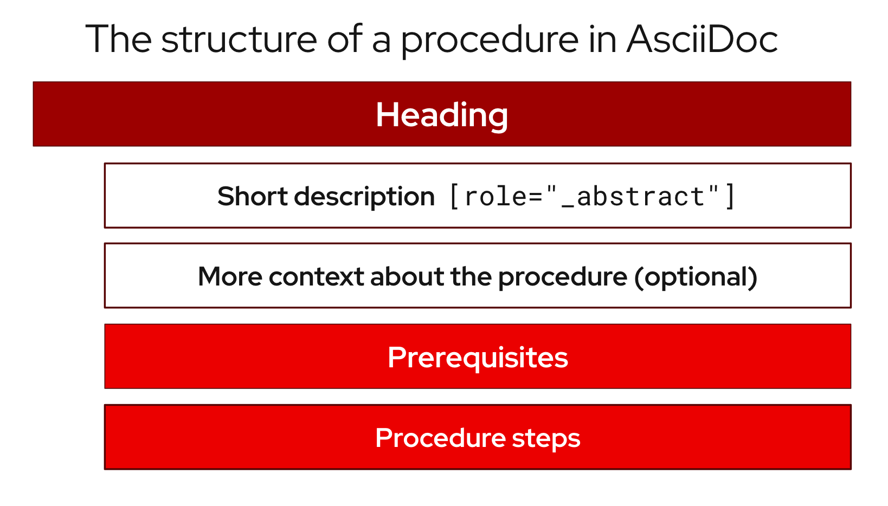

[[structure]]
= Structure

[[admonitions]]
== Admonitions

Admonitions should draw the reader’s attention to certain information. Keep admonitions to a minimum, and avoid placing multiple admonitions close to one another. If multiple admonitions are necessary, restructure the information by moving the less-important statements into the flow of the main content.

Valid admonition types:

NOTE:: Additional guidance or advice that improves product configuration, performance, or supportability.
IMPORTANT:: Advisory information essential to the completion of a task. Users must not disregard this information.
WARNING:: Information about potential system damage, data loss, or a support-related issue if the user disregards this admonition. Explain the problem, cause, and offer a solution that works. If available, offer information to avoid the problem in the future or state where to find more information.
TIP:: Alternative methods that might not be obvious. Makes applying the techniques and procedures described in the text easier or targets specific needs. Helps users understand the benefits and capabilities of the product. Not essential to using the product.

[IMPORTANT]
====
CAUTION, which is another type of AsciiDoc admonition, is not fully supported by the Red{nbsp}Hat Customer Portal. Do not use this admonition type.
====

Admonitions should be short and concise. Do not include procedures in an admonition.

Only individual admonitions are allowed, for example, you cannot have a plural *NOTES* heading.

.Example AsciiDoc
----
[NOTE]
====
Text for note.
====
----

[[lead-in-sentences]]
== Lead-in sentences

A lead-in sentence in this context is the text that directly follows a `Prerequisites` or `Procedure` heading in a task-based module. It is distinct from the module abstract, which describes the goals of the user for the module.

Do not use a lead-in sentence in the `Prerequisites` or `Procedure` sections of a module unless it is necessary to aid navigation or add clarity.

The following examples demonstrate when a lead-in sentence might add value.

* Your module has a long list of prerequisites, and you want to group the prerequisites in sections to make it easier for users to understand what tasks must be performed to complete a procedure.
* Your module has a complex procedure or set of prerequisites, and you want to emphasize that all steps or prerequisites must be completed.

Use a complete sentence for the lead-in sentence to reduce ambiguity and support translation.

[[prerequisites]]
== Prerequisites

When writing prerequisites, be as clear and concise as possible. You can use the passive voice, _if necessary_, to achieve that end.

Write prerequisites as checks that are true or that the user must have completed before they begin a procedure. They can be actions that the user, another person, or piece of technology has completed. Prerequisites can also include items that the user must have ready before beginning the procedure.

* The passive voice might be appropriate for a prerequisite that is not completed by the current user. For example, having a configuration enabled by a system admin.

* Avoid using imperative formations.

* Use parallel language when you write prerequisites. For example, if one bullet is a complete sentence, write the other bullets as complete sentences. But one bullet can be passive voice and another active voice.

.Examples of prerequisites

* JDK 11 or later is installed.
+
Passive voice: the agent is unknown or unimportant.

* A running Kafka instance in {product}.
+
Not a complete sentence: This prerequisite is acceptable if all the other prerequisites in your list are also not complete sentences.

* You are logged in to the Administration Portal.

* You have validated Thing 1.

.Additional resources

* link:https://redhat-documentation.github.io/modular-docs/#creating-procedure-modules[_Procedure Prerequisites_ in the _Modular Documentation Reference Guide_]

[[shortdesc]]
== Short descriptions

Every module and assembly must include a _short description_, formerly called an _abstract_. A short description provides a high-quality summary for both readers and AI-powered search tools. Short descriptions must contain no more than 300 characters. 

The short description must have the correct formatting and tagging:

* In AsciiDoc, label the short description with `[role="_abstract"]`. 
* In DITA, tag the short description with `<shortdesc>`. 

[IMPORTANT]
====
Do not start a module or assembly with an admonition, even when adding the Technology Preview admonition. Always provide a short description first.
====

=== Placement of the short description in procedures ===

In procedures, the short description is displayed between the module title and the Prerequisites section. If you have additional information that exceeds 300 characters, be careful that this text does not rely on the short description for context. In DITA, this additional information is displayed after the Prerequisites section instead of before it. 

In ASCIIDoc, additional information is displayed before the Prerequisites. The following image illustrates how this information is placed:

In DITA, include the additional information after the Prerequisites, as the following image illustrates: 

image:images/Structure-of-a-DITA-procedure.png[Place additional information after prerequisites]

=== Core principles for writing a helpful short description ===

Short descriptions help readers find the information that they need and confirm that they are in the right place. The following principles ensure that you are writing the best short description that you can:

* Include user intent. Explain *what* the user must do and *why* they must complete that action. Build upon the title--do not repeat it.
* Write for AI and search. High-quality short descriptions are a primary source of metadata for AI chatbots and search engine link previews. A high quality, human-verified summary reduces the risk of AI misinterpretation and saves processing time.
* Limit the length of your short description. A short description should be a single, concise paragraph of one or two sentences. Aim for at least 50 characters and no more than 300 characters (approximately 42 to 75 words).
* Avoid DITA-incompatible structures. Do not use bulleted lists or multiple paragraphs. These are not supported by the DITA `<shortdesc>` element.

=== Style guidelines ===

Be sure to follow Red Hat style guidelines. Pay particular attention to the following rules, because short descriptions frequently violate these standards:

* Use active voice and present tense. Write in plain English using simple, direct sentences.
* Use customer-centric language. Use phrases like "You can... by..." or "To..., configure...".
* Do not use self-referential language, for example, "This topic covers..." or "Use this procedure to...".
* Do not use feature-focused language. Focus on what users can accomplish rather than what the product does. Do not use "This product allows you to...".
* Make modules findable and reusable. Include the product name in either the title or the short description to make the module reusable.

=== Short descriptions for complex procedures ===

If you are documenting two or more ways of completing the same procedure, use the short description to explain why users would want to choose one or the other. For complex procedures that have multiple sub-procedures, include some of the key tasks that a customer must complete.

=== Examples of short descriptions ===

Assemblies, as well as procedure, concept, and reference topics, must all have short descriptions.

==== Example: Assembly ====

This rewritten example of an assembly is no longer self-referential and explains *what* and *why*.

.Administering hosts

*Before:* This chapter describes creating, registering, administering, and removing hosts.

*After:* Administering hosts lets you maintain your Linux systems [*what*], ensuring they are secure and up-to-date [*why*].

==== Example: Procedure (Task) topic ====

The following rewritten example is no longer self-referential, leads with the benefit and explains what you can do after performing the task. 

.Create an organization 

*Before:* Use this procedure to create an organization. To use the CLI instead of the Satellite web UI, see the CLI procedure.

*After:* Create organizations to divide resources among multiple teams [*why*]. Assign content and subscriptions to each organization or team, based on ownership, purpose, or security level [*what*].

==== Example: Concept topic ====

The following example explains the benefit of each migration method. 

.Migration speed comparison 

You can minimize virtual machine downtime by choosing an appropriate migration path for your workload. Warm migration runs in the background to keep applications active, but cold migration requires a full shutdown and is safer. Both methods provide similar transfer speeds.

==== Example: Reference topic ====

The following example describes the repository contents, which are listed in a table. 

.The Supplementary repository

The Supplementary repository includes proprietary-licensed packages that are not included in the open source Red Hat Enterprise Linux repositories. Software packages in the Supplementary repository are not supported. The Application Binary Interfaces (ABIs) are also not guaranteed for these packages. 

// TODO: Add new style entries alphabetically in this file
